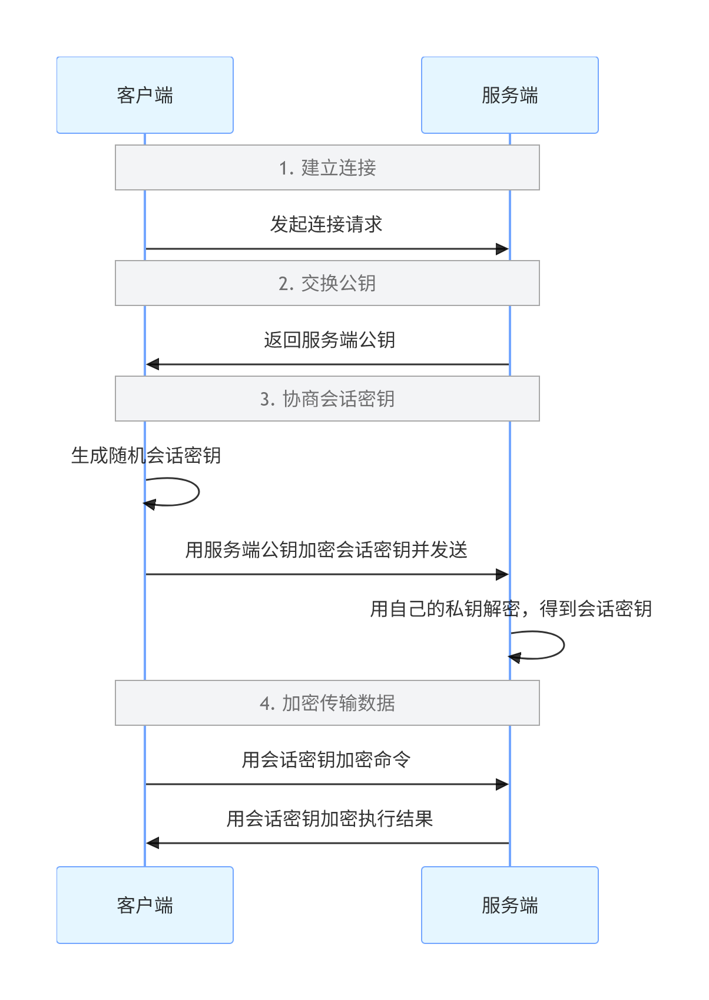

# SSH 核心知识与面试高频考点（运维工程师版）

按**面试权重 + 工作重要性**排序，全部是实际会问到、会用到的内容

------

## 一、基础核心（必问）

### 1. SSH 本质与原理

- **定义**：Secure Shell，加密的远程登录协议，替代明文的 Telnet/FTP，默认端口 22

- 核心原理：

  非对称加密握手 + 对称加密传输

  1. 客户端发起连接，服务端返回自己的公钥
  2. 客户端生成随机会话密钥，用服务端公钥加密后发送
  3. 服务端用私钥解密得到会话密钥
  4. 后续所有数据都用这个**对称会话密钥**加密传输  ， 这个临时会话密码只存再内存里， 下次连接会重新算。
  




**为什么用两种加密？**

✅ **非对称加密**（公钥 + 私钥）：安全但速度慢，只用来**安全传递会话密钥**

✅ **对称加密**（同一个密钥）：速度快，用来**传输实际数据**

两者结合，既安全又高效。

**私钥绝对不能泄露**

私钥是你的身份凭证，就像你的银行卡密码。谁拿到你的私钥，谁就能登录你所有授权过的服务器。

**公钥可以随便分发**

公钥就像你的收款码，发给任何人都没关系，只能用来给你加密信息，不能解密。


扩展

```BASH
SSH 的「会话密钥」到底是什么？
就是 SSH 自动随机生成的一串 二进制乱码字符串
长度固定，常见： 128 位、192 位、256 位 二进制密钥
对应 对称AES加密算法： AES-128  AES-192  AES-256   
这个对称密钥不会在网络上明文传

SSH 的「会话密钥」的工作方式？
任一方： 发送的明文 + AES 算法 + 会话密钥 → 变成密文
对方：   接收的 密文 + AES 算法 + 同一个会话密钥 → 还原明文

AES算法原理：
AES 是对称分组加密算法，先把数据按 128 比特分组，通过字节替换、行移位、列混合、轮密钥加多轮循环打乱混淆，结合会话密钥生成密文；解密用同一密钥反向运算还原明文，只打乱加密、不压缩体积。


```


### 2. 两种认证方式（高频考点）

| 认证方式 | 原理                                             | 安全性             | 适用场景                       |
| :------- | :----------------------------------------------- | :----------------- | :----------------------------- |
| 密码认证 | 客户端输入密码，服务端验证                       | 低（易被暴力破解） | 临时登录、个人测试             |
| 密钥认证 | 客户端持有私钥，服务端保存公钥，通过数学签名验证 | 高（无法暴力破解） | 生产环境、自动化脚本、批量管理 |

### 密钥认证过程

`ssh-keygen` 生成：**私钥 + 公钥** 一对

`ssh-copy-id` 推送公钥时，**第一次必须输服务器账号密码**

推送完以后，下次登录**不用输服务器密码**，直接免密进

客户端、服务器**各自存什么文件、存在哪**，我给你讲死

​	服务器 ~/.ssh/authorized_keys  存所有允许免密登录的客户端公钥

​	客户端 ~/.ssh/known_hosts  服务器的SSH公钥原文  /etc/ssh/ssh_host_ecdsa_key.pub

推送公钥的登录过程，**和普通 SSH 登录原理一模一样**


```BASH
[root@ckh ~]# ssh-keygen #默认是rsa算法
[root@ckh ~]# ll ~/.ssh
total 8
-rw------- 1 root root 1679 May  1 04:34 id_rsa      #私钥
-rw-r--r-- 1 root root  390 May  1 04:34 id_rsa.pub  #公钥

[root@ckh ~]# ssh-copy-id root@10.0.0.4  # 把公钥拷贝到要免密登录的 服务器
/usr/bin/ssh-copy-id: INFO: Source of key(s) to be installed: "/root/.ssh/id_rsa.pub"
The authenticity of host '10.0.0.4 (10.0.0.4)' can't be established.
ECDSA key fingerprint is SHA256:CTk4zIu2CMmmHXcx1Ii7RaEZ8Y1Ok0i3Pl8NuAYoEfc.
ECDSA key fingerprint is MD5:52:ad:6a:2e:e4:1b:25:88:51:6a:ba:e0:60:91:bc:ad.
Are you sure you want to continue connecting (yes/no)?

#这里的指纹验证  是到真实服务器上查看比对 ， 
# 1. 查看SHA256格式的指纹（和你本地第一行比对）
ssh-keygen -lf /etc/ssh/ssh_host_ecdsa_key.pub
# 2. 查看MD5格式的指纹（和你本地第二行比对）
ssh-keygen -lf /etc/ssh/ssh_host_ecdsa_key.pub -E md5

# yes 回车之后

# 把你本地 id_rsa.pub 里面一长串字符，追加写到服务器 authorized_keys 文件末尾
cat ~/.ssh/authorized_keys  

# 服务器的文件权限 700 600
[root@backup ~]# ll -d ~/.ssh
drwx------ 2 root root 29 May  1 19:12 /root/.ssh
[root@backup ~]# ll -d ~/.ssh/authorized_keys
-rw------- 1 root root 390 May  1 19:12 /root/.ssh/authorized_keys

# 客户端存服务器的公钥原文  
~/.ssh/known_hosts

# 服务器的公钥是哪里的？
# 服务器的 SSH 公私钥，是系统安装 OpenSSH 时，自动就帮你生成好了！
[root@backup ~]# ll /etc/ssh/ssh_host*
-rw-r-----. 1 root ssh_keys  227 Aug 28  2024 /etc/ssh/ssh_host_ecdsa_key
-rw-r--r--. 1 root root      162 Aug 28  2024 /etc/ssh/ssh_host_ecdsa_key.pub
-rw-r-----. 1 root ssh_keys  387 Aug 28  2024 /etc/ssh/ssh_host_ed25519_key
-rw-r--r--. 1 root root       82 Aug 28  2024 /etc/ssh/ssh_host_ed25519_key.pub
-rw-r-----. 1 root ssh_keys 1675 Aug 28  2024 /etc/ssh/ssh_host_rsa_key
-rw-r--r--. 1 root root      382 Aug 28  2024 /etc/ssh/ssh_host_rsa_key.pub
# cat /etc/ssh/ssh_host_ecdsa_key.pub  和这里的内容一样


```


------

## 免密登录完整流程（分发完免密公钥之后）

#### 前置条件（不变）

1. 客户端：`ssh-keygen -t ed25519` 生成用户私钥`~/.ssh/id_ed25519`和公钥`~/.ssh/id_ed25519.pub`
2. 服务器：`ssh-copy-id user@server` 将客户端公钥追加到`~/.ssh/authorized_keys`
3. 权限要求：客户端私钥`600`，服务器`.ssh`目录`700`，`authorized_keys`文件`600`

### 第一阶段：【阶段1 纯明文通道 到加密通道】

客户端向服务器 22 端口发起 TCP 三次握手，建立纯明文的基础网络连接。

**此时所有数据都是明文传输**。

这一阶段全程**明文传输**，目标是协商出一个双方都认可的加密通道，之后所有数据都走加密通道。

#### 步骤 1：版本号交换

- 客户端发送自己的 SSH 版本号：`SSH-2.0-OpenSSH_8.0`
- 服务器返回自己的 SSH 版本号：`SSH-2.0-OpenSSH_8.0`
- 客户端把自己的 **Client Random**  （随机数） 明文发给服务器
- 服务器把自己的 **Server Random** （随机数） 明文发给客户端
- 双方确认都使用 SSH-2 协议（SSH-1 已废弃）

#### 步骤 2：算法协商 + 服务器发送主机公钥

- 客户端发送自己支持的所有算法列表：加密算法、签名算法、密钥交换算法、哈希算法
- 服务器返回自己支持的所有算法列表
- 双方按优先级协商出本次连接使用的**算法组合**
- **关键：服务器同时把自己的主机公钥（`/etc/ssh/ssh_host_\*.pub`）发给客户端**

#### 步骤 3：客户端验证服务器身份（防中间人）

- 客户端收到服务器主机公钥后，和本地

  ```
  ~/.ssh/known_hosts
  ```

  中对应 IP 的

  完整公钥原文

  做逐字节对比

  - ✅ 一致：继续下一步
  - ❌ 不一致：直接报错断开
  - 第一次连接：显示公钥的 SHA256 指纹，手动确认后将完整公钥写入`known_hosts`

  

#### 步骤 4：协商临时会话密钥（混合加密核心）

- 客户端生成一个**完全随机的预主密钥** （随机 **32 字节 / 48 字节 串** ）

- 客户端用**刚才收到的服务器主机公钥**加密这个预主密钥，发送给服务器

- 服务器用自己的**主机私钥**解密，得到相同的预主密钥

- 双方用预主密钥，通过相同的算法，各自独立计算出**同一个临时会话密钥** 

  - 什么算法？ 核心派生函数：KDF 密钥派生

     会话密钥 = KDF(预主密钥 + 客户端随机数 + 服务端随机数 + SHA256哈希)

- 预主密钥立即销毁，会话密钥**只存在于双方内存中**，不写硬盘

#### 步骤 5：加密通道正式建立

- 双方互相发送一个 "加密通道已建立" 的消息
- **从这一刻起，后续所有数据（包括用户认证、命令、返回结果）全部用这个会话密钥做 AES 对称加密传输**


------

### 第二阶段：用户身份认证（免密登录核心）

**此时所有数据已经是加密传输**，这一阶段才是免密登录的核心，使用**用户个人密钥对**。

#### 步骤 1：客户端发起公钥认证请求 （默认的先公钥认证）

客户端向服务器发送：

> 我是用户 xxx，我想用公钥认证方式登录，我的公钥类型是 ed25519

#### 步骤 2：服务器生成随机挑战串

服务器生成一个**完全随机的挑战字符串**，用**会话密钥加密**后发送给客户端。

#### 步骤 3：客户端用私钥本地签名

- 客户端收到加密的挑战串，用**会话密钥解密**得到明文挑战串
- 客户端用**自己本地的私钥**对挑战串做**数字签名**
- **私钥永远不离开客户端，只在本地做运算**

#### 步骤 4：服务器用客户端公钥验签

- 客户端将**签名结果**用会话密钥加密后发送给服务器
- 服务器解密得到签名，从`~/.ssh/authorized_keys`中取出对应的客户端公钥
- 服务器用客户端公钥验证签名的合法性
  - ✅ 验签成功：证明客户端持有对应的私钥，身份合法，直接允许登录
  - ❌ 验签失败：拒绝登录，回退到密码认证方式

### 最后：建立 SSH 会话

1. 服务器分配伪终端，启动用户的默认 Shell
2. 客户端发送终端类型、窗口大小等信息
3. 双方进入交互模式：你输入的命令、服务器返回的结果，全部通过会话密钥 AES 加密传输
4. 

------

## 极简时序图

```BASH
【阶段1 纯明文通道 还没任何加密】
1. 客户端 ↔ 服务器 ：TCP 三次握手 建连

2. 客户端 → 服务器 ：明文发 SSH 版本号
   服务器 → 客户端 ：明文回 SSH 版本号

3. 算法协商 + 互发随机数（关键一步）
   客户端：本地生成 客户端随机数 Client-Rand
   服务器：本地生成 服务端随机数 Server-Rand
   客户端 ↔ 服务器 ：【明文互换】两个随机数
   同时双方明文交换：加密/签名/哈希算法列表，协商好统一算法

4. 服务器 → 客户端 ：**明文发送 服务器主机公钥**

5. 客户端本地校验
   比对 ~/.ssh/known_hosts 里的服务器公钥
   - 无记录：弹SHA256指纹 → yes 存入 known_hosts
   - 有记录且一致：放行继续
   - 有记录但不一致：直接报错断开

6. 客户端 本地生成 预主密钥（一大串随机串）
   客户端 → 服务器：用【服务器主机公钥】加密预主密钥 发送
   服务器 本地用【主机私钥】解密，拿到相同预主密钥

【阶段2 派生最终AES会话密钥】
7. 两端材料齐全，各自独立计算：
   材料 = 预主密钥 + Client-Rand + Server-Rand
   算法 = SHA256 密钥派生
   两边算出**同一套 AES 对称会话密钥**

8. 至此：**AES加密通道正式建立**
   后面所有传输 全部走 AES 加密，不再明文

【阶段3 加密通道内：免密登录认证】
9. 服务器 → 客户端：加密发 随机挑战串
10. 客户端：本地用**自己用户私钥** 对挑战串签名（私钥绝不外传）
11. 客户端 → 服务器：加密发送 签名结果
12. 服务器拿 authorized_keys 里的客户端公钥 验签
    验签通过 → 免密登录成功

【阶段4 正常交互】
13. 进入Shell，所有命令、返回结果 全用AES会话密钥加密传输
14. 断开连接：内存清空会话密钥，下次重连全部重新随机来一遍
```

**关键要点一眼记死**

1. **客户端 / 服务端随机数**：在**算法协商阶段就明文互换**，最早就发了
2. 前 6 步全是**明文**，没任何加密通道
3. 随机数、主机公钥、算法列表 全是明文随便看，不怕抓包
4. 只把「预主密钥」用服务器公钥加密传，防中间人偷看
5. 用 预主密钥 + 两个随机数 + SHA256 算出 AES 会话密钥
6. 从第 8 步之后，**全程 AES 加密**，挑战串、签名、命令全在加密通道里跑
7. 两套密钥互不干扰：
   - 服务器主机密钥：做身份校验、协商密钥用
   - 客户端用户密钥：做免密登录签名用


扩展

```
签名 = 用本地私钥，对服务器随机串做专属数学运算，生成一段防伪码；
网络只传「随机串 + 防伪码」，不传私钥；
服务器用配对公钥做反向校验，对上就免密登录，


```


**密钥认证配置步骤**（必须会写）：

```
# 客户端生成密钥对（一路回车）
ssh-keygen -t ed25519  # 推荐，比rsa更安全更快
# 把公钥上传到服务端
ssh-copy-id user@remote-ip
# 测试免密登录
ssh user@remote-ip


# github上配置 GitHub → Settings → SSH and GPG keys → New SSH key

ssh -T git@github.com  #测试连接被拒绝

vim $HOME\.ssh\config
Host github.com
  Hostname ssh.github.com
  Port 443
  User git
  IdentityFile C:\Users\kanghua\.ssh\id_ed25519

#再次测试
ssh -T git@github.com

  
```

------

## 二、常用操作与参数（工作必用，面试常考）

### 1. 基础登录命令

```
ssh user@remote-ip  # 默认22端口
ssh -p 2222 user@remote-ip  # 指定端口
ssh -i /path/to/private_key user@remote-ip  # 指定私钥文件
ssh -v user@remote-ip  # 调试模式，排查连接问题（非常重要）
```

### 2. 高频实用参数

- `-N`：不执行远程命令，只建立连接（专用于端口转发）
- `-f`：后台运行
- `-T`：不分配伪终端
- `-X`：启用 X11 转发（远程运行图形程序）
- `-o StrictHostKeyChecking=no`：自动接受主机公钥（脚本中常用）

### 3. 衍生工具

  scp

  ：基于 SSH 的文件传输

  ```
  scp local-file user@remote:/path/  # 本地上传到远程
  scp user@remote:/path/file local-path/  # 远程下载到本地
  ```

- `sftp`：交互式文件传输，比 scp 更安全，支持断点续传

------

## 三、高级功能（区分初中级运维，面试重点）

### 1. SSH 端口转发（隧道）（**超高频考点**）

核心作用：**加密不安全的流量、穿透内网、访问受限资源**

#### （1）本地转发（最常用）

- 作用：把本地端口的流量转发到远程服务器的指定端口

- 命令：`ssh -L 本地端口:目标地址:目标端口 user@跳板机`

- 场景：本地无法直接访问远程服务器的 3306 端口，通过跳板机访问

  ```
  ssh -L 3306:192.168.1.100:3306 user@jump-server-ip
  # 本地访问127.0.0.1:3306 就等于访问192.168.1.100:3306
  
  ssh -fN -L 3306:10.0.0.2:3306 root@10.0.0.4
```
  


#### （2）远程转发

- 作用：把远程服务器的端口流量转发到本地的指定端口

- 命令：`ssh -R 远程端口:本地地址:本地端口 user@公网服务器`

- 场景：内网机器没有公网 IP，让公网用户访问内网的 Web 服务

```
  ssh -R 8080:127.0.0.1:80 user@public-server-ip
  # 访问公网服务器的8080端口 就等于访问内网机器的80端口

  ```

  

#### （3）动态转发（SOCKS 代理）

- 作用：把本地作为 SOCKS5 代理，所有流量通过 SSH 隧道转发

- 命令：`ssh -D 本地代理端口 user@远程服务器`

- 场景：科学上网、访问公司内网资源

  

  ```bash
ssh -D 1080 user@remote-ip
  # 浏览器设置SOCKS5代理为127.0.0.1:1080即可

  
# 后台运行 Socks5 代理  # 隧道后台运行，不占用终端、不登录 Shell
  ssh -fNT -D 1080 user@跳板IP
  ```


### 2. 跳板机登录

- 旧方法（ProxyCommand）：

  ```
ssh -o ProxyCommand="ssh -W %h:%p user@jump-server" user@target-server
  ```

  

- 新方法（SSH 7.3+，推荐）：

  ```bash
  ssh -J user@jump-server user@target-server
  
  #ssh -J 支持多节点链式跳板
  ssh -J 跳板1,跳板2,跳板3 最终目标机器
  # 黑客反追踪、躲溯源 主流操作方式（原理科普）
  链路模板：
  自己真实机子 → 国内跳板 → 海外跳板 1 → 海外跳板 2 → 攻击目标
  
  方式 2：不登录 Shell，只用 Socks5 多层代理隧道
  		# 格式：ssh -D 本地端口 跳板机用户@跳板机IP
  				ssh -fN -D 127.0.0.1:1080 root@10.0.0.4
          -D 127.0.0.1:1080：在你本地电脑的 1080 端口，开一个 Socks5 代理服务
          这个代理的所有流量，都会通过 SSH 加密隧道，转发到 10.0.0.4 这台跳板机，再从跳板机的公网发出去
          执行完这条命令，你本地的 1080 端口就有了一个可用的 Socks5 代理
          全程你不会进入跳板机的 Shell，只是后台跑了个 SSH 隧道进程
          怎么使用这个代理？
          你本地的浏览器、curl、ssh 这些工具，都可以配置走这个代理：
          # 比如：用curl测试，看出口IP是不是跳板机的
  		curl --socks5 127.0.0.1:1080 ip.gs
          
  方式 3：大量抓「肉鸡集群」随机轮换跳板
  方式 4：全程不用自己真实宽带 IP
  		先用 海外匿名 VPS、动态拨号云、虚拟机、境外代理 做第一层出口
  方式 5：每台跳板必清理日志、抹痕迹
          清空 SSH 登录日志、系统安全日志
          删除 history 命令历史
          篡改登录时间、伪造异常用户
          让运维就算看服务器日志，也看不到真实登录记录。
   方式 6：用完即毁跳板节点
   		临时租用 / 攻破的跳板，攻击完直接重装系统、关机、废弃
  ```
  
  

### 3. SSH 代理转发

- 作用：不用把私钥复制到跳板机，就能用本地私钥登录跳板机后面的服务器

- 用法：

  ```
  ssh-add  # 把私钥添加到本地ssh-agent
  ssh -A user@jump-server  # 启用代理转发
  # 在跳板机上直接登录目标服务器，无需输入密码
  ssh user@target-server
  ```
  


### 2、会话管理（解决断连、重复输密码）

#### 1. 连接复用（一次登录，永久复用）

**第一次输密码 / 验证密钥，后续连接秒连，不用重复验证**

在本地 `~/.ssh/config` 写入：

```bash
Host *   #Host：指定对哪些服务器生效
  ControlMaster auto   #  连接复用总开关
  ControlPath ~/.ssh/%h_%p_%r.sock   #指定连接复用的通道文件（socket）
  ControlPersist 1h   # 退出了 SSH 终端，主连接也不会立刻关闭 会在后台保持 1 小时
  ControlPersist yes  #永久不超时  #两边电脑只要不重启，不停止sshd程序
```

✅ 用途：批量操作服务器，秒连无延迟

#### 2. 强制伪终端（`-t`）

**远程执行交互式命令（top/vim/sudo）**

```bash
ssh -t user@IP "top"

# 远程执行交互命令（top/vim/sudo） → 必须加 -t
```

✅ 用途：远程运行需要交互的程序

------

## 三、远程批量执行（运维自动化）

### 8. 远程直接执行命令 / 脚本

**不用登录，单命令远程干活**

```bash
# 执行单命令
ssh user@IP "ls -l /root"
# 执行本地脚本
ssh user@IP < test.sh
# 批量执行（多台服务器）
for ip in 10.0.0.1 10.0.0.2; do ssh user@$ip "reboot"; done
```

✅ 用途：批量运维、自动化脚本

------

## 四、配置文件与安全加固（**面试必问**）

### 1. 核心配置文件

- 服务端配置：`/etc/ssh/sshd_config`（修改后需重启 sshd 服务）
- 客户端配置：`/etc/ssh/ssh_config`（全局）、`~/.ssh/config`（用户级）

### 2. 服务端关键配置项（安全加固核心）

```ini
Port 2222  # 1. 修改默认端口（减少暴力破解）
PermitRootLogin no  # 2. 禁止root直接登录（生产环境必须）
PasswordAuthentication no  # 3. 关闭密码认证，只允许密钥认证
PubkeyAuthentication yes  # 4. 启用密钥认证

AllowUsers alice bob  # 5. 只允许指定用户登录（白名单，最安全）
# DenyUsers eviluser  # 黑名单
ClientAliveInterval 300  # 6. 300秒无操作自动断开
ClientAliveCountMax 2
MaxAuthTries 3  # 7. 最多3次密码尝试
PermitEmptyPasswords no  # 8. 禁止空密码登录
UseDNS no  # 9. 关闭DNS解析，加快登录速度
```

### 3. 其他安全措施

- 使用`fail2ban`工具自动封禁暴力破解的 IP
- 定期检查`/var/log/secure`（CentOS）或`/var/log/auth.log`（Ubuntu）的登录日志
- 禁用 SSH1 协议，只使用 SSH2
  - 定期轮换密钥，使用强密码保护私钥


------

## 五、常见故障排查（面试常考实际问题）

1. **连接超时**：检查防火墙（iptables/firewalld/ufw）是否开放 22 端口、云服务器安全组、网络连通性

2. **连接被拒绝**：sshd 服务未启动、端口错误、SELinux 阻止

3. 权限错误（最常见）：

   - `~/.ssh`目录权限必须是`700`
- `~/.ssh/authorized_keys`文件权限必须是`600`
   - 私钥文件权限必须是`600`
   
   

4. **Host key verification failed**：远程服务器公钥变更，删除本地`~/.ssh/known_hosts`中对应的条目

5. **免密登录不生效**：检查上述权限问题、公钥是否正确上传、sshd 配置是否允许密钥认证

------

## 六、面试 TOP10 高频问题

1. SSH 的工作原理是什么？加密过程是怎样的？

   ```
   工作原理
   先版本协商 → 协商加密算法 → 密钥交换生成临时会话密钥 → 身份认证 → 加密传输数据。
   加密流程
   先用非对称加密协商出统一的随机会话密钥；再用对称加密传输业务数据；最后用哈希算法校验数据完整性，防篡改。
   ```

   

2. 密码认证和密钥认证的区别？为什么密钥认证更安全？

   ```
   区别
   密码认证：输账号密码登录
   密钥认证：本地公私钥配对校验，不用输密码
   密钥更安全原因
   密码容易被暴力破解、中间人劫持窃听；密钥私钥只在本地不传输，无法爆破，中间人也破解不了。
   ```

   

3. 如何配置 SSH 免密登录？详细步骤

   ```
   本地 ssh-keygen 生成公私钥
   把本地公钥传到目标机 ~/.ssh/authorized_keys
   目标机权限设：.ssh目录700，authorized_keys文件600
   客户端直接 ssh 登录，免密
   ```

   

4. 什么是 SSH 端口转发？本地转发、远程转发、动态转发的区别和应用场景？

   ```bash
   本地转发 -L：在本机监听端口，把请求转发到跳板机后方的内网服务，用于本机访问远端内网资源。 →场景：本地无法直接访问远程服务器的 3306 端口，通过跳板机访问
   ssh -L 3306:192.168.1.100:3306 user@jump-server-ip
   # 本地访问127.0.0.1:3306 就等于访问192.168.1.100:3306
   
   ssh -fN -L 3306:10.0.0.2:3306 root@10.0.0.4
   远程转发 -R：在远程服务器监听端口，把外网请求反向转发到本地内网 →  场景：内网穿透，外网访问家里 / 
           ssh -R 8080:127.0.0.1:80 user@public-server-ip
           # 访问公网服务器的8080端口 就等于访问内网机器的80端口
   
   动态转发 -D：本地生成 Socks5 全局代理 → 场景：走跳板上网、隐藏真实 IP
   
   ```

   

5. 生产环境如何加固 SSH 服务？至少说出 5 点

   ```
   修改默认 22 端口
   禁止 root 直接登录
   关闭密码登录，只允许密钥登录
   限制指定用户才能登录
   配置空闲会话自动断开
   防火墙只放行固定 IP 连接 SSH
   ```

   

6. SSH 连接失败的常见原因有哪些？如何排查？

   ```
   常见原因
   网络不通、端口不通、防火墙拦截、密钥 / 密码错误、.ssh权限过大、known_hosts指纹冲突、sshd 服务异常、账号锁定。
   
   排查
   ping 测网络 → telnet 测端口 → ssh -v 调试 → 检查文件权限 → 清理冲突的 known_hosts → 查看 sshd 日志。
   ```

   

7. 为什么.ssh 目录和 authorized_keys 的权限必须是 700 和 600？

   ```
   SSH 安全机制不允许权限过宽；
   防止服务器上其他普通用户读取、篡改你的密钥和授权文件，避免被盗用免密、恶意登录、提权。权限不对直接免密失效。
   ```

   

8. known_hosts 文件的作用是什么？

   ```
   首次连接自动保存服务器公钥指纹；
   下次登录自动比对指纹，防止中间人伪装服务器劫持、骗密码。
   ```

   

9. 如何通过跳板机登录内网服务器？有几种方法？

   ```
   普通登录：先 ssh 进跳板机，再从跳板机 ssh 内网机器
   命令跳板：ssh -J 跳板机 内网目标机
   配置 ~/.ssh/config 写好跳板，直接别名一键登录
   ```

   

10. scp 和 rsync 的区别？什么时候用哪个？

     ```
     区别
     scp：全量覆盖拷贝，简单粗暴，不支持增量
     rsync：增量同步、只传变化部分，支持断点续传、压缩、保留文件权限属性
     使用场景
     临时少量小文件拷贝用 scp；
     大文件、定时备份、增量同步、服务器间同步数据用 rsync。
     ```


# （了解即可）进阶：多层 Socks5 代理隧道（串多台跳板）

本机→跳板 1→跳板 2→跳板 3→目标，全程不登录任何一台的 Shell。

## 核心工具：`proxychains4`

这是一个专门用来把多个代理串起来的工具，它可以让你的命令，按顺序走你配置的多层代理，不用你手动搭一堆端口转发。

------

## 详细步骤（可直接操作，合法用途）

### 1. 先安装依赖（环境重置后，重新装）


```
# 安装proxychains4，用来串多层代理
sudo apt update && sudo apt install -y proxychains4
```

### 2. 配置多层代理

编辑配置文件：


```
sudo vim /etc/proxychains4.conf
```

找到 `[ProxyList]` 这一段，把你的跳板按**从近到远**的顺序写进去：


```ini
[ProxyList]
# 格式：代理类型  代理IP  代理端口
# 顺序：你本机 → 第一个代理 → 第二个代理 → 第三个代理...
socks5  127.0.0.1  1080  # 第一层：你本地搭的到跳板1的Socks5
socks5  127.0.0.1  1081  # 第二层：跳板1上搭的到跳板2的Socks5
socks5  127.0.0.1  1082  # 第三层：跳板2上搭的到跳板3的Socks5
```

> 简单说：每一层的代理，都是上一层机器上开的本地端口，流量就这么一层一层串过去。

------

### 3. 逐层搭 SSH 动态代理

#### 第一步：在你本机，搭到跳板 1 的代理

```
# 本机执行：开1080端口，连跳板1
ssh -D 127.0.0.1:1080 root@跳板1的IP
```

#### 第二步：通过跳板 1 的代理，在跳板 1 上搭到跳板 2 的代理


```
# 本机执行，用proxychains走第一层代理，去连跳板2
proxychains4 ssh -D 127.0.0.1:1081 root@跳板2的IP
```

这一步，相当于在跳板 1 的本地，开了个 1081 端口，连到跳板 2。

#### 第三步：同理，搭到跳板 3 的代理

```
# 本机执行，走前两层代理，去连跳板3
proxychains4 ssh -D 127.0.0.1:1082 root@跳板3的IP
```

------

### 4. 用多层代理访问目标

现在所有代理都搭好了，你直接用 `proxychains4` 跑任何命令，流量都会自动走三层跳板：


```
# 测试：看最终出口IP，是不是最后一台跳板3的IP
proxychains4 curl ip.gs

# 直接用这个代理，SSH连最终目标机器
proxychains4 ssh root@最终目标的IP
```