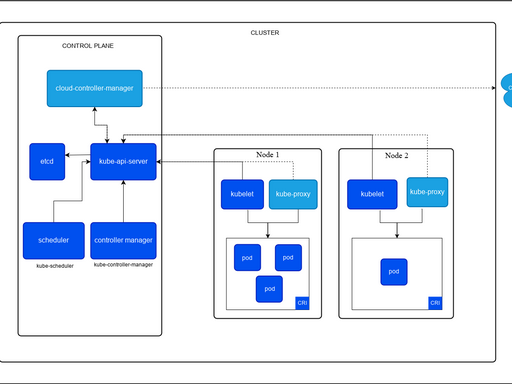

# docker

## Docker 精简介绍

1. **定义**：轻量容器化工具，将程序、依赖、运行环境打包，实现一次打包任意机器运行。
2. **对比虚拟机**：共享宿主机内核，占用资源少、秒级启动；虚拟机自带完整系统，笨重缓慢。
3. 四大核心
   - 引擎：Docker 后台服务，执行所有操作命令
   - 镜像：只读环境模板（如 mysql、nginx）
   - 容器：镜像运行后的可读写实例
   - 镜像仓库：存储、下载镜像的平台
4. **使用流程**：拉取镜像→运行容器-->容器内部署业务程序；自定义项目通过 Dockerfile 打包成镜像分发。
5. **核心优点**：环境统一、资源省、部署快、方便微服务与自动化发布。
6. **一句话总结**：解决环境不一致问题，轻量化打包部署应用。

适用场景: 本地搭建多套测试环境；CI/CD 自动化流水线打包发布。

​		无状态服务（Nginx、Tomcat、SpringBoot 后端、前端）→ 生产最推荐容器化

### 2. 有状态服务分两类，一部分线上也能用 Docker

有状态：需要持久存储、固定网络标识、数据不能随便丢（MySQL、Redis、ES、MQ）

### （1）轻量有状态：Redis（缓存）、MQ、ES、低并发小库 → 中小厂线上大量用

- Redis 只做缓存（非持久化强依赖）、消息队列存临时消息、日志搜索引擎；
- 数据丢失影响可控，配合数据卷挂载、host 网络消除性能损耗，docker/k8s 部署很普遍；
- 私有化交付、内部后台系统标配容器化整套中间件。

### （2）核心重 IO 有状态：生产交易 MySQL、PostgreSQL、核心库

**不推荐单机 docker run 直接上生产**，原因之前说过：IO 损耗、数据损坏风险、主从切换复杂。

但大厂云原生方案例外：

用 K8s + StatefulSet + 本地 SSD + 数据库 Operator 托管数据库，这依然是容器形态，只是不靠简单单机 Docker，是标准化容器集群方案。

## Docker 整体架构（C/S 客户端 - 服务端架构）

Docker 采用 **Client-Server（C/S）** 模型，分为四大核心模块：客户端、Docker 守护进程、镜像仓库、容器运行环境。

### 1. Client 客户端

就是你敲命令的地方（`docker run/pull/build` 等）

- 交互入口：CLI 命令行、Docker Desktop、SDK
- 作用：发送请求给 Docker Daemon，**不直接操作容器 / 镜像**

### 2. Daemon（dockerd 守护进程，服务端核心）

后台常驻服务，Linux 系统后台进程，Docker 真正干活的核心

职责：

1. 管理镜像：构建、拉取、推送、删除镜像
2. 管理容器：创建、启停、销毁、网络、存储挂载
3. 接收客户端请求，内部调用容器运行时完成隔离
4. 与镜像仓库通信

### 内部两层细分

1. **Docker Engine API**：客户端和 Daemon 通信接口（REST API）

2. containerd（容器运行时）

   - 接管容器生命周期：创建、删除、执行命令
   - 管理镜像、存储卷、网络

3. runc（底层标准运行时）

   遵循 OCI 标准，直接调用 Linux 内核能力（namespace、cgroups）实现资源隔离、限制。

### 3. Registry 镜像仓库

存放镜像的远程服务器

- 官方公共：Docker Hub

- 私有仓库：Harbor、阿里云镜像仓库

  流程：Daemon 根据指令去仓库拉取 / 上传镜像。

### 4. 内核支撑技术（底层隔离基础）

Daemon 依赖 Linux 内核实现容器轻量化隔离：

1. Namespace：进程、网络、挂载、用户、PID 隔离（容器互相看不见）
2. Cgroups：限制 CPU、内存、磁盘 IO，防止容器资源耗尽宿主机
3. Union FS：镜像分层只读存储，镜像复用、快速构建

### 完整调用流程举例（docker run nginx）

1. 客户端执行命令 → 请求发送给 dockerd
2. dockerd 发现本地无 nginx 镜像 → 调用 containerd
3. containerd 去 Docker Hub 拉取分层镜像到本地存储
4. 拉取完成，containerd 调用 runc
5. runc 调用 Linux 内核 namespace+cgroups 创建隔离容器进程
6. Nginx 进程启动，客户端返回运行结果

### 极简架构总结

客户端（发命令）→ Daemon（总调度）→ containerd（容器管理）→ runc（内核隔离）+ Registry（镜像仓库），底层靠 Linux 内核实现轻量隔离。

## Docker 实现原理（精简版）

### 一、底层核心三大 Linux 内核技术

1. **Namespace（隔离）**

   提供 6 种独立隔离视图，容器互不感知：

   - PID：独立进程编号（容器内 PID 1，宿主机是大 PID）

   - Mount：独立文件系统

   - Network：独立网卡、IP、端口

   - UTS：独立主机名

   - User：独立用户 ID

   - IPC：独立进程通信通道

     

     作用：实现容器进程、网络、文件、主机名隔离。

2. **Cgroups（资源限制）**

   限制容器 CPU、内存、磁盘 IO、网络带宽，防止单个容器耗尽宿主机资源。

3. **UnionFS（分层镜像存储）**

   镜像分层只读，容器新增读写层；  写时复制（CoW）技术。CoW就是copy-on-write

   多镜像共享基础层，构建 / 拉取速度快、节省磁盘。

   AUFS是作为Docker存储驱动的一种实现，Docker 还支持了不同的存储驱动，包括 aufs、devicemapper、overlay2、zfs 和 Btrfs 等等，在最新的 Docker 中，overlay2 取代了 aufs 成为了推荐的存储驱动

### 二、整体运行分层架构

1. **Docker Client**：docker 命令，发送 API 请求
2. **dockerd 守护进程**：总调度，调用 containerd
3. **containerd**：容器生命周期管理（拉镜像、创建容器）
4. **runc（OCI 标准）**：调用内核 Namespace+Cgroups 创建容器进程
5. **Linux 内核**：提供隔离、限制、文件系统底层能力

### 三、网络实现原理

- 网桥 docker0/CNI 网桥，iptables 实现端口映射、SNAT/DNAT 转发；
- 需开启 ip_forward、br_netfilter 网桥转发内核参数。

### 四、一句话总结

Docker = Linux Namespace 隔离 + Cgroups 资源限制 + UnionFS 分层镜像，上层封装客户端 /daemon/runc 工具链，实现轻量化容器。


## Docker 4 种原生网络模式

### 1. bridge（默认）

- 自动生成`docker0`网桥，容器成对 veth 虚拟网卡接入网桥，独立网络命名空间
- 同网桥容器互通，外网需`-p`端口映射，宿主机看不到容器内网 IP
- 适用：单机常规业务

### 2. host

- 容器直接复用宿主机网络栈，无 veth、无独立 IP，共享宿主机网卡端口
- 网络性能最好，禁止端口映射，易端口冲突
- 适用：高性能中间件、监控类服务

### 3. none

- 仅保留本地回环网卡，禁用所有外网、容器间网络
- 适用：离线安全计算任务

### 4. container

- 复用已有容器的网络命名空间，两个容器共用同一个 IP、网卡
- 可通过 127.0.0.1 互访，端口不能重复
- 适用：Sidecar 日志、监控附属容器

### 二、veth 核心要点

1. veth 成对出现：宿主机端 ↔ 容器内 eth0，删除容器网卡同步销毁
2. 容器 IP 在独立网络命名空间，宿主机仅能查看网卡流量，无法直接看到容器内网 IP
3. 所有跨网络访问依赖网桥 + iptables NAT 转发

### 三、关键注意事项

1. bridge 模式必须开启内核 IP 转发、加载`br_netfilter`模块
2. 频繁启停容器需排查残留 veth 网卡，避免占用内核资源
3. 容器内网 IP 仅同网段容器、宿主机可访问，外网不能直接路由
4. 推荐自定义网桥，规避默认网段冲突，实现业务网络隔离

```bash
1. bridge（默认，可不加--net）
# 默认docker0网桥
docker run -d --name test nginx
# 显式指定bridge
docker run -d --net bridge --name test nginx

2. host 宿主机网络
docker run -d --net host --name test nginx

3. none 无网络
docker run -d --net none --name test nginx

4. container 复用其他容器网络
docker run -d --net container:已存在容器名/ID --name test nginx

二、生产自定义网桥常用套路命令
1. 创建自定义网桥（指定网段、网关）
docker network create \
--subnet=172.20.0.0/16 \
--gateway=172.20.0.1 \
my-net

2. 容器启动直接加入自定义网络
docker run -d --net my-net --name nginx nginx
3. 已有运行容器追加加入自定义网络
docker network connect my-net 容器名
4. 容器从网络中移除
docker network disconnect my-net 容器名
5. 查看网络详情
docker network inspect my-net
6. 删除闲置自定义网络
docker network rm my-net


```


## docker安装

```bash
#centos7 升级内核 6.9版本
# https://dl.lamp.sh/kernel/el7/
wget https://dl.lamp.sh/kernel/el7/kernel-ml-devel-6.9.10-1.el7.x86_64.rpm
wget https://dl.lamp.sh/kernel/el7/kernel-ml-6.9.10-1.el7.x86_64.rpm

yum localinstall -y  kernel-ml-6.9.10-1.el7.x86_64.rpm kernel-ml-devel-6.9.10-1.el7.x86_64.rpm

#安装完毕后查看系统可用启动内核
awk -F\' '$1=="menuentry " {print  $2}' /etc/grub2.cfg

# 修改默认的启动内核
grub2-set-default 'CentOS Linux (6.9.10-1.el7.x86_64) 7 (Core)'
grub2-editenv list

reboot
uname -r
-----------------------------------------------------------------
## 若未配置，需要执行如下
#加载网桥过滤模块
modprobe br_netfilter
cat <<EOF > /etc/modules-load.d/br_netfilter.conf
br_netfilter
EOF
cat <<EOF >  /etc/sysctl.d/docker.conf
# 让 iptables 防火墙规则生效在网桥转发流量上。
# 1：网桥流量同样走 iptables 链做 NAT、过滤、端口转发
net.bridge.bridge-nf-call-ip6tables = 1
net.bridge.bridge-nf-call-iptables = 1
# 开启 Linux 内核 IPv4 数据包转发。
net.ipv4.ip_forward=1
EOF
sysctl -p /etc/sysctl.d/docker.conf
# 检查
sysctl net.bridge.bridge-nf-call-iptables net.bridge.bridge-nf-call-ip6tables net.ipv4.ip_forward

#docker 安装
# https://mirrors.huaweicloud.com/mirrorDetail/5ea14d84b58d16ef329c5c13?mirrorName=docker-ce&catalog=docker
sudo yum remove docker docker-common docker-selinux docker-engine
sudo yum install -y yum-utils device-mapper-persistent-data lvm2
wget -O /etc/yum.repos.d/docker-ce.repo https://mirrors.huaweicloud.com/docker-ce/linux/centos/docker-ce.repo
sudo sed -i 's+download.docker.com+mirrors.huaweicloud.com/docker-ce+' /etc/yum.repos.d/docker-ce.repo
sudo yum makecache fast
sudo yum install docker-ce

#华为云的镜像加速地址
https://console.huaweicloud.com/swr/?region=cn-north-4#/swr/mirror
进入华为云搜索“容器镜像服务”或者 "SWR" ，进入控制台
点击 “镜像资源”---> “镜像中心”---> "镜像加速器"
cat <<EOF > /etc/docker/daemon.json
{
    "registry-mirrors": [ "https://4c0c57d8b79a402d811834c1be74f7ae.mirror.swr.myhuaweicloud.com" ]
}
EOF

## 设置开机自启
systemctl enable docker  
systemctl daemon-reload

## 启动docker
systemctl start docker 

## 查看docker信息
docker info
## docker-client
which docker
## docker daemon
ps aux |grep docker
## containerd
ps aux|grep containerd
systemctl status containerd

```


## docker 命令分类（按图中模块划分）

```bash
# Docker 命令分类（按图中模块划分）
一、镜像相关 Images
1. 镜像基础操作
    images：列出本地所有镜像
    rmi：删除镜像
    tag：给镜像打标签
    history：查看镜像分层构建历史
2. 镜像构建
    build：通过 Dockerfile 构建镜像
3. 镜像本地导入导出（Tar 包）
    save：镜像导出为 tar 文件
    	docker save -o nginx-alpine.tar nginx:alpine
    load：从 tar 文件导入镜像
    	docker load -i nginx-alpine.tar
    export：容器导出为 tar 文件
    import：容器 tar 包导入生成镜像
4. 镜像仓库 Registry 交互
    pull：从仓库拉取镜像到本地
    	docker pull nginx:alpine
    push：推送本地镜像到仓库
    search：搜索仓库镜像
    login：登录镜像仓库
    logout：退出镜像仓库登录
5. 容器生成镜像
	commit：把运行中的容器打包生成新镜像
6. 对比容器与镜像差异
	diff：查看容器相对于底层镜像的文件改动
二、容器相关 Container
1. 容器生命周期（状态流转）
创建容器
    create：创建容器（不启动）
    run：创建并立刻启动容器
    运行 / 停止 / 暂停状态切换
    start：启动已停止容器
    stop：优雅停止运行容器
    kill：强制杀死运行容器
    pause：暂停容器所有进程
    unpause：恢复暂停的容器
删除容器
	rm：删除停止状态的容器
2. 容器信息查看
    ps：列出容器
    inspect：查看容器详细元数据
    port：查看容器端口映射
    top：查看容器内进程
    logs：查看容器日志
    wait：阻塞等待容器停止并返回退出码
3. 容器交互操作
    attach：附着到容器前台终端
    exec：在运行容器内执行命令（进入容器终端常用）
    cp：宿主机与容器之间互传文件 / 文件夹

三、宿主机与容器文件传输 Host
	cp：容器 ↔ 宿主机 文件 / 文件夹拷贝
四、Dockerfile 构建镜像
	build：读取 Dockerfile 构建镜像
五、Tar 文件（镜像 / 容器打包）
    save：镜像导出 tar
    load：tar 导入镜像
    export：容器导出 tar
    import：容器 tar 导入为镜像
六、镜像仓库 Registry
	pull、push、search、login、logout
七、Docker Engine 引擎全局信息
    version：查看 Docker 客户端 / 服务端版本
    info：查看 Docker 系统全局信息（存储、容器、镜像数量等）
    events：实时监听 Docker 后台事件（创建 / 删除容器、拉取镜像等）
```


## docker 镜像仓库

```bash
# 创建 Docker Registry 认证文件目录
mkdir /var/lib/registry_auth

# 使用 htpasswd 来创建加密文件
[ -f /usr/bin/htpasswd ] || yum install -y httpd-tools
htpasswd -Bbn admin admin > /var/lib/registry_auth/htpasswd
#-B：使用 bcrypt 加密密码（安全性更高，推荐）
#-b：批量模式，直接在命令行传入用户名 + 密码，不用交互式输入
#-n：不输出到终端，输出标准输出


## 使用docker镜像启动镜像仓库服务
docker run -p 5000:5000 \
--restart=always \
--name registry \
-v /var/lib/registry:/var/lib/registry \
-v /var/lib/registry_auth/:/auth/ \
-e "REGISTRY_AUTH=htpasswd" \
-e "REGISTRY_AUTH_HTPASSWD_REALM=Registry Realm" \
-e "REGISTRY_AUTH_HTPASSWD_PATH=/auth/htpasswd" \
-d registry

docker run -p 5000:5000 \          # 端口映射：宿主机5000映射容器5000
--restart=always \                 # 容器异常/开机自动重启
--name registry \                  # 容器命名registry
-v /var/lib/registry:/var/lib/registry \  # 持久化镜像存储目录 宿主机位置:容器内位置
-v /var/lib/registry_auth/:/auth/ \      # 挂载账号密码文件目录
-e "REGISTRY_AUTH=htpasswd" \      # 启用htpasswd账号密码认证
-e "REGISTRY_AUTH_HTPASSWD_REALM=Registry Realm" \ # 登录提示域名
-e "REGISTRY_AUTH_HTPASSWD_PATH=/auth/htpasswd" \ # 指定密码文件容器内路径
-d registry                        # 后台运行registry官方仓库镜像
# -e 是添加容器内环境变量
# -d 后台守护进程运行容器，不占用当前终端


## docker默认不允许向http的仓库地址推送，如何做成https的，参考：https://docs.docker.com/registry/deploying/#run-an-externally-accessible-registry
## 我们没有可信证书机构颁发的证书和域名，自签名证书需要在每个节点中拷贝证书文件，比较麻烦，因此我们通过配置daemon的方式，来跳过证书的验证：
vim /etc/docker/daemon.json
{
    "registry-mirrors": [ "https://4c0c57d8b79a402d811834c1be74f7ae.mirror.swr.myhuaweicloud.com" ],
    "insecure-registries": ["10.0.0.80:5000"]
}

systemctl restart docker
docker login 10.0.0.80:5000
Username: admin
Password: admin


docker pull nginx:alpine
docker tag nginx:alpine 10.0.0.80:5000/nginx:alpine
docker push 10.0.0.80:5000/nginx:alpine


## 查看仓库内元数据
curl -u admin:admin -X GET http://10.0.0.80:5000/v2/_catalog
curl -u admin:admin  -X GET http://10.0.0.80:5000/v2/nginx/tags/list

docker rmi nginx:alpine


```

## docker 命令练习

```bash
## 查看运行状态的容器列表
docker ps
## 查看全部状态的容器列表
docker ps -a
## 后台启动
docker run --name nginx -d nginx:alpine
## 映射端口,把容器的端口映射到宿主机中,-p <host_port>:<container_port>
docker run --name nginx -d -p 8080:80 nginx:alpine
## 资源限制,最大可用内存500M
docker run --memory=500m nginx:alpine
## 挂载主机目录
docker run --name nginx -d  -v /opt:/opt  nginx:alpine
docker run --name mysql -e MYSQL_ROOT_PASSWORD=123456  -d -v /opt/mysql/:/var/lib/mysql mysql:5.7

# 进入容器或者执行容器内的命令
docker exec -ti <container_id_or_name> /bin/sh
# -t：分配伪终端，支持交互
# -i：保持标准输入打开
# -ti：组合，实现交互式进容器
docker exec <container_id_or_name> hostname命令

# 主机与容器之间拷贝数据
## 主机拷贝到容器
echo '123'>/tmp/test.txt
docker cp /tmp/test.txt nginx:/tmp
docker exec nginx cat /tmp/test.txt
## 容器拷贝到主机
docker cp nginx:/tmp/test.txt ./

## 查看全部日志
docker logs nginx
## 实时查看最新日志
docker logs -f nginx
## 从最新的100条开始查看
docker logs --tail=100 -f nginx

## 停止运行中的容器
docker stop nginx
## 启动退出容器
docker start nginx
## 删除非运行中状态的容器
docker rm nginx
## 删除运行中的容器
docker rm -f nginx

## 查看容器详细信息，包括容器IP地址等
$ docker inspect nginx
## 查看镜像的明细信息
$ docker inspect nginx:alpine
```


## dockerfile 与多阶构建

```bash
Dockerfile使用
docker build . -t ImageName:ImageTag -f Dockerfile

FROM 指定基础镜像，必须为第一个命令
MAINTAINER 镜像维护者的信息
COPY|ADD 添加本地文件到镜像中
WORKDIR 工作目录
RUN 构建镜像过程中执行命令
CMD 构建容器后调用，也就是在容器启动时才进行调用
ENTRYPOINT 设置容器初始化命令，使其可执行化
ENV
EXPOSE   容器内端口
----------------------------------------------------
# 1. FROM：指定基础镜像，必须首行
FROM centos:7
# 2. RUN：构建时执行shell命令
RUN yum install nginx -y
# 3. COPY：宿主机文件/目录复制到容器
COPY ./index.html /usr/share/nginx/html/
# 4. ADD：类似COPY，自动解压tar、支持远程url
ADD test.tar.gz /opt/
# 5. WORKDIR：设置容器工作目录，后续命令默认在此执行
WORKDIR /app
# 6. ENV：定义环境变量
ENV VERSION=1.0
# 7. ARG：构建时传入临时参数，镜像内不保留
ARG build_user
# 8. EXPOSE：声明容器暴露端口（仅说明，不自动映射）
EXPOSE 80
# 9. VOLUME：声明数据卷，持久化目录
VOLUME ["/data"]
# 10. CMD：容器启动默认命令，docker run可覆盖
CMD ["nginx","-g","daemon off;"]
# 11. ENTRYPOINT：容器入口程序，CMD仅作参数
ENTRYPOINT ["/bin/sh"]
# 12. USER：切换运行用户（默认root）
USER nginx
# 13. LABEL：给镜像添加元数据标签
LABEL author="admin"
# 14. HEALTHCHECK：容器健康检查
HEALTHCHECK --interval=3s CMD curl -s 127.0.0.1
--------------------------------------------------------------

通过1号进程理解容器的本质
----------------------------------------------------------
-- 容器内 PID 1 是什么
容器启动后，容器内部的第一个进程就是 PID=1 进程，由runc依托 Linux Namespace 创建。
宿主机有完整 PID 树，容器拥有独立 PID Namespace：
宿主机看该进程是随机大 PID；
容器内部视角，它就是 PID=1。
本质上讲容器是利用namespace和cgroup等技术在宿主机中创建的独立的虚拟空间，这个空间内的网络、进程、挂载等资源都是隔离的。
------------------------------------------------------------
docker run -d --name xxx nginx:alpine <自定义命令>
# <自定义命令>会覆盖镜像中指定的CMD指令，作为容器的1号进程启动。
docker run -d --name test-3 nginx:alpine echo 123
docker run -d --name test-4 nginx:alpine ping www.badu.com
$ docker exec -ti test-4 /bin/sh
#/ ps aux
#/ ip addr
#/ ls -l /
#/ apt install xxx
#/ #安装的软件对宿主机和其他容器没有任何影响，和虚拟机不同的是，容器间共享一个内核，所以容器内没法升级内核

多阶段构建（极简理解）
1. 核心痛点
单阶段打包会把编译工具、源码、依赖包全塞进最终镜像，镜像体积巨大，包含无用编译环境。
2. 本质
一个 Dockerfile 里写多个 FROM，分出「构建阶段」+「运行阶段」：
构建阶段：带编译环境，编译代码生成可执行文件；
运行阶段：只用极简基础镜像，只拷贝上一阶段编译好的产物，丢弃所有编译工具 / 源码。
3. 关键语法
COPY --from=阶段名 源路径 目标路径：跨阶段复制文件。
4. 优点
镜像体积大幅缩小；
减少攻击面（无 gcc、maven、npm 等工具）；
无需手动导出文件，一条docker build完成。
5. 一句话总结
多阶段构建 =分开编译与运行环境，只保留程序运行必需文件，剔除编译冗余。


yum install -y git 
git clone --depth=1 https://gitee.com/chengkanghua/eladmin-web.git
#--depth=1：只拉取最新 1 次提交，不下载完整 git 历史，加速克隆、减小体积
cd eladmin-web/

# 多阶段构建dockerfile.multi
-------------------------------------------------------
cat <<EOF > Dockerfile.multi
# # 阶段1：编译阶段（大镜像，仅用来打包程序）
FROM codemantn/vue-node AS builder
LABEL maintainer="inspur_lyx@hotmail.com"

# config npm
RUN npm config set sass_binary_site  https://npmmirror.com/mirror/sass && \
    npm config set registry  https://registry.npmmirror.com
WORKDIR /opt/eladmin-web
COPY  . .

# build
RUN ls -l && npm install && npm run build:prod
# 阶段2：运行阶段（超轻量空镜像，只放成品）
FROM nginx:alpine
WORKDIR /usr/share/nginx/html
# 只拷贝构建好的文件，编译器、源码全部丢弃
COPY --from=builder /opt/eladmin-web/dist /usr/share/nginx/html/
EXPOSE 80
EOF
----------------------------------------------------
docker build --no-cache . -t eladmin-web:v1 -f Dockerfile.multi
# --no-cache：构建时不使用旧镜像缓存，全部重新构建
# .：构建上下文为当前目录

# docker login 10.0.0.80:5000
docker tag eladmin-web:v1 10.0.0.80:5000/eladmin/eladmin-web:v1
docker push 10.0.0.80:5000/eladmin/eladmin-web:v1


----------------------------------------------------------------eladmin-api
docker search maven:alpine
docker run --rm -ti aerialist7/maven-git sh
# git clone --depth=1 https://gitee.com/chengkanghua/eladmin.git
# mvn clean package
#上面是手动测试 是否可行

git clone --depth=1 https://gitee.com/chengkanghua/eladmin.git
cd eladmin
cat > Dockerfile.multi <<EOF
FROM aerialist7/maven-git as builder
WORKDIR /opt/eladmin
COPY  . .
RUN mvn clean package

FROM java:8u111
WORKDIR /opt/eladmin
COPY --from=builder /opt/eladmin/eladmin-system/target/eladmin-system-2.6.jar .
CMD [ "sh", "-c", "java -Dspring.profiles.active=prod -jar eladmin-system-2.6.jar" ]
EOF

docker build . -t eladmin:v1 -f Dockerfile.multi
docker tag eladmin:v1 10.0.0.80:5000/eladmin/eladmin-api:v1
docker push 10.0.0.80:5000/eladmin/eladmin-api:v1


```


# k8s


**本例为了演示slave节点的添加，会部署一台master+2台slave**，节点规划如下：

| 主机名     | 节点ip    | 角色   | 部署组件                                                     |
| ---------- | --------- | ------ | ------------------------------------------------------------ |
| k8s-master | 10.0.0.80 | master | etcd, kube-apiserver, kube-controller-manager, kubectl, kubeadm, kubelet, kube-proxy, flannel |
| k8s-slave1 | 10.0.0.81 | slave  | kubectl, kubelet, kube-proxy, flannel                        |
| k8s-slave2 | 10.0.0.82 | slave  | kubectl, kubelet, kube-proxy, flannel                        |

##  安装前准备 + docker安装

```bash
# 在master节点
hostnamectl set-hostname k8s-master #设置master节点的hostname
# 在slave-1节点
hostnamectl set-hostname k8s-slave1 #设置slave1节点的hostname
# 在slave-2节点
hostnamectl set-hostname k8s-slave2 #设置slave2节点的hostname

cat >>/etc/hosts<<EOF
10.0.0.80 k8s-master
10.0.0.81 k8s-slave1
10.0.0.82 k8s-slave2
EOF

# 关闭swap
swapoff -a 
# 防止开机自动挂载 swap 分区
sed -i '/ swap / s/^\(.*\)$/#\1/g' /etc/fstab
#或者
#sed -ri '/ swap / s/(.*)/#\1/g' /etc/fstab


关闭selinux和防火墙
sed -ri 's#(SELINUX=).*#\1disabled#' /etc/selinux/config
setenforce 0
systemctl disable firewalld && systemctl stop firewalld

# 默认放行所有转发流量
iptables -P FORWARD ACCEPT

修改内核参数
cat <<EOF >  /etc/sysctl.d/k8s.conf
net.bridge.bridge-nf-call-ip6tables = 1
# 让网桥转发的 IPv4 流量经过 iptables 防火墙规则，实现 NAT、端口映射、网络策略管控。
net.bridge.bridge-nf-call-iptables = 1
# 开启 IPv4 数据包跨网卡转发，容器访问外网、宿主机端口映射必备。
net.ipv4.ip_forward=1
# 调整进程最大内存映射区域数
vm.max_map_count=262144
EOF
modprobe br_netfilter
sysctl -p /etc/sysctl.d/k8s.conf


#配置yum源
rm -rf /etc/yum.repos.d/*
curl -o /etc/yum.repos.d/CentOS-Base.repo https://mirrors.aliyun.com/repo/Centos-7.repo
curl -o /etc/yum.repos.d/Centos-7.repo http://mirrors.aliyun.com/repo/Centos-7.repo
# curl -o /etc/yum.repos.d/docker-ce.repo http://mirrors.aliyun.com/docker-ce/linux/centos/docker-ce.repo
cat <<EOF > /etc/yum.repos.d/kubernetes.repo
[kubernetes]
name=Kubernetes
baseurl=http://mirrors.aliyun.com/kubernetes/yum/repos/kubernetes-el7-x86_64
enabled=1
gpgcheck=0
repo_gpgcheck=0
gpgkey=http://mirrors.aliyun.com/kubernetes/yum/doc/yum-key.gpg
        http://mirrors.aliyun.com/kubernetes/yum/doc/rpm-package-key.gpg
EOF
yum clean all && yum makecache

#所有节点安装docker
#docker 安装
# https://mirrors.huaweicloud.com/mirrorDetail/5ea14d84b58d16ef329c5c13?mirrorName=docker-ce&catalog=docker
sudo yum remove docker docker-common docker-selinux docker-engine
sudo yum install -y yum-utils device-mapper-persistent-data lvm2
wget -O /etc/yum.repos.d/docker-ce.repo https://mirrors.huaweicloud.com/docker-ce/linux/centos/docker-ce.repo
sudo sed -i 's+download.docker.com+mirrors.huaweicloud.com/docker-ce+' /etc/yum.repos.d/docker-ce.repo
sudo yum makecache fast
sudo yum -y install docker-ce


## 配置docker加速和非安全的镜像仓库，需要根据个人的实际环境修改
mkdir -p /etc/docker
cat <<EOF > /etc/docker/daemon.json
{
    "registry-mirrors": [ "https://4c0c57d8b79a402d811834c1be74f7ae.mirror.swr.myhuaweicloud.com" ],
    "insecure-registries": ["10.0.0.80:5000"]
}
EOF
## 启动docker
systemctl enable docker && systemctl start docker


```


## [初始化集群](https://docs.chengkanghua.top/k8s-2023/2Kubernetes安装文档?id=初始化集群)


时间同步(所有节点都安装)

```bash
# 1. 检查并安装 chrony（最小化安装默认已装）
rpm -q chrony || yum install -y chrony 

# 2. 配置阿里云 NTP 服务器（国内首选，稳定低延迟）
cp /etc/chrony.conf /etc/chrony.conf.bak  # 备份原配置
# 写入新配置
cat > /etc/chrony.conf << EOF
# 使用阿里云公共NTP服务器
server ntp1.aliyun.com iburst
server ntp2.aliyun.com iburst
server ntp3.aliyun.com iburst
# 允许本机查询时间（可选）
allow 127.0.0.1
# 同步硬件时钟
rtcsync
# 不使用本地时钟兜底（外网可用时建议开启）
# local stratum 10
EOF

# 启用并立即启动
systemctl enable chronyd --now 
# 确认状态 active(running) 
systemctl status chronyd

 # 设置为上海时区
timedatectl set-timezone Asia/Shanghai
 # 验证时区与同步状态 
timedatectl status                   
# 1. 查看时间源状态（^* 表示当前活跃源）
chronyc sources -v 
# 2. 查看同步精度（offset 应 < 10ms，MGR 要求 < 50ms）
chronyc tracking 
# 3. 强制立即同步（仅首次部署时可选）
chronyc makestep 


```


```bash


#所有节点执行
yum install -y kubelet-1.24.4 kubeadm-1.24.4 kubectl-1.24.4 --disableexcludes=kubernetes
## 查看kubeadm 版本
kubeadm version
## 设置kubelet开机启动
systemctl enable kubelet --now


# 导出默认配置，config.toml这个文件默认是不存在的
# 将 sandbox_image 镜像源设置为阿里云google_containers镜像源
containerd config default > /etc/containerd/config.toml
grep sandbox_image  /etc/containerd/config.toml

sed -i "s#k8s.gcr.io/pause#registry.aliyuncs.com/google_containers/pause#g"       /etc/containerd/config.toml
sed -i "s#registry.k8s.io/pause#registry.aliyuncs.com/google_containers/pause#g"       /etc/containerd/config.toml

#配置镜像加速
sed -i '147s#\"\"#\"/etc/containerd/certs.d\"#g' /etc/containerd/config.toml
# 创建对应的目录
mkdir -p /etc/containerd/certs.d/docker.io
# 配置加速
cat >/etc/containerd/certs.d/docker.io/hosts.toml <<EOF
server = "https://docker.io"
[host."https://4c0c57d8b79a402d811834c1be74f7ae.mirror.swr.myhuaweicloud.com"]
  capabilities = ["pull","resolve"]
[host."https://docker.mirrors.ustc.edu.cn"]
  capabilities = ["pull","resolve"]
[host."https://registry-1.docker.io"]
  capabilities = ["pull","resolve","push"]
EOF


# 配置containerd cgroup 驱动程序systemd
sed -i 's#SystemdCgroup = false#SystemdCgroup = true#g' /etc/containerd/config.toml


# 配置非安全的私有镜像仓库：
# 此处目录必须和个人环境中实际的仓库地址保持一致
mkdir -p /etc/containerd/certs.d/10.0.0.80:5000
cat >/etc/containerd/certs.d/10.0.0.80:5000/hosts.toml <<EOF
server = "http://10.0.0.80:5000"
[host."http://10.0.0.80:5000"]
  capabilities = ["pull", "resolve", "push"]
  skip_verify = true
EOF

systemctl restart containerd


# 操作节点： 只在master节点（k8s-master）执行
kubeadm config print init-defaults > kubeadm.yaml
sed -ri 's#(advertiseAddress: ).*#\110.0.0.80#' kubeadm.yaml
sed -ri 's#(name: ).*#\1k8s-master#' kubeadm.yaml
sed -ri 's#(imageRepository: ).*#\1registry.aliyuncs.com/google_containers#' kubeadm.yaml
sed -ri 's#(kubernetesVersion: ).*#\11.24.4#' kubeadm.yaml
#sed -i '34a\ \ podSubnet: 10.244.0.0/16' kubeadm.yaml  #指定34行挤下一行添加
sed -i '/dnsDomain:/a\ \ podSubnet: 10.244.0.0/16' kubeadm.yaml

  # 查看需要使用的镜像列表,若无问题，将得到如下列表
$ kubeadm config images list --config kubeadm.yaml
registry.aliyuncs.com/google_containers/kube-apiserver:v1.24.4
registry.aliyuncs.com/google_containers/kube-controller-manager:v1.24.4
registry.aliyuncs.com/google_containers/kube-scheduler:v1.24.4
registry.aliyuncs.com/google_containers/kube-proxy:v1.24.4
registry.aliyuncs.com/google_containers/pause:3.7
registry.aliyuncs.com/google_containers/etcd:3.5.3-0
registry.aliyuncs.com/google_containers/coredns:v1.8.6
 # 提前下载镜像到本地
$ kubeadm config images pull --config kubeadm.yaml

# 初始化master节点
kubeadm init --config kubeadm.yaml
------------- 成功提示
kubeadm join 10.0.0.80:6443 --token abcdef.0123456789abcdef \
        --discovery-token-ca-cert-hash sha256:d3cc8c1f6666842101f79964ca5580291a41d54ac13d8a5862e0f84572a9b08a
----------------
# 执行集群重置清理残留  #初始化失败 再次执行初始化之前做的
# kubeadm reset -f
# 手动删除残留目录（兜底清理）
# rm -rf /etc/kubernetes /var/lib/etcd

#接下来按照上述提示信息操作，配置kubectl客户端的认证
mkdir -p $HOME/.kube
cp -i /etc/kubernetes/admin.conf $HOME/.kube/config
chown $(id -u):$(id -g) $HOME/.kube/config


[root@k8s-master ~]# kubeadm token create --print-join-command
kubeadm join 10.0.0.80:6443 --token srw121.zmapgf66alkiurel --discovery-token-ca-cert-hash sha256:d3cc8c1f6666842101f79964ca5580291a41d54ac13d8a5862e0f84572a9b08a


# 添加slave节点到集群中  #再slave节点运行
kubeadm join 10.0.0.80:6443 --token srw121.zmapgf66alkiurel --discovery-token-ca-cert-hash sha256:d3cc8c1f6666842101f79964ca5580291a41d54ac13d8a5862e0f84572a9b08a


# master 安装网络插件
wget https://raw.githubusercontent.com/coreos/flannel/master/Documentation/kube-flannel.yml
# wget https://gitee.com/chengkanghua/script/raw/master/k8s/kube-flannel.yml

#命令修改  修改网卡名eth0
sed -i '/kube-subnet-mgr/a\ \ \ \ \ \ \ \ - --iface=eth0' kube-flannel.yml

# 执行flannel安装
kubectl apply -f kube-flannel.yml
kubectl -n kube-flannel get po -owide

# 默认部署成功后，master节点无法调度业务pod，如需设置master节点也可以参与pod的调度，需执行：
#kubectl taint node k8s-master node-role.kubernetes.io/master:NoSchedule-
#kubectl taint node k8s-master node-role.kubernetes.io/control-plane:NoSchedule-

# 设置kubectl自动补全
$ yum install bash-completion -y
source /usr/share/bash-completion/bash_completion
source <(kubectl completion bash)
echo "source <(kubectl completion bash)" >> ~/.bashrc

# 使用kubeadm安装的集群，证书默认有效期为1年，可以通过如下方式修改为10年。
cd /etc/kubernetes/pki

# 查看当前证书有效期
for i in $(ls *.crt); do echo "===== $i ====="; openssl x509 -in $i -text -noout | grep -A 3 'Validity' ; done

mkdir backup_key; cp -rp ./* backup_key/
#git clone https://github.com/yuyicai/update-kube-cert.git
#cd update-kube-cert/ 
wget https://gitee.com/chengkanghua/script/raw/master/k8s/update-kubeadm-cert.sh
bash update-kubeadm-cert.sh all
#若无法clone项目，可以手动在浏览器中打开后，复制update-kubeadm-cert.sh 脚本内容到机器中执行

#观察集群节点是否全部Ready
kubectl get nodes  


# 测试nginx 服务
kubectl run  test-nginx --image=nginx:alpine

kubectl get po -o wide
curl `kubectl get po -o wide |awk 'NR==2{print $6}'`


```


## [containerd客户端介绍](https://docs.chengkanghua.top/k8s-2023/2Kubernetes安装文档?id=containerd客户端介绍)


```bash
由于新版本的k8s直接采用`containerd`作为容器运行时，因此，后续创建的服务，通过`docker`的命令无法查询，因此，如果有需要对节点中的容器进行操作的需求，需要用`containerd`的命令行工具来替换，
目前总共有三种，包含：
- ctr
- crictl
- nerctl

ctr为最基础的containerd的操作命令行工具，安装containerd时已默认安装，因此无需再单独安装。
ctr的可操作的命令很少，且很不人性化，因此极力不推荐使用
Containerd 也有 namespaces 的概念，对于上层编排系统的支持，ctr 客户端 主要区分了 3 个命名空间分别是k8s.io、moby和default

# 查看containerd的命名空间
ctr ns ls;
# 查看containerd启动的容器列表
ctr -n k8s.io container ls
# 查看镜像列表
ctr -n k8s.io image ls
# 导入镜像
ctr -n=k8s.io image import dashboard.tar
# 从私有仓库拉取镜像，前提是/etc/containerd/certs.d下已经配置过该私有仓库的非安全认证
ctr images pull --user admin:admin  --hosts-dir "/etc/containerd/certs.d"  172.16.1.226:5000/eladmin/eladmin-api:v1-rc1
# ctr命令无法查看容器的日志，也无法执行exec等操作


crictl 是遵循 CRI 接口规范的一个命令行工具，通常用它来检查和管理kubelet节点上的容器运行时和镜像。
主机安装了 k8s 后，命令行会有 crictl 命令，无需单独安装。
crictl 命令默认使用k8s.io 这个名称空间，因此无需单独指定，使用前，需要先加一下配置文件
cat > /etc/crictl.yaml <<EOF
runtime-endpoint: unix:///run/containerd/containerd.sock
image-endpoint: unix:///run/containerd/containerd.sock
timeout: 10
debug: false
EOF

# 查看容器列表
crictl ps
# 查看镜像列表
crictl images 
# 删除镜像
crictl rmi 172.16.1.226:5000/eladmin/eladmin-api:v1-rc1
# 拉取镜像， 若拉取私有镜像，需要修改containerd配置添加认证信息，比较麻烦且不安全
crictl pull nginx:alpine
# 执行exec操作
crictl ps 
# 注意只能使用containerid
crictl exec -ti d23fe516d2eeb bash
# 查看容器日志
crictl logs -f d23fe516d2eeb
# 清理镜像
crictl rmi --prune


推荐使用 nerdctl，使用效果与 docker 命令的语法基本一致 , 
官网https://github.com/containerd/nerdctl

#安装
# 下载精简版安装包，精简版的包无法使用nerdctl进行构建镜像
wget https://github.com/containerd/nerdctl/releases/download/v0.23.0/nerdctl-0.23.0-linux-amd64.tar.gz

# 解压后，将nerdctl 命令拷贝至$PATH下即可
cp nerdctl /usr/bin/
---------------------浏览器下载
https://gitee.com/chengkanghua/script/raw/master/k8s/nerdctl-0.23.0-linux-amd64.tar.gz
tar xvf nerdctl-0.23.0-linux-amd64.tar.gz
mv nerdctl /usr/bin/

# 常用操作
nerdctl ns ls
# 查看容器列表
nerdctl -n k8s.io ps -a
# 执行exec
nerdctl -n k8s.io exec -ti e2cd02190005 sh
#删除容器
nerdctl -n k8s.io rm -f de6837094ca7

# 登录镜像仓库
nerdctl login 10.0.0.80:5000
# 拉取镜像,如果是想拉取了让k8s使用，一定加上-n k8s.io,否则会拉取到default空间中， k8s默认只使用k8s.io
nerdctl -n k8s.io pull 10.0.0.80:5000/eladmin/eladmin-api:v1
#查看镜像列表
nerdctl -n k8s.io images
# 按镜像名删除
nerdctl -n k8s.io rmi 10.0.0.80:5000/eladmin/eladmin-api:v1
# 按镜像ID删除（先通过上面images拿到IMAGE ID）
nerdctl -n k8s.io rmi -f 镜像ID
# 清理所有未被容器使用的镜像
nerdctl -n k8s.io image prune -a -f
# 批量删除<none>悬空镜像
nerdctl -n k8s.io images --filter "dangling=true" -q | xargs nerdctl -n k8s.io rmi -f

# 启动容器
nerdctl -n k8s.io run -d --name test nginx:alpine
# exec
nerdctl -n k8s.io  exec -ti test sh
# 查看日志, 注意，nerdctl 只能查看使用nerdctl命令创建从容器的日志，k8s中kubelet创建的产生的容器无法查看
nerdctl -n k8s.io logs -f test
# 构建，但是需要额外安装buildkit的包
nerdctl build . -t xxxx:tag -f Dockerfile


使用小经验
用了k8s后，对于业务应用的基本操作，90%以上都可以通过kubectl命令行完成
对于镜像的构建，仍然推荐使用docker build 来完成，推送到镜像仓库后，containerd可以直接使用
对于查看containerd中容器的日志，使用 crictl logs完成，因为ctr、nerdctl均不支持
对于其他常规的containerd容器操作，建议使用nerdctl完成
更多命令可以参考下文：
https://www.modb.pro/db/485911
https://github.com/containerd/nerdctl#container-management


```


## 主流容器调度平台选型对比表

一、原生编排调度引擎

| 平台            | 核心优势                                                     | 缺点                                   | 适用场景                                       | 推荐指数 |
| --------------- | ------------------------------------------------------------ | -------------------------------------- | ---------------------------------------------- | -------- |
| Kubernetes(K8s) | 生态最全、自愈 / 扩缩容 / 滚动更新 / 服务发现能力完善，行业标准 | 组件多、学习成本高、资源占用偏高       | 绝大多数企业生产、微服务、未来需要集群扩容     | ⭐⭐⭐⭐⭐    |
| Docker Swarm    | Docker 原生、上手简单、部署轻量化，命令和 docker 一致        | 调度策略简单、生态贫瘠、大规模稳定性差 | 测试环境、内网小集群（5 节点内）、内部工具服务 | ⭐⭐       |
| Nomad           | 超轻量，可同时调度容器、二进制、虚拟机，资源开销极低         | 容器周边生态不如 K8s 完善              | 边缘节点、混合负载、低配服务器集群             | ⭐⭐⭐      |
| Apache Mesos    | 超大规模资源调度能力强                                       | 架构复杂、运维成本极高，新项目基本淘汰 | 大厂机房级海量服务器、大数据离线任务           | ⭐        |

二、K8s 可视化企业级管理平台

| 平台                   | 核心优势                                                | 缺点                                     | 适用场景                                    | 推荐指数 |
| ---------------------- | ------------------------------------------------------- | ---------------------------------------- | ------------------------------------------- | -------- |
| Rancher                | 多集群统一纳管、权限管控、集群一键部署升级、运维可视化  | 需要单独部署维护                         | 私有化多机房、混合云、中小企业自建 K8s 集群 | ⭐⭐⭐⭐⭐    |
| OpenShift              | 红帽商业发行版，内置安全、CI/CD、日志合规，官方技术支持 | 商业授权费用高，偏重政企规范             | 金融、国企等强安全合规要求场景              | ⭐⭐⭐⭐     |
| Portainer              | 部署极简、轻量 Web 面板，同时支持 Docker/Swarm/K8s      | 仅基础运维能力，缺少企业级权限、集群管控 | 小规模测试、单机容器可视化管理              | ⭐⭐⭐      |
| 云厂商托管 ACK/TKE/CCE | 免运维控制面、自带监控 / 日志 / 负载均衡，一键弹性扩容  | 绑定公有云厂商，私有化无法使用           | 云上业务、不想运维 K8s 控制节点             | ⭐⭐⭐⭐⭐    |


## 一、官方标准架构（控制平面 + 工作节点）

Kubernetes 采用**控制平面（Control Plane）+ 工作节点（Worker Node）** 的分布式主从架构，是官方定义的标准拓扑结构Kubernetes。



#### 1. 控制平面组件（集群大脑，全局决策）

控制平面负责集群管控、调度、状态存储，不运行业务容器，生产环境建议多节点高可用部署。

| 组件                         | 官方定义与核心作用                                           |
| :--------------------------- | :----------------------------------------------------------- |
| **kube-apiserver**           | 集群唯一入口，暴露 RESTful API；所有组件的交互中枢，负责认证、授权、准入校验；是唯一直接读写 etcd 的组件，可水平扩容 |
| **etcd**                     | 一致性、高可用的键值数据库；集群所有资源状态、配置、元数据的唯一持久化存储；生产必须做数据备份 |
| **kube-scheduler**           | 监听未绑定节点的新建 Pod，通过「预选过滤 + 优选打分」算法，为 Pod 选择最合适的工作节点 |
| **kube-controller-manager**  | 运行各类控制器进程，核心机制是**调和循环**：持续监听资源变化，驱动「实际状态」向「期望状态」收敛；内置节点控制器、副本控制器、端点控制器、命名空间控制器等 |
| **cloud-controller-manager** | 可选组件，对接公有云 API；管理云厂商负载均衡、云盘存储、路由网络等资源，私有化部署可不用 |

#### 2. 工作节点组件（运行业务负载）

每个工作节点负责运行 Pod 并提供容器运行环境，受控于控制平面。

| 组件                   | 官方定义与核心作用                                           |
| :--------------------- | :----------------------------------------------------------- |
| **kubelet**            | 节点上的常驻代理，是控制平面与节点的通信桥梁；接收 apiserver 指令，管理本机 Pod 的全生命周期（创建、启停、健康检查、资源限制），确保 Pod 状态符合规约 |
| **kube-proxy**         | 节点网络代理；维护节点上的 iptables/ipvs 网络规则，实现 Service 负载均衡、集群内服务发现与流量转发 |
| **容器运行时**         | 遵循 CRI（容器运行时接口）标准，负责拉取镜像、创建 / 销毁容器；主流实现为 containerd，早期版本使用 Docker |
| **集群插件（Addons）** | 可选扩展能力，包括 CoreDNS（集群内部 DNS 解析）、Ingress Controller、监控日志组件等 |

------

### 二、官方标准工作流程（以创建 Deployment 为例）

K8s 核心设计是**声明式 API + 调和循环**：用户只提交期望状态，系统通过 List-Watch 机制持续监听，自动收敛到目标状态。

以「提交一个 3 副本 Nginx 的 Deployment」为例，完整执行链路：

1. **请求接入**：用户通过 `kubectl apply` 提交 Deployment 配置，请求经认证授权后到达 kube-apiserver
2. **状态持久化**：apiserver 校验资源合法性，将 Deployment 的期望状态写入 etcd
3. **控制器调和**：Deployment Controller 监听到资源变更，对比期望状态，创建对应 ReplicaSet 资源并写入 etcd；ReplicaSet Controller 继续创建 3 个未绑定节点的 Pod 资源
4. **Pod 调度**：kube-scheduler 监听到未调度的 Pod，执行预选 + 优选算法，为每个 Pod 分配目标节点，更新 Pod 的节点绑定信息写入 etcd
5. **Pod 启动**：目标节点的 kubelet 监听到分配给自己的 Pod，调用本地容器运行时拉取镜像、创建并启动容器
6. **状态上报**：kubelet 持续上报 Pod 健康状态到 apiserver，同步存入 etcd
7. **服务网络生效**：Endpoints 控制器监听到 Pod 就绪，更新对应 Service 的后端端点列表；各节点 kube-proxy 同步更新网络规则，完成服务负载均衡配置

------

### 三、核心设计原则（官方核心思想）

1. **声明式 API**：用户只定义最终期望状态，不关心执行步骤，系统自动完成编排
2. **List-Watch 机制**：所有组件通过监听 apiserver 资源变化触发动作，无轮询开销，实时响应
3. **不可变基础设施**：容器镜像不可变，更新通过重建 Pod 实现，保证环境一致性
4. **自愈能力**：节点故障、Pod 异常时，控制器自动重建 / 迁移 Pod，维持期望副本数


### 什么是分布式？

把**原本跑在一台机器上的整套系统**，拆分多个组件，部署在**多台独立服务器**上协同工作，通过网络互相通信、分工协作、共同对外提供服务，任意单台机器故障不会导致整个系统瘫痪，这就是分布式。

与之对立的是**单体架构（集中式）**：所有组件只部署在一台服务器，机器宕机，整套服务直接不可用。

#### 二、结合 K8s 控制平面 + 工作节点，拆解分布式三层含义

##### 1. 组件分布式拆分（功能拆分，各司其职）

K8s 不再是一个单一程序，被拆成多个独立组件，各自负责不同工作：

**控制平面组件（Master 节点）**

- `etcd`：分布式键值数据库，存储集群所有元数据
- `kube-apiserver`：集群唯一入口、鉴权、数据网关
- `kube-controller-manager`：控制器，持续调谐期望状态
- `kube-scheduler`：调度器，把 Pod 调度到合适的 Worker 节点

**工作节点组件（Worker 节点）**

- `kubelet`：管理本机 Pod 生命周期
- `kube-proxy`：维护 Service 网络转发规则
- 容器运行时（containerd/cri-o）：真正跑容器

每个组件独立部署、独立演进、可以单独扩容升级，一个组件故障不会连带其他组件挂掉。

##### 2. 多节点集群部署（物理机器分布式，高可用核心）

1. 控制平面可以多主部署（3/5 个 Master 节点）

   **apiserver**无状态可水平扩容，多个 Master 同时对外提供服务；后端etcd天然分布式集群，采用 Raft 一致性算法，少数节点故障（比如 3 节点挂 1 台），集群数据不丢失、集群依然可用。

2. Worker 节点横向无限扩容

   业务不够就新增服务器加入集群，所有 Worker 统一受控制平面调度，实现算力分布式扩容，突破单台机器硬件上限。

> 传统单体架构只能靠升级单台机器 CPU、内存纵向扩容；分布式架构支持多机器横向扩容。

##### 3. 任务分布式调度执行（业务负载分布式）

1. 用户提交部署需求给`apiserver`，调度器把 Pod 打散调度到不同 Worker 节点；
2. 同一个应用的多个 Pod 副本分散在多台宿主机，某一台 Worker 宕机，该节点上的 Pod 会被控制器重新调度到其他健康节点，业务不会中断；
3. 集群把计算、存储、网络压力分摊到所有节点，避免单点服务器压力过载。

#### 三、分布式架构给 K8s 带来三大核心价值

1. 高可用

   多副本、多节点部署，单点硬件 / 组件故障不影响整体集群运行；

2. 可横向扩容

   Master 组件、Worker 节点均可水平扩展，支撑海量业务容器；

3. 容错 + 数据一致性

   依靠etcd分布式一致性协议保证集群所有节点数据统一，所有节点看到的集群资源状态完全一致。

#### 四、补充对比：单体 vs 分布式

1. 单体：所有 K8s 组件装在一台服务器，机器宕机 → 整个集群瘫痪；只能纵向升级硬件。
2. 分布式：多 Master + 多 Worker，单节点故障集群可用；支持横向加机器扩容，负载分散、容错能力强。

#### 五、延伸小考点

K8s 控制平面的分布式核心依赖：

1. `etcd`分布式存储（保证集群数据一致性、高可用）
2. `kube-apiserver`无状态设计（支持多实例水平部署做负载均衡）


### 核心组件

- ETCD：分布式高性能键值数据库,存储整个集群的所有元数据
- ApiServer: API服务器,集群资源访问控制入口,提供restAPI及安全访问控制
- Scheduler：调度器,负责把业务容器调度到最合适的Node节点
- Controller Manager：控制器管理,确保集群资源按照期望的方式运行
  - Replication Controller
  - Node controller
  - ResourceQuota Controller
  - Namespace Controller
  - ServiceAccount Controller
  - Token Controller
  - Service Controller
  - Endpoints Controller
- kubelet：运行在每个节点上的主要的“节点代理”，脏活累活
  - pod 管理：kubelet 定期从所监听的数据源获取节点上 pod/container 的期望状态（运行什么容器、运行的副本数量、网络或者存储如何配置等等），并调用对应的容器平台接口达到这个状态。
  - 容器健康检查：kubelet 创建了容器之后还要查看容器是否正常运行，如果容器运行出错，就要根据 pod 设置的重启策略进行处理.
  - 容器监控：kubelet 会监控所在节点的资源使用情况，并定时向 master 报告，资源使用数据都是通过 cAdvisor 获取的。知道整个集群所有节点的资源情况，对于 pod 的调度和正常运行至关重要
- kube-proxy：维护节点中的iptables或者ipvs规则
- kubectl: 命令行接口，用于对 Kubernetes 集群运行命令 https://kubernetes.io/zh/docs/reference/kubectl/


```bash
K8s架构+工作流程 3分钟面试背诵版
一、K8s架构（口述1分钟）
K8s整体采用控制平面 + 工作节点的主从分布式架构。
首先是控制平面，是整个集群的管控核心，主要包含四个核心组件：
第一，kube-apiserver，是集群唯一API入口，所有操作、所有组件都和它交互，负责认证授权、准入控制，也是唯一操作etcd的组件。
第二，etcd，是集群唯一数据库，存储所有资源的元数据和期望状态。
第三，kube-scheduler，负责监听未调度的Pod，通过预选、优选策略，把Pod调度到最优工作节点。
第四，kube-controller-manager，内置各类控制器，通过调谐循环，保证集群实际状态和用户期望状态一致，实现自愈能力。

然后是工作节点，负责运行业务Pod，核心组件有三个：
kubelet 是节点代理，负责管理本机Pod的全生命周期；
kube-proxy 维护节点网络规则，实现Service负载均衡和服务发现；
还有容器运行时，负责拉取镜像、运行容器。


二、工作流程（口述2分钟，以Deployment部署为例）
整体流程遵循 K8s 声明式API、List-Watch监听、控制器调谐 的核心机制。
第一步，我执行kubectl apply，请求经过认证授权后给到apiserver，apiserver校验后把资源信息持久化到etcd。
第二步，Deployment控制器监听到资源变化，自动创建ReplicaSet，ReplicaSet再根据配置的副本数，创建对应的Pod资源，写入etcd。
第三步，调度器监听到这批未绑定节点的Pod，经过过滤、打分，选择最合适的Worker节点，完成Pod节点绑定。
第四步，对应节点的kubelet监听到分配给自己的Pod，调用容器运行时，创建沙箱和业务容器，完成Pod启动。
第五步，kubelet实时上报Pod状态，更新到集群数据库。同时kube-proxy更新网络规则，实现Service访问和负载均衡。
最后如果Pod异常退出，控制器会自动重建Pod，始终维持用户定义的期望副本数，实现集群自愈。

三、收尾加分一句话（必说）
简言之，K8s无需定义操作步骤，仅需配置业务期望状态，集群可自动完成调度、部署、扩缩容和故障自愈。


```


## CRI 和 OCI 标准  什么区别?

### 核心一句话

- **OCI：底层容器通用标准（管镜像、管内核怎么跑容器）**
- **CRI：K8s 专属上层接口标准（管 K8s 怎么调用容器运行时）**

### 一、核心区别对比表（必背）

| 对比项       | OCI                                                | CRI                                   |
| ------------ | -------------------------------------------------- | ------------------------------------- |
| **全称**     | 开放容器规范                                       | K8s 容器运行时接口                    |
| **归属**     | Linux 基金会、**全行业通用**                       | K8s 官方、**仅 K8s 使用**             |
| **层级**     | 底层标准                                           | 上层调用接口                          |
| **作用**     | 统一**镜像格式、容器运行规则**（Namespace/Cgroup） | 统一 **kubelet 调用容器运行时的协议** |
| **包含规范** | 镜像规范 + 运行时规范                              | 镜像服务 API + 容器运行 API           |
| **实现**     | runc、crun                                         | containerd、CRI-O                     |

### 二、层级关系

**OCI 是地基，CRI 是上层通道**

- OCI：规定容器**长什么样、怎么跑**
- CRI：规定 K8s **怎么命令运行时去创建容器**

### 三、K8s 完整调用链路（极简）

```
kubelet →(CRI gRPC)→ containerd →(遵循OCI)→ runc → 容器
```

### 四、最简记忆

1. **OCI = 统一容器标准**（所有容器都遵守）
2. **CRI = K8s 解耦接口**（让 K8s 不绑定 Docker）


## 理解集群资源

### 一、核心理解

资源是如何去使用k8s的能力的定义。

K8s 中所有可通过`kubectl get`查询的对象统称为**集群资源**，以 YAML 声明期望状态存入 etcd，控制器通过调谐循环，让集群实际状态不断趋近期望状态。

所有资源通用四段结构：`apiVersion`、`kind`、`metadata`、`spec（期望状态）`、`status（实际状态）`。

### 二、五大类资源（必背）

#### 1. 工作负载类（部署业务）

1. **Pod**：集群最小调度单元，封装一组容器，生命周期短暂，重建 IP 变化。
2. **Deployment**：管理无状态应用，实现副本维持、滚动更新、回滚、故障自愈。
3. **StatefulSet**：管理有状态应用，提供稳定网络标识、有序部署销毁、持久存储。
4. **DaemonSet**：每个节点仅运行一个 Pod，用于日志、监控、网络插件等节点级组件。
5. **Job/CronJob**：一次性任务、定时任务。

#### 2. 网络服务类（流量访问）

1. **Service**：Pod 固定访问入口，提供 ClusterIP，实现负载均衡、集群内服务发现。
2. **Endpoint**：Service 后端绑定的 Pod IP + 端口列表。
3. **Ingress**：七层反向代理，基于域名、路径转发外部流量到多个 Service。

#### 3. 配置管理类（解耦配置与镜像）

1. **ConfigMap**：存放明文配置、环境变量、配置文件。
2. **Secret**：存放密码、证书等敏感数据，仅 Base64 编码，非加密。

#### 4. 存储资源类（数据持久化）

1. **PV**：管理员预先创建的持久存储卷。
2. **PVC**：业务存储申请，通过绑定 PV 实现数据持久挂载。
3. **StorageClass**：动态存储类，无需手动创建 PV，按需自动分配存储。

#### 5. 集群管控类（隔离、权限、资源限制）

1. **Namespace**：资源逻辑隔离，用来划分测试、生产等环境。
2. **Node**：集群节点，承载所有 Pod 运行，自带 CPU、内存硬件资源。
3. **ResourceQuota**：命名空间级别 CPU、内存、Pod 总数配额限制。
4. **LimitRange**：给命名空间内 Pod / 容器设置默认、最大最小资源限制。
5. **RBAC**：基于角色的权限控制，管理用户、服务账号对集群资源的操作权限。

### 三、加分总结

所有集群资源本质都是 API 对象，通过标签 Label 筛选资源，注解 Annotation 存储扩展描述；借助控制器实现声明式运维，不用关心具体操作步骤，只需要定义最终想要的集群状态。


## kubectl 高频常用命令

```bash
kubectl api-resources

kubectl get namespaces

kubectl是命令行工具, 用于与APIServer交互，内置了丰富的子命令，功能极其强大。 https://kubernetes.io/docs/reference/kubectl/overview/
$ kubectl -h
$ kubectl get -h
$ kubectl create -h
$ kubectl create namespace -h


一、集群信息
kubectl get nodes                  # 查看所有节点
kubectl get ns / namespaces        # 查看命名空间
kubectl describe node 节点名       # 节点详细信息
kubectl version                    # 客户端、服务端版本
kubectl cluster-info               # 集群信息
二、资源查看（最常用）
# 查看默认命名空间资源
kubectl get pods
kubectl get deploy
kubectl get svc

# 指定命名空间
kubectl get pods -n test
# 所有命名空间
kubectl get pods --all-namespaces / -A

# 查看详情、事件
kubectl describe pod pod名 -n ns名
# 查看标签
kubectl get pods --show-labels
# 按标签过滤
kubectl get pods -l app=nginx

三、资源创建、删除、更新
# 从yaml创建
kubectl apply -f xxx.yaml
# 批量创建目录下所有yaml
kubectl apply -f ./dir

# 删除资源
kubectl delete pod pod名 -n ns
kubectl delete -f xxx.yaml
kubectl delete ns test             # 删除命名空间（连带内部所有资源）

# 直接命令创建（临时测试）
kubectl create deploy nginx --image=nginx
# 扩缩容
kubectl scale deploy nginx --replicas=3
# 镜像升级
kubectl set image deploy nginx nginx=nginx:1.23
# 回滚
kubectl rollout undo deploy nginx
# 查看发布历史
kubectl rollout history deploy nginx

四、日志、进入容器、文件传输
# 实时查看日志
kubectl logs -f pod名 -n ns
# 查看之前崩溃日志
kubectl logs --previous pod名

# 进入容器
kubectl exec -it pod名 -n ns -- /bin/bash
# 多容器Pod指定容器进入
kubectl exec -it pod名 -c 容器名 -- sh

# 宿主机 ↔ 容器传文件
kubectl cp 宿主机路径 pod名:容器内路径 -n ns
kubectl cp pod名:容器路径 宿主机路径 -n ns

五、配置类资源操作
kubectl get cm
kubectl get secret
kubectl describe cm xxx
kubectl get configmap xxx -o yaml  # 导出yaml

六、存储、网络、Ingress
kubectl get pv
kubectl get pvc
kubectl get ingress

七、导出资源 yaml（备份 / 模板）
# 查看yaml格式
kubectl get deploy nginx -o yaml
# 导出保存
kubectl get deploy nginx -o yaml > deploy.yaml
# 快速生成yaml不创建资源
kubectl create deploy nginx --image=nginx --dry-run=client -o yaml > nginx.yaml

八、常用格式化输出
-o wide        # 更多列（节点、IP）
-o yaml
-o json

九、上下文 / 命名空间快捷设置
# 设置默认命名空间
kubectl config set-context --current --namespace=test
# 查看当前上下文
kubectl config get-contexts


```


## pod

### 一、Pod 定义

Pod 是 K8s**最小调度单元**，不是容器。一个 Pod 可封装 1 个或多个强耦合容器，这些容器共享网络命名空间、存储卷，共用同一个 PodIP，只能调度在同一个节点；Pod 生命周期短暂，重建后 IP 会变化，不会跨节点迁移。

### 二、Pod 内两类容器

1. 业务容器 + Sidecar 边车容器

   主容器跑业务，边车负责日志采集、流量代理、监控等辅助能力，共享网络直接本地通信。

2. Init 初始化容器

   顺序执行，必须全部正常退出后，业务容器才会启动；常用于初始化配置、等待依赖服务、下载资源。

### 三、Pod 状态

| 状态值              | 描述                                                         |
| ------------------- | ------------------------------------------------------------ |
| Pending             | API Server 已经创建该 Pod，等待调度器调度                    |
| ContainerCreating   | 拉取镜像、创建网络存储、启动容器中                           |
| Running             | Pod 内容器均已创建，且至少有一个容器处于运行、正在启动或正在重启状态 |
| Succeeded/Completed | Pod 内所有容器均正常执行完毕退出，且策略不再重启容器         |
| Failed/Error        | 容器启动运行失败，不会再次重启                               |
| CrashLoopBackOff    | 容器反复崩溃退出，集群触发退避策略，延后重试启动             |
| ErrImagePull        | 镜像拉取失败，常见原因：镜像地址错误、私有仓库无认证权限、网络不通 |
| Unknown             | 节点失联，控制平面未收到该节点上报的 Pod 状态                |
| Evicted             | 节点内存 / CPU 等资源耗尽，Pod 被 kubelet 强制驱逐           |

#### 重启策略（3 种）

Pod的重启策略（`RestartPolicy`）应用于Pod内的所有容器，并且仅在Pod所处的Node上由kubelet进行判断和重启操作。当某个容器异常退出或者健康检查失败时，kubelet将根据`RestartPolicy`的设置来进行相应的操作

1. Always（默认）：容器退出就重启，用于常驻业务 Deployment；
2. OnFailure：异常退出才重启，适用于一次性任务 Job；
3. Never：无论成败都不重启。

#### 镜像拉取策略

```bash
spec:
  containers:
  - name: eladmin-api
    image: 172.16.1.226:5000/eladmin/eladmin-api:v1
    imagePullPolicy: IfNotPresent
    
```

设置镜像的拉取策略，默认为IfNotPresent

- Always，总是拉取镜像，即使本地有镜像也从仓库拉取
- IfNotPresent ，本地有则使用本地镜像，本地没有则去仓库拉取
- Never，只使用本地镜像，本地没有则报错

#### 四、三种健康探针

1. **livenessProbe 存活性探针**：检测容器是否卡死，失败直接杀掉重建 Pod；
2. **readinessProbe 可用性探测**：判断应用能否对外提供服务，未就绪会被 Service 摘除流量；
3. **startupProbe 启动探针**：针对启动慢的应用，启动阶段屏蔽前两个探针，避免应用未启动完被误杀。

```bash
Readiness 决定了Service是否将流量导入到该Pod，Liveness决定了容器是否需要被重启
```


三种探测方式：命令执行、HTTP 接口请求、TCP 端口探测。

​	exec：容器内执行命令，返回码 0 则健康

​	httpGet：访问容器内 HTTP 接口，2xx/3xx 正常

​	tcpSocket：检测端口是否可连通

```bash

#exec：通过执行命令来检查服务是否正常，返回值为0则表示容器健康
...
    livenessProbe:
      exec:
        command:
        - cat
        - /tmp/healthy
      initialDelaySeconds: 5
      periodSeconds: 5
...

#httpGet方式：通过发送http请求检查服务是否正常，返回200-399状态码则表明容器健康
  containers:
  - name: eladmin-api
    image: 172.16.1.226:5000/eladmin/eladmin-api:v1
    readinessProbe:
      httpGet:
        path: /auth/code
        port: 8000
        scheme: HTTP
      initialDelaySeconds: 20  # 容器启动后第一次执行探测是需要等待多少秒
      periodSeconds: 15        # 执行探测的频率
      timeoutSeconds: 3        # 探测超时时间
      
#tcpSocket：通过容器的IP和Port执行TCP检查，如果能够建立TCP连接，则表明容器健康
  ...
      livenessProbe:
        tcpSocket:
          port: 8000
        initialDelaySeconds: 10  # 容器启动后第一次执行探测是需要等待多少秒
        periodSeconds: 10        # 执行探测的频率
        timeoutSeconds: 2        # 探测超时时间
  ...
```


### 五、资源配额

`requests`：调度时最小资源申请，调度器依据它选择节点；

`limits`：资源使用上限，CPU 超限限流，内存超限会触发 OOM 杀死容器。

单位：

- CPU：1 核 = 1000m 毫核
- 内存：Mi、Gi

### 六、为什么 K8s 最小调度单元是 Pod 不是容器

1. 方便强耦合容器共享网络、存储，实现 Sidecar 设计模式；
2. 同一 Pod 内容器生命周期统一，同时创建销毁、调度在同一节点；
3. 统一做资源限制、健康检查、网络管控，扩展能力更强。

### 七、静态 Pod（补充考点）

不由 apiserver 管理，由节点 kubelet 直接读取 `/etc/kubernetes/manifests` 下 yaml 创建

Master 控制平面组件（kube-apiserver、etcd 等）都是静态 Pod

只能在对应节点操作删除，kubectl 删除无效

### 八、常用排查命令

```bash
kubectl get pods -o wide
kubectl describe pod <pod名>
kubectl logs -f <pod名>
kubectl exec -it <pod名> -- sh

支持的资源类型与apiVersion
kubectl api-resources

快速获得资源和版本
$ kubectl explain pod
$ kubectl explain Pod.apiVersion


```


### 操作记录

```bash

#准备数据库
git clone https://gitee.com/chengkanghua/eladmin.git
 
docker run -d --restart=always -p 3306:3306 --name mysql  -v /opt/mysql:/var/lib/mysql -e MYSQL_DATABASE=eladmin -e MYSQL_ROOT_PASSWORD=luffyAdmin! mysql:5.7 --character-set-server=utf8mb4 --collation-server=utf8mb4_unicode_ci
 
docker cp eladmin/sql/eladmin.sql  mysql:/
 
[root@CentOS-2 sql]# docker exec -it mysql /bin/bash
root@ebced213f73f:/# mysql -uroot -pluffyAdmin!
mysql> use eladmin
mysql> source /eladmin.sql
mysql> quit
bash-4.2# exit

docker run -p 6379:6379 --name redis -d --restart=always redis:3.2 redis-server

#数据库地址修改成实际的情况
cat > pod-eladmin-api.yaml <<EOF
apiVersion: v1
kind: Pod
metadata:
  name: eladmin-api
  namespace: luffy
  labels:
    app: eladmin-api
spec:
  imagePullSecrets:
  - name: registry-10-0-0-80
  containers:
  - name: eladmin-api
    image: 10.0.0.80:5000/eladmin/eladmin-api:v1
    env:
    - name: DB_HOST   #  指定数据库地址
      value: "10.0.0.80"
    - name: DB_USER   #  指定数据库连接使用的用户
      value: "root"
    - name: DB_PWD
      value: "luffyAdmin!"
    - name: REDIS_HOST
      value: "10.0.0.80"
    - name: REDIS_PORT
      value: "6379"
    ports:
    - containerPort: 8000 
EOF
----------------------------------------------
    
# http://www.wetools.com/yaml/  #这是一个yam文件转换json格式的网址


kubectl create ns luffy
kubectl create namespace luffy

## ImagePullBackOff，创建镜像拉取所用的密钥信息
kubectl -n luffy create secret docker-registry registry-10-0-0-80 --docker-username=admin --docker-password=admin --docker-email=admin@admin.com --docker-server=10.0.0.80:5000


kubectl create -f pod-eladmin-api.yaml
#查看 镜像拉取失败
kubectl -n luffy describe pod eladmin-api

## 删除pod重建,两种方式
kubectl -n luffy delete pod eladmin-api
kubectl delete -f pod-eladmin-api.yaml

kubectl -n luffy get pod -owide
kubectl -n luffy get po -owide |awk 'NR==2{print $6}'
curl -v http://$(kubectl -n luffy get po -owide |awk 'NR==2{print $6}'):8000/auth/code  
# 正常返回信息

## 进入容器,执行初始化, 不必到对应的主机执行docker exec
$ kubectl -n luffy exec -ti eladmin-api -- bash
/ # env


## 查看pod调度节点及pod_ip
kubectl -n luffy get pods -o wide
## 查看完整的yaml
kubectl -n luffy get po eladmin-api -o yaml
## 查看pod的明细信息及事件
kubectl -n luffy describe pod eladmin-api
#进入Pod内的容器
$ kubectl -n <namespace> exec <pod_name> -c <container_name> -ti /bin/sh
#pod里单容器就可以不用指定容器名
kubectl -n luffy exec eladmin-api -ti -- bash
#查看指定pod里所有容器名
kubectl -n luffy get pod eladmin-api -o jsonpath='{.spec.containers[*].name}'

#查看Pod内容器日志,显示标准或者错误输出日志
$ kubectl -n <namespace> logs -f <pod_name> -c <container_name>
kubectl -n luffy logs -f eladmin-api

# 更新服务版本
kubectl apply -f pod-eladmin-api.yaml

#根据文件删除
$ kubectl delete -f pod-eladmin-api.yaml

#根据pod_name删除
$ kubectl -n <namespace> delete pod <pod_name>
kubectl -n luffy delete pod eladmin-api
```


### Infra 容器（Pause 容器）

```bash
#到对应worker 节点查看
nerdctl -n k8s.io ps -a|grep eladmin-api  ## 发现有二个容器
## 其中包含eladmin容器以及pause容器
## 为了实现Pod内部的容器可以通过localhost通信，每个Pod都会启动pause容器，然后Pod内部的其他容器的网络空间会共享该pause容器的网络空间(Docker网络的container模式)，pause容器只需要hang住网络空间，不需要额外的功能，因此资源消耗极低。
```


#### 一、基本概念

Infra 容器又叫**Pause 容器、沙箱容器**，是每个 Pod 自动最先创建的隐形容器，用户无需手动定义，镜像只有几百 KB，内部只有一个无限休眠进程，几乎不消耗 CPU、内存资源。

在 CRI 规范里，Pause 容器就是**Pod 沙箱 Sandbox**，用来给 Pod 内所有业务容器提供基础设施环境。

#### Pod 启动顺序

1. kubelet 调用 containerd 先启动**Pause 容器**，创建各类命名空间、配置 Pod 网络、绑定 Cgroup 资源配额；
2. 再依次启动 Init 容器、业务容器、Sidecar 边车容器，全部加入 Pause 持有的命名空间。

#### 二、三大核心作用（必背）

#### 1. 持有并共享网络命名空间（最核心）

Pause 容器先创建独立 Network Namespace，CNI 给它分配唯一 PodIP、虚拟网卡、路由表。

后续所有业务容器直接加入该网络命名空间，实现：

- 同一个 Pod 内所有容器共用**同一个 PodIP**；
- 容器之间可通过`localhost`直接通信；
- 同一个 Pod 内端口不能重复监听；
- 统一应用网络策略 NetworkPolicy、Istio 流量管控规则。

> 关键：就算 Pod 里所有业务容器全部崩溃退出，只要 Pause 容器还在，网络命名空间就不会销毁，避免频繁创建销毁网络栈；只有 Pause 容器退出，整个 Pod 生命周期才结束。

#### 2. PID 命名空间 1 号进程，回收僵尸孤儿进程

Pause 是 Pod 内 PID=1 的进程：

- 业务容器子进程变成孤儿时，会被 Pause 进程接管回收，防止出现大量僵尸进程导致内存泄漏；
- Pod 优雅停止时，kubelet 通过向 Pause 发送终止信号，统一管控所有容器退出顺序。

#### 3. 统一资源隔离边界

Pod 配置的 CPU、内存`requests/limits`资源配额，实际绑定在 Pause 容器的 Cgroup 上，Pod 内所有容器共享这套资源限制；

同时统一共享 UTS 主机名、IPC 进程间通信命名空间，共享挂载的 EmptyDir 等数据卷。

#### 三、常见误区纠正

1. Pause 不处理数据包转发、不做路由、不提供网络代理，**只负责持有网络命名空间**；
2. 它不跑业务，只负责 “活着” 维持 Pod 的底层隔离环境；
3. 删除单个业务容器不会销毁 Pod，只有删除 Pause 容器，整个 Pod 才会被销毁重建。

#### 一句话总结

Pause（Infra）容器是 Pod 的基础设施沙箱，用来统一持有网络、PID、IPC 命名空间，实现 Pod 内多容器资源共享，同时作为 Pod 生命周期的锚点，负责回收僵尸进程、统一资源管控。


### mysql redis 添加service 

```bash

# 前端和后端项目写到一个pod里
cat >pod-eladmin.yaml <<EOF
apiVersion: v1
kind: Pod
metadata:
  name: eladmin
  namespace: luffy
  labels:
    app: eladmin
spec:
  imagePullSecrets:
  - name: registry-10-0-0-80
  containers:
  - name: eladmin-api
    image: 10.0.0.80:5000/eladmin/eladmin-api:v1
    env:
    - name: DB_HOST   #  指定数据库地址
      value: "10.0.0.80"
    - name: DB_USER   #  指定数据库连接使用的用户
      value: "root"
    - name: DB_PWD
      value: "luffyAdmin!"
    - name: REDIS_HOST
      value: "10.0.0.80"
    - name: REDIS_PORT
      value: "6379"
    ports:
    - containerPort: 8000
  - name: eladmin-web
    image: 10.0.0.80:5000/eladmin/eladmin-web:v1
    ports:
    - containerPort: 80
EOF
 
kubectl create -f pod-eladmin.yaml


cat <<EOF > redis.yaml
apiVersion: v1
kind: Pod
metadata:
  name: redis
  namespace: luffy
  labels:
    app: redis
spec:
  # hostNetwork: true
  containers:
  - name: redis
    image: redis:3.2
    ports:
    - containerPort: 6379
EOF
kubectl create -f redis.yaml

cat <<EOF > redis.service.yaml
apiVersion: v1
kind: Service
metadata:
  name: redis
  namespace: luffy
spec:
  ports:
  - port: 6379
    protocol: TCP
    targetPort: 6379
  selector:
    app: redis 
  type: ClusterIP
EOF

kubectl create -f redis.service.yaml
kubectl -n luffy get svc -owide
业务app —–>访问 cluster-ip:6379 —->redis-service —–> Redis-Pod
这里不用关心pod的ip地址是否变更， servie会自动找到标签 app=redis的pod

[root@k8s-master ~]# kubectl -n luffy describe svc redis
# ip vip 虚拟ip
# Endpoints: 真是容器ip


kubectl -n luffy get pod -owide --show-labels
 
#删除redis pod重新创建  service信息会更新:  endpoints到新的redis上 
#谁作的；controller-manager--->endpoint-controller会给service的endpoints更新
 
 
# 给节点打标签
kubectl label node k8s-slave1 mysql=true
# 停掉之前的mysql容器，用Pod部署
docker stop mysql

cat <<EOF > mysql.yaml
apiVersion: v1
kind: Pod
metadata:
  name: mysql
  namespace: luffy
  labels:
    app: mysql  #这个标签 servie根据这个标签找对应的pod
spec:
  nodeSelector:  # 使用节点选择器将Pod调度到指定label的节点
    mysql: "true"
  containers:
  - name: mysql
    image: mysql:5.7
    env:
    - name: MYSQL_DATABASE   #  指定数据库地址
      value: "eladmin"
    - name: MYSQL_ROOT_PASSWORD
      value: "luffyAdmin!"
    ports:
    - containerPort: 3306
    args: #重写容器启动的cmd 
    - --character-set-server=utf8mb4
    - --collation-server=utf8mb4_unicode_ci
    volumeMounts:
    - name: mysql-data  #挂载的volumes名是mysql-data 和下面的对应好。
      mountPath: /var/lib/mysql
  volumes: 
  - name: mysql-data
    hostPath: 
      path: /opt/mysql
EOF

cat <<EOF > mysql.service.yaml
apiVersion: v1
kind: Service
metadata:
  name: mysql
  namespace: luffy
spec:
  ports:
  - port: 3306
    protocol: TCP
    targetPort: 3306
  selector:
    app: mysql
  type: ClusterIP
EOF

kubectl create -f mysql.yaml
# 创建mysql的service
kubectl create -f mysql.service.yaml

# 部署完一直等待，查看pod的详细信息
kubectl -n luffy describe po mysql
# 查看service 详细信息
kubectl -n luffy describe svc mysql
#查看pod日志
kubectl -n luffy logs -f --tail=200 mysql


kubectl -n luffy  |get|logs|exec|describe |   pod

# 修改eladmin-api的环境变量，重建eladmin-api服务

#分别查看services的redis 和MySQL的 虚拟vip地址  
kubectl -n luffy describe svc mysql|grep IP:|awk '{print $2}'
kubectl -n luffy describe svc redis|grep IP:|awk '{print $2}'

cat >pod-eladmin.yaml <<EOF
apiVersion: v1
kind: Pod
metadata:
  name: eladmin
  namespace: luffy
  labels:
    app: eladmin
spec:
  imagePullSecrets:
  - name: registry-10-0-0-80
  containers:
  - name: eladmin-api
    image: 10.0.0.80:5000/eladmin/eladmin-api:v1
    env:
    - name: DB_HOST   #  指定数据库地址
      value: "10.99.161.76"  #修改成对应的service ip
    - name: DB_USER   #  指定数据库连接使用的用户
      value: "root"
    - name: DB_PWD
      value: "luffyAdmin!"
    - name: REDIS_HOST
      value: "10.99.127.50" #修改成对应的service ip
    - name: REDIS_PORT
      value: "6379"
    ports:
    - containerPort: 8000
  - name: eladmin-web
    image: 10.0.0.80:5000/eladmin/eladmin-web:v1
    ports:
    - containerPort: 80
EOF

# 删除原有Pod
kubectl -n luffy delete pod eladmin
# 重新应用修改后的yaml
kubectl apply -f pod-eladmin.yaml

# 查看eladmin-api容器的报错,原因数据库没有对应的数据
kubectl -n luffy logs eladmin -c eladmin-api

#初始化eladmin-api的数据库
# git clone https://gitee.com/chengkanghua/eladmin.git
cd eladmin
# kubectl cp 宿主机路径 pod名:容器内路径 -c 容器名 -n ns 
kubectl cp sql/eladmin.sql luffy/mysql:/ -c mysql

kubectl -n luffy exec -ti mysql -c mysql -- bash
bash-4.2# mysql -uroot -pluffyAdmin!
mysql> use eladmin
mysql> source /eladmin.sql
mysql> quit
bash-4.2# exit

curl -v http://$(kubectl -n luffy get po -owide |awk 'NR==2{print $8}'):8000/auth/code  
# 正常返回信息
 
#删除之前docker 创建的redis mysql
docker rm -f mysql redis

```


###  添加健康检查 和 资源限制

redis.yaml

```bash
cat <<EOF > redis.yaml
apiVersion: v1
kind: Pod
metadata:
  name: redis
  namespace: luffy
  labels:
    app: redis
spec:
  containers:
  - name: redis
    image: redis:3.2
    ports:
    - containerPort: 6379
    livenessProbe:  #存活性探测
      tcpSocket:
        port: 6379
      initialDelaySeconds: 10  # 容器启动后第一次执行探测是需要等待多少秒
      periodSeconds: 10         # 执行探测的频率
      timeoutSeconds: 2         # 探测超时时间
    readinessProbe:  #可用性探测
      tcpSocket:
        port: 6379
      initialDelaySeconds: 10  # 容器启动后第一次执行探测是需要等待多少秒
      periodSeconds: 10         # 执行探测的频率
      timeoutSeconds: 2         # 探测超时时间
    resources:     #资源限制
      requests:    #满足条件才能调度到对应的woker节点
        memory: 100Mi
        cpu: 50m
      limits:     #运行时候的资源限制
        memory: 1Gi
        cpu: 1
EOF        
        


```


mysql.yaml

```bash
cat <<EOF > mysql.yaml
apiVersion: v1
kind: Pod
metadata:
  name: mysql
  namespace: luffy
  labels:
    app: mysql
spec:
  containers:
  - name: mysql
    image: mysql:5.7
    env:
    - name: MYSQL_DATABASE   #  指定数据库地址
      value: "eladmin"
    - name: MYSQL_ROOT_PASSWORD
      value: "luffyAdmin!"
    ports:
    - containerPort: 3306
    args:
    - --character-set-server=utf8mb4
    - --collation-server=utf8mb4_unicode_ci
    livenessProbe:
      tcpSocket:
        port: 3306
      initialDelaySeconds: 15  # 容器启动后第一次执行探测是需要等待多少秒
      periodSeconds: 10         # 执行探测的频率
      timeoutSeconds: 2         # 探测超时时间
    readinessProbe:
      tcpSocket:
        port: 3306
      initialDelaySeconds: 15  # 容器启动后第一次执行探测是需要等待多少秒
      periodSeconds: 10         # 执行探测的频率
      timeoutSeconds: 2         # 探测超时时间
    resources:
      requests:
        memory: 200Mi
        cpu: 50m
      limits:
        memory: 1Gi
        cpu: 500m
    volumeMounts:
    - name: mysql-data
      mountPath: /var/lib/mysql
  volumes:
  - name: mysql-data
    hostPath:
      path: /opt/mysql/
  nodeSelector:   # 使用节点选择器将Pod调度到指定label的节点
    mysql: "true"
EOF    

```


*eladmin-api.yaml*

```bash
cat <<EOF > eladmin-api.yaml
apiVersion: v1
kind: Pod
metadata:
  name: eladmin-api
  namespace: luffy
  labels:
    app: eladmin-api
spec:
  imagePullSecrets:
  - name: registry-172-16-1-226
  restartPolicy: Always
  containers:
  - name: eladmin-api
    image: 172.16.1.226:5000/eladmin/eladmin-api:v1
    env:
    - name: DB_HOST   #  指定数据库地址
      value: "10.1.14.241"
    - name: DB_USER   #  指定数据库连接使用的用户
      value: "root"
    - name: DB_PWD
      value: "luffyAdmin!"
    - name: REDIS_HOST
      value: "10.105.226.34"
    - name: REDIS_PORT
      value: "6379"
    ports:
    - containerPort: 8000
    livenessProbe:
      tcpSocket:
        port: 8000
      initialDelaySeconds: 20  # 容器启动后第一次执行探测是需要等待多少秒
      periodSeconds: 15     # 执行探测的频率
      timeoutSeconds: 3        # 探测超时时间
    readinessProbe:
      httpGet:
        path: /auth/code
        port: 8000
        scheme: HTTP
      initialDelaySeconds: 20  # 容器启动后第一次执行探测是需要等待多少秒
      periodSeconds: 15     # 执行探测的频率
      timeoutSeconds: 3        # 探测超时时间
    resources:
      requests:
        memory: 200Mi
        cpu: 50m
      limits:
        memory: 1Gi
        cpu: 1
EOF

```


### configMap和Secret

##### ConfigMap

存放**非敏感明文配置**（配置文件、环境变量、启动参数），明文可见，用于统一管理应用配置，避免硬编码写在镜像或 YAML 里。

##### Secret

存放**敏感数据**（密码、密钥、证书、账号），仅做 Base64 编码（非加密），防止明文直接暴露，有 Opaque、kubernetes.io/tls 等类型。

##### 核心区别

1. ConfigMap：明文存储，放普通配置；
2. Secret：Base64 编码，存放账号密码等隐私信息；
3. 二者使用方式一致：可挂载为文件、注入环境变量。


```bash
#configMap
cat <<EOF > configmap.yaml
apiVersion: v1
kind: ConfigMap
metadata:
  name: eladmin
  namespace: luffy
data:
  DB_HOST: "10.0.0.80"
  DB_USER: "root"
  REDIS_HOST: "10.0.0.80"
  REDIS_PORT: "6379"
EOF

kubectl create -f configmap.yaml
kubectl -n luffy get configmap eladmin -oyaml

#文本创建
cat <<EOF > env-configs.txt
DB_HOST=10.0.0.80
REDIS_HOST=10.0.0.80
REDIS_PORT=6379
EOF
kubectl -n luffy create configmap eladmin --from-env-file=env-configs.txt


#Secret
cat > env-secret.txt <<EOF
DB_PWD=luffyAdmin!
DB_USER=root
EOF
#创建 generic 类型secret
kubectl -n luffy create secret generic eladmin-secret --from-env-file=env-secret.txt 
kubectl -n luffy get secret

#命令行创建 docker-registry secret
kubectl -n luffy create secret docker-registry registry-10-0-0-80 --docker-username=admin --docker-password=admin --docker-email=chengkanghua@foxmail.com --docker-server=10.0.0.80:5000

cat <<EOF >secret.yaml
apiVersion: v1
kind: Secret
metadata:
name: eladmin-secret
  namespace: luffy
type: Opaque
data:
  DB_USER: cm9vdA==        #注意加-n参数， echo -n root|base64
  DB_PWD: bHVmZnlBZG1pbiE=
EOF
----------------------------------------------
kubectl -n luffy create -f secret.yaml
kubectl -n luffy get secret

# 从配置中引用环境变量
# mysql的pod
...
  containers:
  - name: mysql
    image: mysql:5.7
    env:
    - name: MYSQL_DATABASE   #  指定数据库地址
      value: "eladmin"
    - name: MYSQL_ROOT_PASSWORD
      valueFrom:
        secretKeyRef:
          name: eladmin-secret
          key: DB_PWD
    ports:
    - containerPort: 3306
...

# eladmin-api的yaml
...
  containers:
  - name: eladmin-api
    image: 172.16.1.226:5000/eladmin/eladmin-api:v1
    env:
    - name: DB_HOST   #  指定数据库地址
      valueFrom:
        configMapKeyRef:
          name: eladmin
          key: DB_HOST
    - name: DB_USER   #  指定数据库连接使用的用户
      valueFrom:
        secretKeyRef:
          name: eladmin-secret
          key: DB_USER
    - name: DB_PWD
      valueFrom:
        secretKeyRef:
          name: eladmin-secret
          key: DB_PWD
    - name: REDIS_HOST
      valueFrom:
        configMapKeyRef:
          name: eladmin
          key: REDIS_HOST
    - name: REDIS_PORT
      valueFrom:
        configMapKeyRef:
          name: eladmin
          key: REDIS_PORT
    ports:
    - containerPort: 8000
...


在部署不同的环境时，pod的yaml无须再变化，只需要在每套环境中维护一套ConfigMap和Secret即可。但是注意configmap和secret不能跨namespace使用，且更新后，pod内的env不会自动更新，重建后方可更新。
```

### 如何编写资源yaml

1. 拿来主义，从机器中已有的资源中拿

   ```bash
   $ kubectl -n kube-system get po,deployment,dsCopyErrorOK!
   ```

2. 学会在官网查找， https://kubernetes.io/docs/home/

3. 从kubernetes-api文档中查找， https://kubernetes.io/docs/reference/generated/kubernetes-api/v1.16/#pod-v1-core

4. kubectl explain 查看具体字段含义


### pod的生命周期

Pod的状态如下表所示：

| 状态值               | 描述                                                         |
| -------------------- | ------------------------------------------------------------ |
| Pending              | API Server已经创建该Pod，等待调度器调度                      |
| ContainerCreating    | 拉取镜像启动容器中                                           |
| Running              | Pod内容器均已创建，且至少有一个容器处于运行状态、正在启动状态或正在重启状态 |
| Succeeded\|Completed | Pod内所有容器均已成功执行退出，且不再重启                    |
| Failed\|Error        | Pod内所有容器均已退出，但至少有一个容器退出为失败状态        |
| CrashLoopBackOff     | Pod内有容器启动失败，比如配置文件丢失导致主进程启动失败      |
| Unknown              | 由于某种原因无法获取该Pod的状态，可能由于网络通信不畅导致    |

#### 一、Pod 内部组成

1. **infra（Pause）基础设施容器**：最先创建，统一持有 Pod 网络、PID、IPC 命名空间，作为 Pod 生命周期锚点。
2. **init 初始化容器**：顺序执行、一次性任务，必须全部执行成功退出后，才会启动业务主容器。
3. **main 业务主容器**：常驻运行的业务容器，配置生命周期钩子 + 两种健康探针。

#### 二、执行时间线顺序

1. 先启动 Pause 容器，创建 Pod 隔离环境；

2. 顺序执行所有 Init 容器，全部执行成功后进入下一阶段；

3. 启动 main 主容器；

4. 容器启动后执行 **postStart 启动后钩子**，钩子执行完成才开始后续健康检测；

5. 同时周期性执行两类探针：

   - **readiness 就绪探针**：检测容器是否可以接收业务流量，就绪后 Pod 才加入 Service 后端端点；
   - **liveness 存活探针**：检测容器进程是否卡死、异常无响应，失败则重启容器；

6. Pod 删除终止前，先执行 **preStop 停止前钩子**，优雅下线业务，超时后强制杀死容器。

   须主动杀掉 Pod 才会触发 `pre-stop hook`，如果是 Pod 自己 Down 掉，则不会执行 `pre-stop hook` ,且杀掉Pod进程前，进程必须是正常运行状态，否则不会执行pre-stop钩子

#### 三、核心作用精简总结

1. Init 容器：业务前置初始化（拉配置、等待中间件就绪）；
2. postStart：容器启动后初始化操作；
3. preStop：容器销毁前优雅下线、释放资源；
4. 就绪探针：控制流量是否转发到当前 Pod；
5. 存活探针：异常容器自动重启，保障服务可用性。

#### 验证Pod生命周期：

```yaml
cat <<EOF >pod-lifecycle.yaml
apiVersion: v1
kind: Pod
metadata:
  name: pod-lifecycle
  labels:
    component: pod-lifecycless
spec:
  initContainers:
  - name: init
    image: busybox
    command: ['sh', '-c', 'echo $(date +%s): INIT >> /loap/timing']
    volumeMounts:
    - mountPath: /loap
      name: timing
  containers:
  - name: main
    image: busybox
    command: ['sh', '-c', 'echo $(date +%s): START >> /loap/timing;sleep 10; echo $(date +%s): END >> /loap/timing;']
    volumeMounts:
    - mountPath: /loap 
      name: timing
    livenessProbe:
      exec:
        command: ['sh', '-c', 'echo $(date +%s): LIVENESS >> /loap/timing']
    readinessProbe:
      exec:
        command: ['sh', '-c', 'echo $(date +%s): READINESS >> /loap/timing']
    lifecycle:
      postStart:
        exec:
          command: ['sh', '-c', 'echo $(date +%s): POST-START >> /loap/timing']
      preStop:
        exec:
          command: ['sh', '-c', 'echo $(date +%s): PRE-STOP >> /loap/timing']
  volumes:
  - name: timing
    hostPath:
      path: /tmp/loap
EOF

kubectl create -f pod-lifecycle.yaml

kubectl  get po -o wide -w

## 查看调度节点的/tmp/loap/timing
$ cat /tmp/loap/timing
1585424708: INIT
1585424746: START
1585424746: POST-START
1585424754: READINESS
1585424756: LIVENESS
1585424756: END


```

## [Pod操作小结](https://docs.chengkanghua.top/k8s-2023/3Kubernetes落地实践之旅?id=pod操作小结)

1. 实现k8s平台与特定的容器运行时解耦，提供更加灵活的业务部署方式，引入了Pod概念，作为k8s平台中业务服务运行时的最小调度单元
2. k8s使用yaml格式定义资源文件，yaml比json更加简洁
3. 通过kubectl create|apply| get | exec | logs | delete 等操作k8s资源，必须指定namespace
4. 每启动一个Pod，为了实现网络空间共享，会先创建pause容器，并把其他容器网络加入该容器，来实现Pod内所有容器使用同一个网络空间
5. 通过nodeSelector选择器影响k8s的调度行为，实现服务定点部署
6. Pod重建后Pod IP发生变化，所以使用Service类型的资源为Pod创建上层的VIP对外提供服务
7. 通过livenessProbe和readinessProbe实现Pod的存活性和就绪健康检查
8. 通过requests和limit分别限定容器初始资源申请与最高上限资源申请
9. 通过configMap和Secret来管理业务应用所需的配置（包含环境变量和配置文件等）
10. Pod通过initContainer和lifecycle分别来执行初始化、pod启动和删除时候的操作，使得功能更加全面和灵活
11. 编写yaml讲究方法，学习k8s，养成从官方网站查询知识的习惯


## K8s Workload（工作负载)

### 一、定义

工作负载是在集群上运行应用程序的各类资源对象，用来管理 Pod 的创建、调度、扩缩容、自愈、滚动更新等生命周期，**不直接跑业务，用来管控 Pod**。

### 二、常用工作负载分类

#### 1. Deployment（最常用，无状态服务）

- 适用：微服务、Nginx、后端 API 等无状态应用
- 核心能力：副本扩缩容、滚动更新 / 回滚、故障自愈（节点故障自动重建 Pod）
- 通过 ReplicaSet 控制器维持指定 Pod 副本数

```txt
ReplicaSet 是底层副本控制器，不属于用户层面的工作负载；它只负责维持 Pod 副本数量，Deployment 封装了 RS，额外提供滚动更新、版本回滚能力，是我们日常使用的无状态工作负载。
```


#### 2. StatefulSet（有状态服务）

- 适用：MySQL、Redis、Elasticsearch 等需要稳定网络标识、持久存储的应用
- 特点：Pod 有序创建 / 删除、固定主机名、稳定网络身份、持久卷一一绑定

#### 3. DaemonSet

- 适用：节点级组件（日志采集、监控、网络插件 flannel、kube-proxy）
- 特点：集群**每个节点只会运行 1 个 Pod**，新节点加入自动部署该 Pod

#### 4. Job & CronJob

1. **Job**：一次性任务，任务执行成功就结束，不重启；适合数据备份、批量脚本
2. **CronJob**：定时 Job，基于 Cron 表达式周期性执行任务；适合定时备份、定时统计

#### 5. 裸 Pod（直接创建 Pod，不属于控制器）

- 不受工作负载管控，节点故障不会自动重建，一般仅用于临时测试，生产禁止使用。

### 三、核心区别精简总结

| 工作负载    | 使用场景                   | 核心特性                         |
| :---------- | :------------------------- | :------------------------------- |
| Deployment  | 无状态业务服务             | 滚动更新、弹性扩缩、自愈         |
| StatefulSet | 数据库、中间件等有状态应用 | 有序部署、稳定网络、持久存储绑定 |
| DaemonSet   | 节点日志、监控、网络组件   | 每个节点仅部署一个 Pod           |
| Job         | 一次性批处理任务           | 执行完成即终止                   |
| CronJob     | 定时任务                   | 按周期重复执行 Job               |


## deployment改造

```bash

cat <<EOF >deployment-mysql.yaml
apiVersion: apps/v1
kind: Deployment
metadata:
  name: mysql
  namespace: luffy
spec:
  replicas: 1    #指定Pod副本数
  strategy:
    type: Recreate  # 重建策略，先删旧Pod再启新Pod
  selector:        #指定Pod的选择器
    matchLabels:
      app: mysql
  template:
    metadata:
      labels:    #给Pod打label,必须和上方的matchLabels匹配
        app: mysql
        from: luffy
    spec:
      containers:
      - name: mysql
        image: mysql:5.7
        args:
        - --character-set-server=utf8mb4
        - --collation-server=utf8mb4_unicode_ci
        ports:
        - containerPort: 3306
        env:
        - name: MYSQL_ROOT_PASSWORD
          valueFrom:
            secretKeyRef:
              name: eladmin-secret
              key: DB_PWD
        - name: MYSQL_DATABASE
          value: "eladmin"
        resources:
          requests:
            memory: 200Mi
            cpu: 50m
          limits:
            memory: 1Gi
            cpu: 500m
        readinessProbe:
          tcpSocket:
            port: 3306
          initialDelaySeconds: 60
          periodSeconds: 10
        livenessProbe:
          tcpSocket:
            port: 3306
          initialDelaySeconds: 80
          periodSeconds: 20
        volumeMounts:
        - name: mysql-data
          mountPath: /var/lib/mysql
      volumes: 
      - name: mysql-data
        hostPath: 
          path: /opt/mysql/
      nodeSelector:   # 使用节点选择器将Pod调度到指定label的节点
        mysql: "true"
EOF
# 指定节点打标签
# kubectl label node k8s-slave1 mysql=true

kubectl -n luffy delete po mysql
#kubectl apply -f deployment-mysql.yaml


#关联的配置 secret
cat > env-secret.txt <<EOF
DB_PWD=luffyAdmin!
DB_USER=root
EOF

#创建 generic 类型secret
kubectl -n luffy create secret generic eladmin-secret --from-env-file=env-secret.txt 
kubectl -n luffy get secret


# ---扩展
kubectl -n luffy get pod -owide  #容器status 报错
# Pod 命名规则：Deployment名称 + ReplicaSet随机字符串 + Pod随机字符串

# 实时监控pod的状态
watch -d kubectl -n luffy get po -owide

kubectl -n luffy  describe pod mysql-858f99d446-677vh  #查看详细报错

kubectl logs -f pod名 -n ns
kubectl -n luffy logs -f mysql-554f987884-hj4dh 
kubectl -n luffy logs mysql-554f987884-hj4dh 


# kubectl rollout restart deployment mysql -n luffy #之前旧的po没被删除, 
# kubectl -n luffy delete po mysql-74ccd5c999-gb87j mysql-858f99d446-677vh

kubectl -n luffy  get pod mysql-858f99d446-sztjs -o yaml #查看运行时Pod配置详细状态

kubectl -n luffy exec -it mysql-858f99d446-sztjs -- /bin/sh  #进容器里调试
kubectl -n luffy get events  
# 查看 luffy 命名空间 下集群最近发生的所有资源事件，是 K8s 排错的第一优先级命令，记录 Pod 调度、镜像拉取、容器启停、探针失败、重启、资源报错等所有关键动作，事件默认仅保存1 小时

# 实时监听事件滚动重启全过程
kubectl -n luffy get events -w
字段			含义
LAST SEEN	该事件最近一次发生距离现在多久
TYPE		Normal正常事件 / Warning警告异常事件（重点看 Warning）
REASON		事件简短原因（Scheduled、Pulling、ReadinessGatesFailed、BackOff 等）
OBJECT		发生事件的资源（一般是 pod/Deployment）
MESSAGE		详细描述，直接告诉你失败原因

常见关键事件
Scheduled：Pod 	调度成功到某个节点
Pulling/Pulled：	正在拉取 / 拉取完成镜像
Created/Started：容器创建、启动成功
Readiness probe failed：就绪探针失败（你现在 MySQL 新旧 Pod 共存的根本原因）
Liveness probe failed：存活探针失败，容器会被重启
BackOff：容器反复崩溃，进入重启退避（CrashLoopBackOff）
Evicted：节点资源不足，Pod 被驱逐


cat <<EOF > deployment-redis.yaml
apiVersion: apps/v1
kind: Deployment
metadata:
  name: redis
  namespace: luffy
spec:
  replicas: 1    #指定Pod副本数
  selector:        #指定Pod的选择器
    matchLabels:
      app: redis
  template:
    metadata:
      labels:    #给Pod打label,必须和上方的matchLabels匹配
        app: redis
    spec:
      containers:
      - name: redis
        image: redis:3.2
        ports:
        - containerPort: 6379
        resources:
          requests:
            memory: 100Mi
            cpu: 50m
          limits:
            memory: 1Gi
            cpu: 500m
        readinessProbe:
          tcpSocket:
            port: 6379
          initialDelaySeconds: 30
          periodSeconds: 10
        livenessProbe:
          tcpSocket:
            port: 6379
          initialDelaySeconds: 60
          periodSeconds: 20
EOF

cat <<EOF > deploy-eladmin.yaml
apiVersion: apps/v1
kind: Deployment
metadata:
  name: eladmin-api
  namespace: luffy
spec:
  replicas: 1
  selector:
    matchLabels:
      app: eladmin-api
  template:
    metadata:
      labels:
        app: eladmin-api
    spec:
      imagePullSecrets:
      - name: registry-10-0-0-80
      containers:
      # 后端API容器
      - name: eladmin-api
        image: 10.0.0.80:5000/eladmin/eladmin-api:v1
        imagePullPolicy: IfNotPresent
        env:
        - name: DB_HOST
          valueFrom:
            configMapKeyRef:
              name: eladmin
              key: DB_HOST
        - name: DB_USER
          valueFrom:
            secretKeyRef:
              name: eladmin-secret
              key: DB_USER
        - name: DB_PWD
          valueFrom:
            secretKeyRef:
              name: eladmin-secret
              key: DB_PWD
        - name: REDIS_HOST
          valueFrom:
            configMapKeyRef:
              name: eladmin
              key: REDIS_HOST
        - name: REDIS_PORT
          valueFrom:
            configMapKeyRef:
              name: eladmin
              key: REDIS_PORT
        ports:
        - containerPort: 8000
        resources:
          requests:
            memory: 200Mi
            cpu: 50m
          limits:
            memory: 1Gi
            cpu: 2
        livenessProbe:
          tcpSocket:
            port: 8000
          initialDelaySeconds: 20  # 容器启动后第一次执行探测是需要等待多少秒
          periodSeconds: 15           # 执行探测的频率
          timeoutSeconds: 3         # 探测超时时间
        readinessProbe:
          httpGet:
            path: /auth/code
            port: 8000
            scheme: HTTP
          initialDelaySeconds: 20
          timeoutSeconds: 3
          periodSeconds: 15

      # 前端WEB容器（补齐同规格配置）
      - name: eladmin-web
        image: 10.0.0.80:5000/eladmin/eladmin-web:v1
        imagePullPolicy: IfNotPresent
        ports:
        - containerPort: 80
        # 资源配额，和后端保持对齐
        resources:
          requests:
            memory: 200Mi
            cpu: 50m
          limits:
            memory: 1Gi
            cpu: 2
        # 存活探针：检测80端口是否监听
        livenessProbe:
          tcpSocket:
            port: 80
          initialDelaySeconds: 20
          periodSeconds: 15
          timeoutSeconds: 3
        # 就绪探针：HTTP检测首页
        readinessProbe:
          httpGet:
            path: /
            port: 80
            scheme: HTTP
          initialDelaySeconds: 20
          timeoutSeconds: 3
          periodSeconds: 15
EOF

#关联的配置 secret
cat > env-secret.txt <<EOF
DB_PWD=luffyAdmin!
DB_USER=root
EOF

#创建 generic 类型secret
kubectl -n luffy create secret generic eladmin-secret --from-env-file=env-secret.txt 
kubectl -n luffy get secret


# 关联的cofnigmap ;修改对应的ip地址
cat <<EOF > configmap.yaml
apiVersion: v1
kind: ConfigMap
metadata:
  name: eladmin
  namespace: luffy
data:
  DB_HOST: "10.99.161.76"
  DB_USER: "root"
  REDIS_HOST: "10.99.127.50"
  REDIS_PORT: "6379"
EOF

# kubectl -n luffy get svc

kubectl create -f configmap.yaml
kubectl -n luffy get configmap   #查看configmap


kubectl -n luffy edit configmap eladmin  #在线修改configmap
kubectl -n luffy get configmap eladmin -oyaml  #查看配置


kubectl -n luffy delete pod eladmin
kubectl -n luffy delete pod mysql
kubectl -n luffy delete pod redis

# 创建Deployment
kubectl create -f deployment-redis.yaml
kubectl create -f deployment-mysql.yaml
kubectl create -f deploy-eladmin.yaml

#查看服务是否正常
curl -v http://$(kubectl -n luffy get po -owide |awk 'NR==2{print $6}'):8000/auth/code  


# 查看deployment
# kubectl api-resources
$ kubectl -n luffy get deploy
NAME          READY   UP-TO-DATE   AVAILABLE   AGE
eladmin-api   1/1     1            1           6m41s
mysql         1/1     1            1           27m
redis         1/1     1            1           90s

  * `NAME` 列出了集群中 Deployments 的名称。
  * `READY`显示当前正在运行的副本数/期望的副本数。
  * `UP-TO-DATE`显示已更新以实现期望状态的副本数。
  * `AVAILABLE`显示应用程序可供用户使用的副本数。
  * `AGE` 显示应用程序运行的时间量。

kubectl -n luffy get deploy -owide

# 查看pod
kubectl -n luffy get po -owide

# 查看replicaSet
# ReplicaSet（简称 RS）是底层副本控制器，核心职责：
# 持续保证集群中指定数量的 Pod 副本正常运行；
# Pod 被删除、节点故障时，自动新建 Pod 补齐副本，实现应用自愈。
kubectl -n luffy get rs


```


# k8s 高频面试题

1. 为什么生产集群 Master 推荐**奇数节点（3/5/7）**？

   偶数节点容错能力和少一台的奇数集群一致，4 节点最多也只能坏 1 台，却多一台机器成本，无收益。

   | Master 节点数 | 法定多数派 | 最大可故障节点数 |

   | ---- | ---- | ---- |

   | 3 | 2 | 1 |

   | 5 | 3 | 2 |

   | 7 | 4 | 3 |

2. kube-apiserver 是无状态组件

   哪怕挂 2 台 apiserver，只要 etcd 集群多数派正常，剩余 apiserver 节点依然可以负载均衡对外提供服务，不影响集群可用性。

3. 临时故障 vs 永久硬件故障

- 短暂网络 / 机器重启：2 台故障恢复后，etcd 自动同步日志，集群自动恢复；
- 硬件永久损坏：必须先把故障节点从 etcd 集群中移除，再新增 Master 节点扩容，恢复容错能力。


# 笔记本 vmare workstation  关闭学习K8S集群

```bash

# 禁止新Pod调度到节点
kubectl cordon k8s-slave1
kubectl cordon k8s-slave2

# 优雅驱逐所有业务Pod
kubectl drain k8s-slave1 --ignore-daemonsets --delete-emptydir-data --force
kubectl drain k8s-slave2 --ignore-daemonsets --delete-emptydir-data --force

# --ignore-daemonsets：忽略网络插件、监控这类 DaemonSet 组件 Pod
# --delete-emptydir-data：清理临时存储 Pod，防止排空卡住
# --force：强制驱逐裸 Pod、不受控制器管理的 Pod

# 确认 slave 节点已经排空
kubectl get pods --all-namespaces -o wide | grep k8s-slave1
kubectl get pods --all-namespaces -o wide | grep k8s-slave2


# 两台 Slave 分别优雅关机
ssh root@k8s-slave1 "systemctl poweroff"
ssh root@k8s-slave2 "systemctl poweroff"


systemctl stop kubelet
systemctl stop docker
systemctl poweroff

二、开机顺序（反向操作）
先启动 Master，等待系统与集群服务就绪
再依次启动两台 Slave
Master 执行解除节点封锁：
kubectl uncordon k8s-slave1
kubectl uncordon k8s-slave2
```


