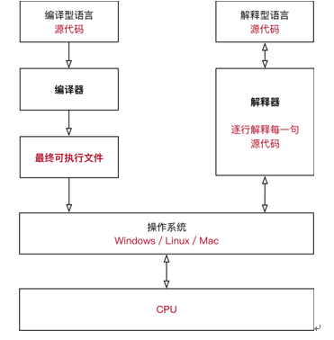
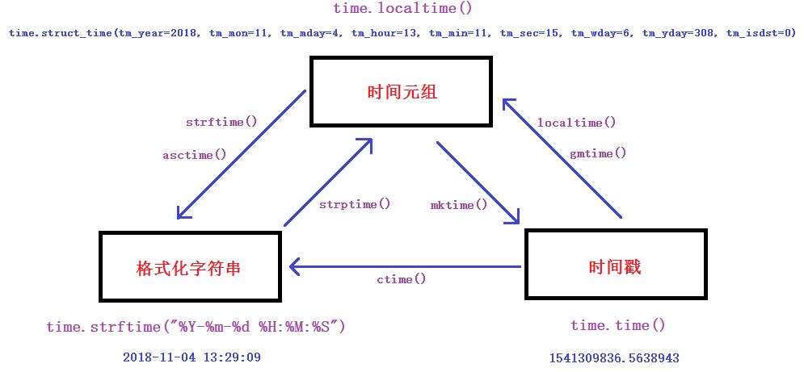

python基础

## 认识python

python的哲学: 明确,优雅,简单
kiss keep it simple,keep it stupid
问题: 我都学了shell，为什么还要学python？
答: python更强大，功能更丰富，执行效率比shell高。还有就是顺应开发型运维的趋势.

## python的优缺点

python优点:

1. 简单,易学,易懂,开发效率高：Python容易上手,语法较简单。在linux上和写shell一样，拿着vi都可以写，直接就可以运行。
2. 免费、开源：我们运维用的大部分软件都是开源啊,亲！
3. 可移植性,跨平台：Python已经被移植在许多不同的平台上,Python程序无需修改就可以在Linux,Windows,mac等平台上运行。
4. 可扩展性：如果你需要你的一段关键代码运行得更快或者希望某些算法不公开，你可以把你的部分程序用C或C++编写，然后在你的Python程序中使用它们（讲完编译型语言和解释型语言区别就容易理解了)。
5. 丰富的库： 想产生个随机数? 调库啊。想操作os? 调库啊。想操作mysql? 调库啊调库君。。。。。。Python的库太丰富宠大了，它可以帮助你处理及应对各种场景应用。
6. 规范的代码：Python采用强制缩进的方式使得代码具有极佳的可读性。

python缺点：

1. 执行效率慢 : 这是解释型语言(下面的解释器会讲解说明)所通有的，同时这个缺点也被计算机越来越强性能所弥补。有些场景慢个几微秒几毫秒,一般也感觉不到。
2. 代码不能加密: 这也是解释型语言的通有毛病，当然也有一些方法可以混淆代码。解决方法: 参考优点的第4条.

## Python应用场景

1. 操作系统管理、服务器运维的自动化脚本
   一般说来，Python编写的系统管理脚本在可读性、性能、代码重用度、扩展性几方面都优于普通的shell脚本。
2. Web开发
   Python经常被用于Web开发。比如，通过mod_wsgi模块，Apache可以运行用Python编写的Web程序。Python定   义了WSGI标准应用接口来协调Http服务器与基于Python的Web程序之间的通信。一些Web框架，如   Django,TurboGears,web2py,Zope等，可以让程序员轻松地开发和管理复杂的Web程序。
3. 服务器软件（网络软件）
   Python对于各种网络协议的支持很完善，因此经常被用于编写服务器软件、网络爬虫。第三方库Twisted支持异步   网络编程和多数标准的网络协议(包含客户端和服务器)，并且提供了多种工具，被广泛用于编写高性能的服务器软件。
4. 游戏
   很多游戏使用C++编写图形显示等高性能模块，而使用Python或者Lua编写游戏的逻辑、服务器。相较于Python，   Lua的功能更简单、体积更小；而Python则支持更多的特性和数据类型。
5. 科学计算
   NumPy,SciPy,Matplotlib可以让Python程序员编写科学计算程序。
6. 其它领域
   无人驾驶，人工智能等。

## 解释型语言与编译型语言

计算机只能识别机器语言（如:01010101001这种）, 程序员不能直接去写01这种代码，所以要程序员所编写的程序
语言翻译成机器语言。将其他语言翻译成机器语言的工具，称之为编译器。
如：中国人 ---（翻译）----外国人
编译器翻译的方式有两种，一种是编译，一种是解释。区别如下:



正因为这样的区别，所以解释型语言开发效率高,但执行慢和无法加密代码

## python版本

python2.x 2020年终止维护
python3.x 目前主流版本
python官网下载地址:
https://www.python.org/getit/

## 第一个python脚本

```py
# vim 1.py
#!/usr/bin/python # 声明类型,指明解释器命令路径
#-*- coding: utf-8 -*- # 指定字符格式为utf-8（可以打印中文）,python3不用再指定了
print "hellow world" # python2的写法,python3执行会报错
print ("hello world") # python3的写法,python2也可以执行
print ("哈哈") # python2指定了utf-8字符，那么这里就可以使用中文
执行方法一:
# python 1.py
执行方法二:
# chmod 755 1.py
# ./1.py # 需要有执行权限和声明类型才能这样执行
```

2. 使用python命令（默认版本)交互写

```py
# python
>>> print ("hello world")
hello world
>>> exit() --使用exit()或ctrl+d键来退出
```

## python安装

在linux上(虚拟机的话请把内存调大点)安装python3.x（我这里为3.6.6版本)

```bash
linux系统如果gnome图形界面和开发工具都安装了,那么就还需要安装zlib-devel,openssl,openssl-devel这
几个依赖包
# yum install zlib-devel openssl openssl-devel
# tar xf Python-3.6.6.tar.xz -C /usr/src/
# cd /usr/src/Python-3.6.6/
# ./configure --enable-optimizations
编译第一步如果报错,十之八九是缺少依赖包
# make --这一步时间较长(20-30分钟，视机器速度而定)
编译第二步如果报错,有可能是系统兼容性的问题，换一个版本或编译参数试试（有人这一步可能会卡住，那么在前一步
不加--enable-optimizations参数重试)
# make install
编译第三步几乎不会报错，除非你的安装路径空间不够了
# ls /usr/local/bin/python3.6 --确认此命令
# ls /usr/local/bin/pip3.6 --确认此命令,pip为python安装模块的命令
```

pycharm安装

yCharm是一种Python IDE（Integrated Development Environment, 集成开发环境）。它带有一整套可以帮助
用户在使用Python语言开发时提高其效率的工具，比如调试、语法高亮、Project管理、代码跳转、智能提示、自
动完成、单元测试、版本控制。
pycharm官网下载地址:
http://www.jetbrains.com/pycharm/download/#section=linux
专业版: 功能全，需要收费，但可以试用30天
社区版: 免费版，学习基础够用了

## pyenv安装(了解)

pyenv是一个python多版本管理工具，当服务器上存在不同版本的python项目时，使用pyenv可以做到多版本的
隔离使用(类似虚拟化)，每个项目使用不同版本互不影响。
pyenv文档及安装地址:
https://github.com/pyenv/pyenv

```bash
1,使用git clone下载安装到家目录的.pyenv目录
# git clone https://github.com/pyenv/pyenv.git ~/.pyenv
2,设置环境变量,并使之生效,这样才能直接使用pyenv命令
# echo 'export PYENV_ROOT="$HOME/.pyenv"' >> /etc/profile
# echo 'export PATH="$PYENV_ROOT/bin:$PATH"' >> /etc/profile
# source ~/.bash_profile
# pyenv help
# pyenv install -l --或者使用pyenv install --list列出所有的python当前可用版本
3,先解决常见依赖包的问题，否则下一步安装会报错
# yum install zlib-devel bzip2-devel openssl-devel ncurses-devel sqlite-devel readline-
devel tk-devel gdbm-devel libpcap-devel xz-devel -y
4,安装3.6.6版本,需要下载并安装,速度较慢。它会安装到~/.pyenv/versions/下对应的版本号
# pyenv install 3.6.6
5,查看当前安装的版本,前面带*号的是默认使用的版本
# pyenv versions
* system (set by /root/.pyenv/version)
3.6.6
```

pyenv-virtualenv是pyenv的插件，为pyenv设置的python版本提供隔离的虚拟环境。不同版本的python在不同
的虚拟环境里使用互不影响。
pyenv-virtualenv文档及安装地址:
https://github.com/pyenv/pyenv-virtualenv

```bash
1，将pyenv-virtualenv这个plugin下载安装到pyenv根目录的plugins/下叫pyenv-virtualenv
# git clone https://github.com/pyenv/pyenv-virtualenv.git $(pyenv root)/plugins/pyenv-
virtualenv
2，把安装的3.6.6版本做一个隔离的虚拟化环境，取名为python3.6.6(这个取名是自定义的)
# pyenv virtualenv 3.6.6 python3.6.6
3，active激活使用，但报错
# pyenv activate python3.6.6
Failed to activate virtualenv.
Perhaps pyenv-virtualenv has not been loaded into your shell properly.
Please restart current shell and try again.
解决方法:
# echo 'eval "$(pyenv init -)"' >> /etc/profile
# echo 'eval "$(pyenv virtualenv-init -)"' >> /etc/profile# source /etc/profile
4,再次激活，成功
# pyenv activate python3.6.6
pyenv-virtualenv: prompt changing will be removed from future release. configure
`export PYENV_VIRTUALENV_DISABLE_PROMPT=1' to simulate the behavior.
(python3.6.6) [root@daniel ~]# pip install ipython --安装一个ipython测试
5,使用ipython测试完后退出虚拟环境
(python3.6.6) [root@daniel ~]# ipython
In [1]: print ("hello word")
hello word
In [2]: exit
(python3.6.6) [root@daniel ~]# pyenv deactivate --这里exit就退出终端了，用此命令退出虚拟环境
[root@daniel ~]#
这样的话，你可以在linux安装多个版本的python,使用不同的隔离环境来开发不同版本的python程序.
删除隔离环境的方法:
# pyenv uninstall python3.6.6
```

小结:
我们已经安装的几种python开发环境对比:

1. /usr/local/bin/python3.6回车 交互式，没有辅助功能，非图形化
2. vim 1.py 非交互式，没有辅助功能，非图形化
3. pycharm 非交互式，有辅助功能，图形化
4. ipython 交互式，有辅助功能，非图形化

## print 打印

基本的打印规则
Python程序由多个逻辑行构成，一个逻辑行不一定为一个物理行(人眼看到的行)
显式行连接: \ 在物理行后跟反斜杠， 代表此行连接下一行代码
隐式行连接: () [] {} 在括号里换行会自动行连接
字符串需要用引号引起来，单引双引都可以。
示例: 换行打印

```bash
help(print) # 帮助方法
print("hello world")
print("python") # 这是两句分开的打印，会打印两行
print("hello world\npython") # 打印的结果会换行
print('''hello world
python''') # 打印的结果会换行
print("hello world
python") # 错误写法
```

示例: 不换行打印

```bash
print('hello world',end=" ") # python3里加上end=" "，可以实现不换行打印.这两句只打印一行
print("python")
print("hello world \
python") # 使用\符号连接行，物理上换了行，逻辑上并没有换行。
print("hello world"
"python") # (),[],{}里的多行内容不用\连接，但需要每行引起来;打印出来的结果不换行
```

示例: 使用VT100控制码(用来在终端扩展显示的代码)实现有颜色的打印

```bash
shell里也可以实现有颜色的打印
# vim 1.sh
#!/bin/bash
echo -en "\\033[0;30m\\033[0;31mhello world\n\\033[0;30m"
echo -en "\\033[0;30m\\033[0;32mhello world\n\\033[0;30m"
echo -en "\\033[0;30m\\033[0;33mhello world\n\\033[0;30m"
echo -en "\\033[0;30m\\033[0;34mhello world\n\\033[0;30m"
echo -en "\\033[0;30m\\033[0;35mhello world\n\\033[0;30m"
echo -en "\\033[0;30m\\033[0;36mhello world\n\\033[0;30m"

python里实现的有颜色打印
print("\033[31;1;31mhello world\033[0m")
print("\033[31;1;32mhello world\033[0m")
print("\033[31;1;33mhello world\033[0m")
print("\033[31;1;34mhello world\033[0m")
print("\033[31;1;35mhello world\033[0m")
print("\033[31;1;36mhello world\033[0m")
结果如下:
```

## 注释

```py
单行注释
#hello   #后不空行 pycharm下面会有线
# hello  #后空行,pycharm里一切ok

在代码的后面添加注释 ：注释和代码之间要至少有两个空格
print("hello world")# comment
print("hello world") # comment
print("hello world")  # comment  //注释和代码之间两个空格

多行注释 : 三引号（三个双引或三个单引)里包含注释内容
'''
注释内容
'''

"""
注释内容
"""
快捷键 ctrl + /
```

## 代码规范PEP

Python 官方提供有一系列 PEP（Python Enhancement Proposals） 文档
其中第 8 篇文档专门针对 Python 的代码格式 给出了建议，也就是俗称的 PEP 8
文档地址：https://www.python.org/dev/peps/pep-0008/
谷歌有对应的中文文档：http://zh-google-styleguide.readthedocs.io/en/latest/google-python-styleguide/pyth
on_style_rules/

## 变量

变量：在内存中开辟一块空间，存储规定范围内的值，值可以改变。通俗的说变量就是给数据起个名字，通过这个名字来访问和存储空间中的数据。

变量的特点
可以反复存储数据
可以反复取出数据
可以反复更改数据

变量的命名规则
变量名只能是字母、数字或下划线的任意组合
变量名的第一个字符不能是数字
变量名要有见名知义的效果, 如UserName,user_name
变量名区分大小写

以下关键字不能声明为变量名(关键字是python内部使用或有特殊含义的字符) ['False', 'None', 'True', 'and','as', 'assert', 'break', 'class', 'continue', 'def', 'del', 'elif', 'else', 'except', 'finally', 'for', 'from', 'global', 'if','import', 'in', 'is', 'lambda', 'nonlocal', 'not', 'or', 'pass', 'raise', 'return', 'try', 'while', 'with', 'yield']

import keyword # 导入keyword模块
print(keyword.kwlist) # 打印上面的关键字列表

## 变量的创建

```py
num=100 # num第一次出现是表示定义这个变量
num=num-10 # 再次出现，是为此变量赋一个新的值
print(num)

name1="daniel"
print(id(name1))
name2="daniel"
print(id(name2)) # id()函数用于获取对象内存地址;name1和name2得到的id相同,说明指向同一个内存空间
```

## 两个变量值的交换

```py
a=1
b=2
print(a,b)

a,b=b,a
print(a,b)
```

## 变量的类型

在程序中，为了更好的区分变量的功能和更有效的管理内存，变量也分为不同的类型。
Python是强类型的动态解释型语言。
强类型: 不允许不同类型相加。如整型+字符串会报错。
动态：不用显式声明数据类型，确定一个变量的类型是在第一次给它赋值的时候，也就是说: 变量的数据类型是由值决定的。

```py
name="zhangsan" # str类型
age=25 # 25没有加引号，则为int类型；加了引号，则为str类型;
height=1.8 # float类型
marry=True # bool类型（布尔值)
print(type(name)) # 通过type()函数得知变量的类型
print(type(age))
print(type(height))
print(type(marry))
```

## Python基本数据类型分类

1. 数字
   int 整型(1, 2, -1, -2)
   float 浮点型(34.678)
   bool 布尔型(True/False)
   complex 复数(4+3J, 不应用于常规编程，这种仅了解一下就好
2. 字符串
   str 单引号和双引号内表示的内容为字符串 “hello world" "12345"
3. 列表
   list 使用中括号表示 [1, 2, 3, 4]
4. 元组
   tuple 使用小括号表示 (1, 2, 3, 4)
5. 字典
   dict 使用大括号表示，存放key-value键值对 {"a":1, "b":2, "c":3}
6. 集合
   set 也使用大括号表示，但与字典有所不同 {1, 2, 3, 4}

## 类型的转换

转换函数      说明
int(xxx)     将xxx转换为整数
float(xxx)   将xxx转换为浮点型
str(xxx)     将xxx转换为字符串
list(xxx)    将xxx转换为列表
tuple(xxx)   将xxx转换为元组
dict(xxx)    将xxx转换为字典
set(xxx)     将xxx转换为集合
chr(xxx)     把整数[0-255]转成对应的ASCII码
ord(xxx)     把ASCII码转成对应的整数[0-255]

```
age=25
print(type(age)) # int类型
age=str(25)
print(type(age)) # str类型

name="zhangsan"
age=25
print(name,"你"+age+"岁了") # str+int，字符串拼接报错;age=str(25),这一句就可以成功。
```

## 输入输出

输入 
还记得shell里的read吗？

```bash
shell里的read输入用法
#!/bin/bash
read -p "input your name:" name
read -p "input your age:" age
echo "$name,you are $age old years"

用python3中可以使用input()函数等待用户的输入（python2中为raw_input()函数)

python里的input输入用法
name=input("what is your name: ")
age=input("what is your age: ") # input输入的直接就为str类型，不需要再str()转换了
print(name,"你"+age+"岁了")
```

输出
普通输出
输出用print()

```bash
print("="*10) # 表示连续打印10个=符号
print("1-系统")
print("2-数据库")
print("3-quit")
print("="*10)
或者
print("="*10)
print('''1-系统 # 使用''' '''符号来换行
2-数据库
3-quit''')
print("="*10)
```

## 格式化输出

还记得awk里的printf吗? (学过C基础的也肯定知道printf)
python里不用printf，但也可以用 % 表示格式化操作符

操作符    说明
%s       字符串
%d       整数
%f       浮点数
%%       输出 %

```py
name=input("what is your name: ")
age=input("what is your age: ")
num=int(input("what is your phone number: ")) # 因为iput输入的纯数字也是是str类型,所以用int()转成int类型，这样才能在后面对应%d

print(name,"you are %s years old,and your phone number is %d"%(age,num)) # 按顺序对应,age对应%s，num对应%d

name=input("what is your name: ")
age=input("what is your age: ")
num=int(input("what is your phone number: "))
# 下面这是一种新的格式化输出写法,不用去纠结是写%s还是%d，只对应好顺序就行.（0代表第一个,1代表第二个)
print(name,"you are {} years old, and your phone number is {}".format(age,num))
print(name,"you are {1} years old, and your phone number is {0}".format(num,age))

```py
name = input("what is your name: ")
sex = input("what is your sex: ")
job = input("what is your job: ")
phonenum = input("what is your number: ")
info = '''
---------- information of {} ----------
name: {}
sex: {}
job: {}
phonenum: {}
'''.format(name, name, sex, job, phonenum)
print(info)
```

## 运算符

```
算术运算符   描述           
+           加法             
-           减法             
*           乘法             
/           除法             
//           整除                10//3=3(不能整除的只保留整数部分)
**           求幂                2**3=8
%           取余（取模）          10%3=1 得到除法的余数


赋值运算符            描述
=              简单的赋值运算符，下面的全部为复合运算符
+=             加法赋值运算符
-=             减法赋值运算符
*=             乘法赋值运算符
/=             除法赋值运算符
//=            整除赋值运算符
**=            求幂赋值运算符
%=             取余（取模)赋值运算符

比较运算符     描述
==           等于
!=           不等于
<>           不等于
>            大于
<            小于
>=           大于等于
<=           小于等于

print(type(2<=1)) # 结果为bool类型，所以返回值要么为True,要么为False.

逻辑运算符     
and             x and y   两个都为true则返回true
or              x or y    任意一个条件为true,则返回true
not             not x     取反  

成员运算符
在后面讲解和使用序列(str,list,tuple) 时，还会用到以下的运算符
in               x 在 y序列中 就返回true
not in           x  不在 y序列中 就返回true 

身份运算符
is          is判断两个标识符是不是引用一个对象  x i y 类似 id(x) == id(y)
is not      is not判断两个标识符是不是引用不同的对象. x is not y,类似 id(x) != id(y)

is 与 == 区别：
is 用于判断两个变量引用对象是否为同一个(同一个内存空间)， == 用于判断引用变量的值是否相等。
a=[1,2,3]
b=a[:]
c=a
print(b is a) # False
print(b == a) # True
print(c is a) # True
print(c == a) # True

位运算符 (了解)
还记得IP地址与子网掩码的二进制算法吗？
这里的python位运算符也是用于操作二进制的。

位运算符     说明
&           对应二进制位两个都为1，结果为1
|           对应二进制位两个有一个1, 结果为1, 两个都为0才为0
^           对应二进制位两个不一样才为1,否则为0
>>          去除二进制位最右边的位，正数上面补0, 负数上面补1
<<          去除二进制位最左边的位，右边补0
~           二进制位，原为1的变成0, 原为0变成1

运算符的优先级
常用的运算符中: 算术 > 比较 > 逻辑 > 赋值
示例: 请问下面的结果是什么?
result = 3-4 >=0 and 4*(6-2)>15
print(result)

result = 3-4 >=0 and 4*(6-2)>15
          -1          16
            flast      true 
            False
```

## 判断语句

shell里的判断语句格式

```bash
shell单分支判断语句:
if 条件;then
执行动作一
fi
shell双分支判断语句:
if 条件;then
执行动作一
else
执行动作二
fi
shell多分支判断语句:
if 条件一;then
   执行动作一
elif 条件二;then
   执行动作二
elif 条件三;then
   执行动作三
else
   执行动作四
fi

case 变量 in
   值一 )
      动作一;;
   值二 )
      动作二;;
   * )
      其它动作
esac
```

示例: 判断输入的字符是否为数字

```
shell的写法
#!/bin/bash
read -n 1 -p "input a char:" char
echo
echo $char |grep [0-9] &> /dev/null
if [ $? -eq 0 ];then
   echo "$char is a digit"
else
   echo "$char is not a int"
fi

python的写法
char=input("input a char: ")
if char.isdigit():
   print(char,"is digit")
```

练习:使用input输入字符，判断输入是数字，小写字母，大写字母，还是其它

```py
答:
char=input("input a char: ")
if char.isdigit():
print ("{} is a digit".format(char))
elif char.islower():
print("{} is a lower".format(char))
elif char.isupper():
print("{} is a upper".format(char))
else:
print("{} is other char".format(char))
```

示例:通过os模块判断操作系统上的文件是否存在

```py
shell的做法，shell虽然在这里使用-e来判断很方便，但只能用于linux平台
#!/bin/bash
read -p "input a file path: " file
if [ -e $file ];then
   echo "$file exists"
else
   echo "$file not exists"
fi

python的做法,python这里要调用os模块里的os.path.exists()来判断，看起来比shell麻烦，但这个脚本也可
以在windows和mac上运行
import os
file=input("input a file: ")
if os.path.exists(file):
   print(file,"exists")
else:
   print(file,"not exists")
```

示例:看看下面语句有什么错误:

```py
if 1>0:
   print("yes")
else:
   print("no")
print("haha")
   print("hehe")  #这里多了空格
```

示例:使用getpass模块使用密码隐藏输入
隐藏输入密码(类似shell里的read -s )，但在pycharm执行会有小bug,会卡住(卡住后，用ps -ef |grep pycharm，
然后kill -9 杀掉所有pycharm相关进程)；在bash下用python命令执行就没问题

```bash
这是shell的用法，并且实现了*打印功能，有兴趣可以测试一下
#!/bin/bash
getchar() {
stty cbreak -echo
dd if=/dev/tty bs=1 count=1 2> /dev/null
stty -cbreak echo
}
echo -n "请输入你的密码:"
while true
do
   char=`getchar`
   if [ -z $char ]; then
      echo
      break
   fi
   password1="$password1$char"
   echo -n "*"
done
echo "$password1"

#运行效果
[root@m01 ~]# sh test.sh
请输入你的密码:****************
1234123561345132

-------------------------------
import getpass
username=input("username:")
password=getpass.getpass("password:")
if username == "daniel" and password == "123":
print("login success")
else:
print("login failed")
```

示例:通过年龄是否成年与性别来判断对一个人的称呼

```bash
name=input("what is your name: ")
age=int(input("how old are you: "))
sex=input("what is your sex: ")

if age >= 18 and sex=="male":
   print(name,"sir")
elif age>=18 and sex=="female":
   print(name,"lady")
elif age<18 and sex=="male":
   print(name,"boy")
elif age<18 and sex=="female":
   print(name,"girl")
```

还记得shell里有个case语句吗？也可以实现多分支判断。但是python里没有case语句.

练习: input输入一个年份,判断是否为闰年(能被4整除但不能被100整除的是闰年，或者能被400整除的也是闰年)

```bash
shell的多种做法
#!/bin/bash
#方法一:
read -p "输入一个年份:" year
if [ $[$year%4] -eq 0 -a $[$year%100] -ne 0 ];then
   echo "$year是闰年"
elif [ $[$year%400] -eq 0 ];then
   echo "$year是闰年"
else
   echo "$year不是闰年"
fi
#方法二:
read -p "输入一个年份:" year
if [ $[$year%4] -eq 0 -a $[$year%100] -ne 0 -o $[$year%400] -eq 0 ];then
   echo "$year是闰年"
else
   echo "$year不是闰年"
fi

#方法三:
read -p "输入一个年份:" year
date -d "$year-02-29" &> /dev/null
if [ $? -eq 0 ];then
   echo "$year是闰年"
else
   echo "$year不是闰年"
fi

#方法四:
read -p "输入一个年份:" year
days=`date -d "$year-12-31" +%j`
if [ $days -eq 366 ];then
   echo "$year是闰年"
else
   echo "$year不是闰年"
fi
```

```py
# 方法一
import calendar
a=int(input("input a year: "))
print(calendar.isleap(a))

# 方法二
year=int(input("input a year: "))
if year%4 == 0 and year%100 != 0 or year%400 ==0:
   print(year,"is leapyear")
else:
   print(year,"is not leapyear")
```

if嵌套
if嵌套也就是if里还有if，你可以无限嵌套下去，但层次不宜过多（嵌套层次过多的话程序逻辑很难读，也说明你的
程序思路不太好，应该有很好的流程思路来实现）

```py
if 条件一:
   if 条件二:
      执行动作一 # 条件一，二都为True，则执行动作一
   else:
         执行动作二 # 条件一True，条件二False，则执行动作二
      执行动作三 # 条件一True，条件二无所谓，则执行动作三
else:
   if 条件三:
      执行动作四 # 条件一False，条件三True，则执行动作四
   else:
         执行动作五 # 条件一False,条件三False,则执行动作五
   执行动作六 # 条件一False,条件二，三无所谓，则执行动作四
执行动作七 # 与if里的条件无关，执行动作七
```

示例

```bash
name=input("what is your name: ")
age=int(input("how old are you: "))
sex=input("what is your sex: ")
if sex=="male":
   if age>=18:
      print(name,"sir")
   else:
      print(name,"boy")
else:
   if age>=18:
      print(name,"lady")
   else:
      print(name,"girl")
```

## 循环语句

while循环

while 条件:
条件满足时候:执行动作一
条件满足时候:执行动作二
......

continue 跳出本次循环，直接执行下一次循环
break 退出循环，执行循环外的代码
exit() 退出python程序，可以指定返回值

示例: 打印1-10

```py
i=1
while i<=10:
   print(i,end=" ")
   i+=1
```

示例: 猜数字小游戏

```py
import random
num=random.randint(1,100) # 取1-100的随机数（包括1和100)
while True:
   gnum=int(input("please guess:"))
if gnum > num:
   print("bigger")
   continue
elif gnum<num:
   print("smaller")
   continue
else:
   print("right")
break
```

练习: 求1-100中的所有偶数之和

```py
# 方法一
i=2
sum=0
while i<101:
   sum+=i
   i+=2
print(sum)
# 方法二
sum=0
for i in range(2,101,2):
   sum+=i
print(sum)
# 方法三
sum=0
for i in range(1,101):
   if i%2 == 0:
      sum+=i
print(sum)
# 方法四
sum=0
for i in range(1,101):
   if i%2 == 1:
      continue
   else:
      sum+=i
print(sum)
```

## for循环

for循环遍历一个对象（比如数据序列，字符串,列表,元组等）,根据遍历的个数来确定循环次数。
for循环可以看作为定循环，while循环可以看作为不定循环。

```py
for i in (1,2,3,4,5): # 这里用小括号表示是一个元组，换成[]做成列表或{}做成集合，在这里都是可以的
   print(i,end=" ")
print()
for i in range(1,6): # range函数，这里是表示1，2，3，4，5（不包括6）
   print(i)
for i in range(6): # range函数，这里是表示0，1，2，3，4，5（不包括6，默认从0开始）
   print(i)
for i in range(1,100,2):
   print(i,end=" ")
print()
for i in range(100,1,-2):
   print(i,end=" ")
```

练习: 用for循环来实现 1-100之间能被 5整除,同时能被3整除的数的和

```py
sum=0
for i in range(1,101):
   if i%5 == 0 and i%3 == 0:
      sum+=i

print(sum)
```

练习:改写猜数字游戏，最多只能猜5次，5次到了没猜对就退出

```py
import random
num=random.randint(1,100)
for i in range(5):
   gnum=int(input("please guess:"))
   if gnum > num:
      print("bigger")
   elif gnum<num:
      print("smaller")
   else:
      print("right")
      break
   if i == 4:
      print("you are out of chances")
      exit()
print("give you 100 dallor")
```

循环嵌套
前面在讲if时解释过嵌套是什么，这里我们再来做一个总结: if,while,for都可以互相嵌套。

示例: 一个袋子里有3个红球，3个绿球，6个黄球，一次从袋子里取6个球，列出所有可能组合

```py
sum=0
for i in range(4):
   for j in range(4):
      print("红球{},绿球{},黄绿{}".format(i,j,6-i-j))
      sum+=1
print("一共有{}种排列组合方式".format(sum))
```

练习: 打印1-1000的质数（只能被1和自己整除的数)

```py
for i in range(2,1001):
   for j in range(2,i):
      if i%j == 0:
         break
   else:
      print(i,end=" ")
```

练习: 打印九九乘法表

```py
for i in range(1,10):
   for j in range(1,i+1):
      print("{}*{}={}".format(j,i,i*j),end=" ")
   print()
```

## 字符串-str

python数据类型再次回顾:

1. 数字 int float bool
2. 字符串 str
3. 列表 list
4. 元组 tuple
5. 字典 dict
6. 集合 set

字符串的定义与输入
在python中,用引号引起来的都是字符串。还有input函数输入的， str()函数转换的等。

```py
string1="hello"
string2='hello'
string3="""hello
python"""
string4='''hello
world'''
string5=input("input anything: ")
string6=str(18)
print(isinstance(string3,str)) # isinstance函数可以用来判断数据是否为某一个数据类型，返回值为
True或False
```

字符串的拼接

```py
name="daniel"
str1="==="+name+"==="
str2="===%s==="%(name)
str3="==={}===".format(name)
print(str1)
print(str2)
print(str3) # 三种方法结果一样
```

字符串的下标

字符串，列表，元组都属于序列，所以都会有下标。

示例: 将字符串遍历打印

```py
str1="hello,python"
for i in str1: # 直接用for循环遍历字符串
   print(i,end=" ")
```

示例: 将字符串遍历打印,并对应打印出下标

```py
str1="hello,python"
for i,j in enumerate(str1):
   print(i,j)
```

示例: 将字符串遍历打印,并对应打印出顺序号(从1开始，不是像下标那样从0开始)

```py
str1="hello,python"
# 方法一
for i,j in enumerate(str1):
   print(i+1,j)
# 方法二
num=1
for i in str1:
   print(num,i)
   num+=1
```

字符串的切片,倒序
字符串，列表，元组都属于序列，所以都可以切片。

```py
a="abcdefg"
print(a[0:3]) # 取第1个到第3个字符（注意，不包含第4个）
print(a[2:5]) # 取第3个到第5个字符（注意，不包含第6个）

print(a[0:-1]) # 取第1个到倒数第2个（注意:不包含最后一个)
print(a[1:]) # 取第2个到最后一个
print(a[:]) # 全取
print(a[0:5:2]) # 取第1个到第5个，但步长为2（结果为ace)
print(a[::-1]) # 字符串的倒序（类似shell里的rev命令)
```

```bash
扩展shell里其它的切片方式
# str="abcdefg"
# echo ${str:1:3}
bcd
# echo $str |cut -c2-4
bcd
# echo $str |awk '{print substr($0,2,3)}'
bcd
# echo $str |sed -r 's/(.)(...)(.*)/\2/'
bcd
```

字符串的常见操作

```py
abc="hello,nice to meet you"
print(len(abc)) # 调用len()函数来算长度
print(abc.__len__()) # 使用字符串的__len__()方法来算字符串的长度
print(abc.capitalize()) # 整个字符串的首字母大写
print(abc.title()) # 每个单词的首字母大写
print(abc.upper()) # 全大写
print(abc.lower()) # 全小写
print("HAHAhehe".swapcase()) # 字符串里大小写互换
print(abc.center(50,"*")) # 一共50个字符,字符串放中间，不够的两边补*
print(abc.ljust(50,"*")) # 一共50个字符,字符串放中间，不够的右边补*
print(abc.rjust(50,"*")) # 一共50个字符,字符串放中间，不够的左边补*
print(" haha\n".strip()) # 删除字符串左边和右边的空格或换行
print(" haha\n".lstrip()) # 删除字符串左边的空格或换行
print(" haha\n".rstrip()) # 删除字符串右边的空格或换行
print(abc.endswith("you")) # 判断字符串是否以you结尾
print(abc.startswith("hello")) # 判断字符串是否以hello开始
print(abc.count("e")) # 统计字符串里e出现了多少次
print(abc.find("nice")) # 找出nice在字符串的第1个下标，找不到会返回-1
print(abc.rfind("e")) # 找出最后一个e字符在字符串的下标，找不到会返回-1
print(abc.index("nice")) # 与find类似，区别是找不到会有异常（报错）
print(abc.rindex("e")) # 与rfind类似，区别是找不到会有异常（报错）
print(abc.isalnum())
print(abc.isalpha())
print(abc.isdecimal())
print(abc.isdigit())
print(abc.islower())
print(abc.isnumeric())
print(abc.isspace())
```

数字,字符串,元组是不可变类型.下面的操作可以替换字符串的值，但原字符串没有改变。

```py
aaa="hello world,itcast"
bbb=aaa.replace('l','L',2) # 从左到右，把小写l替换成大写L，并且最多只替换2个
print(aaa) # 原值不变
print(bbb) # 改变的值赋值给了bbb变量，所以这里看到的是替换后的值


print("root:x:0:0".split(":")) # 以:为分隔号,分隔成列表
print("root:x\n:0:0".splitlines()) # 以\n为分隔号，分隔成列表
```

字符串的join操作
`print(" ".join(['df', '-h'])) # 把列表里的元素以前面引号里的分隔符合成字符串`

练习:使用input输入一个字符串，判断是否为强密码: 长度至少8位,包含大写字母,小写字母,数字和下划线这四类字符则为强密码

```py
提示:因为没有学python的正则，你可以使用这样来判断 if 字符 in "abcdefghijklmnopqrstuvwxyz":
答:
str=input("input a str: ")
flag1,flag2,flag3,flag4=True,True,True,True
if len(str) < 8:
   print("not enough length")
   exit()
else:
   count=0
   for i in str:
      if i in "0123456789":
         if flag1:
            count+=1
            flag1=False
      if i in "abcdefghijklmnopqrstuvwxyz":
         if flag2:
            count+=1
            flag2=False
      if i in "ABCDEFGHIJKLNMOPQRSTUVWXYZ":
         if flag3:
            count+=1
            flag3=False
      if i in "_":
         if flag4:
            count+=1
            flag4=False
   if count == 4:
      print(str,"is a strong password")
   else:
      print(str,"is not strong password")
```

## 列表-list

列表是一种基本的序列数据结构（字符串和元组也属于序列)
列表是一种可变值的数据类型（再次强调数字,字符串,元组是不可变类型）

列表的创建
使用中括号括起来，里面的数据称为元素。可以放同类型数据，也可以放不同类型数据，但通常是同类型。

os=["rhel","centos","suse","ubuntu"]
print(os)

列表的下标
和字符串一样，见字符串的下标章节
示例:

os=["rhel","centos","suse","ubuntu"]
for i,j in enumerate(os):
print(i,j)

列表的切片,倒序
和字符串一样，见字符串的切片,倒序章节
示例:

```py
os=["rhel","centos","suse","ubuntu"]
print(os[::-1]) # 通过切片来倒序
os.reverse() # 通过reverse操作来倒序，并且是直接改变原数据（因为列表是可变数据类型）
print(os)
```

列表的常见操作

```py
os=["rhel","centos","suse"]
# 增
os.append("ubuntu") # 在列表最后增加一个元素
print(os)
os.insert(2,"windowsxp") # 插入到列表，变为第三个
print(os)
# 改
os[2]="windows10" # 修改第三个
print(os)
# 删
os.remove("windows10") # 删除操作，还可以使用del os[2]和os.pop[2];它们的区别del os是删除整个列表，os.pop()是默认删除列表最后一个元素；如果都用下标的话，则一样
print(os)
# 查
print(os[0]) # 通过下标就可以
# 其它
print(os.index("centos")) # 找出centos在os列表里的位置
os.reverse() # 反转列表
print(os)
os.sort() # 排序列表，按ASCII编码来排序
print(os)
os.clear() # 清除列表所有元素，成为空列表,不是删除列表
print(os)
```

```py
列表合并
list1=["haha","hehe","heihei"]
list2=["xixi","hoho"]
list1.extend(list2) # list1+=list2也可以，类似字符串拼接
print(list1)
```

```py
双列表
name_list=["zhangsan","lisi","wangwu","maliu"]
salary=[18000,16000,20000,15000]

for i in range(name_list.__len__()):
   print("{}的月收入为{}元".format(name_list[i].ljust(10," "),salary[i]))

列表嵌套
emp=[["zhangsan",18000],["lisi",16000],["wangwu",20000],["maliu",15000]]

for i in range(emp.__len__()):
   print("{}的月收入为{}元".format(emp[i][0].ljust(10," "),emp[i][1]))
```

## 元组-tuple

元组就相当于是只读的列表;因为只读,所以没有append,remove,修改等操作方法.
它只有两个操作方法:count,index
元组,字符串,列表都属于序列.所以元组也可以切片.

元组的创建
列表使用中括号，元组使用小括号。
示例:

```py
tuple1=(1,2,3,4,5,1,7)
print(type(tuple1))
print(tuple1.index(3)) # 打印3这个元素在元组里的下标
print(tuple1.count(1)) # 统计1这个元素在元组里共出现几次
print(tuple1[2:5]) # 切片
tuple1[5]=6 # 修改元组会报错
```

```py
emp2=(["zhangsan",18000],["lisi",16000],["wangwu",20000],["maliu",15000])
emp2[0].append("haha") # 元组里面的列表可以修改
print(emp2)
```

可变类型: 在值能改变的基础上,内存地址不变。
不可变类型: 改变值相当于在内存里新开辟一个空间来存放新的值，原内存地址的值不变。

综合练习（有难度，尽量尝试，不做要求）:

```py
tvlist = [
   "戏说西游记:讲述了西游路上的三角恋.",[
      "孙悟空:悟空爱上了白骨精......",
      "唐三藏:唐僧只想取经......",
      "白骨精:她爱上了唐僧......",
      ],
   "穿越三国:王二狗打怪升级修仙史",[
      "王二狗:开局一把刀,一条狗......",
      "吕布:看我方天画鸡......",
      "貂蝉:油腻的师姐,充值998就送!",
   ],
   "金瓶梅:你懂的",[
      "西门大官人:你懂的......",
      "潘金莲:你懂的......",
      "武大郎:你懂的......",
      "武松:你懂的......",
   ],
   "大明湖畔:我编不下去了......",[
      "夏雨荷:xxxxxx",
      "乾隆:xxxxxx",
      "容么么:xxxxxx",
   ],
]
```

```py
答案:
tv_name_num = random.randrange(0,len(tvlist),2)
tv_role_num = tv_name_num + 1
print("今日的通告: ")
print(tvlist[tv_name_num])
print("可接的角色有: ")

for index,role in enumerate(tvlist[tv_role_num]):
   print(index+1,role)

choice = int(input("请问你要接哪个角色(请输入数字): "))

print("恭喜你,你接了{}这个角色,相信我们的合作会让这部剧大火".format(tvlist[tv_role_num][choice-1].split(":")[0]))
```

综合练习（有难度，尽量尝试，不做要求）:
小购物车程序 1,双十一来了，你的卡里有一定金额(自定义) 2,买东西，会出现一个商品列表(商品名，价格) 3,选择
你要买的商品,卡里的钱够就扣钱成功，并加入到购物车;卡里钱不够则报余额不足 （或者做成把要买的商品都先加
入到购物车，最后可以查看购物车，并可以删除购物车里的商品；确定后，一次性付款） 4,买完后退出，会最后显
示你一共买了哪些商品和显示你的余额

```py
提示部分代码:
money=20000
goods_list=[
   ["iphoneX",8000],
   ["laptop",5000],
   ["book",30],
   ["earphone",100],
   ["share_girlfriend",2000],
]
cart_list=[]
```

```py
while True:
   for index,good in enumerate(goods_list):
      print(index+1,good)
   choice = int(input("请输入你要购买的商品编号: "))
   buy_good_price = goods_list[choice-1][1]
   if money >= buy_good_price:
      money -= buy_good_price
      cart_list.append(goods_list[choice-1][0])
   else:
      print("余额不足，请充值!")
      break

print(money)
print(cart_list)
```

```py
num_list=['1','2','3','4','5']
cart_list=[]
for i in range(goods_list.__len__()):
   print("{} {}\t{} RMB".format(num_list[i],goods_list[i][0].ljust(20,""),goods_list[i][1]))
while True:
   cho=int(input("选择商品序号,将其加入购物车[选择完成请输入0]:"))
   if cho == 0:
      break
   else:
      tmp=goods_list[cho-1]
      cart_list.append(tmp)
print('下面是您已选择的商品:')
for j in range(cart_list.__len__()):
   print("{} {}\t{} RMB".format(num_list[j],cart_list[j][0].ljust(10," "),cart_list[j][1]))
sum=0
for h in range(cart_list.__len__()):
   money_used=int(cart_list[h][1])
   sum+=money_used
print('合计{sum}元'.format(sum=sum))
if sum > money:
   print('余额{}-{}={}'.format(money,sum,money-sum))
   while True:
      delete=int(input("您的余额不足抵扣,请选择购物车需要删除的商品[序号]:"))
      tmp_remove=cart_list[delete-1]
      # print(tmp_remove)
      # print(tmp_remove[1])
      cart_list.remove(tmp_remove)
      sum_del=int((tmp_remove[1]))
      sum1=sum-sum_del
      # print(cart_list)
      print('已购商品:')
      if sum1 <= money:
         for j in range(cart_list.__len__()):
            print("{} {}\t{} RMB".format(num_list[j], cart_list[j][0].ljust(10, ""), cart_list[j][1]))
         print('总共花费:{}\n余额:{}'.format(sum1,money-sum1))
         break
else:
   print('已购商品:')
   for s in range(cart_list.__len__()):
      print("{} {}\t{} RMB".format(num_list[s], cart_list[s][0].ljust(10, " "),cart_list[s][1]))
   print('总共花费:{}\n余额:{}'.format(sum, money-sum))
```

## 字典-dict

字典:是一种key:value(键值对)类型的数据，它是无序的（没有像列表那样的索引,下标).它是通过key来找value 底层
就是hash表,查找速度快;如果key相等,会自动去重(去掉重复值)。
字符串,列表,元组属于序列,所以有下标.

字典的创建

```py
dict1 = {
   'stu01':"zhangsan",
   'stu02':"lisi",
   'stu03':"wangwu",
   'stu04':"maliu",
}
print(type(dict1))
print(len(dict1))
print(dict1)
```

字典的常见操作

```py
# 增
dict1["stu05"]="tianqi" # 类似修改,如果key值不存在,则就增加
print(dict1)
# 改
dict1["stu04"]="马六" # 类似增加,如果key值存在,则就修改
print(dict1)
# 字典的增加与修改的写法是一样的，区别就在于key是否已经存在
# 查
print(dict1["stu01"]) # 如果key值不存在,会返回keyerror错误
print(dict1.get("stu01")) # 这种取值方法如果key值不存在,会返回none,不会返回错误
# 删
dict1.pop("stu05") # 删除这条；也可以del dict1["stu05"]来删除
dict1.popitem() # 删除显示的最后一条
dict1.clear() # 清空字典
print(dict1)
# del dict1 # 删除整个字典
```

其它操作（了解）

```py
print(dict1.keys()) # 打印所有的keys
print(dict1.values()) # 打印所有的values
print(dict1.items()) # 字典转成列表套元组
# 上面这三种可以使用for来循环遍历
print("stu01" in dict1) # 判断键stud01是否在字典里,在则返回True,不在则返回False
print(list(dict1)) # 这种只能看到key
dict1.setdefault("stu08","老八") # 有这个key，则不改变；没有这个key，则增加这个key和value
# if "stu08" in dict1:
#     pass
# else:
#     dict1["stu08"]="老八" # 这个判断也可以实现setdefault的方法效果
print(dict1)
dict2={
   "stu02":"李四",
   "stu09":"老九"
}
dict1.update(dict2) # 把dict2更新到dict1;如果dict2有dict1也有的key，则dict1更新它的value;如果dict2有，而dict1没有的key，则加到dict1
print(dict1)
```

字典练习:

```py
city={
   "北京": {
      "东城":"景点",
      "朝阳":"娱乐",
      "海淀":"大学",
   },
   "深圳":{
      "罗湖":"老城区",
      "南山":"IT男聚集",
      "福田":"华强北",
   },
   "上海":{
      "黄埔":"xxxx",
      "徐汇":"xxxx",
      "静安":"xxxx",
   },
}
```

1. 打印北京东城区的说明（也就是打印出"景点")
2. 修改北京东城区的说明，改为"故宫在这"
3. 增加北京昌平区及其说明
4. 修改北京海淀区的说明，将"大学"改为"清华","北大","北邮"三个学校的列表
5. 在大学列表里再加一个"北影"
6. 循环打印出北京的区名,并在前面显示序号(以1开始)
7. 循环打印出北京海淀区的大学,并在前面显示序号(以1开始)

```py
print(city["北京"]["东城"])
city["北京"]["东城"]="故宫在这"
print(city["北京"]["东城"])
city["北京"]["昌平"]="我们在这"
print(city)
city["北京"]["海淀"]=["清华","北大","北邮"]
print(city["北京"]["海淀"])
city["北京"]["海淀"].append("北影")
print(city["北京"]["海淀"])

for index,i in enumerate(city["北京"].keys()):
   print(index+1,i)

for index,i in enumerate(city["北京"]["海淀"]):
   print(index+1,i)
```

练习:打印出所有value为2的key

```py
dict1={
'张三': 2,
'田七': 4,
'李四': 3,
'马六': 2,
'王五': 1,
'陈八': 2,
'赵九': 2,
}
for line in dict1.items():
   if line[1] == 2:
      print(line[0])
```

综合练习（有难度，尽量尝试，不做要求) :
以下面字典中的数据，评选最佳group,最佳class和teacher

```py
info={
   "group1":{
      "class1":["李老师","班级平均成绩85"],
      "class2":["张老师","班级平均成绩89"],
   },
   "group2": {
      "class3": ["王老师", "班级平均成绩78"],
      "class4": ["赵老师", "班级平均成绩91"],
   },
   "group3": {
      "class5": ["马老师", "班级平均成绩82"],
      "class6": ["陈老师", "班级平均成绩79"],
   },
   "group4": {
      "class7": ["钱老师", "班级平均成绩90"],
      "class8": ["孙老师", "班级平均成绩80"],
   },
}
```

```py
class_list=[]
teacher_list=[]
score_list=[]
group_list=[]
group_score_list=[]

for i in info:
   group_list.append(i)
   group_score=0
   for j in info[i]:
      class_list.append(j)
      teacher_list.append(info[i][j][0])
      score_list.append(info[i][j][1][-2:])
      group_score+=int(info[i][j][1][-2:])
   group_score_list.append(group_score)

num1=score_list.index(max(score_list))
num2=group_score_list.index(max(group_score_list))

print("最佳班级为{},最佳老师为{},最佳组为{}".format(class_list[num1],teacher_list[num1],group_list[num2]))
```

## 集合-set(了解)

集合和字典一样都是使用大括号。但集合没有value，相当于只有字典的key。
字符串,列表和元组属于序列，是有序的，但集合是无序的，所以不能通过下标来查询和修改元素。
再总结一下：
整数，字符串，元组是不可变数据类型(整数和字符串改变值的话是在内存里开辟新的空间来存放新值，原内存地址里的值不变)

列表，字典，集合是可变数据类型(在内存地址不变的基础上可以改变值)
当然还有一种不可变集合我们这里不做讨论
集合主要特点:

1. 天生去重（去掉重复值）
2. 可以增，删（准确来说,集合可以增加删除元素，但不能修改元素的值)
3. 可以方便的求交集，并集，补集

示例:

```py
set1={1,2,3,4,5,1,2}
set2={2,3,6,8,8}
print(type(set1))
print(set1)
print(set2) # 打印的结果，没有重复值
```

```py
set1={1,4,7,5,9,6}
set2=set([2,4,5,9,8])
# 交集
print(set1.intersection(set2))
print(set1 & set2)
print(set1.isdisjoint(set2)) # 判断两个集合是否有交集,类型为bool(有交集为False,没交
集为True)
# 并集
print(set1.union(set2))
print(set1 | set2)
# 差集(补集)
print(set1.difference(set2)) # set1里有,set2里没有
print(set1-set2)
print(set2.difference(set1)) # set2里有,set1里没有
print(set2-set1)
# 对称差集
print(set1.symmetric_difference(set2)) # 我有你没有的 加上 你有我没有的
print(set1^set2)
# 子集
set3=set([4,5])
print(set3.issubset(set1)) # 判断set3是否为set1的子集
print(set1.issuperset(set3)) # 判断set1是否包含set3
# 集合的增加操作
set1.add(88)
print(set1)
set1.update([168,998]) # 添加多个
print(set1)
# 集合的删除操作
set1.remove(88) # 删除一个不存在的元素会报错
print(set1)
set1.discard(666) # 删除一个不存在的元素不会报错，存在则删除
print(set1)
```

```py
shell里面求两个文件里相同的行（相当于求交集)
# cat 1.txt
111
222
333
444
777
# cat 2.txt
222
888
555
444
000
# grep -f 1.txt 2.txt
222
444
```

练习: 有以下4个选修课名单

```py
math = ["张三", "田七", "李四", "马六"]
english = ["李四", "王五", "田七", "陈八"]
art = ["陈八", "张三", "田七", "赵九"]
music = ["李四", "田七", "马六", "赵九"]
```

1. 求同时选修了math和music的人
2. 求同时选修了math,enlish和music的人
3. 求同时选修了4种课程的人

```py
print(set(math).intersection(set(english),set(music),set(art)))
# 或
print(set(math).intersection(set(english).intersection(set(music))).intersection(set(art)))
```

1. 找出同时选修了任意1种课程的人,任意2种课程的人,任意3种课程的人，任意4种课程的人
   
   ```py
   math = ["张三", "田七", "李四", "马六"]
   english = ["李四", "王五", "田七", "陈八"]
   art = ["陈八", "张三", "田七", "赵九"]
   music = ["李四", "田七", "马六", "赵九"]
   list1 = math + english + art + music
   dict1={}
   for i in list1:
   if list1.count(i) > 0:
      dict1[i] = list1.count(i)
   for i in dict1.items():
   if i[1] ==1:
      print("{} 选修了1门课".format(i[0]))
   elif i[1] ==2:
      print("{} 选修了2门课".format(i[0]))
   elif i[1] == 3:
      print("{} 选修了3门课".format(i[0]))
   else:
      print("{} 选修了4门课".format(i[0]))
   ```

python数据类型总结:
1, 数字(int,float,bool,complex); 字符串, 列表,元组,字典,集合
2, 字符串，列表，元组属于序列，它们都有下标。字典,集合没有下标
3, 数字,字符串,元组是不可变类型; 列表，字典，集合是可变类型（不可变集合不讨论)
4, 可以做增,删操作的有列表,字典,集合。
5, 列表,字典可以修改里面的元素, 但集合不可以修改里面的元素。
python里括号使用总结:
小括号(): 用于定义元组; 方法调用; print打印; 函数,如len()
中括号(): 用于定义列表; 字符串,列表,元组取下标; 字典取key
大括号(): 用于定义字典,集合; format格式化输出用于取代%s这种的占位符也是大括号

## python文件IO操作

回顾下shell里的文件操作
shell里主要就是调用awk,sed命令来处理文件，特别是sed命令可以使用sed -i 命令直接操作文件的增,删,改。

python文件操作的步骤
python文件的操作就三个步骤：

1. 先open打开一个要操作的文件
2. 操作此文件(读，写，追加等)
3. close关闭此文件

python文件访问模式
帮助: help(open)
简单格式: file_object = open(file_path,mode=" ")
r 只读模式,不能写（文件必须存在，不存在会报错）
w 只写模式,不能读（文件存在则会被覆盖内容（要千万注意），文件不存在则创建）
a 追加模式,不能读
r+ 读写模式
w+ 写读模式
a+ 追加读模式
rb 二进制读模式
wb 二进制写模式
ab 二进制追加模式
rb+ 二进制读写模式
wb+ 二进制写读模式
ab+ 二进制追加读模式

python主要的访问模式示例
只读模式(r)

```py
# 先操作系统head -5 /etc/passwd > /tmp/1.txt准备一个文件
f=open("/tmp/1.txt",encoding="utf-8") # 默认就是只读模式
# 刚打开一个文件(就是一个内存对象或者叫文件句柄要赋值给一个变量,通过变量进行后续操作);如果不同平台,可能
会字符集编码不一致,不一致的需要指定;一致的不用指定。

data1=f.read()
data2=f.read() # 读第二遍

f.close()

print(data1)
print("="*50)
print(data2) # 发现读第二遍没有结果;类似从上往下读了一遍，第二次读从最后开始了，所以就没结果了
```

只写模式(w)

```py
f=open("/tmp/1.txt",'w') # 只写模式(不能读),文件不存在则创建新文件，如果文件存在，则会复盖原内容(千W要小心)
data=f.read() # 只写模式,读会报错
f.close()
```

示例: 创建新文件,并写入内容

```py
f=open("/tmp/2.txt",'w') # 文件不存在,会帮你创建(类似shell里的 > 符号)

f.write("hello\n") # 不加\n,默认不换行写
f.write("world\n")
f.truncate() # 截断，括号里没有数字，那么就是不删除
f.truncate(3) # 截断，数字为3，就是保留前3个字节
f.truncate(0) # 截断，数字为0，就是全删除
f.flush() # 相当于把写到内存的内容刷新到磁盘(要等到写的数据到缓冲区一定量时才会自动写，用此命令就可以手动要求他写)

f.close()
```

示例:针对flush的扩展

```py
import sys,time

for i in range(50):
   sys.stdout.write("=") # print打印会自动换行，这个可以不换行打印；或者print("=",end="")
   sys.stdout.flush() # 这一句不加的话，测试结果会发现不会每隔0.2秒打印，而是缓存了一定后，一次打印出来，加了这个flush就能看到是每隔0.2秒打印的效果了
   time.sleep(0.2)
```

追加模式(a)

```py
f=open("/tmp/2.txt",'a') # 类似shell里的>>符
f.write("hello\n")
f.write("world\n")
f.truncate(0)
f.close()
```

```bash
扩展:
1,但python里的a模式,是可以使用truncate方法来清空内容的
2,在linux系统里执行了下面命令后,则就只能追加此文件,而不能清空此文件内容
# chattr +a /tmp/2.txt
3,如果在linux系统里做了chattr +a /tmp/2.txt后,在python里再用w或a模式open此文件,就不可以使用
truncate方法来清空内容了(因为python允许你这么做,但linux系统拒绝了)
```

## 深入理解 python的io操作

```py
f=open("/tmp/2.txt","r")
print(f.tell()) # 告诉你光标在哪,刚打开文件，光标在0位置
f.seek(5) # 移你的光标到整个文件的第5个字符那
print(f.tell())
data1=f.read() # read是读整个文件在光标后面的所有字符(包括光标所在的那个字符)，读完后，会
把光标移到你读完的位置
data2=f.readline() # readline是读光标所在这一行的在光标后面的所有字符(包括光标所在的那个字符)，读完后，会把光标移到你读完的位置
data3=f.readlines() # readlines和read类似，但把读的字符按行来区分做成了列表

f.close()
print("data1:",data1)
print("data2:",data2)
print("data3:",data3)
```

文件读的循环方法

```py
f=open("/tmp/2.txt","r")
#循环方法一:
for index,line in enumerate(f.readlines()):
   print(index,line.strip()) # 需要strip处理，否则会有换行
# 循环方法二:这样效率较高，相当于是一行一行的读，而不是一次性全读（如果文件很大，那么一次性全读会速度很慢)
for index,line in enumerate(f):
   print(index,line.strip())

f.close()
```

示例: 通过/proc/meminfo得到可用内存的值

```py
f=open("/proc/meminfo","r")
for line in f:
   if line.startswith("MemAvailable"):
      print(line.split()[1])
f.close()
```

练习:
打印一个文件的前5行，并打印行号（不是下标）

```py
f=open("/tmp/2.txt","r")
for index,line in enumerate(f):
   if index<5:
      print(index+1,line.strip())
f.close()
```

打印一个文件的3到7行，并打印行号

```py
f=open("/etc/passwd","r")
for index,line in enumerate(f):
   if index >= 2 and index <= 6:
      print(index+1,line.strip())
f.close()
```

打印一个文件的奇数行，并打印行号

```py
f=open("/tmp/2.txt","r")
for index,line in enumerate(f):
   if (index+1) % 2 == 1:
      print(index+1,line.strip())
f.close()
```

打印一个文件所有行,但把第2行内容替换成hello world(不能替换原文件,打印出的结果替换就可以)

```py
f=open("/etc/passwd","r")
for index,line in enumerate(f):
   if index == 1:
      print("hello world")
   else:
      print(index+1,line.strip())
f.close()
```

通过/proc/cpuinfo得到cpu核数

```py
f=open("/proc/cpuinfo","r")
count=0
for line in f:
   if line.startswith("processor"):
      count+=1
f.close()
print(count)
```

比较r+,w+,a+三种模式
r+不会改变原文件的数据，相当于在只读模式的基础上加了写权限;
w+会清空原文件的数据，相当于在只写模式的基础上加了读权限；
a+不会改变原文件的数据，相当于在只追加模式的基础上加了读权限;

r+,w+,a+混合读写深入理解

```py
f=open("/tmp/2.txt","w+")
f.write("11111\n")
f.write("22222\n")
f.write("33333\n")

print(f.tell()) # 打印结果为18,表示光标在文件最后

f.write("aaa") # 这样写aaa,相当于在文件最后追加了aaa三个字符

f.seek(0) # 表示把光标移到0(也就是第1个字符)
f.write("bbb") # f.seek(0)之后再写bbb,就是把第一行前3个字符替换成了bbb

f.seek(0) # 把光标再次移到0
f.readline() # 把光标移到第1行最后
f.seek(f.tell()) # f.seek到第1行最后(如果这里理解为两个光标的话，你可以看作是把写光标同步到
读光标的位置)
f.write("ccc") # 这样写ccc，就会把第二行的前3个字符替换成ccc

f.close()
```

练习: 通过打印三角形的方法，往一个新文件里写一个三角形

```py
for i in range(1,6):
   for j in range(i):
      print("*",end="")
   print()
f=open("/tmp/3.txt","w+")
for i in range(1,6):
   for j in range(i):
      f.write("*")
   f.write("\n")
f.seek(0) # 这里需要seek(0),否则读不出来
data1=f.read()

f.close()
print(data1)
```

练习: 修改httpd配置文件, 要求把httpd.conf里的第42行的监听端口由80改为8080

```py
f=open("/etc/httpd/conf/httpd.conf","r+")
for i in range(41):
   f.readline()

f.seek(f.tell())
f.write("Listen 8080\n")
f.close()
```

总结:
r+,w+,a+这三种模式因为涉及到读与写两个操作,你可以使用两个光标来理解,但这样的话读光标与写光标会容易混
乱，所以我们总结下面几条:

1. f.seek(0)是将读写光标都移到第1个字符的位置
2. 如果做了f.read()操作,甚至是做了f.readline()操作,写光标都会跑到最后
3. 如果做了f.write()操作,也会影响读光标
   所以建议在做读写切换时使用类似f.seek(0)和类似f.seek(f.tell())这种来确认一下位置，再做切换操作

二进制相关模式（了解）
二进制模式用于网络传输等相关的情况
示例: 二进制读模式

```py
f=open("/tmp/2.txt","rb")
print(f.readline())
print(f.readline())
f.close()
```

示例: 二进制写模式

```py
f=open("/tmp/2.txt","wb")
f.write("hello word".encode()) # 需要encode才能成功写进去
f.close()
```

文件的字符串全替换(了解)
两个文件, 一个读，另一个替换完后写,最后再覆盖回来

```py
import sys,os
f1=open("/tmp/1.txt",'r')
f2=open("/tmp/2.txt",'w')

# with open("/tmp/1.txt",'r') as f1, \
# open("/tmp/2.txt",'w') as f2: # 如果打开了N多文件忘了close,会造成内存浪费.但这种写法可以帮助你自动关闭

# oldstr=input('old string:')
# newstr=input('new string:')
# import sys
oldstr=sys.argv[1] # 类似shell里的$1
newstr=sys.argv[2] # 类似shell里的$2

for i in f1:
   if oldstr in i:
      i=i.replace(oldstr,newstr)
   f2.write(i)

os.remove("/tmp/1.txt")
os.rename("/tmp/2.txt","/tmp/1.txt")

f1.close()
f2.close()
```

## 模块

模块的定义,分类,存放路径

模块就是一个.py结尾的python代码文件（文件名为hello.py,则模块名为hello), 用于实现一个或多个功能（变量，
函数，类等）
模块分为

1. 标准库（python自带的模块，可以直接调用）
2. 开源模块（第三方模块,需要先pip安装,再调用）
3. 自定义模块（自己定义的模块）
   模块主要存放在/usr/local/lib/python3.6/目录下,还有其它目录下。使用sys.path查看。

```py
# python3.6
>>> import sys
>>> print(sys.path) # 模块路径列表,第一个值为空代码当前目录
['', '/usr/local/lib/python36.zip', '/usr/local/lib/python3.6',
'/usr/local/lib/python3.6/lib-dynload', '/root/.local/lib/python3.6/site-packages',
'/usr/local/lib/python3.6/site-packages']
# sys.path和linux上的$PATH很类似，如果两个目录里分别有同名模块，则按顺序来调用目录靠前的。
# sys.path的结果是一个列表，所以你可以使用sys.path.append()或sys.path.insert()增加新的模块目录。
```

示例: 手动在当前目录下（pycharm当前项目目录）写一个简单模块(名为hello.py）
如果你命名为os.py这种就坑了，原因是什么？

```py
def funct1():
   print("funct1")
def funct2():
   print("funct2")
def funct3():
   print("funct3")
if __name__ == "__main__":
   print("haha") # 直接执行hello.py文件会执行这段代码
else:
   print("hehe") # 当hello.py以模块形式被调用时执行这段代码
```

示例:与上面的hello.py同目录下，再写一个1.py来调用hello.py

```py
import hello # 调用同目录的hello模块
hello.funct1() # 可以调用hello模块里的funct1()函数
hello.funct2() # 可以调用hello模块里的funct2()函数
hello.funct3() # 可以调用hello模块里的funct3()函数
```

模块的基本导入语法
import导入方法相当于是直接解释模块文件
import导入单模块
import hello

import导入多模块
import module1,module2,module3

from导入模块里所有的变量，函数
from hello import *

from导入模块文件里的部分函数
from hello import funct1,funct2

import语法导入与from语法导入的区别：
import导入方法相当于是直接解释模块文件
像from这样的语法导入，相当于是把hello.py里的文件直接复制过来，调用hello.py里的funct1()的话，就不需要
hello.funct1()了，而是直接funct1()调用了，如果你本地代码里也有funct1()，就会冲突，后面的会overwrite前面的

```py
# 代码一:
import hello
hello.funct1() # 前面要接模块名
# 代码二:
from hello import *
funct1() # 前面不用模块名了
# 代码三:
import hello
def funct1():
   print("local funct1")
hello.funct1() # 调用模块里的funct1
funct1() # 调用本地的funct1
# 代码四:
from hello import *
def funct1():
   print("local funct1")
#hello.funct1() # hello模块里的funct1与本地的funct1冲突了
funct1() # 得到的是本地的funct1结果
```

为了区分本地funct1和导入的hello模块里的funct1，可以导入时做别名
from hello import funct1 as funct1_hello

示例: 利用别名来解决模块与本地函数冲突的问题

```py
from hello import funct1 as funct1_hello
def funct1():
   print("local funct1")
funct1_hello() # 用别名来调用hello模块里的funct1
funct1() # 本地的funct1
```

问题: 比较了半天，import又方便也没使用问题，为什么还要有from这种导入方式呢? 因为是: 为了优化

```py
import hello
hello.funct1() # 如果本文件有大量的地方需要这样调用，那么也就是说需要大量重复找hello模块里的
funct1函数
from hello import funct1
funct1() # 如果本文件有大量的地方需要这样调用，这样就不用大量重复查找hello模块了，因为上面的导入就相当于把funct1的函数代码定义到本文件了;而且这样导入方式可以选择性的导入部分函数。
```

包(了解)

包是用来逻辑上组织多个模块，其实就是一个目录，目录里必须有一个__init__.py文件（导入一个包就是执行包下的__init__.py文件）

标准库之os模块

```py
import os
print(os.getcwd()) # 查看当前目录
os.chdir("/tmp") # 改变当前目录
print(os.curdir) # 打印当前目录.
print(os.pardir) # 打印上级目录..
os.chdir(os.pardir) # 切换到上级目录
print(os.listdir("/")) # 列出目录里的文件,结果是相对路径，并且为list类型
print(os.stat("/etc/fstab")) # 得到文件的状态信息，结果为一个tuple类型
print(os.stat("/etc/fstab")[6]) # 得到状态信息(tuple)的第7个元素,也就是得到大小
print(os.stat("/etc/fstab")[-4]) # 得到状态信息(tuple)的倒数第4个元素,也就是得到大小
print(os.stat("/etc/fstab").st_size) # 用这个方法也可以得到文件的大小
print(os.path.getsize(__file__)) # 得到文件的大小,__file__是特殊变量，代表程序文件自己
print(os.path.getsize("/etc/fstab")) # 也可以指定想得到大小的任意文件
print(os.path.abspath(__file__)) # 得到文件的绝对路径
print(os.path.dirname("/etc/fstab")) # 得到文件的绝对路径的目录名，不包括文件
print(os.path.basename("/etc/fstab")) # 得到文件的文件名，不包括目录
print(os.path.split("/etc/fstab")) # 把dirname和basename分开，结果为tuple类型
print(os.path.join("/etc","fstab")) # 把dirname和basename合并
print(os.path.isfile("/tmp/1.txt")) # 判断是否为文件,结果为bool类型
print(os.path.isabs("1.txt")) # 判断是否为绝对路径,结果为bool类型
print(os.path.exists("/tmp/11.txt")) # 判断是否存在,结果为bool类型
print(os.path.isdir("/tmp/")) # 判断是否为目录,结果为bool类型
print(os.path.islink("/etc/rc.local")) # 判断是否为链接文件,结果为bool类型
os.rename("/tmp/1.txt","/tmp/11.txt") # 改名
os.remove("/tmp/11.txt") # 删除
os.mkdir("/tmp/aaa") # 创建目录
os.rmdir("/tmp/aaa") # 删除目录
os.makedirs("/tmp/a/b/c/d") # 连续创建多级目录
os.removedirs("/tmp/a/b/c/d") # 从内到外一级一级的删除空目录，目录非空则不删除
```

os.popen()和os.system()可以直接调用linux里的命令，二者有一点小区别:

```py
# 下面这两句执行操作都可以成功
os.popen("touch /tmp/222")
os.system("touch /tmp/333")
print(os.popen("cat /etc/fstab").read()) # 通过read得到命令的内容，可直接打印出内容，也可以
赋值给变量
print(os.system("cat /etc/fstab")) # 除了执行命令外，还会显示返回值(0,非0，类似shell里$?判断用
的返回值)
# 所以如果是为了得到命令的结果，并想对结果赋值进行后续操作的话，就使用os.popen(cmd).read()
```

问题: 感觉我就只要会os.popen()和os.system()就够了啊，因为我是搞linux运维的，命令熟悉啊。为啥还去记上面那些方法?
答:
尽量不使用os.popen和os.system,练习下面题目:
练习: 递归找一个目录里的所有链接文件

shell里直接一个find命令就可以实现递归查找

# find $dir -type l

```bash
# shell写法的参考
#!/bin/bash
read -p "输入一个目录:" dir
if [ ! -d $dir ];then
   echo "不是目录,重试"
   sh $0
   exit 1
fi
findsymlink() { # 这里用到了函数
for i in $1/*
do
   if [ -L $i ];then
      echo "$i是链接文件"
   elif [ -d $i ];then
      finddeadlink $i
   fi
done
}
findsymlink $dir
```

```py
# python的写法方法一
import os
dir=input("input a directory: ")
def find_symlink(dir):
   for file in os.listdir(dir):
      absfile = os.path.join(dir,file)
      if os.path.islink(absfile):
         print("{} is a symbol link".format(absfile))
      elif os.path.isdir(absfile):
         find_symlink(absfile)
if os.path.isdir(dir):
   find_symlink(dir)
else:
   print("what you input is not a directory")
# 方法二
import os
dir=input("input a directory: ")
command="find {} -type l".format(dir)
print(command)
if os.path.isdir(dir):
   print(os.popen(command).read())
else:
   print("what you input is not a directory")
```

扩展题目:
练习: 递归查找指定目录的空文件
if os.path.getsize(absfile) == 0:

练习: 递归查找指定目录的死链接(是链接文件但同时不存在的就是死链接文件)

```py
if os.path.islink(absfile) and not os.path.exists(absfile):

if os.path.islink(absfile):
   if os.path.exists(absfile) is False:
```

练习: 递归查找指定目录的特定类型文件（如.avi,.mp4)

```py
if absfile.endswith(".avi") or absfile.endswith(".mp4")
re.search(".avi$|.map4",absfile)
length=len(end_file)
if absfile[-length:] == xxx
```

练习: 通过一个关键字，查到属于哪个文件（不记得文件名，只记得一个关键字，或者一句话)

```py
# 学了re正则表达式模块再回来尝试
f=open("xxx","r")
for i in f:
   re.search(keyword,i)
f.close
```

练习: 递归查找指定目录里24小时内被修改过的文件

```py
# 学了date时间模块再回来尝试
if time.time() - os.path.getmtime(absfile) <= 86400:
if ( time.time() - os.stat(absfile)[-2] ) <= 86400:
```

标准库之sys模块

```py
print(sys.path) # 模块路径
print(sys.version) # python解释器版本信息
print(sys.platform) # 操作系统平台名称，如linux
sys.argv[n] # sys.argv[0]等同于shell里的$0, sys.argv[1]等同于shell里的$1，以此类推
sys.exit(n) # 退出程序,会引出一个异常
sys.stdout.write('hello world') # 不换行打印
```

```py
# vim 1.py
import sys,os
command=" ".join(sys.argv[1:]) # df -h取出来会变为['df', '-h']，所以需要join成字符串
print(command)
print(os.popen(command).read()) # 这一句加上，就可以直接得到df -h命令的结果
# python3.6 1.py df -h # 这样可以把df -h命令取出来（在bash环境这样执行，不要使用pycharm直接执行)
```

标准库之random模块

```py
import random
print(random.random()) # 0-1之间的浮点数随机
print(random.uniform(1,3)) # 1-3间的浮点数随机
print(random.randint(1,3)) # 1-3整数随机
print(random.randrange(1,3)) # 1-2整数随机
print(random.randrange(1,9,2)) # 随机1,3,5,7这四个数,后面的2为步长
print(random.choice("hello,world")) # 字符串里随机一位，包含中间的逗号
print(random.sample("hello,world",3)) # 从前面的字符串中随机取3位,并做成列表
list=[1,2,3,4,5]
random.shuffle(list) # 把上面的列表洗牌，重新随机
print(list)
```

示例: 随机打印四位小写字母，做一个简单的验证码

```py
import random
code=""
for i in range(4):
   for j in chr(random.randint(97,122)): # chr()在变量的数据类型转换的表格里有写，这里97-122使用chr()转换后对应的就是a-z
   code+=j
print(code)
```

示例: 验证码要求混合大写字母,小写字母,数字

```py
import random
code=""
for i in range(4):
   a=random.randint(1,3)
   if a==1:
      code+=chr(random.randrange(65,91)) # 大写的A-Z随机
   elif a==2:
      code+=chr(random.randrange(97,123)) # 小写的a-z随机
   else:
      code+=chr(random.randrange(48,58)) # 0-9随机
print(code)
```

课外兴趣题（不做要求):
伪随机抽卡游戏， 按自己想法扩展

```py
five_stars=["刘备","关羽","张飞","曹操","郭嘉","吕布","司马懿","夏侯惇","张辽","孙权","周瑜","诸葛亮"]
four_stars=["袁术","公孙瓒","黄盖","步练师","关平","张苞"]
three_stars=["小兵一","小兵二","小兵三","小兵四"]
```

标准库之re模块
re是regex的缩写,也就是正则表达式

```text
表达式或符号   描述
^              开头
$              结尾
[abc]          代表一个字符（a,b,c任取其一）
[^abc]         代表一个字符（但不能为a,b,c其一)
[0-9]          代表一个字符（0-9任取其一)
[a-z]          代表一个字符（a-z任取其一)
[A-Z]          代表一个字符（A-Z任取其一)
.              一个任意字符
*0             个或多个前字符
.*             代表任意字符
+1             个或多个前字符
?              代表0个或1个前字符
\d             匹配数字0-9
\D             匹配非数字
\w             匹配[A-Za-z0-9]
\W             匹配非[A-Za-z0-9]
\s             匹配空格,制表符
\S             匹配非空格，非制表符
{n}            匹配n次前字符
{n,m}          匹配n到m次前字符

模块+函数（方法）    描述
re.match()           开头匹配,类似shell里的^符号
re.search()          整行匹配，但只匹配第一个
re.findall()         全匹配并把所有匹配的字符串做成列表
re.split()           以匹配的字符串做分隔符，并将分隔的转为list类型
re.sub()             匹配并替换
```

示例: re.match

```py
import re
print(re.match("aaa","sdfaaasd")) # 结果为none，表示匹配未成功
print(re.match("aaa","aaasd")) # 有结果输出，表示匹配成功
abc=re.match("aaa\d+","aaa234324bbbbccc")
print(abc.group()) # 结果为aaa234324，表示打印出匹配那部分字符串
```

示例: re.search

```py
import re
print(re.search("aaa","sdfaaasdaaawwsdf")) # 有结果输出，表示匹配成功;re.search就是全匹配，而不是开头(但只返回一个匹配的结果)；想开头匹配的话可以使用^aaa
print(re.search("aaa\d+","aaa111222bbbbcccaaaa333444").group()) # 验证,确实只返回一个匹配的结果,并使用group方法将其匹配结果打印出来
```

示例: re.findall

```py
import re
print(re.findall("aaa\d+","aaa111222bbbbcccaaaa333444")) # 没有group()方法了,结果为['aaa111222', 'aaa333444']
print(re.findall("aaa\d+|ddd[0-9]+","aaa111222bbbbddd333444")) # 结果为['aaa111222','ddd333444']
```

示例: re.split

```py
import re
print(re.split(":","root:x:0:0:root:/root:/bin/bash")) # 以:分隔后面字符串,并转为列表
```

示例: re.sub

```py
import re
print(re.sub(":","-","root:x:0:0:root:/root:/bin/bash")) # 全替换:成-
print(re.sub(":","-","root:x:0:0:root:/root:/bin/bash",count=3)) # 只替换3次
```

练习:使用input输入一个字符串，判断是否为强密码: 长度至少8位,包含大写字母,小写字母,数字和下划线这四类字符则为强密码

```py
import re
def pass_check(input_str):
   if len(input_str)<8:
      print('too short')
   else:
      if re.search('\d',input_str) and re.search('[a-z]',input_str) and re.search('[A-Z]',input_str) and re.search('[_]',input_str):
         print('strong passwd')
      else:
         print('weak passwd')
password=input('check passwd:')
pass_check(password)
```

今日学习目标:

1. 掌握time,datetime,calendar等时间模块的基本使用
2. 能使用pip安装第三方模块
3. 掌握第三方模块psutil与paramiko的基本使用
4. 了解python异常处理的基本方式

标准库之time,datetime,calendar模块
python中有三种时间类型

时间类型                      描述
struct_time(时间元组)         记录时间的年,月,日,时,分等
timestamp时间戳（epoch时间）   记录离1970-01-01 00:00:00有多少秒
格式化的时间字符串             如2018-01-01 12:00:00(格式可以自定义)

三种类型之间的转换图:




示例: 三种基本格式的打印
```py
import time
time.sleep(1) # 延迟1秒
print(time.localtime()) # 打印当前时间的年,月,日,时,分等等，本地时区（时间元组）
print(time.gmtime()) # 与localtime类似，但是为格林威治时间（时间元组）
print(time.strftime("%Y-%m-%d %H:%M:%S")) # 打印当前时间（格式化字符串）
print(time.strftime("%F %T")) # 打印当前时间（格式化字符串）
print(time.time()) # 打印当前时间，离1970年1月1号0点的秒数(时间戳)

```

示例: 三种格式间的转换
```py
import time
abc=time.localtime() # 当前时间（本地时区）的时间元组赋值给abc
print(time.mktime(abc)) # 时间元组转时间戳
print(time.strftime("%Y-%m-%d %H:%M:%S",abc)) # 时间元组转格式化字符串（自定义格式)
print(time.asctime(abc)) # 时间元组转格式化字符串(常规格式)
print(time.strptime("2018-01-01 10:30:25","%Y-%m-%d %H:%M:%S")) # 格式化字符串转时间元组
print(time.localtime(86400)) # 打印离1970年86400秒的时间，本地时区(时间戳转时间元组)
print(time.gmtime(86400)) # 打印离1970年86400秒的时间，格林威治时间（时间戳转时间元组）
print(time.ctime(335235)) # 时间戳转格式化字符串

```

示例: datetime,calendar模块
```py
import datetime,calendar
print(datetime.datetime.now())
print(datetime.datetime.now()+datetime.timedelta(+3)) # 三天后
print(datetime.datetime.now()+datetime.timedelta(days=-3)) # 三天前
print(datetime.datetime.now()+datetime.timedelta(hours=5)) # 五小时后
print(datetime.datetime.now()+datetime.timedelta(minutes=-10)) # 十分钟前
print(datetime.datetime.now()+datetime.timedelta(weeks=1)) # 一星期后
print(calendar.calendar(2018))
print(calendar.isleap(2016))

```

示例: 打印出昨天的日期(格式要求为YYYY-mm-dd)
```py
# 方法一
import time
print(time.strftime("%Y-%m-%d",time.localtime(time.time()-86400)))

# 方法二
import datetime

a=datetime.datetime.now()+datetime.timedelta(-1)
print(str(a).split(" ")[0])

```

练习: 打印一年后的当前时间
```py
import time
time_list=list(time.localtime())
time_list[0]=2019
print(time.strftime("%F %T",tuple(time_list)))

```
示例:写一个2019-01-01的倒计时

```py
import time
goal_seconds=int(time.mktime(time.strptime("2019-01-01 00:00:00","%Y-%m-%d %H:%M:%S")))
while True:
   s=int(goal_seconds-int(time.time()))
   if s==0:
      break
   else:
      print("离2019年还有{}天{}时{}分{}秒".format(int(s/86400),int(s%86400/3600),int(s%3600/60),int(s%60)))
      time.sleep(1)
print("2019年到了")

```

示例: 每隔1秒循环打印2018年的日期（从2018-01-01至2018-12-31)
```py
import time,datetime
start_time=datetime.datetime.strptime("2018-01-01","%Y-%m-%d")
delta=datetime.timedelta(days=1)

while True:
   print(str(start_time).split()[0])
   start_time=start_time+delta
   time.sleep(1)

```

示例: 简单的定时程序
```py
import time
goal_time=input("输入定时的时间(年-月-日 时:分:秒):")
while True:
   now=time.strftime("%Y-%m-%d %H:%M:%S")
   print(now)
   time.sleep(1)
   if now==goal_time:
      print("时间到了!")
      break

```


## 第三方模块之psutil
psutil是一个跨平台库，能够轻松实现获取系统运行的进程和系统利用率（包括CPU、内存、磁盘、网络等）信
息。它主要应用于系统监控，分析和限制系统资源及进程的管理。
因为是第三方模块,所以需要先使用pip命令安装后再能使用
```
# pip3.6 install psutil
# pip3.6 list |grep psutil
psutil 5.4.8
```
这样安装后，直接# python进入交互模式可以import psutil，但pycharm却导入不了（重启pycharm也不行).原因
是我们在第二章节的时候修改过项目的解释器版本为3.x，但因为那是虚拟环境，所以并没有修改过系统的解释器。

示例: psutil模块常用操作
linux下top,vmstat,sar,free,,mpstat等命令可以查
```py
import psutil
# cpu
print(psutil.cpu_times()) # 查看cpu状态,类型为tuple
print(psutil.cpu_count()) # 查看cpu核数,类型为int
# memory
print(psutil.virtual_memory()) # 查看内存状态,类型为tuple
print(psutil.swap_memory()) # 查看swap状态,类型为tuple
# partition
print(psutil.disk_partitions()) # 查看所有分区的信息,类型为list,内部为tuple
print(psutil.disk_usage("/")) # 查看/分区的信息，类型为tuple
print(psutil.disk_usage("/boot")) # 查看/boot分区的信息，类型为tuple
# io
print(psutil.disk_io_counters()) # 查看所有的io信息（read,write等)，类型为tuple
print(psutil.disk_io_counters(perdisk=True)) # 查看每一个分区的io信息，类型为dict,内部为tuple
# network
print(psutil.net_io_counters()) # 查看所有网卡的总信息(发包，收包等)，类型为tuple
print(psutil.net_io_counters(pernic=True)) # 查看每一个网卡的信息，类型为dict,内部为tuple
# process
print(psutil.pids()) # 查看系统上所有进程pid，类型为list
print(psutil.pid_exists(1)) # 判断pid是否存在，类型为bool
print(psutil.Process(1)) # 查看进程的相关信息,类型为tuple
# user
print(psutil.users()) # 查看当前登录用户相关信息，类型为list
```

示例:监控/分区的磁盘使用率,超过90%就发给微信好友
```
# pip3.6 install itchat # 先安装itchat这个开源模块（可以连接微信)
import psutil,itchat
itchat.auto_login(hotReload=True) # 第一次登陆会扫描二维码登陆(hotreload=True会缓存，不用每次都登录)
user_info=itchat.search_friends("Candy") # Candy为你的好友名，这是一个list类型,里面是dict
user_id=user_info[0]['UserName'] # 通过上面获取的信息得到Candy的好友id
root_disk_use_percent=psutil.disk_usage("/")[1]/psutil.disk_usage("/")[0]
if root_disk_use_percent > 0.1: # 如果/分区没有使用超过90%，为了方便测试可以把0.9改小
   itchat.send("/ is overload", toUserName=user_id) # 发送信息给好友id  


```

## 第三方模块之paramiko
paramiko模块支持以加密和认证的方式连接远程服务器。可以实现远程文件的上传,下载或通过ssh远程执行命令。
linux上写shell脚本远程ssh操作处理密码有两种方法:
1. ssh-keygen 实现空密码密钥的连接，这样远程连接不用输入密码
2. expect自动应答处理密码

```bash
#!/bin/bash
sed -i /^10.1.1.12/d /root/.ssh/known_hosts # 因为第一次ssh一台机器需要输入yes，后面不用再输入。这样处理一下，就每次都需要输入yes确认

expect<<EOF
spawn ssh 10.1.1.12 # 执行的命令ssh 10.1.1.12
expect "(yes/no)?" # 当出现要yes或no确认时
send "yes\n" # 发送yes确认
expect "password:" # 当出现要输入密码时
send "123\n" # 发送密码验证登录
expect "]" # 当登录成功后 （[root@daniel ~]# 可以用]符号来匹配）
send "touch /tmp/123\n" # 发送登录成功后要执行的命令
send "exit\n" # 最后发送退出命令
expect eof
EOF
```

python就是使用paramiko模块来实现远程ssh操作
```py
# pip3.6 install paramiko

```
示例: 使用paramiko传密码远程登录操作
```py
import paramiko
ssh=paramiko.SSHClient() # 创建一个客户端连接实例
ssh.set_missing_host_key_policy(paramiko.AutoAddPolicy) # 加了这一句,如果第一次ssh连接要你
输入yes,也不用输入了
ssh.connect(hostname="10.1.1.12",port=22,username="root",password="123456") # 指定连接的ip,port,username,password
stdin,stdout,stderr=ssh.exec_command("touch /tmp/123") # 执行一个命令,有标准输入,输出和错误输出

cor_res=stdout.read() # 标准输出赋值
err_res=stderr.read() # 错误输出赋值

if cor_res: # 没有错误就把正确输出赋值给result,否则就把错误输出赋值给result
   result = cor_res
else:
   result = err_res

print(result.decode()) # 网络传输是二进制需要decode(我们没有讨论socket编程，所以这里你就直接这样做)
ssh.close()

```
示例: 使用input方式来传参,并使用getpass模块实现密码隐藏输入

```py
import paramiko,getpass

command=input("input your command:")
host=input("input your ip: ")
username=input("input your username: ")
passwd=getpass.getpass("input your password: ")

ssh=paramiko.SSHClient()
ssh.set_missing_host_key_policy(paramiko.AutoAddPolicy)
ssh.connect(hostname=host,port=22,username=username,password=passwd)

stdin,stdout,stderr=ssh.exec_command(command)

cor_res = stdout.read()
err_res = stderr.read()
print(cor_res.decode())
print(err_res.decode()) # 不管正确的还是错误的输出,都打印出来

ssh.close()

#不建议在pycharm里测试(因为getpass模块在pycharm里有bug，会造成pycharm卡死)。直接在bash环境下#python3.6 xxx.py来执行
```

示例: 使用paramiko空密码密钥远程登录操作

```bash
# ssh-keygen
# ssh-copy-id -i 10.1.1.12

```

```py
import paramiko

ssh=paramiko.SSHClient() # 创建一个客户端连接实例

private_key=paramiko.RSAKey.from_private_key_file("/root/.ssh/id_rsa") # 提前先做好ssh等效性(也就是免密登陆)

ssh.set_missing_host_key_policy(paramiko.AutoAddPolicy) # 加了这一句,如果第一次ssh连接要你输入yes,也不用输入了

ssh.connect(hostname="10.1.1.12",port=22,username="root",pkey=private_key) # 把password=123456换成pkey=private_key

stdin,stdout,stderr=ssh.exec_command("touch /tmp/321")

cor_res=stdout.read()
err_res=stderr.read()

print(result.decode())
print(err_res.decode())

ssh.close()

```

示例: paramiko模块实现文件的上传下载(要传密码)
```py
import paramiko

trans=paramiko.Transport(("10.1.1.12",22))

trans.connect(username="root",password="123456")

sftp=paramiko.SFTPClient.from_transport(trans)

sftp.get("/etc/fstab","/tmp/fstab") # 把对方机器的/etc/fstab下载到本地为/tmp/fstab(注意不能只写/tmp,必须要命名)
sftp.put("/etc/inittab","/tmp/inittab") # 本地的上传,也一样要命令

trans.close()

```

示例:paramiko模块实现文件的上传下载(免密登录)
```py

import paramiko

trans=paramiko.Transport(("10.1.1.12",22))

private_key=paramiko.RSAKey.from_private_key_file("/root/.ssh/id_rsa")
trans.connect(username="root",pkey=private_key) # 提前使用ssh-keygen做好免密登录

sftp=paramiko.SFTPClient.from_transport(trans)

sftp.get("/etc/fstab","/tmp/fstab2")
sftp.put("/etc/inittab","/tmp/inittab2")

trans.close()
```

第三模块之pymysql(拓展)

```
# yum install mariadb*
# systemctl restart mariadb
# pip3.6 install pymysql
```

```py
import pymysql
db=pymysql.connect(host="localhost",user="root",password="",port=3306) # 指定数据的连接host,user,password,port,schema
cursor=db.cursor() # 创建游标,就类似操作的光标
cursor.execute("show databases;")

print(cursor.fetchone()) # 显示结果的一行
print(cursor.fetchmany(2)) # 显示结果的N行(接着前面的显示2行)

print(cursor.fetchall()) # 显示结果的所有行(接着前面的显示剩余的所有行)

cursor.close()
db.close()
```

示例:
```py
import pymysql

db=pymysql.connect(host="localhost",user="root",password="",port=3306,db="mysql") # 多指定了db="mysql"，表示登录后会直接use mysql

cursor=db.cursor()
# cursor.execute("use mysql;") # 前面连接时指定了连接的库，这里不用再执行use mysql;
cursor.execute("show tables;")

print(cursor.fetchall())

cursor.close()
db.close()

```
示例: 操作数据库(建库，建表等)
```py
import pymysql
db=pymysql.connect(host="localhost",user="root",password="",port=3306)
cursor=db.cursor()
cursor.execute("create database aaa;")
cursor.execute("use aaa;")
cursor.execute("create table emp(ename varchar(20),sex char(1),sal int)")
cursor.execute("desc emp")
print(cursor.fetchall())
cursor.close()
db.close()

```

示例: 远程数据库dba先建一个库，再授权一个普通用户给远程开发的连接
```py
# 比如在10.1.1.12(测试服务器)上安装数据库，然后对10.1.1.11(开发人员)授权
# mysql
MariaDB [mysql]> create database aaadb;
MariaDB [mysql]> grant all on aaadb.* to 'aaa'@'10.1.1.11' identified by '123';
MariaDB [mysql]> flush privileges;

# 下面开发代码是在10.1.1.11(开发人员)上执行的
import pymysql
db=pymysql.connect(host="10.1.1.12",user="aaa",password="123",port=3306,db="aaadb")
cursor=db.cursor()
cursor.execute("create table hosts(ip varchar(15),password varchar(10),hostgroup
tinyint)")

# 插入数据方法一
cursor.execute("insert into hosts(ip,password,hostgroup) values('10.1.1.22','123456',1)")

# 插入数据方法二
insertsql='''
   insert into hosts
   (ip,password,hostgroup)
   values
   ('10.1.1.23','123456',1),
   ('10.1.1.24','123456',1),
   ('10.1.1.25','123',2),
   ('10.1.1.26','1234',2),
   ('10.1.1.27','12345',2);
'''
cursor.execute(insertsql)
# 插入数据方法三
data=[
   ('10.1.1.28','12345',2),
   ('10.1.1.29','12345',3),
   ('10.1.1.30','12345',3),
   ('10.1.1.31','12345',3),
   ('10.1.1.32','12345',3),
   ('10.1.1.33','12345',3),
   ('10.1.1.34','12345',3),
]
cursor.executemany("insert into hosts(ip,password,hostgroup) values(%s,%s,%s);",data)
db.commit() # 这里做完DML需要commit提交，否则数据库没有实际插入数据
cursor.execute("select * from hosts;")
print(cursor.fetchall()) # 上面不提交，这里也可以看得到
cursor.close()
db.close()
```

## 异常处理(了解)
异常处理: Python程序运行语法出错会有异常抛出 不处理异常会导致程序终止

异常种类                描述
IndentationError        缩进对齐代码块出现问题
NameError               自定义标识符找不到
IndexError              下标错误
KeyError                键名出错
AssertionError          断言异常
SyntaxError             语法错误
AttributeError          找不到属性
TypeError               类型错误
KeyboardInterrupt       ctrl + c 被按下
ImportError             导入模块出错
....

示例: 异常处理的简单应用
```py
import os,sys
num=input("请输入一个数字:")
try:
   num=int(num)
except ValueError:
   print("你输的不是数字!")
   exit()
print(num)

```
try语句
1. 首先,执行try子句（在关键字try和关键字except之间的语句）。
2. 如果没有异常发生，忽略except子句，try子句执行后结束。
3. 如果在执行try子句的过程中发生了异常，那么try子句余下的部分将被忽略。
4. 如果异常的类型和 except 之后的名称相符，那么对应的except子句将被执行。最后执行 try 语句之后的代
码。
5. 如果一个异常没有与任何的except匹配，那么这个异常将会报错并终止程序。

```py
list1=[1,2,3]
try:
   print(list1[3]) # 执行这一句，正常就直接执行，不用管后面的错误；如果不正常，出现了异常，则要继续往下看
except TypeError: # 捕捉异常,如果是TypeError错误，则执行print("error1")；如果不是，继续往下看
   print("error1")
except IndexError as err: # 捕捉异常,如果是IndexError错误，则执行print("error2:"err)
   print("error2:",err)
print("haha") # 异常都没有被捕捉到，就会报异常，并终止程序运行；如果捕捉到，会报你自定义的错误，并继续可以执行下面的代码

```

```py
list1=[1,2,3]
try:
   print(list1[3]) # 这里两句，从上往下执行，只要发现错误就不继续往下try了，而是直接执行后面的except语句
   print(list1[0])
except TypeError as err:
   print("error1",err)
except IndexError as err:
   print("error2:",err)

```


```py
list1=[1,2,3]

try:
   print(list1[3]) # 这是一个IndexError
except TypeError as err: # 这里没有捕捉对错误类型
   print("error1",err)
except SyntaxError as err: # 这里没有捕捉对错误类型
   print("error2:",err)
except Exception as err: # Exception代表所有错误异常
   print("error3",err)

```

```py
list1=[1,2,3]
try:
   print(list1[3])
except TypeError as err:
   print("error1",err)
except SyntaxError as err:
   print("error2:",err)
except Exception as err:
   print("error3",err)
else: # 没有异常，会执行；有异常被捕捉到不会执行；有异常没被捕捉到也不会执行
   print("everything is ok,do it!")
finally: # 没有异常,有异常被捕捉到，有异常没有被捕捉到,finally里的代码都会执行
   print("no matter what,do it!")

print("haha")
```

示例: 自定义异常(学了面向对象编程后再来理解)
```py
class Daniel_define_exception(Exception): # 如果官方的异常类型你还是觉得不够用，还可以自定义异常类型。我这里就自定义了一个异常Daniel_define_exception
def __init__(self,error_msg):
   self.error_msg=error_msg

class Daniel_define_exception(Exception):
   def __init__(self, error_msg):
      self.error_msg=error_msg

num=int(input("input a num bigger than 10:"))
if num<11:
   try:
      raise Daniel_define_exception("bigger than 10,you idiot!!")
   except Daniel_define_exception as error:
      print(error)

```

## 面向对象编程
面向过程编程思想与面向对象编程思想
第一种方式强调的是过程，每个人都一步一步地参与了自己的买电脑的步骤。（面向过程的思想）
第二种方式强调的是电脑高手这个对象, 步骤不用亲自一步一步做，由对象来搞定。（面向对象的思想）


类与对象
类与对象是面向对象两个非常重要的概念。
类是总结事物特征的抽象概念,是创建对象的模板。对象是按照类来具体化的实物。

类的构成
类的名称: 类名
类的属性: 一组参数数据
类的方法: 操作的方式或行为

类的创建
```py
# class People(object): 新式类 class People(): 经典类
class People(object): # 类名python建议使用大驼峰命名(每一个单词的首字母都采用大写字母);
pass

```

创建对象（类的实例化)
```py
class People(object):
   pass

p1=People() # 创建第一个对象p1，这个过程也叫类的实例化
p2=People() # 创建第二个对象p2，这个过程也叫类的实例化
print(p1)
print(p2)
print(People()) # 得到的内存地址都不同,也就是说类和类的实例都是生成的内存对象(类和不同的实例占不同的内存地址)

print(id(p1))
print(id(p2))
print(id(People())) # 用id函数来看也不同

```

给对象加上属性
比较下面两段代码的传参方式:
```py
class People(object):
   pass

p1=People()
p2=People()

p1.name="zhangsan" # 给实例p1赋于属性name和值zhangsan
p1.sex="man" # 给实例p1赋于属性sex和值man
p2.name="lisi" # 给实例p2赋于属性name和值lisi
p2.sex="woman" # 给实例p2赋于属性sex和值woman

print(p1.name,p1.sex)
print(p2.name,p2.sex) # 可以打印出赋值的数据

class People(object):
   def __init__(self,name,sex): # 第一个参数一定是self,代表实例本身.其它要传的参数与函数传参一样(可以传位置参数,关键字参数,默认参数,不定长参数等);__init__为构造函数
   self.name=name # 此变量赋给了实例,也就是实例变量
   self.sex=sex

p1=People("zhangsan","man") # 实例化的时候直接传参数
p2=People("lisi","woman")

print(p1.name,p1.sex)
print(p2.name,p2.sex) # 也可以打印出传入的值
```

给类加上方法
比较上面代码和下面这段代码
```py
class People(object):
   def __init__(self,name,sex):
      self.name=name
      self.sex=sex
   def info(self): # 定义类的方法,就是一个封装的函数
      print(self.name,self.sex) # 此方法就是打印对象的name和sex

p1=People("zhangsan","man")
p2=People("lisi","woman")

p1.info()
p2.info() # 对象调用类的方法

```

类的变量
   类的变量是做什么用的？
先来看几个例子：
示例:类变量可以被类调用，也可以被实例调用
```py
class People(object):
   abc="haha" # 类变量
   def __init__(self,name,sex):
      self.name=name # 实例变量
      self.sex=sex

   def info(self):
      print(self.name,self.sex)


p1=People("zhangsan","man")
print(People.abc) # 可以看到可以打印类变量的值(值为haha)
print(p1.abc) # 也可以打印实例化后的类变量的值(值为haha)

```

示例: 类变量与实例变量同名时，实例变量优先于类变量（就好像后赋值的会覆盖前面赋值的)
```py
class People(object):
   name="haha" # 类变量与实例变量同名
   def __init__(self,name,sex):
      self.name=name # 实例变量
      self.sex=sex
   def info(self):
      print(self.name,self.sex)

p1=People("zhangsan","man")
p2=People("lisi","woman")

print(People.name) # 结果为haha
print(p1.name) # 结果为zhangsan。说明变量重名时,实例变量优先于类变量

```

示例: 类变量,实例1,实例2都是独立的内存空间，修改互不影响
```py
class People(object):
   abc="haha" # 类变量
   def __init__(self,name,sex):
      self.name=name
      self.sex=sex
   def info(self):
      print(self.name,self.sex)

p1=People("zhangsan","man")
p2=People("lisi","woman")

p1.abc="hehe" # 对p1实例的类变量赋值hehe
print(p1.abc) # 结果为赋值后hehe
print(p2.abc) # 结果仍为haha,说明p1的修改不影响p2
print(People.abc) # 结果仍为haha,说明p1的修改是在p1的内存地址里改的,也不影响类变量本身

```

示例: 类变量的作用就是类似一个通用属性，放在类变量比放在构造函数里效率高

```py
class People(object):
   country="china"
   def __init__(self,name,sex):
      self.name=name
      self.sex=sex
    # self.country=country # 如果要实例100个人，都是中国人。下面实例化时每个实例都要传参。
   def info(self):
      print(self.name,self.sex)

p1=People("zhangsan","man")
p2=People("lisi","woman") # 如果要实例100个人，都是中国人。放在类变量里实例化就不用写了。

print(p1.name,p1.sex,p1.country)
print(p2.name,p2.sex,p2.country)

p2.country="USA" # 如果某一个人要移民，直接改这个属性就行，不影响其它实例。
print(p2.name,p2.sex,p2.country)

```

小结:
1. 类变量是对所有实例都生效的，对类变量的增，删，改也对所有实例生效（前提是不要和实例变量同名冲突，同名冲突的情况下，实例变量优先）
2. 类和各个实例之间都是有独立的内存地址，在实例里（增，删，改）只对本实例生效，不影响其它的实例。

更简单点就是：
类似运维里一些配置文件的配置原理（类相当于全局配置，实例相当于是子配置文件或模块配置文件）

__str__与__del___(了解)
```py
class Hero(object):
   def __init__(self,name):
      self.name=name
   def __str__(self): # print(对象)会输出__str__函数的返回值
      return "我叫{},我为自己代言".format(self.name)
   def __del__(self): # 对象调用完销毁时,会调用此函数
      print("......我{}还会回来的......".format(self.name))

hero1=Hero("亚瑟")
hero2=Hero("后羿")

print(hero1)
print(hero2)

del hero1
del hero2 # 把这两句del注释分别打开，会有不同的效果

print("="*30)

```

小结:
方法                 描述
def __init__(self)   创建对象的时候自动调用此方法
def __str__(self)    print(对象)时调用此方法
def __del__(self)    对象被销毁的时候自动调用该方法,做一些收尾工作，如关闭打开的文件，释放变量等


私有属性与私有方法(拓展)
一般情况下，私有的属性、方法都是不对外公布的，往往用来做内部的事情，起到安全的作用。
python没有像其它语言那样有public,private等关键词来修饰，而是在变量前加__来实现私有。
```py
class People(object):
   __country="china" # 前面加上__，那么就做成了私有属性，就不能被类的外部直接调用
   def __init__(self,name,sex):
      self.name=name
      self.__sex=sex # 前面加上__，那么就做成了私有属性，就不能被类的外部直接调用
   def __info(self): # 前面加上__，那么就做成了私有方法，就不能被类的外部直接调用
      print(self.name,self.sex)

p1=People("zhangsan","man")
# print(p1.sex)
# print(p1.__sex)
# print(p1.country)
# print(p1.__country)
# p1.info()
# p1.__info() # 这六句单独打开注释验证，都会报错。不能调用私有属性和私有方法

```
示例: 如果类的外部需要调用到私有属性的值，可以对私有属性单独定义一个类的方法，让实例通过调用此方法来
调用私有属性(私有方法同理)
```py
class People(object):
   __country="china"
   def __init__(self,name,sex):
      self.name=name
      self.__sex=sex
   def __info(self):
      print(self.name,self.__sex)
   def show_sex(self):
      print(self.__sex)
   def show_country(self):
      print(self.__country)
   def show_info(self):
      People.__info(self)

p1=People("zhangsan","man")

p1.show_sex()
p1.show_country()
p1.show_info()
```

## 继承
继承介绍
面向对象三大特性:
1. 封装
2. 继承
3. 多态
什么是继承？

```py
class 人
   吃
   喝
   玩
   拉
   睡
class 老师
   上课
   备课
class 工程师
   上班
   加班

```
继承的作用: 减少代码的冗余,便于功能的升级（原有的功能进行完善）与扩展（原没有的功能进行添加）

```py
class People(object):
   def __init__(self,name,age):
      self.name=name
      self.age=age
   def eat(self):
      print("come to eat,{}".format(self.name))
   def drink(self):
      print("come to drink,{}".format(self.name))

class Man(People): # 表示Man类继承父类（基类，超类）People
   pass
class Woman(People): # 表示Woman类继承父类（基类，超类）People
   pass

m1=Man("zhangsan",16)
m1.eat() # 继承了父类，就可以调用父类的方法
m1.drink() # 继承了父类，就可以调用父类的方法

w1=Woman("lisi",18)
w1.eat() # 继承了父类，就可以调用父类的方法
w1.drink() # 继承了父类，就可以调用父类的方法

```

方法重写
示例: 在子类里重写父类的方法

```py
class People(object):
   def __init__(self,name,age):
      self.name=name
      self.age=age
   def eat(self):
      print("come to eat,{}".format(self.name))
   def drink(self):
      print("come to drink,{}".format(self.name))

class Man(People):
   def drink(self): # 在子类里写了一个和父类相同的方法，那么对这个子类实例化，调用此方法，子类方法会优先生效（方法重写）
#     People.drink(self) # 可以在子类里继续调用父类的方法
      if self.age>=18: # 下面这是可以在原来的基础上再增加额外的功能代码
         print("you can drink!")
      else:
         print("you can not drink!")

class Woman(People):
   pass

m1=Man("zhangsan",16)
m1.drink()

```

子类重新构造属性
示例:在子类重新构造属性
```py
class People(object):
   def __init__(self,name,age):
      self.name=name
      self.age=age
   def eat(self):
      print("come to eat,{}".format(self.name))
   def drink(self):
      print("come to drink,{}".format(self.name))

class Man(People):
   def drink(self):
      # People.drink(self)
      if self.age>=18:
         print("you can drink!")
      else:
         print("you can not drink!")

class Woman(People):
   def __init__(self,name,age,bra_size): # 如果我的子类有新属性，需要在这里用构造函数重新构造，但需要和原父类的属性对应
      People.__init__(self,name,age) # 经典类写法；换成super(Woman,self).__init__(name, age)这句也一样（新式类写法）
      self.bra_size = bra_size

w1=Woman("lisi",18,"D")
w1.eat()

```
多层继承(了解)
示例: 多层继承例一
```py
class Grandfather():
   def house(self): # 爷爷类的方法
      print("a big house!")

class Father(Grandfather): # 爸爸类继承爷爷类
   def car(self):
      print("a cool car!")

class child(Father): # 孩子类继承爸爸类
   pass

p1=child() # 实例化一个孩子
p1.house() # 这个孩子对象可以调用爷爷的方法

```

示例: 多层继承例二
```py
class People():
   def __init__(self, name, sex):
      self.name = name
      self.sex = sex

class Love(People):
   def fall_in_love(self,obj):
      if self.sex == "男":
         print("{}向{}求婚".format(self.name,obj.name))
      elif self.sex == "女":
         print("{}要给{}生猴子".format(self.name,obj.name))
      else:
         print("性别输入有误")

class Man(Love):
   pass
class Woman(Love):
   pass

m1=Man("张三","男")
w1=Woman("李四","女")

m1.fall_in_love(w1)
w1.fall_in_love(m1)

```

多继承(了解)
支持面向对象编程的开发语言中，支持多继承的语言并不多，像java,php这些都只支持单继承。支持多继承的主要
就是python,c++。
什么是多继承？
答: 多继承，即子类有多个父类，并且具有它们的特征。

动物: 骡子 继承了 驴和马的特性

示例: 多继承例一
```py
class Father(object):
   def sing(self):
      print("can sing")

class Mother(object):
   def dance(self):
      print("can dance")

class child(Father,Mother): # 继承Father,Mother两个父类
   pass

p1=child()
p1.sing() # 可以用Father的方法
p1.dance() # 也可以用Mother的方法

```
示例: 多继承例二
```py
class People():
   def __init__(self, name, sex):
      self.name = name
      self.sex = sex

class Love():
   def fall_in_love(self,obj):
      if self.sex == "男": # 这里的sex变量在Love类里并没有定义
         print("{}向{}求婚".format(self.name,obj.name))
      elif self.sex == "女":
         print("{}要给{}生猴子".format(self.name,obj.name))
      else:
         print("性别输入有误")

class Man(People,Love): # Love里没有sex变量,People里有sex变量,多继承合到一起就OK
   pass
class Woman(People,Love):
   pass

m1=Man("张三","男")
w1=Woman("李四","女")

m1.fall_in_love(w1)
w1.fall_in_love(m1)

```

多态(了解)

多态: 一类事物的有多种形态。如水蒸汽，水，冰。
回顾下我们前面讲过: Python是强类型的动态解释型语言,这里的动态其实就是多态。
python是变量本身是没有类型的，变量的类型是由赋的值所决定的。值是int，变量就是int; 值是str，变量类型就是str。这其实就是一种多态。
python崇尚鸭子类型(ducking type): 鸭子类型是动态类型的一种风格。"当看到一只鸟走起来像鸭子、游泳起来像鸭子、叫起来也像鸭子，那么这只鸟就可以被称为鸭子。" 在鸭子类型中，关注的不是对象的类型本身，而是它是如何使用的。

作用: 接口统一
```py
class Animal(object):
   def jiao(self):
      pass

class Dog(Animal):
   def jiao(self):
      print("wang wang...")

class Cat(Animal):
      def jiao(self):
         print("miao miao...")

d1=Dog()
c1=Cat()

d1.jiao() # 实例接类的方法来调用，结果是狗叫
c1.jiao() # 实例接类的方法来调用，结果为猫叫
```

```py
class Animal(object):
   def jiao(self):
      pass
class Dog(Animal):
   def jiao(self):
      print("wang wang...")
class Cat(Animal):
   def jiao(self):
      print("miao miao...")

def jiao(obj):
   obj.jiao()

d1=Dog()
c1=Cat()
jiao(d1) # 调用方式统一
jiao(c1) # 调用方式统一

```

## 综合题目
示例: 一个英雄与怪物互砍小游戏
```py
import random
# 定义英雄类
class Hero(object):
   def __init__(self,name):
      self.name = name
      self.hp = 100 # 血量
      self.attack = random.randint(31, 100) # 随机产生攻击值
      self.defense = 30
   # 显示英雄信息
   def __str__(self):
      return "名字:%s 血量:%s 攻击:%d 防御:%d" % (self.name, self.hp, self.attack,self.defense)
   # 攻击函数
   def fight(self, monster):  
      # 计算怪物掉血多少
      mhp = self.attack - monster.defense
      # 减少怪物血量
      monster.hp = monster.hp - mhp
      # 提示信息
      print("英雄[%s]对怪物[%s]造成了%d伤害!" % (self.name, monster.name, mhp))

# 定义怪物类
class Monster(object):
   def __init__(self,name):
      self.name = name
      self.hp = 100 # 血量
      self.attack = random.randint(31, 100) # 随机产生攻击值
      self.defense = 30
   # 显示怪物信息
   def __str__(self):
      return "名字:%s 血量:%s 攻击:%d 防御:%d" % (self.name, self.hp, self.attack,self.defense)
   # 攻击函数
   def fight(self, hero):
      # 计算怪物掉血多少
      mhp = self.attack - hero.defense
      # 减少怪物血量
      hero.hp = hero.hp - mhp
      # 提示信息
      print("怪物[%s]对英雄[%s]造成了%d伤害!" % (self.name, hero.name, mhp))

# 创建对象
hero = Hero("一刀满级")
# 创建怪物
monster = Monster("打死我爆好装备")
# 回合数
my_round = 1
# 开始回合战斗
while True:
   input()
   print(hero)
   print(monster)
   print("-"*50)
   print("当前第%d回合:" % my_round)
   hero.fight(monster)
   if monster.hp <= 0:
      print("英雄[%s]击败了怪物[%s],顺利通关!" % (hero.name, monster.name))
      break
   monster.fight(hero)
   if hero.hp <= 0:
      print("怪物[%s]仰天大笑，哈哈哈,弱鸡!" % monster.name)
      break
   my_round += 1
print("Game Over!")

```

示例: 下例把paramiko的远程执行命令，上传，下载功能简单地做成了面向对象编程的方法。请解决相关bug或按
此思路扩展写其它程序
```py
import paramiko,sys
class Host(object):
   port = 22
   def __init__(self,ip,port,username,password):
      self.ip=ip
      self.port=port
      self.username=username
      self.password=password
   def exec_cmd(self):
      ssh=paramiko.SSHClient()
      ssh.set_missing_host_key_policy(paramiko.AutoAddPolicy)
      ssh.connect(hostname=self.ip,port=self.port,username=self.username,password=self.password)
      input_cmd=input("input your command: ")
      stdin, stdout, stderr = ssh.exec_command(input_cmd)
      cor_res = stdout.read()
      err_res = stderr.read()
      print(cor_res.decode())
      print(err_res.decode())
      ssh.close()
   def get_or_put(self):
      trans=paramiko.Transport((self.ip,int(self.port)))
      trans.connect(username=self.username,password=self.password)
      sftp = paramiko.SFTPClient.from_transport(trans)
      if choice == 2:
         get_remote_file=input("下载文件的路径: ")
         get_local_file=input("下载到本地的路径: ")
         sftp.get(get_remote_file,get_local_file)
      else:
         put_local_file=input("要上传的本地文件路径: ")
         put_remote_path=input("上传到远程的路径: ")
         sftp.put(put_local_file,put_remote_path)

print("菜单")
print("1-exec")
print("2-get")
print("3-put")
print("0-quit")

host1=Host(sys.argv[1],sys.argv[2],sys.argv[3],sys.argv[4])
choice=int(input("your choice: "))
if choice == 1:
   host1.exec_cmd()
elif choice == 2 or choice == 3:
   host1.get_or_put()
elif choice == 0:
   exit(1)

# python3.6 脚本名 10.1.1.12 22 root 123456
```


