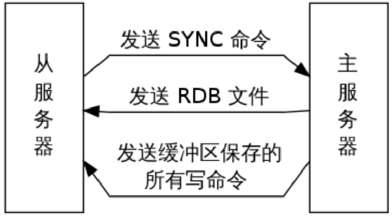

redis

## Redis简介
Redis是一款开源的，ANSI C语言编写的，高级键值(key-value)缓存和支持永久存储NoSQL数据库产品。
Redis采用内存(In-Memory)数据集(DataSet) 。
支持多种数据类型。
运行于大多数POSIX系统，如Linux、*BSD、OS X等。

软件获取和帮助
● 官方网站：https://redis.io/
● 下载网站：http://download.redis.io/releases/
● 帮助网站：http://redisdoc.com/


软件功能
1）高速读写
2）数据类型丰富
3）支持持久化
4）多种内存分配及回收策略
5）支持事物
6）消息队列、消息订阅
7）支持高可用
8）支持分布式分片集群

redis一般在企业中，是单机多实例架构


## Redis安装部署
```
 
# 安装依赖包
 yum install -y ncurses-devel libaio-devel cmake  gcc-c++ 
 #yum -y install gcc automake autoconf libtool make

#下载
wget http://download.redis.io/releases/redis-3.2.12.tar.gz
#解压
tar xf redis-3.2.12.tar.gz
#移动到指定目录
mv redis-3.2.12 /application/
#做软链接
ln -s /application/redis-3.2.12 /application/redis
#进入redis目录
cd /application/redis
#编译
make

#解决“jemalloc/jemalloc.h：没有那个文件或目录“问题，在进行编译（因为上次编译失败，有残留的文件）
#[root@bogon redis-3.2.0]# make distclean
#[root@bogon redis-3.2.0]# make && make install

#添加环境变量
echo 'export PATH="/application/redis/src:$PATH"' > /etc/profile.d/redis.sh
source /etc/profile

#启动redis
src/redis-server &
#连接redis
#redis-cli
#退出redis
#127.0.0.1:6379> quit
#关闭redis服务
# redis-cli
127.0.0.1:6379> shutdown


# 基本配置
#创建redis工作目录
mkdir -p /etc/redis/6379
#创建redis配置文件
cat > /etc/redis/6379/redis.conf <<EOF
daemonize yes
port 6379
logfile /etc/redis/6379/redis.log
dir /etc/redis/6379
dbfilename dump.rdb
#指定ip地址监听
bind 127.0.0.1 10.0.0.4
#认证密码
requirepass ckh
EOF

#指定配置文件启动redis
redis-server /etc/redis/6379/redis.conf

#redis-cli
127.0.0.1:6379> auth ckh    #认证密码
OK 
127.0.0.1:6379> set foo bar #设置键值对
OK
127.0.0.1:6379> get foo     #取出值
"bar"

```

## redis安全配置

protected-mode： 禁止protected-mode yes/no （保护模式，是否只允许本地访问）
bind：指定IP进行监听
requirepass： 增加密码
	auth {password}： 在redis-cli中使用，进行认证
```
#添加到配置文件
[root@db01 redis]# vim /etc/redis/6379/redis.conf
bind 127.0.0.1 10.0.0.51
requirepass  ckh

#不加认证，报错
[root@db01 redis]# redis-cli
127.0.0.1:6379> set name zhangsan
(error) NOAUTH Authentication required.
#连接方式1
[root@db01 redis]# redis-cli
127.0.0.1:6379> AUTH ckh
127.0.0.1:6379> set name zhangsan
OK
#连接方式2
[root@db01 redis]# redis-cli -a ckh
127.0.0.1:6379> set name lisi
OK

```
redis在线查看和修改配置
```
#查看配置文件中的监听地址
127.0.0.1:6379> CONFIG GET bind
#查看dir
127.0.0.1:6379> CONFIG GET dir
#查看所有配置
127.0.0.1:6379> CONFIG GET *
#修改配置，即时生效 没有修改配置文件,重启redis后失效
127.0.0.1:6379> CONFIG SET requirepass 123
#测试修改后连接
[root@db01 redis]# redis-cli -a 123
#查看配置文件
[root@db01 redis]# cat /etc/redis/6379/redis.conf

```
## redis持久化
什么是持久化？
持久化：就是将内存中的数据，写入到磁盘上，并且永久存在的。


RDB 持久化
	可以在指定的时间间隔内生成数据集的时间点快照（point-in-time snapshot）。
AOF 持久化
	记录服务器执行的所有写操作命令，并在服务器启动时，通过重新执行这些命令来还原数据集。 AOF 文件中的命令全部以 Redis 协议的格式来保存，新命令会被追加到文件的末尾。

RDB持久化优缺点总结
● 优点：速度快，适合于用作备份，主从复制也是基于RDB持久化功能实现的。
● 缺点：会有数据丢失、导致服务停止几秒

AOF持久化优缺点总结
● 优点：可以最大程度保证数据不丢失
● 缺点：日志记录量级比较大


RDB持久化核心配置参数
```
#编辑配置文件
[root@db01 redis]# vim /etc/redis/6379/redis.conf
#持久化数据文件存储位置
dir /etc/redis/6379
#rdb持久化数据文件名
dbfilename dump.rdb
#900秒（15分钟）内有1个更改
save 900 1
#300秒（5分钟）内有10个更改
save 300 10
#60秒（1分钟）内有10000个更改
save 60 10000

#RDB持久化高级配置
#编辑配置文件
[root@db01 redis]# vim /etc/redis/6379/redis.conf
#后台备份进程出错时,主进程停不停止写入? 主进程不停止容易造成数据不一致
stop-writes-on-bgsave-error yes
#导出的rdb文件是否压缩 如果rdb的大小很大的话建议这么做
rdbcompression yes 
#导入rbd恢复时数据时,要不要检验rdb的完整性 验证版本是不是一致
rdbchecksum yes

```
AOF持久化核心配置参数
```
#修改配置文件
[root@db01 redis]# vim /etc/redis/6379/redis.conf
#是否打开AOF日志功能
appendonly yes/no
#每一条命令都立即同步到AOF
appendfsync always
#每秒写一次
appendfsync everysec
#写入工作交给操作系统,由操作系统判断缓冲区大小,统一写入到AOF
appendfsync no

#AOF持久化高级配置
#编辑配置文件
[root@db01 redis]# vim /etc/redis/6379/redis.conf
#正在导出rdb快照的过程中,要不要停止同步aof
no-appendfsync-on-rewrite yes/no
#aof文件大小比起上次重写时的大小,增长率100%时重写,缺点:业务开始的时候，会重复重写多次
auto-aof-rewrite-percentage 100
#aof文件,至少超过64M时,重写
auto-aof-rewrite-min-size 64mb
```

面试： 
redis 持久化方式有哪些？有什么区别？
rdb：基于快照的持久化，速度更快，一般用作备份，主从复制也是依赖于rdb持久化功能
aof：以追加的方式记录redis操作日志的文件。可以最大程度的保证redis数据安全，类似于mysql的binlog


### 数据类型
介绍
                key            			 value
                键		       			值
                自主定制的名字				多数据类型的存储模式
● String类型		  name                     			 "zhangsan" 
● Hash类型		stu                                                 {id:101,name:zhangsan}
● List类型                       wechat                                          {v1,v2,v3}
● Set 集合类型              set1                  			   0  1  2
● Sorted set(有序)       zset1                                              [score m1,score m2,score m3]
									        0	   1	   2
### 应用场景
strings :  
	常规计数：微博数、粉丝数、
	互联网当中，点击量，访问量，关注量等
	网页游戏应用当中的，血量、蓝量等
hash类型 (字典类型)
    应用场景：最接近于MySQL表结构的数据类型
    存储部分变更的数据，如用户信息,商品信息等。
List（列表）
	消息队列系统
	比如sina微博: 在Redis中我们的最新微博ID使用了常驻缓存，这是一直更新的。但是做了限制不能超过5000个ID，因此获取ID的函数会一直询问Redis。只有在start/count参数超出了这个范围的时候，才需要去访问数据库。 系统不会像传统方式那样“刷新”缓存，Redis实例中的信息永远是一致的。SQL数据库（或是硬盘上的其他类型数据库）只是在用户需要获取“很远”的数据时才会被触发，而主页或第一个评论页是不会麻烦到硬盘上的数据库了。
Set（集合)
	在微博应用中，可以将一个用户所有的关注人存在一个集合中，将其所有粉丝存在一个集合。Redis还为集合提供了求交集、并集、差集等操作，可以非常方便的实现如共同关注、共同喜好、二度好友等功能，对上面的所有集合操作，你还可以使用不同的命令选择将结果返回给客户端还是存集到一个新的集合中。
Sorted-Set（有序集合）
	排行榜应用，取TOP N操作
	这个需求与上面需求的不同之处在于，前面操作以时间为权重，这个是以某个条件为权重，比如按顶的次数排序，这时候就需要我们的sorted set出马了，将你要排序的值设置成sorted set的score，将具体的数据设置成相应的value，每次只需要执行一条ZADD命令即可。

### 数据类型基本操作

通用操作
```
#查看所有的key
127.0.0.1:6379> KEYS *
#判断key是否存在
127.0.0.1:6379> EXISTS name
#变更key名
127.0.0.1:6379> RENAME age nianling
127.0.0.1:6379> type name
#删除key
127.0.0.1:6379> del name
#以秒为单位设置生存时间
127.0.0.1:6379> EXPIRE name 10
#以毫秒为单位设置生存时间
127.0.0.1:6379> PEXPIRE name 10000
#取消剩余生存时间
127.0.0.1:6379> PERSIST name

```
string
```
基本操作：
127.0.0.1:6379> set name zhangsan 
OK
127.0.0.1:6379> get name
"zhangsan"
127.0.0.1:6379> mset id 101 name zhangsan age 20 gender male 
OK
127.0.0.1:6379> mget id name age gender

计数器应用

127.0.0.1:6379> incr fensi
127.0.0.1:6379> DECR fensi
127.0.0.1:6379> INCRBY fensi 10000
127.0.0.1:6379> DECRBY fensi 10003

127.0.0.1:6379> get fensi
```

hash
```
127.0.0.1:6379> hset zhangsan name zs
(integer) 1
127.0.0.1:6379> hmset student id 101 name zs age 20 gender male
OK
127.0.0.1:6379> hmset stu id 102 name lisi age 21 gender male
OK
127.0.0.1:6379> hmget stu id name age gender
1) "102"
2) "lisi"
3) "21"
4) "male"
127.0.0.1:6379> hgetall stu
1) "id"
2) "102"
3) "name"
4) "lisi"
5) "age"
6) "21"
7) "gender"
8) "male"

小扩展：
MySQL 中 city表中前10行数据，灌入到redis中

MySQL:
		id        name      age    gender 
		101       zhangsan  20      male
		
hmset zhangsan_stu  id 101 name zhangsan  age 20 gender male


思路：
mysql> desc t1;
+-------+-------------+------+-----+---------+-------+
| Field | Type        | Null | Key | Default | Extra |
+-------+-------------+------+-----+---------+-------+
| id    | int(11)     | YES  |     | NULL    |       |
| name  | varchar(20) | YES  |     | NULL    |       |
+-------+-------------+------+-----+---------+-------+
2 rows in set (0.00 sec)

mysql> select concat("hmset stu_",name," id ",id," name ",name) from t1;
+---------------------------------------------------+
| concat("hmset stu_",name," id ",id," name ",name) |
+---------------------------------------------------+
| hmset stu_zhang3 id 1 name zhang3                 |
| hmset stu_li4 id 2 name li4                       |
| hmset stu_wang5 id 3 name wang5                   |
+---------------------------------------------------+
```

list
```
例子：微信朋友圈应用
127.0.0.1:6379> LPUSH wechat "today is 1"
(integer) 1
127.0.0.1:6379> LPUSH wechat "today is 2"
(integer) 2
127.0.0.1:6379> LPUSH wechat "today is 3"
(integer) 3
127.0.0.1:6379> LPUSH wechat "today is 4"
(integer) 4
127.0.0.1:6379> LPUSH wechat "today is 5"

127.0.0.1:6379> LRANGE wechat 0 -1
1) "today is 5"
2) "today is 4"
3) "today is 3"
4) "today is 2"
5) "today is 1"
127.0.0.1:6379> 

```
set
```
#若key不存在,创建该键及与其关联的set,依次插入
#若key存在,则插入value中,value中存在的不插入
127.0.0.1:6379> sadd lxl pg1 pg2 baoqiang masu marong 
(integer) 5
127.0.0.1:6379> sadd jnl baoqiang yufan baobeier zhouxingchi 
(integer) 4
# 取并集: 两个人的好友都列出来
127.0.0.1:6379> SUNION lxl jnl 
1) "zhouxingchi"
2) "baobeier"
3) "pg2"
4) "yufan"
5) "masu"
6) "baoqiang"
7) "pg1"
8) "marong"
127.0.0.1:6379>
# 取交集: 共同好友
127.0.0.1:6379> SINTER lxl jnl
1) "baoqiang"
# lxl 和jnl比较获得独有的值
127.0.0.1:6379> SDIFF lxl jnl
1) "masu"
2) "pg1"
3) "marong"
4) "pg2"
# 取差集: jnl有的好友,lxl没有的好友
127.0.0.1:6379> SDIFF jnl lxl
1) "yufan"
2) "zhouxingchi"
3) "baobeier"
# 取差集: lxl有的好友,jnl没有的好友
127.0.0.1:6379> sdiff lxl jnl
1) "marong"
2) "pg2"
3) "pg1"
4) "masu"

```
sorted-set (有序)
```
#增
#添加两个分数分别是 2 和 3 的两个成员
127.0.0.1:6379> zadd myzset 2 "two" 3 "three"
#删
#删除多个成员变量,返回删除的数量
127.0.0.1:6379> zrem myzset one two
#改
#将成员 one 的分数增加 2，并返回该成员更新后的分数
127.0.0.1:6379> zincrby myzset 2 one
#查
#返回所有成员和分数,不加WITHSCORES,只返回成员
127.0.0.1:6379> zrange myzset 0 -1 WITHSCORES
1) "one"
2) "2"
3) "three"
4) "3"
#获取成员one在Sorted-Set中的位置索引值。0表示第一个位置
127.0.0.1:6379> zrank myzset one
(integer) 0
#获取 myzset 键中成员的数量
127.0.0.1:6379> zcard myzset
(integer) 2
#获取分数满足表达式 1 <= score <= 2 的成员的数量
127.0.0.1:6379> zcount myzset 1 2
(integer) 1  
#获取成员 three 的分数 
127.0.0.1:6379> zscore myzset three
"3"
#获取分数满足表达式 1 < score <= 2 的成员
127.0.0.1:6379> zrangebyscore myzset  1 2
1) "one"
#-inf 表示第一个成员，+inf最后一个成员
#limit限制关键字
#2  3  是索引号
zrangebyscore myzset -inf +inf limit 2 3  返回索引是2和3的成员
#删除分数 1<= score <= 2 的成员，并返回实际删除的数量
127.0.0.1:6379> zremrangebyscore myzset 1 2
(integer) 1
#删除位置索引满足表达式 0 <= rank <= 1 的成员
127.0.0.1:6379> zremrangebyrank myzset 0 1
(integer) 1
#按位置索引从高到低,获取所有成员和分数
127.0.0.1:6379> zrevrange myzset 0 -1 WITHSCORES
#原始成员:位置索引从小到大
      one  0
      two  1
#执行顺序:把索引反转
      位置索引:从大到小
      one 1
      two 0
#输出结果: 
       two
       one
#获取位置索引,为1,2,3的成员
127.0.0.1:6379> zrevrange myzset 1 3
(empty list or set)
#相反的顺序:从高到低的顺序
#获取分数 3>=score>=0的成员并以相反的顺序输出
127.0.0.1:6379> zrevrangebyscore myzset 3 0
(empty list or set)
#获取索引是1和2的成员,并反转位置索引
127.0.0.1:6379> zrevrangebyscore myzset 4 0 limit 1 2
(empty list or set)


```

## redis 消息队列

生成消费模型


什么是消息队列？
在生活中，其实有很多的例子，都类似消息队列。
比如：工厂生产出来的面包，交给超市，商场来出售，客户通过超市，商场来买面包，客户不会针对某一个工厂去选择，只管从超市买出来，工厂也不会管是哪一个客户买了面包，只管生产出来之后，交给超市，商场来处理。
消息队列（Message Queue）是一种应用间的通信方式，消息发送后可以立即返回，有消息系统来确保信息的可靠专递，消息生产者只管把消息发布到MQ中而不管谁来取，消息消费者只管从MQ中取消息而不管谁发布的，这样发布者和使用者都不用知道对方的存在。

为什么要使用消息队列呢？
首先，我们可以知道，消息队列是一种异步的工作机制，比如说日志收集系统，为了避免数据在传输过程中丢失，还有订单系统，下单后，会生成对应的单据，库存的扣减，消费信息的发送，一个下单，产生这么多的消息，都是通过一个操作的触发，然后将其他的消息放入消息队列中，依次产生。再就是很多网站的，秒杀活动之类的，前多少名用户会便宜，都是通过消息队列来实现的。
这些例子，都是通过消息队列，来实现，业务的解耦，最终数据的一致性，广播，错峰流控等等，从而完成业务的逻辑。

消息队列产品
1）rabbit-MQ（最初起源于金融系统，用于分布式系统中存储转发消息。OpenStack）
2）Zero-MQ（SaltStack）
3）Kafka（JAVA）
4）redis（key:value数据库，缓存，消息队列）

## redis 发布消息的两种模式

**任务队列模式(quieuing)**
任务队列：顾名思义，就是“传递消息的队列”。与任务队列进行交互的实体有两类，一类是生产者（producer），另一类则是消费者（consumer）。生产者将需要处理的任务放入任务队列中，而消费者则不断地从任务独立中读入任务信息并执行。

任务队列的好处
1）松耦合。
生产者和消费者只需按照约定的任务描述格式，进行编写代码。
2）易于扩展。
多消费者模式下，消费者可以分布在多个不同的服务器中，由此降低单台服务器的负载。

**发布-订阅模式(publish-subscribe)**
其实从Pub/Sub的机制来看，它更像是一个广播系统，多个订阅者（Subscriber）可以订阅多个频道（Channel），多个发布者（Publisher）可以往多个频道（Channel）中发布消息。
可以这么简单的理解：
1）Subscriber：收音机，可以收到多个频道，并以队列方式显示
2）Publisher：电台，可以往不同的FM频道中发消息
3）Channel：不同频率的FM频道

**一个发布者多个订阅者模型**
主要应用: 通知 公告

**多个发布者一个订阅者模型**
可以将PubSub做成独立的HTTP接口，各应用程序作为Publisher向Channel中发送消息，Subscriber端收到消息后执行相应的业务逻辑，比如写数据库，显示等等。
主要应用:排行榜,投票,计数

**多个发布者多个订阅者模型**
故名思议，就是可以向不同的Channel中发送消息，由不同的Subscriber接收。
主要应用: 群聊,聊天.

## Redis发布订阅实践
1）PUBLISH channel msg
将信息 message 发送到指定的频道 channel
2）SUBSCRIBE channel [channel ...]
订阅频道，可以同时订阅多个频道
3）UNSUBSCRIBE [channel ...]
取消订阅指定的频道, 如果不指定频道，则会取消订阅所有频道
4）PSUBSCRIBE pattern [pattern ...]
订阅一个或多个符合给定模式的频道，每个模式以 * 作为匹配符，
比如 it* 匹配所  有以 it 开头的频道( it.news 、 it.blog 、 it.tweets 等等)， 
news.* 匹配所有  以 news. 开头的频道( news.it 、 news.global.today 等等)，诸如此类
5）PUNSUBSCRIBE [pattern [pattern ...]]
退订指定的规则, 如果没有参数则会退订所有规则
6）PUBSUB subcommand [argument [argument ...]]
查看订阅与发布系统状态

**订阅单个频道**
```
#第一个窗口
#登录Redis
[root@db01 ~]# redis-cli -a ckh
#在订阅者的服务器上输入订阅zls
127.0.0.1:6379> SUBSCRIBE zls
Reading messages... (press Ctrl-C to quit)
1) "subscribe"
2) "zls"
3) (integer) 1
#第二个窗口
#登录Redis
[root@db01 ~]# redis-cli -a ckh
#在发布者的服务器上输入信息
127.0.0.1:6379> PUBLISH zls "The Nice Boy Like Me."
(integer) 1
#第一个窗口
#在订阅者的服务器上会看到如下信息
1) "message"
2) "zls"
3) "The Nice Boy Like Me."
```

** 订阅多个频道**
```
#第一个窗口
#登录Redis
[root@db01 ~]# redis-cli -a ckh
#在订阅者服务器上输入订阅所有频道
127.0.0.1:6379> PSUBSCRIBE *
Reading messages... (press Ctrl-C to quit)
1) "psubscribe"
2) "*"
3) (integer) 1
#第二个窗口
#在发布者服务器上输入多频道信息
127.0.0.1:6379> PUBLISH zls "The Nice Boy Like Me."
(integer) 1
127.0.0.1:6379> PUBLISH bgx "The Ugly Old Man Like Me."
(integer) 1
#第一个窗口
#在订阅者的服务器上会看到如下信息
1) "pmessage"
2) "*"
3) "zls"
4) "The Nice Boy Like Me."
1) "pmessage"
2) "*"
3) "bgx"
4) "The Ugly Old Man Like Me."
```
消息队列系统对比
客户端在执行订阅命令之后进入了订阅状态，只能接收 SUBSCRIBE 、PSUBSCRIBE、 UNSUBSCRIBE 、PUNSUBSCRIBE 四个命令。 开启的订阅客户端，无法收到该频道之前的消息，因为 Redis 不会对发布的消息进行持久化。 和很多专业的消息队列系统（例如Kafka、RocketMQ、RabbitMQ）相比，Redis的发布订阅略显粗糙。
例如:无法实现消息堆积和回溯。但胜在足够简单，如果当前场景可以容忍的这些缺点，也不失为一个不错的选择。

## redis的事务, 锁及管理命令

redis的事务与关系型数据库中的事务区别
1）在MySQL中讲过的事务，具有A、C、I、D四个特性
    ● Atomic（原子性）
    ● 所有语句作为一个单元全部成功执行或全部取消。
    ● Consistent（一致性）
    ● 如果数据库在事务开始时处于一致状态，则在执行该事务期间将保留一致状态。
    ● Isolated（隔离性）
    ● 事务之间不相互影响。
    ● Durable（持久性）
    ● 事务成功完成后，所做的所有更改都会准确地记录在数据库中。所做的更改不会丢失。
2）MySQL具有MVCC（多版本并发控制）的功能，这些都是根据事务的特性来完成的。
3）redis中的事务跟关系型数据库中的事务是一个相似的概念，但是有不同之处。关系型数据库事务执行失败后面的sql语句不在执行前面的操作都会回滚，而在redis中开启一个事务时会把所有命令都放在一个队列中，这些命令并没有真正的执行，如果有一个命令报错，则取消这个队列，所有命令都不再执行。
4）redis中开启一个事务是使用multi，相当于begin\start transaction，exec提交事务，discard取消队列命令（非回滚操作）。

和事务相关的命令
1）DISCARD
取消事务，放弃执行事务块内的所有命令。
2）EXEC
执行所有事务块内的命令。
3）MULTI
标记一个事务块的开始。
4）UNWATCH
取消 WATCH 命令对所有 key 的监视。
5）WATCH key [key ...]
监视一个(或多个) key ，如果在事务执行之前这个(或这些) key 被其他命令所改动，那么事务将被打断。MySQL	                Redis
开启	start transaction begin	            multi
语句	普通SQL	 			     普通命令
失败	rollback回滚	                             discard取消（这里的取消不是回滚，是队列里的命令根本没有执										     行，并不是执行了之后，再撤回）
成功	commit	                                        exec

和事务相关的命令
1）DISCARD
取消事务，放弃执行事务块内的所有命令。
2）EXEC
执行所有事务块内的命令。
3）MULTI
标记一个事务块的开始。
4）UNWATCH
取消 WATCH 命令对所有 key 的监视。
5）WATCH key [key ...]
监视一个(或多个) key ，如果在事务执行之前这个(或这些) key 被其他命令所改动，那么事务将被打断。

**事务测试**
```
#登录redis
[root@db01 ~]# redis-cli
#验证密码
127.0.0.1:6379> auth 123
OK
#不开启事务直接设置key
127.0.0.1:6379> set zls "Nice"
OK
#查看结果
127.0.0.1:6379> get zls
"Nice"
#开启事务
127.0.0.1:6379> MULTI
OK
#设置一个key
127.0.0.1:6379> set bgx "low"
QUEUED
127.0.0.1:6379> set alex "Ugly"
QUEUED
#开启另一个窗口查看结果
127.0.0.1:6379> get bgx
(nil)
127.0.0.1:6379> get alex
(nil)
#执行exec完成事务
127.0.0.1:6379> EXEC
1) OK
2) OK
#再次查看结果
127.0.0.1:6379> get bgx
"low"
127.0.0.1:6379> get alex
"Ugly"
```

## redis乐观锁介绍

乐观锁举例
场景：我正在买票
Ticket -1 , money -100
而票只有1张, 如果在我multi之后,和exec之前, 票被别人买了---即ticket变成0了.
我该如何观察这种情景,并不再提交？
1）悲观的想法:
世界充满危险,肯定有人和我抢, 给 ticket上锁, 只有我能操作. [悲观锁]
2）乐观的想法:
没有那么人和我抢,因此,我只需要注意,
--有没有人更改ticket的值就可以了 [乐观锁]
3）Redis的事务中,启用的是乐观锁,只负责监测key没有被改动.

简说:  乐观锁 : 不上锁,谁先付款票给谁
	悲观锁: 提交订单时候未付款,其他人已经无法提交购买了,只能等最后一张票的人超时未付款.

**乐观锁实现**
模拟买票两个窗口实现
```
#首先在第一个窗口设置一个key（ticket 1）
127.0.0.1:6379> set ticket 1
OK
#设置完票的数量之后观察这个票
127.0.0.1:6379> WATCH ticket
OK
#开启事务
127.0.0.1:6379> MULTI
OK
#买了票所以ticket设置为0
127.0.0.1:6379> set ticket 0
QUEUED
#然后在第二个窗口观察票
127.0.0.1:6379> WATCH ticket
OK
#开启事务
127.0.0.1:6379> MULTI
OK
#同样设置ticket为0
127.0.0.1:6379> set ticket 0
QUEUED
#此时如果谁先付款，也就是执行了exec另外一个窗口就操作不了这张票了
#在第二个窗口先付款（执行exec）
127.0.0.1:6379> exec
1) OK
#然后在第一个窗口再执行exec
127.0.0.1:6379> exec
(nil)       //无，也就是说我们无法对这张票进行操作
```

## redis 管理命令

**info**
```
#查看redis相关信息
127.0.0.1:6379> info
#服务端信息
# Server
#版本号
redis_version:3.2.12
#redis版本控制安全hash算法
redis_git_sha1:00000000
#redis版本控制脏数据
redis_git_dirty:0
#redis建立id
redis_build_id:3b947b91b7c31389
#运行模式：单机（如果是集群：cluster）
redis_mode:standalone
#redis所在宿主机的操作系统
os:Linux 2.6.32-431.el6.x86_64 x86_64
#架构（64位）
arch_bits:64
#redis事件循环机制
multiplexing_api:epoll
#GCC的版本
gcc_version:4.4.7
#redis进程的pid
process_id:33007
#redis服务器的随机标识符(用于sentinel和集群)
run_id:46b07234cf763cab04d1b31433b94e31b68c6e26
#redis的端口
tcp_port:6379
#redis服务器的运行时间（单位秒）
uptime_in_seconds:318283
#redis服务器的运行时间（单位天）
uptime_in_days:3
#redis内部调度（进行关闭timeout的客户端，删除过期key等等）频率，程序规定serverCron每秒运行10次
hz:10
#自增的时钟，用于LRU管理,该时钟100ms(hz=10,因此每1000ms/10=100ms执行一次定时任务)更新一次
lru_clock:13601047
#服务端运行命令路径
executable:/application/redis-3.2.12/redis-server
#配置文件路径
config_file:/etc/redis/6379/redis.conf
#客户端信息
# Clients
#已连接客户端的数量(不包括通过slave的数量)
connected_clients:2
##当前连接的客户端当中，最长的输出列表，用client list命令观察omem字段最大值
client_longest_output_list:0
#当前连接的客户端当中，最大输入缓存，用client list命令观察qbuf和qbuf-free两个字段最大值
client_biggest_input_buf:0
#正在等待阻塞命令(BLPOP、BRPOP、BRPOPLPUSH)的客户端的数量
blocked_clients:0
#内存信息
# Memory
#由redis分配器分配的内存总量，以字节为单位
used_memory:845336
#以人类可读的格式返回redis分配的内存总量
used_memory_human:825.52K
#从操作系统的角度，返回redis已分配的内存总量(俗称常驻集大小)。这个值和top命令的输出一致
used_memory_rss:1654784
#以人类可读方式，返回redis已分配的内存总量
used_memory_rss_human:1.58M
#redis的内存消耗峰值(以字节为单位)
used_memory_peak:845336
#以人类可读的格式返回redis的内存消耗峰值
used_memory_peak_human:825.52K
#整个系统内存
total_system_memory:1028517888
#以人类可读的格式，显示整个系统内存
total_system_memory_human:980.87M
#Lua脚本存储占用的内存
used_memory_lua:37888
#以人类可读的格式，显示Lua脚本存储占用的内存
used_memory_lua_human:37.00K
#Redis实例的最大内存配置
maxmemory:0
#以人类可读的格式，显示Redis实例的最大内存配置
maxmemory_human:0B
#当达到maxmemory时的淘汰策略
maxmemory_policy:noeviction
#内存分裂比例（used_memory_rss/ used_memory）
mem_fragmentation_ratio:1.96
#内存分配器
mem_allocator:jemalloc-4.0.3
#持久化信息
# Persistence
#服务器是否正在载入持久化文件
loading:0
#离最近一次成功生成rdb文件，写入命令的个数，即有多少个写入命令没有持久化
rdb_changes_since_last_save:131
#服务器是否正在创建rdb文件
rdb_bgsave_in_progress:0
#最近一次rdb持久化保存时间
rdb_last_save_time:1540009420
#最近一次rdb持久化是否成功
rdb_last_bgsave_status:ok
#最近一次成功生成rdb文件耗时秒数
rdb_last_bgsave_time_sec:-1
#如果服务器正在创建rdb文件，那么这个域记录的就是当前的创建操作已经耗费的秒数
rdb_current_bgsave_time_sec:-1
#是否开启了aof
aof_enabled:0
#标识aof的rewrite操作是否在进行中
aof_rewrite_in_progress:0
#rewrite任务计划，当客户端发送bgrewriteaof指令，如果当前rewrite子进程正在执行，那么将客户端请求的bgrewriteaof变为计划任务，待aof子进程结束后执行rewrite
aof_rewrite_scheduled:0
#最近一次aof rewrite耗费的时长
aof_last_rewrite_time_sec:-1
#如果rewrite操作正在进行，则记录所使用的时间，单位秒
aof_current_rewrite_time_sec:-1
#上次bgrewriteaof操作的状态
aof_last_bgrewrite_status:ok
#上次aof写入状态
aof_last_write_status:ok
#统计信息
# Stats
#新创建连接个数,如果新创建连接过多，过度地创建和销毁连接对性能有影响，说明短连接严重或连接池使用有问题，需调研代码的连接设置
total_connections_received:19
#redis处理的命令数
total_commands_processed:299
#redis当前的qps，redis内部较实时的每秒执行的命令数
instantaneous_ops_per_sec:0
#redis网络入口流量字节数
total_net_input_bytes:10773
#redis网络出口流量字节数
total_net_output_bytes:97146
#redis网络入口kps
instantaneous_input_kbps:0.00
#redis网络出口kps
instantaneous_output_kbps:0.00
#拒绝的连接个数，redis连接个数达到maxclients限制，拒绝新连接的个数
rejected_connections:0
#主从完全同步次数
sync_full:0
#主从完全同步成功次数
sync_partial_ok:0
#主从完全同步失败次数
sync_partial_err:0
#运行以来过期的key的数量
expired_keys:5
#过期的比率
evicted_keys:0
#命中次数
keyspace_hits:85
#没命中次数
keyspace_misses:17
#当前使用中的频道数量
pubsub_channels:0
#当前使用的模式的数量
pubsub_patterns:0
#最近一次fork操作阻塞redis进程的耗时数，单位微秒
latest_fork_usec:0
#是否已经缓存了到该地址的连接
migrate_cached_sockets:0
#主从复制信息
# Replication
#角色主库
role:master
#连接slave的个数
connected_slaves:0
#主从同步偏移量,此值如果和上面的offset相同说明主从一致没延迟，与master_replid可被用来标识主实例复制流中的位置
master_repl_offset:0
#复制积压缓冲区是否开启
repl_backlog_active:0
#复制积压缓冲大小
repl_backlog_size:1048576
#复制缓冲区里偏移量的大小
repl_backlog_first_byte_offset:0
#此值等于 master_repl_offset - repl_backlog_first_byte_offset,该值不会超过repl_backlog_size的大小
repl_backlog_histlen:0
#CPU信息
# CPU
#将所有redis主进程在内核态所占用的CPU时求和累计起来
used_cpu_sys:203.44
#将所有redis主进程在用户态所占用的CPU时求和累计起来
used_cpu_user:114.57
#将后台进程在内核态所占用的CPU时求和累计起来
used_cpu_sys_children:0.00
#将后台进程在用户态所占用的CPU时求和累计起来
used_cpu_user_children:0.00
#集群信息
# Cluster
#实例是否启用集群模式
cluster_enabled:0
#库相关统计信息
# Keyspace
#db0的key的数量,以及带有生存期的key的数,平均存活时间
db0:keys=17,expires=0,avg_ttl=0
#单独查看某一个信息（例：查看CPU信息）
127.0.0.1:6379> info cpu
# CPU
used_cpu_sys:203.45
used_cpu_user:114.58
used_cpu_sys_children:0.00
used_cpu_user_children:0.00

```

**client**
```
#查看客户端连接信息（有几个会话就会看到几条信息）
127.0.0.1:6379> CLIENT LIST
id=19 addr=127.0.0.1:35687 fd=6 name= age=30474 idle=8962 flags=N db=0 sub=0 psub=0 multi=-1 qbuf=0 qbuf-free=0 obl=0 oll=0 omem=0 events=r cmd=info
id=21 addr=127.0.0.1:35689 fd=7 name= age=3 idle=0 flags=N db=0 sub=0 psub=0 multi=-1 qbuf=0 qbuf-free=32768 obl=0 oll=0 omem=0 events=r cmd=client
#杀掉某一个会话
127.0.0.1:6379> CLIENT KILL 127.0.0.1:35687
```

**config**
```
#重置统计状态信息
127.0.0.1:6379> CONFIG RESETSTAT
#查看所有配置信息
127.0.0.1:6379> CONFIG GET *
#查看某个配置信息
127.0.0.1:6379> CONFIG GET maxmemory
1) "maxmemory"
2) "0"
#动态修改配置信息
127.0.0.1:6379> CONFIG SET maxmemory 60G
OK
#再次查看修改后的配置信息
127.0.0.1:6379> CONFIG GET maxmemory
1) "maxmemory"
2) "60000000000"
```

dbsize
```
#查看当前库内有多少个key
127.0.0.1:6379> DBSIZE
(integer) 17
#验证key的数量
127.0.0.1:6379> KEYS *
 1) "lidao_fans"
 2) "ticket"
 3) "myhash"
 4) "teacher1"
 5) "name"
 6) "zls_fans"
 7) "bgx_fans"
 8) "mykey"
 9) "bgx"
10) "diffkey"
11) "alex"
12) "KEY"
13) "teacher"
14) "key3"
15) "unionkey"
16) "zls"
17) "wechat"
```
**dbsize**
```
#查看当前库内有多少个key
127.0.0.1:6379> DBSIZE
(integer) 17
#验证key的数量
127.0.0.1:6379> KEYS *
```
**select**
在Redis中也是有库这个概念的，不过不同于MySQL，Redis的库是默认的，并不是我们手动去创建的，在Redis中一共有16（0-15）个库。在MySQL中进入某一个库，我们需要使用use dbname，在Redis中，只需要select即可。默认情况下，我们是在0库中进行操作，每个库之间都是隔离的。
```
#在0库中创建一个key
127.0.0.1:6379> set name zls
OK
#查看0库中的所有key
127.0.0.1:6379> KEYS *
1) "name"
#进1库中
127.0.0.1:6379> SELECT 1
OK
#查看所有key
127.0.0.1:6379[1]> KEYS *
(empty list or set)         //由此可见，每个库之间都是隔离的
```

**flushdb、flushall**
```
#删库跑路专用命令（删除所有库）
127.0.0.1:6379> FLUSHALL
OK
#验证一下是否真的删库了
127.0.0.1:6379> DBSIZE
(integer) 0
127.0.0.1:6379> KEYS *
(empty list or set)
#删除单个库中数据
127.0.0.1:6379> FLUSHDB
OK
```

**开启两个窗口进行命令实时监控**
开启两个窗口进行命令实时监控
```
#在第一个窗口开启监控
127.0.0.1:6379> MONITOR
OK
#在第二个窗口输入命令
127.0.0.1:6379> SELECT 2
OK
127.0.0.1:6379[2]> set name bgx
OK
127.0.0.1:6379[2]> info
#在第一个窗口会实时显示执行的命令
127.0.0.1:6379> MONITOR
OK
1540392396.690268 [0 127.0.0.1:35689] "SELECT" "2"
1540392409.883011 [2 127.0.0.1:35689] "set" "name" "bgx"
1540392543.892889 [2 127.0.0.1:35689] "info"
```
**shutdown**
```
#关闭Redis服务
127.0.0.1:6379> SHUTDOWN
not connected>
```

## redis主从复制
**Redis复制功能简单介绍**
1）使用异步复制。
2）一个主服务器可以有多个从服务器。
3）从服务器也可以有自己的从服务器。
4）复制功能不会阻塞主服务器。
5）可以通过复制功能来让主服务器免于执行持久化操作，由从服务器去执行持久化操作即可。

**Redis复制功能介绍（重点了解）**
1）Redis 使用异步复制。从 Redis2.8开始，从服务器会以每秒一次的频率向主服务器报告复制流（replication stream）的处理进度。
2）一个主服务器可以有多个从服务器。
3）不仅主服务器可以有从服务器，从服务器也可以有自己的从服务器，多个从服务器之间可以构成一个图状结构。
4）复制功能不会阻塞主服务器：即使有一个或多个从服务器正在进行初次同步， 主服务器也可以继续处理命令请求。
5）复制功能也不会阻塞从服务器：只要在 redis.conf 文件中进行了相应的设置， 即使从服务器正在进行初次同步， 服务器也可以使用旧版本的数据集来处理命令查询。
6）在从服务器删除旧版本数据集并载入新版本数据集的那段时间内，连接请求会被阻塞。
7）还可以配置从服务器，让它在与主服务器之间的连接断开时，向客户端发送一个错误。
8）复制功能可以单纯地用于数据冗余（data redundancy），也可以通过让多个从服务器处理只读命令请求来提升扩展性（scalability）： 比如说，繁重的SORT命令可以交给附属节点去运行。
9）可以通过复制功能来让主服务器免于执行持久化操作：只要关闭主服务器的持久化功能，然后由从服务器去执行持久化操作即可。


**关闭主服务器持久化时，复制功能的数据安全**
1.当配置Redis复制功能时，强烈建议打开主服务器的持久化功能。 否则的话，由于延迟等问题，部署的服务应该要避免自动拉起。
2.为了帮助理解主服务器关闭持久化时自动拉起的危险性，参考一下以下会导致主从服务器数据全部丢失的例子：
1）假设节点A为主服务器，并且关闭了持久化。并且节点B和节点C从节点A复制数据
2）节点A崩溃，然后由自动拉起服务重启了节点A. 由于节点A的持久化被关闭了，所以重启之后没有任何数据
3）节点B和节点C将从节点A复制数据，但是A的数据是空的，于是就把自身保存的数据副本删除。

结论：
1）在关闭主服务器上的持久化，并同时开启自动拉起进程的情况下，即便使用Sentinel来实现Redis的高可用性，也是非常危险的。因为主服务器可能拉起得非常快，以至于Sentinel在配置的心跳时间间隔内没有检测到主服务器已被重启，然后还是会执行上面的数据丢失的流程。
2）无论何时，数据安全都是极其重要的，所以应该禁止主服务器关闭持久化的同时自动拉起。

**主从复制的原理**



1）从服务器向主服务器发送 SYNC 命令。
2）接到 SYNC 命令的主服务器会调用BGSAVE 命令，创建一个 RDB 文件，并使用缓冲区记录接下来执行的所有写命令。
3）当主服务器执行完 BGSAVE 命令时，它会向从服务器发送 RDB 文件，而从服务器则会接收并载入这个文件。
4）主服务器将缓冲区储存的所有写命令发送给从服务器执行。


命令传播
在主从服务器完成同步之后，主服务器每执行一个写命令，它都会将被执行的写命令发送给从服务器执行，这个操作被称为“命令传播”（command propagate）。
命令传播是一个持续的过程：只要复制仍在继续，命令传播就会一直进行，使得主从服务器的状态可以一直保持一致。

SYNC与PSYNC
1）在 Redis2.8版本之前，断线之后重连的从服务器总要执行一次完整重同步（fullresynchronization）操作。
2）从 Redis2.8开始，Redis使用PSYNC命令代替SYNC命令。
3）PSYNC比起SYNC的最大改进在于PSYNC实现了部分重同步（partial resync）特性：
在主从服务器断线并且重新连接的时候，只要条件允许，PSYNC可以让主服务器只向从服务器同步断线期间缺失的数据，而不用重新向从服务器同步整个数据库。
注：
PSYNC这个特性需要主服务器为被发送的复制流创建一个内存缓冲区（in-memory backlog）， 并且主服务器和所有从服务器之间都记录一个复制偏移量（replication offset）和一个主服务器 ID（master run id），当出现网络连接断开时，从服务器会重新连接，并且向主服务器请求继续执行原来的复制进程：
1）如果从服务器记录的主服务器ID和当前要连接的主服务器的ID相同，并且从服务器记录的偏移量所指定的数据仍然保存在主服务器的复制流缓冲区里面，那么主服务器会向从服务器发送断线时缺失的那部分数据，然后复制工作可以继续执行。
2）否则的话，从服务器就要执行完整重同步操作。

复制的一致性问题
1）在读写分离环境下，客户端向主服务器发送写命令 SET k10086 v10086，主服务器在执行这个写命令之后，向客户端返回回复，并将这个写命令传播给从服务器。
2）接到回复的客户端继续向从服务器发送读命令 GET k10086 ，并且因为网络状态的原因，客户端的 GET命令比主服务器传播的 SET 命令更快到达了从服务器。
3）因为从服务器键k10086的值还未被更新，所以客户端在从服务器读取到的将是一个错误（过期）的k10086值。
Redis是怎么保证数据安全的呢？
1）主服务器只在有至少N个从服务器的情况下，才执行写操作
2）从Redis 2.8开始，为了保证数据的安全性，可以通过配置，让主服务器只在有至少N个当前已连接从服务器的情况下，才执行写命令。
3）不过，因为 Redis 使用异步复制，所以主服务器发送的写数据并不一定会被从服务器接收到，因此， 数据丢失的可能性仍然是存在的。
4）通过以下两个参数保证数据的安全：
```
#执行写操作所需的至少从服务器数量
min-slaves-to-write <number of slaves>
#指定网络延迟的最大值
min-slaves-max-lag <number of seconds>
```
这个特性的运作原理：
1）从服务器以每秒一次的频率 PING 主服务器一次， 并报告复制流的处理情况。主服务器会记录各个从服务器最后一次向它发送 PING 的时间。用户可以通过配置， 指定网络延迟的最大值 min-slaves-max-lag ， 以及执行写操作所需的至少从服务器数量 min-slaves-to-write 。
2）如果至少有 min-slaves-to-write 个从服务器， 并且这些服务器的延迟值都少于 min-slaves-max-lag 秒， 那么主服务器就会执行客户端请求的写操作。你可以将这个特性看作 CAP 理论中的 C 的条件放宽版本： 尽管不能保证写操作的持久性， 但起码丢失数据的窗口会被严格限制在指定的秒数中。
3）另一方面， 如果条件达不到 min-slaves-to-write 和 min-slaves-max-lag 所指定的条件， 那么写操作就不会被执行， 主服务器会向请求执行写操作的客户端返回一个错误。


**主从复制实现**

```
1、环境：
准备两个或两个以上redis实例

mkdir /data/638{0..2}

#配置文件示例：
cat > /data/6380/redis.conf<<EOF
port 6380
daemonize yes
pidfile /data/6380/redis.pid
loglevel notice
logfile "/data/6380/redis.log"
dbfilename dump.rdb
dir /data/6380
protected-mode no
EOF

cat > /data/6381/redis.conf<<EOF
port 6381
daemonize yes
pidfile /data/6381/redis.pid
loglevel notice
logfile "/data/6381/redis.log"
dbfilename dump.rdb
dir /data/6381
protected-mode no
EOF

cat > /data/6382/redis.conf<<EOF
port 6382
daemonize yes
pidfile /data/6382/redis.pid
loglevel notice
logfile "/data/6382/redis.log"
dbfilename dump.rdb
dir /data/6382
protected-mode no
EOF

#启动：
redis-server /data/6380/redis.conf
redis-server /data/6381/redis.conf
redis-server /data/6382/redis.conf


主节点：6380
从节点：6381、6382


2、开启主从：
6381/6382命令行:

redis-cli -p 6381
SLAVEOF 127.0.0.1 6380

redis-cli -p 6382
SLAVEOF 127.0.0.1 6380


3、查询主从状态

从库：
127.0.0.1:6382> info replication

主库：
127.0.0.1:6380> info replication


主库故障模拟及切换（failover过程）：

4、从库切为主库

模拟主库故障

redis-cli -p 6380
shutdown

redis-cli -p 6381
info replication
slaveof no one  #取消从库


6382连接到6381：
[root@db03 ~]# redis-cli -p 6382
127.0.0.1:6382> SLAVEOF no one
127.0.0.1:6382> SLAVEOF 127.0.0.1 6381
```

## redis sentinel 
Redis-Sentinel是Redis官方推荐的高可用性(HA)解决方案，当用Redis做Master-slave的高可用方案时，假如master宕机了，Redis本身(包括它的很多客户端)都没有实现自动进行主备切换，而Redis-sentinel本身也是一个独立运行的进程，它能监控多个master-slave集群，发现master宕机后能进行自动切换。

sentinel的构造
Sentinel 是一个监视器，它可以根据被监视实例的身份和状态来判断应该执行何种动作。

sentinel的功能
1）监控（Monitoring）：
Sentinel会不断地检查你的主服务器和从服务器是否运作正常。
2）提醒（Notification）：
当被监控的某个Redis服务器出现问题时，Sentinel可以通过API向管理员或者其他应用程序发送通知。
3）自动故障迁移（Automatic failover）：
当一个主服务器不能正常工作时，Sentinel会开始一次自动故障迁移操作，它会将失效主服务器的其中一个从服务器升级为新的主服务器，并让失效主服务器的其他从服务器改为复制新的主服务器；当客户端试图连接失效的主服务器时，集群也会向客户端返回新主服务器的地址，使得集群可以使用新主服务器代替失效服务器。


发现并连接主服务器
Sentinel通过用户给定的配置文件来发现主服务器。
Sentinel会与被监视的主服务器创建两个网络连接：
命令连接用于向主服务器发送命令。
订阅连接用于订阅指定的频道，从而发现监视同一主服务器的其他Sentinel。

发现并连接从服务器
Sentinel通过向主服务器发送INFO命令来自动获得所有从服务器的地址。
跟主服务器一样，Sentinel 会与每个被发现的从服务器创建命令连接和订阅连接。


发现其他sentinel
Sentinel 会通过命令连接向被监视的主从服务器发送 “HELLO” 信息，该消息包含 Sentinel 的 IP、端口号、ID 等内容，以此来向其他 Sentinel 宣告自己的存在。与此同时Sentinel 会通过订阅连接接收其他 Sentinel 的“HELLO” 信息，以此来发现监视同一个主服务器的其他 Sentinel 。
sentinel1 通过发送HELLO 信息来让sentinel2 和 sentinel3发现自己，其他两个sentinel 也会进行类似的操作。


多个sentinel之间连接
Sentinel之间只会互相创建命令连接，用于进行通信。因为已经有主从服务器作为发送和接收HELLO信息的中介，所以Sentinel之间不会创建订阅连接。


检测实例的状态
Sentinel使用PING命令来检测实例的状态：如果实例在指定的时间内没有返回回复，或者返回错误的回复，那么该实例会被 Sentinel 判断为下线。
Redis的Sentinel中关于下线（down）有两个不同的概念：
1）主观下线（Subjectively Down， 简称 SDOWN）指的是单个 Sentinel 实例对服务器做出的下线判断。
2）客观下线（Objectively Down，简称 ODOWN）指的是多个Sentinel实例在对同一个服务器做出SDOWN判断，并且通过SENTINEL is-master-down-by-addr命令互相交流之后，得出的服务器下线判断。（一个 Sentinel可以通过向另一个Sentinel发送SENTINEL is-master-down-by-addr命令来询问对方是否认为给定的服务器已下线。）
如果一个服务器没有在 master-down-after-milliseconds 选项所指定的时间内， 对向它发送 PING 命令的 Sentinel 返回一个有效回复（valid reply）， 那么 Sentinel 就会将这个服务器标记为主观下线。


故障转移FAILOVER
一次故障转移操作由以下步骤组成：
1）发现主服务器已经进入客观下线状态。
2）基于Raft leader election协议 ，进行投票选举
3）如果当选失败，那么在设定的故障迁移超时时间的两倍之后，重新尝试当选。如果当选成功，那么执行以下步骤。
4）选出一个从服务器，并将它升级为主服务器。
5）向被选中的从服务器发送 SLAVEOF NO ONE 命令，让它转变为主服务器。
6）通过发布与订阅功能，将更新后的配置传播给所有其他Sentinel，其他Sentinel对它们自己的配置进行更新。
7）向已下线主服务器的从服务器发送SLAVEOF命令，让它们去复制新的主服务器。
8）当所有从服务器都已经开始复制新的主服务器时， leader Sentinel 终止这次故障迁移操作。

sentinel搭建过程
```
mkdir /data/26380
cd /data/26380

vim sentinel.conf
port 26380
dir "/data/26380"
sentinel monitor mymaster 127.0.0.1 6380 1
sentinel down-after-milliseconds mymaster 5000

启动：
redis-sentinel /data/26380/sentinel.conf &


停主库测试：
[root@db01 ~]# redis-cli -p 6380
shutdown

[root@db01 ~]# redis-cli -p 6381
info replication

启动源主库（6380），看状态。
```

