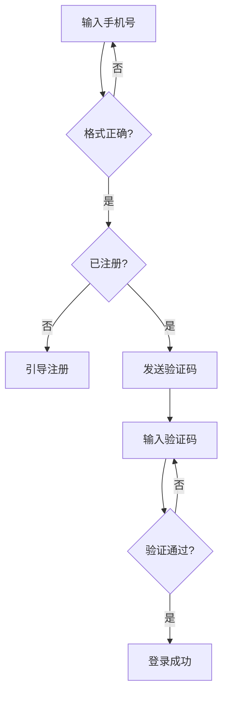

# 产品经理从零开始学习(互联网/软件公司)

> **面向对象**:想转产品经理的人,尤其是有技术/运维背景的转型者(本教程的案例大量选用你熟悉的场景)。
> **本文目标**:从零讲透"产品经理怎么干活"——需求从哪来、怎么写、怎么定优先级、怎么推动上线、上线后怎么验证,每章附训练,学完能动手写出自己的第一份 PRD。
> **岗位阶梯/薪资/路线**:见《职业发展路线.md》第三章(不重复),本文只讲"怎么做 PM"这件事。
> **学习方法**:先读每章"一句话 + 类比"建立直觉,再看"方法/工具"掌握干货,最后做"本章训练"练手。

---

## 〇、学习大纲(先看地图,再上路)

| 章 | 学什么 | 一句话 |
|---|---|---|
| 一、认识产品经理 | 是什么、一天干什么 | 用产品解决一群人的问题,并为之负责 |
| 二、需求从哪来 | 找需求、辨真伪 | 用户说的 ≠ 用户要的 |
| 三、需求怎么表达 | PRD、流程图、原型 | 把脑子里的想法变成研发看得懂的文档 |
| 四、需求怎么定优先级 | KANO、RICE、Roadmap | 什么都不能全做,先做最值的 |
| 五、从评审到上线 | 评审会、敏捷、拆需求 | 让团队都认可并开始干活 |
| 六、上线后看数据 | 埋点、指标、A/B 测试 | 好不好用数据说话,不是拍脑袋 |
| 七、商业化与增长 | 商业模式、定价、AARRR | 产品能赚钱、能长大 |
| 八、项目与协作 | 排期、风险、汇报 | 没有权力,也能推动所有人 |
| 九、面试与求职 | 作品集、案例题 | 用证据证明"你能干好 PM" |
| 十、技术型 PM 专项 | B 端/云产品 PM | 你的技术背景怎么变成护城河 |

---

## 一、认识产品经理

### 1.1 一句话:产品经理是什么

> **产品经理 = 为产品的"做什么、怎么做、做成什么样"负责的人。**

- 他不写代码(那是研发)、不画漂亮界面(那是设计师)、不负责拉用户(那是运营)。
- 但**一切围绕产品的人和事,最终都归他协调、推动、背结果**。

**类比**:一个餐馆里,老板决定"卖什么菜、定价多少、客人满不满意"——产品经理就是产品的"老板"。厨师(研发)负责把菜做好,但"做什么菜"是老板定的。

### 1.2 产品经理的一天(感受一下)

```
上午:看数据(昨日留存/转化有没有异常) → 回复研发/客服群 → 用户访谈 or 竞品体验
下午:写 PRD / 画原型 → 开需求评审会(被研发怼"这个做不了")→ 跟进测试进度
晚上:复盘版本数据 → 准备明早给老板的汇报 → 列下一迭代的需求池
```

**核心动作只有三个**:**想清楚(需求分析)→ 写清楚(PRD/原型)→ 推清楚(评审/跟进/协调)**。

### 1.3 产品经理的分类(选赛道先看清)

| 分类 | 做什么 | 例子 | 关键能力 |
|---|---|---|---|
| **C 端产品** | 面向普通用户 | 微信、抖音、美团 | 用户体验、增长 |
| **B 端产品** | 面向企业客户 | 云平台、CRM、运维系统 | 业务理解、方案能力 |
| **数据产品** | 面向分析需求 | 数据看板、BI | 数据敏感度、SQL |
| **商业化产品** | 面向赚钱 | 广告、会员、电商 | 商业思维、ROI |
| **增长产品** | 面向拉新促活 | 活动、裂变、A/B | 数据、实验 |

> 你的技术背景 → **B 端产品 / 数据产品**最对口(第 10 章详讲)。

### 1.4 能力模型(面试和晋升都考这个)

| 能力 | 具体表现 |
|---|---|
| **需求分析** | 能从一句话需求里挖出真实问题 |
| **逻辑思维** | 流程闭环、异常分支想得全(边界情况) |
| **沟通推动** | 让研发、设计、运营、老板都跟着你走 |
| **数据能力** | 看得懂指标、会用数据验证想法 |
| **文档写作** | PRD 写得研发不用追着你问 |
| **行业理解** | 懂所在领域的业务逻辑 |

### 1.5 和开发/设计/运营的边界(别越界也别甩锅)

| 角色 | 负责什么 | PM 要做什么 |
|---|---|---|
| **研发** | 代码实现、技术方案 | 说清"做什么、为什么",别管"怎么实现" |
| **设计师** | 视觉、交互 | 给"目标用户和场景",别指挥"按钮放哪" |
| **测试** | 质量把关 | 验收需求,讲清优先级 |
| **运营** | 拉新、活动、内容 | 一起定义目标,别互相甩锅 |

**铁律**:PM 管"**要什么**",研发管"**怎么做**",设计管"**长什么样**",运营管"**怎么推**"——各管一段,但结果一起背。

### 1.6 本章训练

1. 选一个你天天用的 APP,写 3 条它做得好的地方、3 条不好的地方,并猜"这个功能的产品经理当时为什么这么做"。
2. 想想你的运维经验里,被哪类"内部系统/工具"恶心过?写 3 个"如果我是 PM 我会怎么改"。
3. 用一张表列出:研发、设计、测试、运营、PM 对"一个订单功能上线"各自负责什么。

**下一章预告**:知道 PM 是干什么的了,开始干第一件事——**需求从哪来、怎么辨真假**。

---

## 二、需求从哪来

### 2.1 一句话:需求不是"凭空想",是"从各方收集 + 加工"

> **用户说的 ≠ 用户要的;用户要的 ≠ 该做的;该做的 ≠ 现在做的。**

需求的五个来源:

| 来源 | 方式 | 优点 | 坑 |
|---|---|---|---|
| **用户访谈** | 一对一聊,问场景不问意见 | 挖到深层原因 | 样本少,以偏概全 |
| **问卷** | 批量收集 | 量化 | 用户乱填、问题设计偏差 |
| **数据分析** | 看漏斗/留存/报错日志 | 客观 | 只能看出"发生了什么",看不出"为什么" |
| **竞品分析** | 拆解对手功能 | 有参照 | 跟风抄,没差异化 |
| **业务方/老板** | 需求往下砸 | 有资源支持 | 经常是"伪需求" |

### 2.2 伪需求识别(最重要的基本功)

**一句话**:伪需求 = 用户嘴上说要 A,实际问题是 B,而 A 解决不了 B。

**经典案例(必背)**:
- 福特造车前问用户:"你想要什么?" 用户:"一匹更快的马。" → 真需求是"更快地到目的地",答案是汽车。
- 用户说:"我想要一个'导出 Excel'按钮。" → 真实问题是"要拿数据做报表",可能"加个数据看板"更对。

**识别伪需求的三个追问**:
1. **场景**:用户什么时候、在什么情况下会遇到这个问题?
2. **频次**:多久遇到一次?一次性的需求不值得做。
3. **代价**:没解决会怎样?有没有更轻的替代方案?

### 2.3 用户画像(User Persona)

**一句话**:把目标用户"画"成具体的人,所有设计都围绕他。

```
【示例】监控告警产品的用户画像
小张,27 岁,某互联网公司 SRE
- 目标:业务出事前发现、出事时 5 分钟定位
- 痛点:告警太多误报,已经麻木(狼来了)
- 场景:凌晨 3 点被电话叫醒,打开手机看是误报
- 决定权:工具选型他有话语权,但采购要领导批
```

**画像四要素**:**基本信息 + 目标 + 痛点 + 使用场景**。

### 2.4 用户故事(User Story)

**一句话**:用"谁 + 要什么 + 为什么"一句话说清一个需求。

```
作为[角色],我想要[功能/能力],以便[达成什么价值]

例:作为值班 SRE,我想要告警按"严重级别"分组,以便凌晨只处理真正的故障,不被误报淹没。
```

**用户故事 vs 需求文档**:用户故事是"卡片"(沟通用),PRD 是"说明书"(研发用)。敏捷里先用卡片对齐,再落到 PRD 细化。

### 2.5 需求池(需求管理的基本功)

**一句话**:所有收集到的需求放进一个池子,定期评估、排序、淘汰,防止"领导临时插需求"打乱节奏。

| 需求 | 来源 | 优先级 | 状态 | 备注 |
|---|---|---|---|---|
| 告警分级 | 用户访谈 | P0 | 已排期 | 下个迭代 |
| 导出 Excel | 业务方 | P2 | 待评估 | 疑似伪需求,先访谈 |
| 暗黑模式 | 老板 | P1 | 评审中 | — |

### 2.6 本章训练

1. 找一句"用户说过的话"(或编一个),用 2.2 的三个追问判断它是真需求还是伪需求。
2. 给"公司内部的工单系统"写一个用户画像(运维/客服/管理员任选)。
3. 用用户故事格式写 3 条你工作中最痛的需求("作为……我想要……以便……")。

**下一章预告**:需求理清了,把它**变成研发看得懂的东西**——PRD、流程图、原型。

---

## 三、需求怎么表达

### 3.1 一句话:PRD 是"把脑子里的产品翻译成大家都能看懂的说明书"

> 研发不看你的想法,只看你的文档。**PRD 写得清不清,决定开发返工多不多。**

### 3.2 PRD 的完整结构(模板)

```text
一、背景与目标     为什么做?预期指标?(不写这个,开发不知道为什么做)
二、用户与场景     给谁用?什么场景?
三、功能需求      主流程(正常路径)+ 分支(异常路径)+ 边界条件
四、交互与视觉要求  按钮文案、状态、空态/加载/报错
五、埋点需求      要统计哪些行为(见第六章)
六、非功能需求    性能、兼容性、安全、权限
七、排期与上线计划  何时开发、灰度范围、回滚方案
八、风险与待确认   拿不准的、需要研发评估的
```

**PRD 三原则**:①**写"要什么"不写"怎么做"**;②**穷举分支**(用户点返回呢?断网呢?数据为空呢?);③**每个功能能对到目标**(和背景目标对不上,砍)。

### 3.3 流程图:先画流程,再写细节

**一句话**:任何功能都有"正常流程 + 异常分支",流程图是让所有人看到全貌的图。

**主流程示例(登录)**:



**画流程图的要点**:**只画一个主路径 + 关键分支**,别把所有异常全画进去(异常写进 PRD 文字)。

### 3.4 原型:把 PRD 变成"看得见的界面"

| 阶段 | 内容 | 工具 |
|---|---|---|
| 低保真原型 | 线框图,画"有哪些元素、放哪" | Axure、Figma、甚至纸笔 |
| 高保真原型 | 接近真实界面的交互稿 | Figma、Axure |
| 交互稿 | 可点击跳转的演示 | Figma Prototype、墨刀 |

**PM 要不要会画 UI?** 不需要好看,但**要会表达布局和信息结构**——用低保真线框就够,视觉交给设计师。

### 3.5 场景与用例

**一句话**:PRD 写"功能",场景写"人在什么时候用",用例写"具体的输入输出"。

| 概念 | 例子 |
|---|---|
| 场景 | 凌晨 3 点,SRE 被告警电话叫醒 |
| 用例 | 输入:收到 P0 告警 → 输出:手机推送 + 自动创建工单 |

### 3.6 本章训练

1. 把你手机上"设置 → 修改密码"的流程画成流程图(含忘记密码的分支)。
2. 用 3.2 的模板,给"会议室预订"写一份 2-3 页的简化 PRD(重点:背景目标、主流程、异常分支)。
3. 找一个 APP 页面,用文字 + 简单线框描述它的"信息结构"(哪些元素、顺序)。

**下一章预告**:想法写成文档了,但**需求永远比资源多**——怎么决定先做什么。

---

## 四、需求怎么定优先级

### 4.1 一句话:优先级 = 在资源有限下,决定"先做什么最值"

> 需求永远做不完,PM 的核心职责之一是**拒绝**——用方法拒绝,而不是凭感觉。

### 4.2 KANO 模型:按"用户满意度"分四类

| 类型 | 含义 | 例子 | 做法 |
|---|---|---|---|
| **必备型** | 没有会骂,有了没感觉 | 登录、支付成功 | 必须做,不是卖点 |
| **期望型** | 越完善越满意 | 搜索速度 | 做好,是竞争力 |
| **兴奋型** | 没有没想到,有了惊喜 | 个性化推荐 | 锦上添花,做差异化 |
| **无差异型** | 有没有都一样 | 多余的装饰 | 别浪费时间 |

**一句话**:先保"必备"不挨骂,再做强"期望"成卖点,偶尔上"兴奋"造惊喜,坚决砍"无差异"。

### 4.3 价值-成本矩阵(四象限)

```
           价值高
      ┌─────────────┐
      │  ① 优先做    │  ② 大项目,规划做
成本低 │  (快赢)      │  (难而正确)
      ├─────────────┤
      │  ③ 顺手做    │  ④ 坚决不做
      │  (顺手)      │  (垃圾需求)
      └─────────────┘
           价值低
```

- ① 价值高 + 成本低 = **快赢**,第一个做。
- ④ 价值低 + 成本高 = **垃圾需求**,拒绝时用这个象限当依据。

### 4.4 RICE 打分(量化优先级,最实用)

**公式**:`RICE = Reach(影响人数) × Impact(影响程度) × Confidence(信心) ÷ Effort(成本)`

| 需求 | Reach(人数/月) | Impact(0-3) | Confidence(%) | Effort(人天) | RICE 分 |
|---|---|---|---|---|---|
| 告警分级 | 200 | 3 | 0.9 | 10 | 200×3×0.9÷10 = **54** |
| 导出 Excel | 300 | 1 | 0.5 | 5 | 300×1×0.5÷5 = **30** |
| 暗黑模式 | 50 | 1 | 0.8 | 8 | 50×1×0.8÷8 = **5** |

**结论**:按分排序,告警分级 > 导出 Excel > 暗黑模式。RICE 的好处是**把"感觉"变成可比较的数字**,向上汇报时有依据。

### 4.5 版本规划(Roadmap)

**一句话**:把排好序的需求放进时间轴,形成"这一季度/这个版本做什么"的地图。

```
Q1:告警分级(核心) + 告警静默
Q2:数据看板 + 导出(顺手做)
Q3:智能根因分析(大项目,规划)
```

**迭代三原则**:①**小步快跑**(2-4 周一版);②**每版有明确目标**(不要一版塞 50 个需求);③**留 20% 缓冲**(应对突发和延期)。

### 4.6 本章训练

1. 用 KANO 把"一个工单系统"的 6 个功能分类:登录、工单流转、导出、暗黑模式、自动分配、语音输入。
2. 用 RICE 给你 3.6 写的"会议室预订"PRD 里的 5 个功能打分排序。
3. 拒绝一个"领导插的需求"——写出你用哪个方法、怎么表达拒绝(话术)。

**下一章预告**:需求定好优先级了,怎么让研发、设计、测试都认可并开始干——**评审与敏捷开发**。

## 五、从评审到上线

### 5.1 一句话:评审会 = 把"我认为"变成"大家都同意做"

> 需求评审不是走流程,是**让研发、测试、设计在动手前把所有问题暴露出来**——会后改文档只要 1 天,上线后改代码要 1 个月。

### 5.2 需求评审会(会前/会中/会后)

| 阶段 | 要做什么 |
|---|---|
| **会前** | 提前 1-2 天发 PRD;标注"重点讨论区";让研发先看,问题提前收集 |
| **会中** | 只讲"背景目标 + 主流程 + 关键分支";**当场拍板可改的**;**拿不准的记下来会后再确认**(别当场承诺) |
| **会后** | 24 小时内更新 PRD + 发会议纪要(结论、待办、负责人、时间) |

**评审会被怼怎么办**:① 用数据/用户访谈当依据("我访谈了 5 个客户,3 个提了这个");② 分不清的先记录,别硬刚;③ 记住——**评审会的目的就是被发现问题,问题早暴露是好事**。

### 5.3 与技术/测试/设计的协作卡点

| 协作对象 | 常见卡点 | PM 破法 |
|---|---|---|
| **研发** | "这个做不了 / 成本高" | 问清"做不了是因为什么",能不能降级实现(先做 80% 版本) |
| **测试** | "用例不清楚" | 评审时把异常分支讲全,测试用例照着 PRD 写 |
| **设计** | "你管的太细" | 给目标和场景,留发挥空间,只卡关键交互 |

### 5.4 敏捷开发(Scrum):现代产品怎么落地

**一句话**:把大项目切成 2-4 周的小迭代(Sprint),每迭代交付"能用的东西",而不是攒到最后一起交付。

| 角色 | 职责 |
|---|---|
| **产品经理(兼任 Product Owner)** | 维护需求池、定义每个迭代做什么、验收 |
| **Scrum Master** | 保证流程运转、扫清障碍(不是领导) |
| **研发/测试团队** | 估时、开发、自测 |

**迭代节奏**:需求池 → 迭代规划会(选需求、估时)→ 2-4 周开发(每日站会 15 分钟同步)→ 迭代评审会(演示成果)→ 复盘会(改进流程)。

**PM 在敏捷里最重要的事**:**验收**——开发完的每个功能你都要亲手测一遍,不符合预期的当场打回,别等到上线才发现。

### 5.5 需求拆分:把大需求拆成小迭代

**一句话**:一个"做告警系统"的大需求没法估时,拆成一个个"用户故事"才能排期。

**拆解原则(INVEST)**:可独立(Independent)、可协商、有价值、可估时、够小(2-3 天)、可测试。

```
❌ 大需求:做一个完整的监控告警系统(估不了时)
✅ 拆解:
  - 告警规则配置页(2 天)
  - 告警分级与推送(3 天)
  - 告警静默(1 天)
  - 告警历史查询(2 天)
```

### 5.6 本章训练

1. 把你 3.6 的"会议室预订"PRD 拆成 5 个用户故事,每个标注估时。
2. 模拟一次需求评审:列出研发/测试/设计各可能提出的 3 个反对意见,写出你的回应。
3. 说出敏捷迭代里 PM 最不能偷懒的一件事是什么,为什么。

**下一章预告**:功能上线了,不是结束——**用数据验证它到底有没有用**。

---

## 六、上线后看数据

### 6.1 一句话:数据是产品的"体检报告"——好不好,数据说话

> 感觉"用户应该喜欢"不算数;**埋点 + 指标 + 实验**,才知道用户真的用不用。

### 6.2 埋点:先决定"要统计什么"

**一句话**:埋点 = 在产品里埋"计数器",记录用户行为(谁、在什么时候、做了什么)。

**提埋点需求的格式**:

```
事件:add_to_cart(加购)
触发:用户点击"加入购物车"
属性:商品ID / 价格 / 是否来自搜索
```

**核心事件(一个功能上线必埋)**:**曝光**(看到了吗)、**点击**(点了吗)、**转化**(完成了吗)、**流失**(在哪一步走了)。

### 6.3 核心指标:留存 > 增长 > 虚荣

| 指标 | 含义 | 一句话 |
|---|---|---|
| **北极星指标** | 唯一最重要的指标 | 一个产品最重要的一个数(如电商=GMV,工具=周活) |
| **留存率** | 用了一次还来不来 | 产品有没有价值的真相 |
| **转化率** | 从 A 动作到 B 动作的比例 | 流程有没有漏斗 |
| **DAU/MAU** | 日/月活跃 | 规模,但容易是"虚荣指标" |

**面试高频**:**"你的产品最重要的指标是什么?为什么?"** → 用北极星指标 + 一句逻辑回答。

### 6.4 A/B 测试:用实验代替争论

**一句话**:两个方案拿不准?**同时上线,一半用户看 A、一半看 B,看数据决定留哪个。**

**前提**:样本量够大 + 只改一个变量 + 跑够时间(至少一个完整业务周期)。

**最小演示(为什么样本量重要)**:

```python
# A/B 测试最小演示:样本量不足时,看似大的差异也不可信
import math

def ab_test(a_click, a_show, b_click, b_show):
    p1, p2 = a_click / a_show, b_click / b_show       # 两方案转化率
    p = (a_click + b_click) / (a_show + b_show)       # 合并转化率
    se = math.sqrt(p * (1 - p) * (1 / a_show + 1 / b_show))
    z = (p2 - p1) / se if se else float("inf")
    print(f"方案A转化率: {p1:.2%} ({a_show} 次曝光)")
    print(f"方案B转化率: {p2:.2%} ({b_show} 次曝光)")
    print(f"Z 值: {z:.2f}  (>1.96 才说明差异显著)")
    return z > 1.96

print("① 大样本:2.0% vs 2.4%(差异看起来小,但可信):")
print("   B 胜出?", ab_test(200, 10000, 240, 10000))
print()
print("② 小样本:2% vs 5%(差异看起来大,但不可信):")
print("   B 胜出?", ab_test(2, 100, 5, 100))
```

**结论**:样本量决定"差异可信不可信"——这也是为什么不能"上线三天就看数据"。

### 6.5 数据复盘与迭代

**复盘会四问**:
1. 这个版本的目标是什么?
2. 数据达成没有?(和上线前预期对比)
3. 好的/坏的分别是哪一步?
4. 下一步:保留、优化、还是砍掉?

**一句话方法论**:**上线 → 看数据 → 对比预期 → 决定去留**。数据说"砍"就砍,不要感情用事。

### 6.6 本章训练

1. 给你 3.6 的"会议室预订"写 3 条埋点需求(事件 + 触发 + 属性)。
2. 说出"北极星指标"和"虚荣指标"的区别,各举一个例子。
3. 设计一个 A/B 测试:你想验证"按钮从蓝改绿是否提高点击率"——写出:对照组/实验组、指标、跑多久、怎么判断。

**下一章预告**:产品有人用了,怎么让它**赚钱、长大**——商业化与增长。

---

## 七、商业化与增长

### 7.1 一句话:好产品 = 有人用 + 能赚钱(或能长大)

> 前面都在做"有人用",本章做"怎么活下来、怎么长大"。

### 7.2 商业模式画布(一句话版)

**九个格子,先看四个关键的**:

| 格子 | 要回答 | 例子(云监控) |
|---|---|---|
| **客户是谁** | 卖给谁 | 中小公司技术团队 |
| **价值主张** | 帮客户解决什么 | 5 分钟定位故障,少扣绩效 |
| **收入来源** | 怎么收钱 | 按节点数订阅 |
| **成本结构** | 花在哪 | 服务器、带宽、销售 |

**面试爱问**:**"你们产品怎么赚钱?"** → 从这四个格子讲清。

### 7.3 定价策略(PM 必须懂)

| 策略 | 玩法 | 例子 |
|---|---|---|
| 免费增值 | 基础免费,高级付费 | 云产品按量付费、会员 |
| 按量计费 | 用多少付多少 | 云服务器按小时 |
| 阶梯定价 | 档位越高单价越低 | 企业版/专业版/旗舰版 |
| 打包销售 | 组合卖 | 全家桶 |

**定价心法**:**跟着"客户愿意为价值付多少钱"定,不是跟着成本定**。

### 7.4 AARRR 增长模型(用户从哪来到哪去)

```
Acquisition 获取(拉新)→ Activation 激活(首次体验好)
→ Retention 留存(还用)→ Revenue 收入(付费)→ Referral 传播(口碑)
```

**PM 在不同环节做不同事**:
- 获取:渠道投放、裂变活动(和运营配合)
- 激活:首次打开引导、新用户任务
- 留存:推送、内容、习惯养成
- 收入:付费点设计、会员
- 传播:分享奖励、邀请机制

### 7.5 产品生命周期

| 阶段 | 特点 | PM 的重点 |
|---|---|---|
| 引入期 | 没人知道 | 验证价值、找到种子用户 |
| 成长期 | 增长快 | 快速迭代、抢市场 |
| 成熟期 | 增长慢 | 商业化、精细化 |
| 衰退期 | 用户流失 | 转型 or 体面退场 |

### 7.6 本章训练

1. 用 7.2 的四个格子,给你熟悉的一款 B 端工具(如运维平台)画商业模式。
2. 给"会议室预订"想 2 种收入方式,各写一句"客户为什么会付钱"。
3. 用 AARRR 分析:一个监控告警产品在"激活"环节可以设计什么功能提高留存?

**下一章预告**:做产品还要跟一堆人周旋——**没有权力,怎么推动所有人把事办成**。

---

## 八、项目管理与跨部门协作

### 8.1 一句话:PM 没有"官威",推动靠"信息、关系、节奏"

> 研发不听你的?因为你没给够"为什么"和"优先级"的信息。老板插需求?因为你没管理好预期。

### 8.2 排期与估时

**要点**:
- 估时**让研发估**,PM 别拍脑袋。
- 给排期加缓冲:**研发估的时间 × 1.2~1.5**。
- 排期出来先问自己:**"哪个环节挂了会全盘崩?"** → 提前想风险。

**工具**:甘特图(横道图)看依赖和并行;Jira/禅道管任务状态。

### 8.3 风险管理(三问)

1. **会出什么事?**(研发延期、第三方接口不稳定、测试发现大 bug)
2. **概率多大、影响多大?**
3. **怎么预防 / 怎么应对?**

```
风险:第三方短信接口不稳定
概率:中 | 影响:高(验证码收不到,用户无法登录)
预防:提前联调 + 备选短信通道
应对:接口挂了自动切备用通道 + 告警
```

### 8.4 向上管理:管好老板的预期

**一句话**:老板要的不是"好消息",是"**确定性**"——你要主动、定期、如实同步。

| 做法 | 话术示例 |
|---|---|
| 定期同步 | "本周进展:……风险:……需要你支持的:……" |
| 提前报风险 | "这个功能可能延期,原因是……,我建议……" |
| 给选择题不给问答题 | "方案 A 和 B,我推荐 A,因为……" |
| 管理预期 | "灰度一周看数据,达标再全量" |

### 8.5 跨部门推动(没有权力怎么办)

**推动四件套**:
1. **对齐目标**:让对方知道"这事对他有什么好处"(运营配合你,是为了 KPI)。
2. **降低门槛**:把要对方做的事拆到最小、给足资料。
3. **给正反馈**:做成了公开感谢,下次才好开口。
4. **借力**:搞不定就升级——先找对方的 leader 对齐,再找你的 leader 出面。

**一句话**:**"推动"不是命令,是"让每个合作方都觉得:配合你,对自己有好处"。**

### 8.6 本章训练

1. 给"会议室预订"列 3 个风险,写预防和应对。
2. 写一段"给老板的周报"(本周进展 + 风险 + 需要支持)。
3. 情景题:研发说"做不了,要延期两周",你怎么回应?(用 8.2/8.4 的方法)

**下一章预告**:能力都练完了,最后一步——**怎么证明你能干 PM(作品集 + 面试)**。

## 九、面试与求职

### 9.1 一句话:转行 PM,面试官要的不是"你会什么",是"你做过什么"

> 没干过 PM 怎么办?——**用作品集证明你干过**。作品集 > 简历 > 嘴炮。

### 9.2 作品集怎么准备(转行的命根子)

**三件套(每个都要有)**:
1. **一份完整 PRD**(选一个你熟悉的领域,如"监控告警产品""运维工单系统")——按第三章模板写。
2. **对应的低保真原型**(Figma/Axure 画 5-10 个页面,可点击跳转)。
3. **一次数据复盘**(哪怕是自己小程序/小实验的数据,证明你会"用数据说话")。

**作品集选题原则**:①选**你懂的领域**(你的运维背景 → 监控/工单/发布系统);②**小而全**(一个核心流程做透,胜过十个半成品);③**要有数据和验证**(写过 PRD 不算,加一句"我访谈了 3 个同事,确认这个痛点真实存在")。

### 9.3 高频面试题类型

| 类型 | 例子 | 解题框架 |
|---|---|---|
| **行为题** | "说一次你推动困难事情的经历" | STAR 法则:情境→任务→行动→结果 |
| **案例题** | "给 xx 设计一个功能" | 用户→场景→问题→方案→验证(见下) |
| **数据题** | "我们的转化率下降了,你怎么排查" | 拆漏斗→找断点→提假设→验证 |
| **开放题** | "怎么提升留存" | 结合 AARRR,先问清楚产品再答 |

**通用框架(背下来)**:**先问清 → 拆问题 → 给方案 → 说验证**。面试官看的不是答案,是**思考过程**。

### 9.4 案例题实战模板(设计/改进一个功能)

**题目**:给"一个在线文档产品"设计"评论"功能。

```
1. 先问清(30秒):面向谁?(个人/团队/企业)→ 场景?(审阅?讨论?)
2. 用户画像:小张,团队协作审阅文档的人
3. 场景问题:目前用微信传文件 + 群聊提意见,意见和文档对不上
4. 方案:
   - 核心:行内评论(选中文字→评论)→ 讨论线程
   - 分支:评论@人、已解决/未解决、导出评论列表
5. 验证:灰度 20% 用户,看"评论数/使用时长"是否提升
6. 收尾:还可以优化什么(评论区权限、敏感词)
```

**记住**:**任何案例题都按这 6 步走,哪怕答案普通,过程完整就赢了。**

### 9.5 转行策略(技术背景怎么起步)

| 路径 | 做法 | 适合谁 |
|---|---|---|
| **内部转岗** | 在公司内部申请转 PM(你有"懂业务+懂技术"优势) | 已在互联网公司的人 |
| **B 端/垂直行业** | 投 B 端产品/云产品/数据产品(竞争比 C 端小,吃技术背景) | 你 |
| **先做产品运营/助理** | 低门槛入行,再转 PM | 想先进门的人 |
| **做作品集投简历** | 作品集 + 案例题熟练度硬闯 | 谁都可以 |

**你的简历怎么改**:不要只写"8 年运维",要写**"懂技术、懂系统、懂业务,能直接和研发对话,能落地 B 端产品"**——HR 和面试官就吃这套。

### 9.6 本章训练

1. 用 9.4 的模板,完整练习一道题:"给一个会议室预订系统设计'冲突提醒'功能"(写满 6 步)。
2. 用 STAR 法则写一个你"推动困难事情"的真实经历(用工作里的例子)。
3. 给"监控告警产品"写 PRD 的第一章"背景与目标"(这是作品集的第一步)。

**下一章预告**:最后一章,专门为你(技术背景)定制——**技术型 PM 怎么打差异化**。

---

## 十、技术型 PM 专项(你的隐藏优势)

### 10.1 为什么技术背景是 B 端 PM 的护城河

**一句话**:B 端/云产品的客户全是工程师,**听不懂客户在说什么、糊弄不了研发的 PM 根本做不了**——而你恰好都懂。

| 场景 | 不懂技术的 PM 的困境 | 你的优势 |
|---|---|---|
| 客户访谈 | 客户说"K8s 告警太吵",他听不懂 | 你秒懂:是误报、重复告警、缺分级 |
| 和研发对齐 | 研发说"这个要改存储引擎",他无法判断 | 你能听懂代价,判断值不值 |
| 写 PRD | 不知道边界条件 | 你知道网络抖动、限流、幂等这些坑 |
| 排优先级 | 全听研发的 | 你能独立判断技术债和业务价值的权衡 |

### 10.2 B 端 / 云产品 PM 的技能补强清单

**你已经有的**:系统架构、网络、数据库、部署、监控、故障排查 → **直接复用**。

**需要补的**:

| 类别 | 补什么 | 怎么补 |
|---|---|---|
| 产品基础 | 本教程前 8 章 | 做完每章训练 |
| B 端特有 | 多角色(管理员/操作员/审批人)、权限体系(RBAC)、计费体系 | 拆解云控制台 |
| 行业知识 | 云产品线(IaaS/PaaS/SaaS)、开源生态 | 熟悉阿里云/腾讯云控制台,拆解一个产品 |
| 方案能力 | 写"解决方案"(不只是功能) | 练:给"金融行业"写监控方案 |
| 表达 | 汇报、白皮书、文档 | 把 PRD 当产品打磨 |

### 10.3 把运维经验转化为 PM 优势(具体怎么讲)

**面试自我介绍的话术框架**:

```
"我做运维 8 年,深度使用过监控、告警、发布、容器平台这些工具。
转产品经理,我的差异化是:
1. 我真实踩过这些工具的坑(误报、变更失败、容量预估错)——知道客户痛点在哪;
2. 我能和研发用同一套语言沟通——需求传递不损耗;
3. 我懂数据和服务质量(SLA/SLO)——能定义'什么样的产品才算好'。"
```

**一句话**:你不是"没有产品经验的运维",你是"**有 8 年一线客户经验的准 B 端产品经理**"。

### 10.4 作品集方向(从你的经验出发,3 个现成选题)

| 选题 | 为什么好做 | 核心流程 |
|---|---|---|
| **监控告警产品** | 你被误报折磨过,痛点真实 | 告警接入 → 分级 → 通知 → 静默 → 复盘 |
| **运维工单系统** | 你天天用 | 提单 → 分派 → 处理 → 回访 → SLA |
| **发布/变更管理平台** | 变更出事你背过锅 | 申请 → 审批 → 灰度 → 回滚 → 审计 |

> 选一个做到"完整 PRD + 原型 + 一页复盘",就是你的敲门砖。

### 10.5 技术型 PM 的日常(想清楚再跳)

```
上午:和两个客户(运维负责人)视频访谈,记录"变更审批太慢"的痛点
下午:和研发过"灰度发布"的技术约束,评估可行性
晚上:写需求文档:变更审批流(谁审批/超时自动/权限)
明天:拿方案去给销售讲,问"客户愿意为这个付多少钱?"
```

**技术型 PM 的一天 = 客户访谈 + 研发对齐 + 方案设计 + 商业验证**——四件事你都有基础,只差"产品方法论"这块,也就是本教程的内容。

### 10.6 本章训练 + 结语

1. 从 10.4 三个选题里选一个,写下它的"用户画像 + 3 个核心痛点"。
2. 用一句话回答:"你的差异化优势是什么?"(仿 10.3 话术,结合你自己)
3. 列出你转行前 3 个月的行动计划(学什么/做什么作品集/投什么岗位)。

> **结语**:产品经理不是"会画原型的",是"**发现问题、定义价值、推动实现、用数据验证**"的人。你有技术背景这张牌,把它和产品方法论组合起来——这正是 B 端产品市场最稀缺的人。
> 从今天的第一份 PRD 开始,加油。

---

*全文完。十章学完 + 训练做完 + 一份作品集,你就具备投递 B 端产品经理岗位的条件了。*
