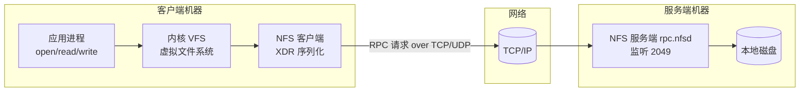
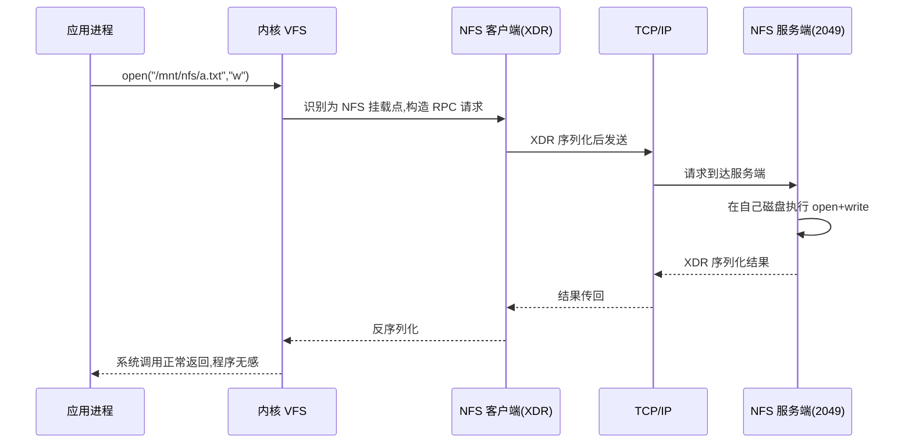
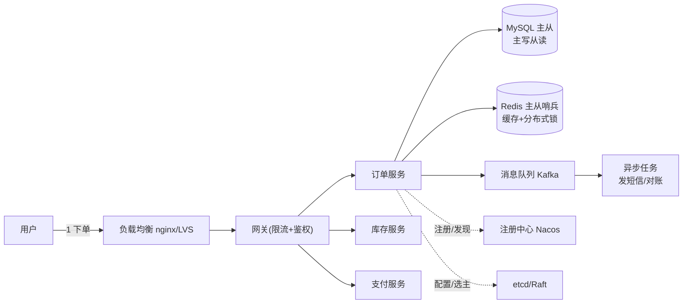

# 分布式系统设计(从零开始)

> **面向对象**: Linux 运维转开发学习者——你已经会部署 MySQL 主从、Redis、Kafka、K8s、nginx、keepalived。
> **本文目标**: 把 "已经会用的工具" 用 **统一的分布式理论** 串起来。从零讲透: 多台机器协作时会遇到什么问题、业界用什么套路解决。
> **学习主语言**: Python(精简演示代码, 单块复制即可运行, 不依赖第三方库)。
> **配套索引**: 面试背诵版见《八股文.md》第九章; 部署实战见各阶段运维文档。

---

## 〇、学习大纲(先看地图, 再上路)

> 分布式系统不是一门 "软件", 而是 **多机协作时所有问题的总称**。大纲按 "问题 → 理论 → 存储 → 协作 → 扩展 → 高可用 → 落地" 层层递进。

| 章 | 学什么 | 一句话 | 你已会的落点 |
|---|---|---|---|
| 一、分布式是什么 | 从单机到多机 | 一台机器扛不住时, 怎么让多台机器像一台一样干活 | 你部署过的集群 |
| 二、核心挑战 | 分布式难在哪 | 网络不可靠、没有全局钟、故障必然发生 | 心跳、主从切换的经验 |
| 三、理论基础 | 通信/时钟/一致性/CAP | 先把 "多机怎么通话、怎么对齐、什么算一致" 想清楚 | 八股文第九章 |
| 四、数据分布 | 复制 + 分区 | 数据怎么存多份、怎么拆多份 | MySQL 主从、Redis 集群 |
| 五、协作共识 | Raft/锁/事务/ID | 多台机器怎么达成一致、怎么排他、怎么保证原子 | Redis 锁、etcd |
| 六、服务扩展 | 负载均衡/注册中心/MQ/限流 | 服务多了怎么调度、怎么通信、怎么保护 | nginx、Kafka、Sentinel |
| 七、高可用与故障 | 冗余/转移/追踪 | 挂了怎么不中断、出问题怎么定位 | keepalived、监控 |
| 八、K8s 与云原生 | 编排层 | 把 "多机运维" 变成 "声明式自动管理" | 你的 k8s 文档 |
| 九、综合案例 | 高可用订单系统 | 用一张全景图串起前面所有概念 | — |
| 十、学习路径 | 书单与顺序 | 学完本文后往哪走(DDIA) | — |

---

## 一、分布式系统是什么

### 1.1 为什么需要分布式: 单机的 "三堵墙"

**一句话**: 一台机器永远逃不过 **性能、容量、可用性** 三堵墙, 翻墙的办法就是 "上多台机器"。

| 墙 | 单机的困境 | 多机的解法 |
|---|---|---|
| **性能墙** | CPU/内存就那么多, 并发一高就慢 | 加机器, 请求分给多台跑(水平扩展) |
| **容量墙** | 硬盘就那么大, 数据存不下 | 数据拆到多台机器(分区/分片) |
| **可用性墙** | 机器总会坏, 坏了服务就停 | 数据/服务放多份(复制/冗余), 坏一台不中断 |

**类比**: 一家饭店厨房只有一口锅(单机), 客流一多就排队。老板再买几口锅、请几个厨师(加机器)——但问题是: **菜怎么分?谁先炒?怎么保证每桌点的菜不会乱?** 这就是分布式系统研究的事。

### 1.2 一句话定义

> **分布式系统 = 一群通过网络连接的独立计算机, 它们协作起来, 对外表现得像一台计算机。**

拆开看三个关键词:

| 关键词 | 含义 |
|---|---|
| 独立计算机 | 每台有自己的 CPU/内存/磁盘, 自己会挂 |
| 通过网络连接 | 消息会延迟、会丢失、会断——**网络不是可靠的** |
| 像一台 | 用户不在乎背后几台机器, 只要求 "能用、不丢数据、够快" |

### 1.3 设计视角: 一句话看懂 "分布式系统设计"

> **分布式系统设计 = 用多台机器协作, 把 "一台超级机器" 伪装给你用, 同时解决单机从不需要操心的三件事——机器会挂、网络会断、数据要一致。**

单机里 "理所当然" 的事, 到多机全变成 **要专门设计** 的问题:

| 单机不用操心的事 | 分布式设计要做的事 | 对应章节 |
|---|---|---|
| **机器会挂** | 复制、主从切换、Raft 选主(高可用) | 四/复制、五/Raft、七/故障转移 |
| **网络会断** | 分区容忍、超时重试、幂等 | 二/网络不可靠、三/CAP |
| **数据要一致** | 共识、分布式锁、消息队列(不超卖、不重复扣款) | 五/共识与锁、六/MQ |

**记忆锚点**: 单机系统是 "一台机器, 不出问题"; 分布式系统是 "一群机器, 必然出问题"——设计的全部功夫, 就是 **让出问题时用户依然无感**。

### 1.4 和单机系统的本质区别

| | 单机 | 分布式 |
|---|---|---|
| 状态 | 一份, 进程内随意读写 | 多份副本, 要 **同步** |
| 时间 | 一个时钟, 顺序确定 | 每台有自己的钟, 会 **漂移** |
| 故障 | 挂了整个系统停 | 部分故障, 其他照跑, 要 **容错** |
| 扩展 | 换更贵的机器(垂直) | 加机器(水平), 但引入新问题 |

> **核心转变**: 单机里 "理所当然" 的事(内存一致、时钟一致、不会只坏一半), 到分布式里全都要 **重新设计和协商**。

### 1.5 挂接你已经会的

- 你搭过的 **MySQL 主从**: 就是 "复制"(第 4 章); 主从延迟, 就是 "副本不同步" 的代价。
- 你配过的 **nginx 负载均衡**: 就是 "请求分发"(第 6 章)。
- 你用的 **keepalived 主备**: 就是 "故障转移"(第 7 章)。
- 你同步过的 **NTP**: 就是在解决 "没有全局时钟"(第 3 章)。

**下一章预告**: 知道分布式要解决什么问题了, 先别急着学解法——先把 "到底难在哪" 看透。

---

## 二、分布式系统的核心挑战

**一句话**: 分布式的所有难题, 都能归到五件事——**网络不可靠、没有全局时钟、故障必然发生、状态难以一致、并发难以协调**。

### 2.1 网络不可靠(消息会丢、会慢、会断)

- 网络分区(脑裂): 两台机器之间断了, 但每台都还活着, 各自为政。
- 消息延迟: 一条消息可能 1ms, 也可能 10s 才到, 甚至永远不到。
- **关键推论**: 你无法区分 "对方挂了" 和 "对方只是慢"(没有完美的心跳)。

**类比**: 两个人打电话, 信号不好——你喊 "在吗?", 对方可能没听见、听见了没回、回了但你这边又断。你 **永远无法确定对方是死了还是只是卡**。

### 2.2 没有全局时钟(每台机器的 "现在" 不一样)

- 每台机器有自己的物理时钟, 会漂移(NTP 也只能尽量对齐, 不能绝对一致)。
- 两台机器上 "先后发生" 的事件, 靠物理时间戳 **排不出确定顺序**。

**类比**: 两个编辑分头改同一份文档, 各存各的版本。你说 "我改得比你晚, 以我为准"——但两边的电脑时间都不可信, 谁更晚根本说不清。

### 2.3 故障必然发生(部分故障是常态)

- 机器会挂、磁盘会坏、进程会崩、机房会断电——**在分布式系统里, 故障不是 "万一", 而是 "迟早"**。
- 难点: 故障是 **部分** 的(这台挂了那台没挂), 系统要 "带着病继续跑"。

### 2.4 状态难以一致(副本不同步)

- 数据存了多份, 写了一份, 另一份还没更新——用户读到了 **旧数据**。
- 到底 "允许多旧", 就是 **一致性模型**(第 3 章)要回答的问题。

### 2.5 并发难以协调(多台同时改同一份数据)

- 两台机器同时扣同一个用户的钱, 怎么保证不超扣?
- 需要 **分布式锁、分布式事务、共识算法**(第 5 章)。

### 2.6 挂接你已经会的

- 你监控里的 **Keepalived 脑裂告警** → 就是网络分区问题(2.1)。
- 你部署过 **NTP 同步** → 就是在对付时钟漂移(2.2)。
- 你见惯的 **MySQL 主从延迟** → 就是副本不一致(2.4)。
- 你配的 **主备切换 VIP 漂移** → 就是在处理故障转移(2.3)。

**下一章预告**: 挑战看完了, 开始建地基——多机之间怎么通信、怎么对齐时间、什么算 "一致"。

---

## 三、理论基础

### 3.1 通信基础: 消息传递与 RPC

**一句话**: 分布式系统里, 机器之间只能 **发消息**(通过网络收发数据包); RPC 就是 "把发消息包装得像调用本地函数"。

- **消息传递**: Socket 收发字节流——底层、原始。
- **RPC(远程过程调用)**: 客户端调 `add(2,3)`, 感觉像本地调用, 实际是序列化请求 → 发给服务端 → 执行 → 序列化结果回来。
- **REST/HTTP** 和 **gRPC/Thrift** 都是 RPC 的工业形态。

**⚠️ 分清: RPC 不是协议, 是 "范式"**:

- RPC 只是一套 *思路*: 让远程调用像本地调用(序列化 → 发送 → 执行 → 返回)。
- 它没规定消息格式、没规定传输方式, 所以不是协议; gRPC/Thrift/JSON-RPC 把细节定死, 才叫协议。

```bash
RPC(思想): "让远程调用像本地调用一样"
   │
   ├── 具体协议/框架(二选一,它们才是"协议")
   │     ├── gRPC      → 序列化:Protobuf;传输:HTTP/2
   │     ├── Thrift    → 序列化:Thrift 二进制;传输:TCP
   │     └── JSON-RPC  → 序列化:JSON;传输:HTTP
   │
   └── 任何 RPC 都要解决的三件事
        ① 序列化(把参数变成字节)
        ② 传输(把字节发出去)
        ③ 反序列化(把返回的字节变回结果)

```

| 概念 | 是什么 | 类比 |
|---|---|---|
| **RPC** | 调用模型(思想): 远程调用像本地调用 | "打电话订餐" 这个 *方式* |
| **具体协议** | 序列化 + 传输都定死的实现 | "中国移动 + 4G 网络" |

**任何 RPC 落地都要解决三件事**:
① **序列化**: 参数 → 字节(JSON / Protobuf)
② **传输**: 字节 → 发出去(TCP / HTTP)
③ **反序列化**: 返回字节 → 结果

**记忆锚点**: RPC = 设计模式(怎么组织调用); gRPC = 具体实现(消息格式 + 传输方式全定死)。

**类比**: 你打电话订餐(消息), 餐厅接到单、做完、送过来——你在电话这头只说了句 "一份宫保鸡丁", 剩下的打包传递过程全被隐藏(RPC 的 "透明性")。

```python
# RPC 最小演示:客户端像调本地函数一样,调用"远程"的 add
import socket, threading, json

def add(a, b): return a + b                       # 服务端要暴露的函数

def server():
    s = socket.socket(); s.bind(("127.0.0.1", 8800)); s.listen(1)
    conn, _ = s.accept()
    data = json.loads(conn.recv(1024).decode())   # 收到 {"a":2,"b":3}
    conn.sendall(str(add(**data)).encode())       # 执行并返回结果
    conn.close()

def client():
    s = socket.socket(); s.connect(("127.0.0.1", 8800))
    s.sendall(b'{"a":2,"b":3}')                   # 发请求
    print("远程调用结果:", s.recv(1024).decode())

threading.Thread(target=server).start()
client()                                          # 远程调用结果: 5
```

**透明性深挖: NFS 为什么 "像本地盘", AJAX 为什么 "不像"?**

**RPC 的本质 = 藏差异**: 把 "远程执行" 伪装成 "本地调用"; **伪装藏得越深, 你越无感**。

| | **NFS**(网络文件系统) | **AJAX/fetch**(前端请求后端) |
|---|---|---|
| 是 RPC 吗 | ✅ 是, 且是 RPC 老祖宗级应用(SUN 为 NFS 发明了 XDR 序列化) | ✅ 是 |
| 伪装藏在哪 | **内核 VFS 层**(最底层) | **JS 协议层**(较浅) |
| 体感 | **100% 像本地**(open/read/write 系统调用无感知) | **70%**(异步等待、失败提示必须暴露) |
| 序列化 | XDR 二进制 | JSON |

**NFS 工作原理**(三步):
① 你在本地 `open("/mnt/nfs/a.txt")`——系统调用, 你无感;
② 内核 VFS 发现这是 NFS 挂载点 → RPC 序列化(XDR)→ 发给 NFS 服务端;
③ 服务端在自己磁盘执行 → 结果返回, 你的程序 **一行代码不用改**。

**NFS 架构图**(谁在调用链上):



**工作流程**(时序图):



**类比**: 插个 U 盘, 在 `/mnt/usb` 读写和本地硬盘一样——NFS 只是把 "U 盘" 换成 "别人服务器的硬盘", 伪装由内核驱动完成。

**AJAX 为什么故意不藏?**: 本地调用同步、瞬间、几乎不失败; 网络调用异步、慢、会失败。前端若把异步和失败也藏起来, 用户点了按钮就干等, 像 **卡死**。所以 UI 必须让你感知 "这是远程"——这是正确设计, 不是 RPC 没做好。

**统一结论——判断 "像不像本地" 看伪装层**:

- 藏最底(NFS, 内核层)→ 完全无感, 像本地盘
- 藏中间(gRPC/Thrift, 框架生成客户端 stub)→ 服务端内部调用, 程序员无感
- 藏最浅(AJAX, 浏览器层)→ 只藏序列化/传输, 异步与失败故意暴露

**挂接**: nginx 的 `proxy_pass`、你写的 Python `requests.get()`、微服务之间的 HTTP 调用——全是 RPC 的变体。


### 3.2 时间与排序: 逻辑时钟(Lamport 时钟)

**一句话**: 物理时钟不可靠, 那就别比 "几点几分", 改比 "**谁先发生(因果序)**"——用计数器编号代替时间戳。

**规则(三条)**:

1. 本地事件: `c = c + 1`
2. 发消息: `c = c + 1`, 把序号附在消息里
3. 收消息: `c = max(自己序号, 对方序号) + 1`

**效果**: 如果 A 发消息前发生的事, 在 B 收到消息时序号必然 ≤ B 的序号 → **因果顺序不乱**(结果一致的前提)。

**类比**: 接力赛不靠手表计时, 靠 "交接棒"——拿到棒的瞬间, 前面所有棒次都完成了, 顺序天然确定。

```python
# Lamport 逻辑时钟:用"序号"替代真实时间,保证"因果顺序"不乱
class Clock:
    def __init__(self, pid):
        self.pid, self.c = pid, 0

    def tick(self):              # 本地事件:c+1
        self.c += 1
        return self.c

    def send(self):              # 发消息:序号附在消息里
        self.c += 1
        return self.c

    def recv(self, remote):      # 收消息:取 max(自己,对方)+1
        self.c = max(self.c, remote) + 1
        return self.c

a, b = Clock("A"), Clock("B")
a.tick(); a.tick()               # A 本地发生 2 个事件(序号到 2)
msg = a.send()                   # A 发消息,序号 3
b.recv(msg)                      # B 收到后,序号跳到 4(≥3,因果序成立)
print("A 序号:", a.c, "| B 序号:", b.c)   # A: 3 | B: 4
```

**延伸**: Lamport 时钟只能排 "因果", 排不出 "并发事件的确定全序"; **向量时钟** 才能做到——理解到 Lamport 足够入门。

### 3.3 一致性模型: 什么算 "一致"

**一句话**: 一致性就是 "**用户读到的数据, 允许多旧**"——从 "永远是新的" 到 "最后总归是新的", 中间是权衡。

| 模型 | 允许读到多旧 | 代价 | 典型场景 |
|---|---|---|---|
| **强一致(线性一致)** | 永远最新, 写完成功立刻所有人可见 | 最贵(要等副本都确认) | 银行转账、etcd |
| **顺序一致** | 所有节点看到 **相同顺序**, 但不一定最新 | 贵 | 数据库主从(理想态) |
| **因果一致** | 有因果关系的操作有序, 无关的随意 | 中 | 朋友圈评论(回复必须晚于原帖) |
| **最终一致** | 不保证立刻, 但 **过段时间一定一致** | 便宜, 默认选择 | DNS、MySQL 主从实际状态、Redis 主从 |

**类比**: 你发朋友圈(写), 朋友要过一会儿才刷到(读)。

- 强一致: 所有朋友 **立刻** 同时看到——最贵, 但不会有人说 "我看到的跟你不一样"。
- 最终一致: 朋友 **迟早** 看到, 先看到后看到的顺序可能不同——便宜, 大多数人能接受。

**关键认知**: **"一致" 不是免费的, 强一致 = 等最慢的那台机器**。选哪档, 是 **业务可接受程度** 和 **性能** 的权衡(呼应 M4 权衡模型)。

### 3.4 CAP 定理与 BASE 理论

**一句话**: 网络分区(P)躲不掉, **必须在 "一致性(C)" 和 "可用性(A)" 之间二选一**; BASE 就是选了 A 之后的落地策略。

| 字母 | 含义 | 通俗解释 |
|---|---|---|
| C(Consistency, 一致性) | 所有节点同一时刻读到相同数据 | 副本永远一样 |
| A(Availability, 可用性) | 任何请求都能得到响应(不保证最新) | 服务永远有反应 |
| P(Partition tolerance, 分区容错性) | 网络断了系统仍能工作 | 断网也不挂 |

- **为什么三选二**: 网络分区发生时, 你只能二选一——
  - 选 **CP**: 宁可拒绝服务, 也不给旧数据 → ZooKeeper、etcd、HBase。
  - 选 **AP**: 先返回旧数据, 事后再同步 → Eureka、Cassandra、Redis 主从(实际)。
- **BASE(Basically Available + Soft state + Eventually consistent)** = AP 的落地: 基本可用、允许中间态、最终一致。

**类比**: 银行网点间电话断了(分区)。

- 取 1000 元, 你卡里只有 500 —— CP 的银行: 直接拒绝这笔取款(牺牲可用)。
- AP 的银行: 先给你取, 晚点对账时发现负数再追回(牺牲一致)。

**挂接你已经会的**:

- **NTP**(3.2 的物理版): 让各节点时间尽量对齐, 但逻辑时钟解决的是 "因果", 两者互补。
- **MySQL 主从延迟**(3.3): 你遇到的所有 "读到旧数据", 都是 "最终一致" 在起作用。
- **ZooKeeper / etcd**(3.4 CP 例子): K8s 就是用 etcd 做 "必须强一致" 的配置存储。

**下一章预告**: 理论基础齐了, 开始第一件实事——**数据** 怎么在多台机器上存(复制 + 分区)。

## 四、数据分布: 复制 + 分区

> 数据在多台机器上, 只有两种放法: **复制**(同份数据放多份)和 **分区**(不同数据放不同机器)。两者可叠加, 几乎所有数据库集群都是 "分区 + 副本" 的组合。

### 4.1 复制(Replication): 数据存多份

**一句话**: 同一份数据存 N 份副本, 解决 **可用性**(坏一台还有)和 **读性能**(读请求分给多台)。

**三种复制方式(按 "谁能写" 分)**:

| 方式 | 谁能写 | 优点 | 缺点 | 代表 |
|---|---|---|---|---|
| **主从(单主)** | 只有主可写, 从负责读 | 实现简单、无写冲突 | 主挂了写不可用(要选主) | MySQL 主从、Redis 哨兵 |
| **多主** | 多个主都可写 | 多地容灾、就近写入 | 写冲突要处理 | MySQL 双主、多机房 |
| **无主** | 谁都能写, 靠多数派投票 | 高可用最强 | 实现复杂 | Cassandra、Dynamo |

**同步 vs 异步**(关键权衡):

- **同步复制**: 主写完, 等从也写完才返回成功 → 不丢数据, 但 **慢**(受最慢从机拖累)。
- **异步复制**: 主写完就返回, 从慢慢追 → **快**, 但主挂了可能丢几秒数据。
- 现实几乎都是 **异步** 或 **半同步**(等至少一个从确认)。

**类比**: 文件存档——同步: 每改一笔, 所有复印机当场复印完才算完(安全但慢); 异步: 主档先改, 复印机有空再补印(快, 但主档烧了会丢最近几页)。

**挂接**: 你的 MySQL 主从、Redis 主从哨兵, 就是单主复制的工程实现; `半同步复制`(MySQL 5.7+)和 `wait for ack` 就是在同步/异步之间做折中。

### 4.2 分区(Partitioning): 数据拆多份

**一句话**: 数据太多放不下一台, 按规则把数据拆到多台机器, **每台只存一部分**, 解决 **容量** 和 **写性能**。

**三种分区方式**:

| 方式 | 规则 | 优点 | 缺点 |
|---|---|---|---|
| **范围分区** | 按 key 区间切(如 ID 1-1 万、1 万-2 万) | 范围查询友好 | 热点区间(如新订单全写到最后一段) |
| **哈希分区** | `hash(key) % N` 决定去哪台 | 分布均匀 | 加节点后 **几乎所有 key 都要搬家**(缓存雪崩) |
| **一致性哈希** | 哈希到环上, 顺时针找节点 | 加节点只影响 **一小段** | 实现略复杂 |

**一致性哈希(Python 演示)**: 对比取模法和一致性哈希, 看 "加一台机器" 的搬家代价:

```python
# 一致性哈希 vs 取模:看加一台机器后,有多少 key 要"搬家"
import hashlib

def h(s):  return int(hashlib.md5(s.encode()).hexdigest(), 16)

class Ring:
    def __init__(self, nodes):
        self.ring = sorted((h(n), n) for n in nodes)   # 节点哈希后按环排列
    def get(self, key):
        kh = h(key)
        for pos, node in self.ring:      # 顺时针找第一个 >= key 的节点
            if kh <= pos:
                return node
        return self.ring[0][1]           # 没有就绕回环头

keys = ["user:1", "user:2", "user:3", "order:99", "cart:abc"]
ring3 = Ring(["redis-1", "redis-2", "redis-3"])
before = {k: ring3.get(k) for k in keys}

# 取模法:3 台 -> 4 台
moved_mod = sum(1 for k in keys if h(k) % 4 != h(k) % 3)

# 一致性哈希:3 台 -> 4 台
ring4 = Ring(["redis-1", "redis-2", "redis-3", "redis-4"])
moved_ch = [k for k in keys if ring4.get(k) != before[k]]

print("取模法 hash%N 加 1 台:", f"{moved_mod}/{len(keys)} 个 key 搬家(几乎全搬)")
print("一致性哈希加 1 台:    ", f"{len(moved_ch)}/{len(keys)} 个 key 搬家", moved_ch)
```

**结论**: 取模 `%N` 一旦 N 变化, **所有** key 的归属都可能变 → 缓存全失效(雪崩); 一致性哈希只影响环上 **一小段** → 大部分缓存还能用。这就是 Redis Cluster、Cassandra 用它做数据分布的原因。

### 4.3 数据同步: 副本怎么追上新数据

**一句话**: 副本不是凭空变新的, 靠 **把写入操作(或数据)同步过去**——同步方式决定了延迟和数据丢失窗口。

| 方式 | 原理 | 代表 |
|---|---|---|
| **日志/日志重放** | 主库把变更记录写到日志, 从库重放 | MySQL binlog 主从复制 |
| **推送/订阅** | 主库主动推给副本 | Redis 主从 `repl` |
| **全量 + 增量** | 先全量拷贝, 再持续追增量 | 新从库上线流程 |

**挂接**: MySQL 主从流程你肯定熟——`master 写 binlog → slave 的 IO 线程拉 binlog 写 relay log → SQL 线程重放`, 这就是 "日志重放 + 异步复制"。**主从延迟 = relay 追不上的时间差**。

**下一章预告**: 数据 "存" 的问题解决了, 轮到最硬核的——多台机器怎么 **达成一致**(选主、锁、事务、ID)。

---

## 五、协作共识: 让多台机器 "想法一致"

> 这是分布式 **最硬核** 的一章。核心问题: **多台机器怎么对一个决定(谁是主、这笔账对不对)达成一致?** 答: 靠 **共识算法**。

### 5.1 为什么需要共识

- 主从复制里, 主挂了谁来当新主?多台机器 **必须统一意见**, 不能你说 A 他说 B(否则脑裂)。
- 关键前提: **大多数(过半)** 节点同意才算数——过半保证任意两个 "多数派" 必有交集, 不可能同时选出两个主。

**类比**: 小组投票选组长——过半同意才生效。因为 "过半" 和 "过半" 必然重叠, 所以不可能同时有两个组长(任何两个多数集合必有公共成员)。

### 5.2 Raft: 当前最主流的共识算法

**一句话**: Raft 把 "达成一致" 拆成三个子问题——**选主、日志复制、安全性**; 核心思想: **靠投票选一个 Leader, 所有写入先经过 Leader, 再复制到多数节点后才算提交**。

**选主简化模拟(Python)**:

```python
# Raft 选主简化演示:任期(term)+ 过半票数 -> 选出唯一 Leader
class Node:
    def __init__(self, name):
        self.name, self.term, self.votes, self.voted_for = name, 0, 0, None

    def become_candidate(self):      # 发起选举:任期+1,给自己一票
        self.term += 1
        self.votes, self.voted_for = 1, self.name

    def vote(self, node):            # 每个节点同一任期只能投一票
        if self.voted_for is None:
            self.voted_for = node.name
            node.votes += 1

nodes = [Node(f"node-{i}") for i in range(5)]
nodes[0].become_candidate()          # node-0 心跳超时,发起选举
for n in nodes[1:]:
    n.vote(nodes[0])                 # 其余 4 个节点投票给它

leader = max(nodes, key=lambda n: n.votes)
print("得票:", {n.name: n.votes for n in nodes})
print("Leader:", leader.name, "| 任期:", leader.term)
print("过半当选?", leader.votes > len(nodes) / 2)
```

**Raft 关键机制(背这四句)**:

1. **选举**: 每个节点有随机超时, 超时了就自荐当候选人, 拿到 **过半票** 成为 Leader。
2. **任期(Term)**: 每次选举 term+1, 过期 term 的消息全部作废 → 防止旧 Leader 复活捣乱。
3. **日志复制**: 所有写请求只发 Leader, Leader 广播给从节点, **过半节点写入后才提交** → 保证不丢。
4. **脑裂防护**: 同一任期只有一个 Leader(因为过半交集); 分区恢复后 term 高的一方胜。

**挂接**: etcd(存 K8s 配置)就是 Raft; ZooKeeper 用的是 ZAB(思想同 Raft); MySQL 半同步复制、Redis Cluster 选主都借鉴了 "多数派确认"。

### 5.3 Paxos(了解即可)

**一句话**: Raft 的 "前辈", 同样解决共识, 但 **极难理解**; Raft 是它的简化教学版。知道 "Paxos 也能达成共识、业界已基本用 Raft 替代" 就够。

### 5.4 分布式锁: 多台机器抢同一资源

**一句话**: 单机用 `threading.Lock`, 多机要用 "**全集群唯一的一把锁**"——谁抢到谁干活, 防止重复扣款、重复下单。

**实现三要素(Redis 版, 面试必背)**:

1. **SETNX + 过期时间**: `SET lock_key uuid NX EX 30` —— NX 表示不存在, EX 30: 30 秒过期; 键不存在才写入(排他), 带过期(防死锁)。
2. **只删自己的锁**: 释放时用 Lua 脚本比对 uuid, 防止 "误删别人的锁"。
3. **续期(看门狗)**: 任务没干完, 锁要过期了, 自动续期。

**Python 模拟**(用字典模拟 Redis):

```python
# 分布式锁:SETNX 加锁 + 过期防死锁 + 只删自己的锁
import time

redis = {}                                   # 模拟 Redis 键值(真实用 SET key val NX EX 30)
def setnx(key, val, ttl):
    if key in redis:
        return False                         # 已存在 -> 加锁失败
    redis[key] = (val, time.time() + ttl)    # 写入并带过期时间
    return True

def release(key, val):
    if redis.get(key, (None,))[0] == val:    # 只能删自己加的锁
        del redis[key]
        return True
    return False

key, my_uuid = "order:1001", "uuid-abc"
print("我加锁?", setnx(key, my_uuid, 30))            # True
print("别人加锁被拒?", setnx(key, "uuid-xyz", 30))   # False(已被我持有)
print("我释放锁?", release(key, my_uuid))            # True
print("锁释放后可再加?", setnx(key, "uuid-xyz", 30)) # True
```

### 5.5 分布式事务: 跨库/跨服务的 "要么全成、要么全不成"

**一句话**: 单机事务靠数据库回滚; 跨机器没有共同的回滚机制, 只能用 **补偿** 或 **消息** 来凑出 "原子性"。

| 方案 | 思路 | 优点 | 缺点 | 适用 |
|---|---|---|---|---|
| **2PC(两阶段提交)** | 先 "准备", 全部同意再 "提交" | 强一致 | 协调者挂了全卡住(阻塞) | XA、跨库金额一致性 |
| **TCC** | Try-Confirm-Cancel 三段, 业务自己写补偿 | 灵活、不阻塞 | 每个操作要写三套代码 | 金融类订单 |
| **本地消息表** | 业务和发消息同库事务, 靠定时任务补发 | 简单可靠 | 有延迟、要消费幂等 | 下单发 MQ |
| **Saga** | 每个子事务配一个 **补偿事务**, 失败就逆序回滚 | 长事务友好 | 中间态对外可见 | 订单/旅游多步骤 |

**一句话记忆**: **2PC 靠 "先问后做" 保强一致; TCC 靠业务补偿; 消息表靠 "同库事务+重发"; Saga 靠 "每一步都有后悔药"。**

### 5.6 分布式 ID: 全集群唯一、有序的 ID

**一句话**: 分库分表后自增 ID 会撞车, 需要一个 **全局唯一、尽量递增** 的 ID 生成器。

**主流方案: 雪花算法(Snowflake)** —— 64 位整数 = 41 位时间戳 + 10 位机器号 + 12 位毫秒内自增序号。

```python
# 雪花算法:64 位 = 时间戳(41) + 机器号(10) + 序列号(12)
import time

class Snowflake:
    def __init__(self, machine_id):
        self.machine_id = machine_id & 0x3FF        # 10 bit 机器号
        self.seq, self.last = 0, 0

    def next_id(self):
        now = int(time.time() * 1000)               # 毫秒时间戳
        if now == self.last:                        # 同一毫秒内
            self.seq = (self.seq + 1) & 0xFFF       # 序号自增(12 bit)
        else:
            self.seq, self.last = 0, now
        return (now << 22) | (self.machine_id << 12) | self.seq

sf = Snowflake(machine_id=1)
ids = [sf.next_id() for _ in range(3)]
print("生成的 ID:", ids)
print("不重复?", len(set(ids)) == 3, "| 随时间递增?", ids == sorted(ids))
```

**挂接**: Redis 集群的数据分槽(16384 个槽)= 哈希分区思想; K8s 的 etcd = Raft 实例; 你写的 "订单号不重复" 需求 = 分布式 ID。

**下一章预告**: 数据的一致性和协调搞定了, 往上走一层——**服务** 多了怎么调度、怎么发现、怎么通信、怎么保护。

## 六、服务扩展: 让系统 "人多力量大"

> 单机扛不住 → 加机器; 机器多了 → 谁来分发请求?服务之间怎么互相找?突发流量怎么挡?本章讲 **服务侧的四大件: 负载均衡、注册中心、消息队列、限流熔断降级**。

### 6.1 负载均衡(LB): 把请求分给多台机器

**一句话**: 一台机器扛不住, 把请求 **均匀分发** 给后面 N 台, 顺带做 **健康检查**(坏机器自动摘掉)。

**四层 vs 七层(面试必背)**:

| 对比 | 四层 LB | 七层 LB |
|---|---|---|
| 工作层级 | 传输层(IP + 端口) | 应用层(HTTP 内容) |
| 典型实现 | LVS、Nginx stream、F5 | Nginx、HAProxy |
| 特点 | 性能极高、转发原始报文 | 灵活(按 URL/Header/Cookie 分发) |
| 适用 | TCP/UDP 高并发 | HTTP/HTTPS 业务 |

**调度算法**: 轮询(RR)、加权轮询(WRR)、最少连接(LC)、IP 哈希(会话保持)、一致性哈希(缓存类)。

**Python 演示(轮询 + 加权轮询)**:

```python
# 负载均衡算法演示:轮询 / 加权轮询 / 最少连接
import itertools

class LB:
    def __init__(self, servers):
        self.servers = servers
        self.conns = {s: 0 for s in servers}      # 记录每个后端当前连接数
        self.i = 0

    def round_robin(self):                        # 轮询:按顺序轮流
        s = self.servers[self.i]
        self.i = (self.i + 1) % len(self.servers)
        return s

    def weighted(self, weights):                  # 加权轮询:按权重展开再轮询
        pool = list(itertools.chain.from_iterable(
            [s] * w for s, w in zip(self.servers, weights)))
        s = pool[self.i % len(pool)]
        self.i += 1
        return s

    def least_conn(self):                         # 最少连接:找当前最闲的
        return min(self.conns, key=self.conns.get)

servers = ["web-1", "web-2", "web-3"]
lb = LB(servers)
print("轮询 6 次:", [lb.round_robin() for _ in range(6)])
lb.i = 0
print("加权(1:2:1) 4 次:", [lb.weighted([1, 2, 1]) for _ in range(4)])
lb.conns["web-2"] += 10                           # web-2 快满了
print("最少连接:", lb.least_conn())
```

**挂接**: 你的 nginx `upstream` 配置(轮询/权重/ip_hash)、LVS 四层转发, 就是本章的工程版。

### 6.2 注册中心与服务发现: 服务之间怎么互相找

**一句话**: 机器会动态增删(扩缩容、故障), **服务别把对方地址写死**, 而是 "**登记到注册中心 + 启动时去查**"。

**工作流程**:

```txt
服务启动 -> 向注册中心登记(ip:port)
服务定期心跳续约
调用方查询注册中心 -> 拿到可用服务列表 -> 选择一个发起调用
服务挂掉 -> 心跳超时 -> 注册中心剔除
```

**类比**: 外卖平台(注册中心)——商家(服务)入驻登记, 顾客(调用方)打开 APP 就能看到 "附近有哪些店、现在营业不营业", 店关门了平台会下架。

**代表**: **ZooKeeper / etcd**(CP, 强一致)、**Eureka / Nacos**(AP, 可用优先)。K8s 的 Service + kube-proxy 干的就是这件事。

### 6.3 消息队列(MQ): 削峰、解耦、异步

**一句话**: 生产者和消费者 **不直接通信**, 中间加一个 "信箱"(队列), 解决三个问题——**削峰**(流量先存起来慢慢消化)、**解耦**(两边互不依赖)、**异步**(不等对方处理完)。

**可靠性三板斧(面试常问)**:

1. **确认(ACK)**: 消费者处理完才 ack, 没 ack 就重发。
2. **重试 + 幂等**: 消息可能重复投递, 消费端要做幂等(唯一订单号 + 数据库唯一索引), 防重复扣款。
3. **事务消息/本地消息表**: 保证 "业务成功了消息才发出去"(见 5.5)。

**Python 演示(生产/消费 + ACK + 重试)**:

```python
# 消息队列最小演示:队列缓冲 + 消费 ACK + 失败有限重试
import queue, time

q = queue.Queue()
def producer():                                   # 生产:削峰,先入队
    for i in range(5):
        q.put((f"msg-{i}", 0))                    # (消息, 重试次数)
        print("生产:", f"msg-{i}")

def consumer():
    while not q.empty():
        msg, tries = q.get()
        try:
            if msg == "msg-2":
                raise RuntimeError("模拟处理失败")    # 模拟消费失败
            print("消费成功:", msg)
        except RuntimeError:
            if tries < 2:                         # 未 ACK -> 有限重试
                print("消费失败重试:", msg)
                q.put((msg, tries + 1))
            else:
                print("重试次数用完,丢弃并告警:", msg)   # 进死信队列
        time.sleep(0.05)

producer(); consumer()
```

**挂接**: 你的 Kafka 就是工程版 MQ——`partition`(分区)、`replica`(副本)、`acks` 参数(ACK 级别), 把第四、五章的概念全用上了。

### 6.4 限流 / 熔断 / 降级: 雪崩治理三件套

**一句话**: 流量太猛要 **限流**(挡在门外)、下游坏了要 **熔断**(快速失败别拖死自己)、核心保障要 **降级**(砍掉非核心功能)。

| 手段 | 做什么 | 例子 |
|---|---|---|
| **限流** | 控制进入系统的请求速率 | 令牌桶/漏桶, Nginx `limit_req` |
| **熔断** | 下游故障时 **快速失败**, 避免请求堆积把上游也拖死 | Hystrix/Sentinel, 半开自动恢复 |
| **降级** | 非核心功能暂时关闭, 保核心 | 评论显示 "维护中", 推荐位用默认 |

**Python 演示(令牌桶限流)**:

```python
# 令牌桶限流:固定速率往桶里加令牌,有令牌才放行,桶空就拒绝
import time

class TokenBucket:
    def __init__(self, rate, capacity):
        self.rate, self.capacity = rate, capacity
        self.tokens, self.last = capacity, time.time()

    def allow(self):
        now = time.time()
        self.tokens = min(self.capacity,
                          self.tokens + (now - self.last) * self.rate)
        self.last = now
        if self.tokens >= 1:
            self.tokens -= 1
            return True
        return False

b = TokenBucket(rate=2, capacity=5)          # 每秒补 2 个令牌,桶最多存 5 个
ok = [b.allow() for _ in range(6)]           # 前 5 个放行,第 6 个被限流
print("连续 6 个请求放行情况:", ok)
print("累计放行:", sum(ok), "/ 6")
```

**雪崩怎么发生**: 服务 A 挂了 → 依赖 A 的 B 请求全部超时堆积 → B 的连接池耗尽 → B 也挂 → 连环反应。
**解法(背)**: **超时**(不等太久)+ **熔断**(快速失败)+ **隔离**(线程池/信号量隔离)+ **限流**(挡住流量)。

**挂接**: nginx 的 `limit_req_zone`、你写的 "高峰期降级开关", 就是三件套的工程版; 生产上更常用 **Sentinel / Resilience4j**。

**下一章预告**: 服务能扩展了, 还差最后一块——**机器真的挂了, 怎么不中断、怎么快速定位**。

---

## 七、高可用与故障: 挂了也不中断

> 高可用(HA)= **冗余 + 故障转移 + 快速恢复**。目标不是 "不出故障", 而是 "**出了故障用户没感觉**"。

### 7.1 冗余与故障转移(主备 / 多活)

**一句话**: 准备 "备胎"——主挂了, 备胎立刻顶上, 对外 IP 不变(漂移)。

**三件套**:

1. **冗余**: 数据多副本(主从)、服务多实例(集群)、甚至多机房。
2. **检测**: 心跳(定期发 "我还活着"), 连续 N 次没响应判定 "疑似故障"。
3. **转移**: 自动切换到备机(VIP 漂移、从库提升为主库、选新 Leader)。

**为什么不能简单 "主挂了备直接上"**: 可能只是网络分区(主还活着), 两边都抢着当主 = **脑裂**(数据分裂)。所以要靠 **过半机制 / 防脑裂仲裁**(见第五章 Raft)来决定谁是唯一主。

**Python 演示(心跳 + 超时判定)**:

```python
# 故障检测演示:心跳 + 超时判死 + 触发切换
import time

class Heartbeat:
    def __init__(self, timeout=3):
        self.last_seen = time.time()
        self.timeout = timeout
    def beat(self):                            # 收到心跳,更新最后存活时间
        self.last_seen = time.time()
    def is_dead(self):
        return time.time() - self.last_seen > self.timeout

hb = Heartbeat(timeout=0.2)
time.sleep(0.1); hb.beat()                     # 0.1s 时来了一次心跳,活着
time.sleep(0.25)                               # 超过 0.2s 没心跳
print("判定主机故障?", hb.is_dead())            # True -> 触发 VIP 漂移/选主
```

**挂接**: 你的 **keepalived**(VIP 漂移)、**MySQL 主从切换**(从库提升)、**Redis 哨兵**(自动选主), 全是 "心跳 + 检测 + 转移" 的工程实现。

### 7.2 数据备份与恢复

**一句话**: 故障转移防 "服务中断", 备份防 "**数据丢失**"(误删、机房火灾、勒索病毒)。

- **备份策略**: 全量(定期全备份)+ 增量(每天/每小时 binlog 增量)+ 冷备(异地/离线)。
- **恢复演练**: 备份不演练等于没有——**定期做恢复测试**, 测 "恢复时长 RTO" 和 "最多丢多久数据 RPO"。
- **RPO(能丢多少)/ RTO(多久恢复)**: 一切容灾方案都在权衡这两个数。

### 7.3 分布式追踪与排障

**一句话**: 一次请求跨几十个服务, 日志散在各机器——**用 "一次请求一个全局 ID(trace_id)", 把整条链路串起来看**。

**三件套**: `trace_id`(一次请求全局唯一)+ `span`(每一跳的耗时)+ 上报聚合(像 Jaeger、SkyWalking 展示调用链瀑布图)。

**类比**: 快递全链路——每个中转站都扫同一个运单号, 你就能查到 "件现在到哪了、哪一站耽误了"。

**排障心法(运维视角)**:

1. 先看 **监控大盘**(CPU/内存/连接数/QPS/错误率), 确定 "哪里异常"。
2. 顺着 **链路追踪** 找到慢的那一跳。
3. 结合 **日志 + 指标**, 区分: 是 **限流**(被挡)、**熔断**(下游坏了)、还是 **主从延迟**(读到旧数据)。

**挂接**: 你的 Zabbix/Prometheus 监控 + 应用日志里加的 `request_id`, 就是追踪的雏形; 生产常用 SkyWalking / Jaeger / 阿里 ARMS。

**下一章预告**: 单台机器上的所有概念都齐了, 最后一层——**把整个集群当成一台电脑来管理(K8s)**。

---

## 八、K8s 与云原生: 把集群变成 "一台电脑"

### 8.1 为什么需要编排

**一句话**: 机器多了, 手工部署/扩容/重启太慢太容易错——**K8s 把 "多台机器" 抽象成 "一台大电脑", 你只声明 "要什么", 它负责 "怎么实现"**。

**对比**:

| 传统运维 | K8s 方式 |
|---|---|
| SSH 到每台机器装环境 | 打包成 **镜像**, 声明式发布 |
| 手动重启挂掉的服务 | 自动 **重启/拉起**(自愈) |
| 流量大了手动加机器 | 自动 **水平扩容**(HPA) |
| 手工切流量 | **Service + 负载均衡** 自动分发 |

### 8.2 核心对象(背这五个)

| 对象 | 是什么 | 对应分布式概念 |
|---|---|---|
| **Pod** | 运行的最小单位(一组容器) | 一台 "虚拟服务器" |
| **Deployment** | 声明 "要几个副本、怎么更新" | **副本(复制)** |
| **Service** | 稳定的访问入口(ClusterIP) | **负载均衡 + 服务发现** |
| **ConfigMap/Secret** | 配置和密钥 | 配置中心 |
| **etcd** | K8s 的 "大脑", 存所有状态 | **Raft 共识(强一致)** |

### 8.3 用前几章概念看 K8s

- **Deployment 的 `replicas: 3`** = 第四章的 "复制": 3 个副本, 坏一个自动补一个。
- **Service + kube-proxy** = 第六章的 "负载均衡 + 服务发现": Pod 的 IP 会变, Service 提供稳定入口。
- **etcd** = 第五章的 "Raft": K8s 的期望状态存 etcd, 靠 Raft 保证多 master 强一致。
- **HPA(自动扩缩容)** = 第六章的 "水平扩展": CPU 高了自动加副本。
- **自愈(重启/重新调度)** = 第七章的 "故障检测 + 转移": 节点挂了, Pod 自动迁移。

**类比**: K8s 像一个 "智能酒店"——你(Deployment)说 "我要 3 间房(Pod)", 前台(etcd)记下, 服务员(ReplicaSet)盯着: 哪间房客人走了(挂了)就打扫干净安排新人入住, 前台电话(Service)永远只报一个总机号, 不管房间怎么变。

**挂接**: 你有 k8s 高频面试题/架构师文档, 本章是 "用分布式理论重新理解 K8s 设计" 的钥匙, 细节去那些文档看。

**下一章预告**: 概念全部学完, 最后一击——用一张 **全景图** 把订单系统从用户点击到数据库落盘的每一步, 对上前面的每个概念。

## 九、综合案例: 高可用订单系统(全链路串讲)

> 把前八章所有概念放到一个真实场景里: **用户下单买东西**。看每一步背后站着哪个分布式概念。

### 9.1 系统架构(全景图)



### 9.2 一次下单, 走过了所有概念

| 步骤 | 发生什么 | 用到的概念(章节) |
|---|---|---|
| 1. 用户点下单 | 请求先到 **负载均衡**, 分给某台网关 | 六/负载均衡 |
| 2. 网关限流 | 令牌桶检查: 流量超了就 503 | 六/限流 |
| 3. 查服务地址 | 订单服务从 **注册中心** 查到库存/支付服务在哪 | 六/服务发现 |
| 4. 扣库存 | 用 **Redis 分布式锁** 防超卖 | 五/分布式锁 |
| 5. 写订单表 | 写入 MySQL **主库**, 从库异步同步 | 四/复制 |
| 6. 发消息 | 订单入库 + 发 Kafka 消息 **同一事务**(本地消息表), 防止 "钱扣了短信没发" | 五/分布式事务、六/MQ |
| 7. 生成订单号 | 用 **雪花算法** 生成全局唯一订单 ID | 五/分布式 ID |
| 8. 异步对账 | 消费者从 Kafka 取消息, 幂等处理, 失败重试 | 六/MQ 可靠性 |
| 9. 全程追踪 | 每个服务日志带同一个 `trace_id` | 七/分布式追踪 |

### 9.3 故障演练: 每个故障对应哪一章

| 故障 | 系统怎么扛 | 对应章节 |
|---|---|---|
| 订单服务挂了 | 负载均衡 **摘除** 它, 请求转给别的实例 | 六/负载均衡健康检查 |
| 主库挂了 | 哨兵/选主, 从库 **提升为主**, VIP 漂移 | 七/故障转移、五/Raft |
| 数据库被删了 | 从 **备份** 恢复 + binlog 补增量(接受几分钟 RPO) | 七/备份恢复 |
| 大促流量猛增 | **限流** 挡 + **降级** 砍非核心 + HPA **自动扩容** | 六/限流熔断降级 |
| 支付服务变慢 | 订单服务 **熔断** 快速失败, 不让线程池耗尽 | 六/熔断 |
| 机房断电 | 多机房部署, 流量切到另一机房 | 七/冗余 |

**一句话总结这个案例**: **你在运维时做的每一件事(主从、VIP、限流、扩容), 背后都是分布式系统的某个理论在支撑——现在你知道了它们的 "名字" 和 "为什么"。**

---

## 十、学习路径与书单(学完本文后往哪走)

### 10.1 建议学习顺序(与你的工作结合)

1. **巩固本文**: 合上文档, 把 9.2 表格里每个 "概念" 自己讲一遍(讲不清就回去看那章)。
2. **动手验证理论**(你已经会部署, 升级为 "带着理论看部署"):
   - 配一个 MySQL 主从, 人为制造延迟, 观察 **复制与最终一致**。
   - 给 Redis 加哨兵, 杀掉主库, 看 **选主 + 故障转移**。
   - 用 nginx 配置轮询/加权/ip_hash, 观察 **负载均衡算法** 区别。
   - 压测时把服务打挂一次, 用监控看 **雪崩** 怎么发生。
3. **补理论硬核**: **读 DDIA(《数据密集型应用系统设计》)**, 重点第 5-9 章(复制/分区/事务/一致性/共识)——它讲的正是本文每一章的原版深度, 你已有工具经验, 读起来不会飘。
4. **面试冲刺**: 背《八股文.md》第九章 + 本文 5.2/5.4/5.5 的要点(面试常考: CAP、分布式锁、2PC vs TCC、一致性哈希)。

### 10.2 书单与资源(按需取用)

| 资源 | 定位 | 适合阶段 |
|---|---|---|
| **《数据密集型应用系统设计》(DDIA)** | 分布式领域 "圣经", 把理论讲透 | 本文之后精读 |
| **《分布式系统原理与范型》** | 经典教材, 体系全面 | 想系统补理论 |
| **MIT 6.824(分布式系统)** | 顶级公开课, 含 lab(Go 写 Raft) | 想动手写代码 |
| 《八股文.md》第九章 | 面试背诵版索引 | 面试前 |
| 你的 k8s 文档 / 50 台集群项目 | 编排与运维实战 | 同步对照 |

### 10.3 结语(回到你最初的困惑)

> 分布式系统 **不是一门 "新软件", 而是多机协作问题的总称**。它既宽泛(存储、网络、运维、架构处处是它), 又专门(核心理论就那几块: 复制、分区、一致性、共识、容错)。
>
> 你作为运维, **工具层早已熟练**; 本文补上的是 **设计层和理论层**——以后你看到任何 "分布式" 产品, 都能问出三句话:
> **① 数据怎么分/怎么存多份?(复制+分区)② 多台机器怎么达成一致?(共识/锁/事务)③ 挂了怎么不中断?(故障检测+转移)**
>
> 三句话能答上来, 分布式就 "会了"。

---

*全文完。保持 "一句话 + 类比 + 代码 + 挂接" 的方式, 祝你学习顺利。*
