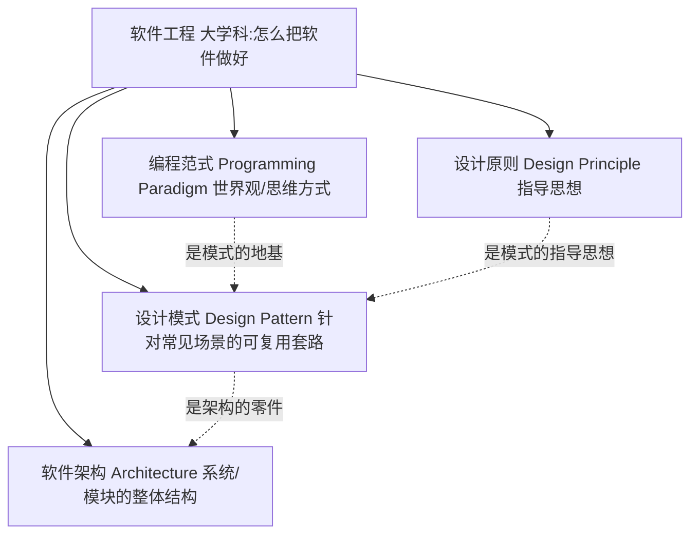
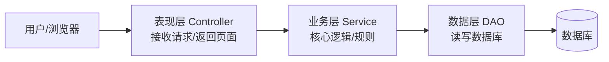

# 软件工程学习（写给会写代码、但缺设计感的你）

> 适用对象：已经会 Python / 前端 / TypeScript / Go 的语法，能写出可以跑的小程序，但没做过大型软件，遇到"该不该拆函数、要不要抽象、怎么组织代码"时没抓手。
> 目标：把**编程范式、设计原则、设计模式、软件架构**这四件事讲清，并告诉你所有语言的共同根基在哪，不必被"后端语言那么多"吓到。

---

## 一、为什么你要补这一块

你会写代码，但常觉得"不知道该做什么"——这不是你能力不够，而是缺了一套**设计语言**：

- 能实现功能 → 这是"语法 + 算法"层面；
- 不知道怎么组织 → 这是"范式 + 模式 + 架构"层面。

打个比方：你会用砖头砌墙（语法），但还不会画户型图（设计）。本文给你这张"户型图的语言"。

---

## 二、一张图看懂四者的关系

它们不是并列的四个词，而是**同一棵树上由根到叶的四个层级**：抽象程度从高到低。



**一句话**：范式定思维方式，原则定指导思想，模式定具体套路，架构定整体结构。

### 四者定位对照表

| 概念 | 它回答的问题 | 例子 | 层级 |
|:--|:--|:--|:--|
| **编程范式** | 代码根本该怎么写（世界观） | 函数能当变量传吗？状态要不要变？ | 抽象 |
| **设计原则** | 写好代码该守什么规矩 | 单一职责、开闭原则 | 指导 |
| **设计模式** | 这个场景有什么成熟套路 | 工厂造对象、观察者解耦 | 套路 |
| **软件架构** | 整个系统怎么拆分协作 | 前后端分离、微服务 | 结构 |

### 常见同义词（容易混的叫法）

- 编程范式 ≈ 编程模型 / 编程风格 / 编码风格（广义）
- 设计原则 ≈ 最佳实践 / 指导思想（SOLID 等）
- 设计模式 ≈ 套路 / 惯用法（idom，注意模式和惯用法不完全等，模式更系统）
- 软件架构 ≈ 系统架构 / 顶层设计 / 架构风格（Architectural Style）

---

## 三、所有编程语言的共同根基

这是你最大的底气：**语言是方言，根基是通用语**。后端语言（Go / Java / Rust / …）再多，也只是同一根基上的不同方言。

所谓"根基"，是每个主流语言都有的四块内容：

### 3.1 数据

| 类别 | 内容 | 说明 |
|:--|:--|:--|
| 基础类型 | int / float / bool / string | 各语言名字不同，概念一样 |
| 复合类型 | 数组、字典（map）、结构体/class | 组合数据的容器 |
| 引用 vs 值 | 指针、引用、拷贝语义 | Python 全引用，Go 有值/指针之分 |

### 3.2 控制

顺序、分支（if）、循环（for/while）、递归、异常处理。这五样在 Python/TS/Go 里本质一样，只是关键字不同。你学第二门语言很快，就是在复用这块。

### 3.3 抽象

函数、作用域、模块、类型系统。把"重复的东西"命名、封装、复用。

### 3.4 机制

堆/栈、内存管理、并发模型（线程 / 协程）、IO。这是"机器层面"的共性。

### 3.5 为什么框架也是"根基 + 模式"

框架 = 别人替你做好的**架构** + 一堆**设计模式**。你用框架时其实已经在用这些思想，只是没对上名字。一旦把名字和概念对上，学新框架会快很多——因为每个框架都在套用相似的模式（依赖注入、中间件、观察者……）。

> **一句话**：把根基（数据/控制/抽象/机制）+ 范式与模式这套"设计语言"学会，就能以一敌百；剩下的是框架和业务的经验积累，靠做项目补，不是靠再学一门语言。

---

## 四、编程范式（世界观）

**定义**：解决问题的"思维方式/风格"。同一个问题，不同范式写法完全不同。

### 主要范式一览

| 范式 | 核心思想 | 代表语言倾向 |
|:--|:--|:--|
| 命令式 | 一步一步告诉机器怎么做 | C、Go 偏此 |
| 面向对象 OOP | 用"对象"封装数据+行为 | Java、Python、TS |
| 函数式 FP | 函数是一等公民，少改状态 | Haskell、TS/JS、Python 支持 |
| 泛型 | 写"不确定类型"的通用代码 | Go、TS、C++ |
| 响应式 | 数据流动驱动更新 | 前端 RxJS、Vue |

### 你观察的"TS 大量回调 / Promise / 装饰器"——对，但要准确归因

- **回调 / Promise** 不是独立范式，而是**异步编程**在 JS 里的历史产物：JS 单线程，早期只能用回调处理异步；Promise 是回调的升级（链式），`async/await` 又让它变同步写法。Python 也有回调（`callback` 参数）、`asyncio`，Go 用 goroutine+channel，**思路本质一样**。
- **装饰器 / 函数套函数** = 函数式编程特征：把函数当一等公民，可以传、可以包装、可以返回。Python 同样普遍（`@app.route` 就是装饰器），Go 也可以把 `func` 当参数，只是 Go 社区更爱显式写。

**关键结论**：Python/Go/TS 都是**多范式混合语言**，写法差异主要来自"语言特性 + 生态习惯"，不是范式本质不同。范式是"风格选项"，语言是"提供哪些选项的工具"。

---

## 五、设计原则（指导思想）

原则介于"范式"和"模式"之间，是写好代码的尺子——专门治"不知道该不该抽象"。

| 原则 | 一句话 |
|:--|:--|
| **S** 单一职责 | 一个类/函数只干一件事 |
| **O** 开闭原则 | 对扩展开放，对修改关闭 |
| **L** 里氏替换 | 子类能替父类而不出事 |
| **I** 接口隔离 | 别逼人实现用不到的接口 |
| **D** 依赖倒置 | 依赖抽象，不依赖具体 |
| **DRY** | Don't Repeat Yourself，别重复 |
| **KISS** | Keep It Simple，别过度设计 |

> **一句话**：原则是"什么时候该抽象、什么时候别过度设计"的判官。你缺的不是知识，是带着设计意识去写。

---

## 六、设计模式（套路）

模式是针对常见场景的**可复用组织方案**（GoF 23 种，挑高频的讲）。下面用三语对照同一概念，证明"语言是方言、思路通用"。

### 6.1 工厂模式（创建型）：把"造对象"集中管理

```python
# Python
class AnimalFactory:
    def create(self, kind):
        if kind == "dog":
            return Dog()
        return Cat()
```

```typescript
// TypeScript
class AnimalFactory {
  create(kind: string): Animal {
    if (kind === "dog") return new Dog();
    return new Cat();
  }
}
```

```go
// Go
func CreateAnimal(kind string) Animal {
    if kind == "dog" {
        return &Dog{}
    }
    return &Cat{}
}
```

### 6.2 装饰器模式（结构型）：动态加功能

```python
# Python：用语法糖 @
@log_time
def foo(): ...
```

```typescript
// TypeScript：高阶函数/装饰器
function logTime(target) { /* 包装 */ }
```

```go
// Go：显式包装函数
func LogTime(f func()) func() {
    return func() { /* 包装 */ f() }
}
```

### 6.3 观察者模式（行为型）：一对多通知

```python
# Python：回调列表
class Subject:
    def __init__(self): self.subs = []
    def notify(self, msg): [s(msg) for s in self.subs]
```

```typescript
// TypeScript：事件回调
class Subject {
  private subs: ((m: string) => void)[] = [];
  notify(m: string) { this.subs.forEach(s => s(m)); }
}
```

```go
// Go：用 channel 或切片存回调
type Subject struct{ subs []func(string) }
func (s *Subject) Notify(m string) { for _, f := range s.subs { f(m) } }
```

> **一句话**：模式是"别人踩过坑总结的套路"。一个项目用上 3~5 个（单例、工厂、观察者、策略、装饰器），设计感就来了。

---

## 七、软件架构（结构）

架构是系统/模块级别的"整体结构"，比模式更宏观。

| 架构风格 | 说明 | 场景 |
|:--|:--|:--|
| 分层（MVC） | 表现层/业务层/数据层分离 | 大多数后端 |
| 微服务 | 拆成多个独立服务 | 大型系统 |
| 事件驱动 | 靠消息/事件协作 | 高并发、解耦 |
| 六边形 | 端口与适配器，内外分离 | 可测试系统 |

**架构 vs 模式**：架构是"整个房子的结构"（微服务还是单体），模式是"房间里一个插座的标准接法"。架构会**包含**很多模式。

---

## 八、框架与设计思想的关系

- 框架本身就是"别人做好的架构 + 一堆模式"。
- 你之前用的 React/Vue（前端）、Gin/Flask（后端），底层都在套用：依赖注入、中间件（装饰器链）、观察者（事件）、工厂（容器）。
- **会了一个框架，再学另一个之所以快**，是因为你在复用"模式认知"，不是复用代码。

---

## 九、常见误区澄清

1. **设计模式不属于数据结构与算法**，它属于软件工程/架构侧，但建立在范式之上。
2. **Python/Go/TS 写法不同 ≠ 范式本质不同**：都是多范式混合，差异来自语言特性和生态（如 TS 单线程异步多，所以回调/Promise 突出）。
3. **"装饰器"一词有歧义**：作为模式（装饰器模式）跨语言；作为语法 `@decorator` 是 Python/TS 的关键字。两者都成立，但别把"模式"和"语法"当一个东西。
4. **回调/Promise 不是范式**，是"异步编程"的实现手段，属于命令式+函数式混合下的写法。
5. **架构 ≠ 模式**：架构是整体蓝图，模式是局部套路；架构包含模式。

---

## 十、学习路径与提升建议

不用把"软件工程"整本啃，按性价比优先级：

1. **先吃透两个范式**：函数式（你已会用回调/高阶函数）、面向对象（类/接口）。知道"为什么这么写"比记语法重要。
2. **再学几个高频模式**：单例、工厂、观察者、策略、装饰器。先会用 3~5 个。
3. **补设计原则 SOLID + DRY/KISS**：这是"什么时候该抽象"的尺子。
4. **架构先了解 MVC/分层/微服务概念**，等真做项目再深。

**关键心态**：不要等"学完理念再写大项目"。理念是从小项目里**反推**出来的。你缺的不是知识，是"带着设计意识去写"的练习——下次写函数时问问自己："它职责单一吗？换场景好扩展吗？"

### 行动清单

- [ ] **第1步过关**：把一段脚本改造成 class（数据私有）+ 写一个高阶函数（见「实战教学营」）
- [ ] **第2步过关**：手写工厂/单例/观察者/策略/装饰器 5 个最小例子
- [ ] **第3步过关**：用 SOLID 给自己旧代码打 1 次分并改 1 处
- [ ] **第4步过关**：画一张"请求到数据库"的分层图
- [ ] **第5步过关**：200 行小项目，刻意用上"工厂 + 观察者"
- [ ] **第6步过关**：从常用框架里找 3 个模式的影子
- [ ] 对比 Python/TS/Go 同一功能的写法，体会"方言不同、根基相同"

---

## 十一、总纲与复习清单

> **范式定思维方式，原则定指导思想，模式定具体套路，架构定整体结构。**
> 它们依次从"抽象世界观"落到"大楼施工图"，是同一棵树上由根到叶的四个层级。

**复习三句话**：

1. 语言是方言，根基（数据/控制/抽象/机制）是通用语——学好根基，后端语言以一敌百。
2. 框架 = 别人做好的架构 + 模式；会一个框架后再学另一个快，是因为复用"模式认知"。
3. 提升顺序：范式 → 原则 → 模式 → 架构，并从小项目反推理念，而非等学完再写。

---

# 实战教学营（一步步练，教学主语言：Python）

> 按上面的学习路径，**一步一个练习**带你做。每个练习都有"目标 → 讲解 → 动手 → 过关标准"，做完一个再做下一个。示例主语言用 Python（你学过，且适合讲概念）。
> 每完成一步教学，本手册会把该步的"讲解 + Python 示例 + 练习"补进来，直到第 6 步（框架溯源）结束。

## 第 1 步：吃透两个范式（函数式 + 面向对象）

**目标**：不是背概念，而是能"解释为什么这么写"。
学完能回答：① 为什么这里用对象而不是一堆全局变量？② 为什么把函数当参数传？

### 1.1 函数式编程（FP）——你已经会一半

**核心一句话**：函数是一等公民，可以**传、存、返回**；尽量**不改状态**（输入一样 → 输出一样）。

你的回调、`map()`、`sorted(key=...)` 都是它：

```python
# 函数当参数传（你写过很多）
result = sorted([3, 1, 2], key=lambda x: x)   # 传了一个函数（lambda）
```

**高阶函数**：接收函数 / 返回函数的函数，这是"装饰器、中间件"的本质：

```python
# 一个"返回函数"的函数 —— 装饰器的底层原理
def 计时(f):
    def 包装():
        print("开始")
        import time
        t = time.time()
        f()
        print("耗时", round(time.time() - t, 4))
    return 包装            # 返回一个新函数

def 干活():
    print("工作中...")

包装后 = 计时(干活)
包装后()   # 开始 / 工作中... / 耗时 xx
```

Python 装饰器 `@` 就是这个写法的语法糖：

```python
@计时        # 等价于 干活 = 计时(干活)
def 干活():
    print("工作中...")

干活()
```

**纯函数**（少改状态）：

```python
# 不纯：改了外面的变量，难预测
total = 0
def add(x):
    global total
    total += x

# 纯：输入 → 输出，不碰外部
def add_pure(total, x):
    return total + x
```

### 1.2 面向对象（OOP）——数据和行为捆在一起

**核心一句话**：用"对象"把相关的**数据（属性）+ 行为（方法）**封在一起，对外只暴露该有的操作。

**为什么用对象而不是全局变量**：

```python
# 乱：一堆全局变量，互相没关系，也没人管
balance = 0
def deposit(money):
    global balance
    balance += money
def withdraw(money):
    global balance
    balance -= money

# 好：一个对象自己管自己的数据，外部碰不到内部
class Account:
    def __init__(self):
        self.__balance = 0          # 私有数据，外部不能直接改

    def deposit(self, money):
        self.__balance += money

    def withdraw(self, money):
        self.__balance -= money

    def get_balance(self):
        return self.__balance

my = Account()
my.deposit(100)
# my.__balance = -9999   # ❌ 外面改不到，只能走方法
```

这就是**封装** —— 数据 + 行为打包，只留"门"（方法）给外面。

**接口/抽象（定"约定"）**：

```python
# 约定：任何能"叫"的，都有 say 方法
class 会叫:
    def say(self): ...          # 抽象方法（约定）

class Dog(会叫):
    def say(self):
        return "汪"

class Cat(会叫):
    def say(self):
        return "喵"

# 不管传谁，只要实现了"会叫"就能用 —— 面向抽象编程
def 介绍(x: 会叫):
    print("它会叫:", x.say())

介绍(Dog())   # 汪
介绍(Cat())   # 喵
```

### 1.3 动手练习（做完才算过关）

**练习 1：把脚本改造成 class**
挑你之前写的一个小程序（算分、记账、todo），把"相关数据和函数"收进一个类。要求：数据私有化，只能通过方法访问。

**练习 2：写一个高阶函数**
写一个函数，接收一个函数参数，返回一个"加了日志/计时包装"的新函数（参考上面的 `计时`）。

**过关标准（自测）**：
- 能说清"为什么 balance 要私有" → 答：防止外部乱改，保证数据只按规矩变。
- 能说清"为什么把函数当参数传" → 答：让调用方决定行为，函数本身不用改，这是开闭原则的雏形（第 3 步正式学）。

## 第 2 步：学 5 个高频设计模式

**目标**：不是背代码，而是理解"场景 → 为什么这么组织"。每个模式写一个**能跑的最小例子**。

**过关标准**：这 5 个你都能不查文档、凭理解写出来。

### 2.1 工厂模式（创建型）——把"造对象"集中管理

**场景**：程序里到处 `if kind == "dog": return Dog()`，散落各处不好维护 → 集中到一个工厂函数。

```python
class Dog:
    def speak(self): return "汪"
class Cat:
    def speak(self): return "喵"

def create_animal(kind):        # 工厂函数：根据参数决定造什么
    if kind == "dog":
        return Dog()
    elif kind == "cat":
        return Cat()
    raise ValueError("未知动物")

# 使用：调用方只认"create_animal"，不关心具体类
a = create_animal("dog")
print(a.speak())   # 汪
```

### 2.2 单例模式（创建型）——整个程序只有一个实例

**场景**：配置管理器、日志器、数据库连接池，全局只该有一份。

```python
class Config:
    _instance = None            # 类变量存唯一实例

    def __new__(cls):
        if cls._instance is None:
            cls._instance = super().__new__(cls)
            cls._instance.load()   # 只加载一次
        return cls._instance

    def load(self):
        print("加载配置...")
        self.debug = True

c1 = Config()
c2 = Config()
print(c1 is c2)   # True（同一个对象）
```

**补充**：Python 更地道的单例写法是"模块级唯一实例"——模块导入一次只会执行一次，天然单例：

```python
# config.py
class _Config: ...
config = _Config()   # 导几次都是同一个
```

### 2.3 观察者模式（行为型）——一对多通知

**场景**：一个事件（如"任务完成"）要通知多个地方（更新 UI、写日志、发消息）。

```python
class EventBus:
    def __init__(self):
        self._subscribers = []          # 订阅者（函数）列表

    def subscribe(self, fn):            # 订阅
        self._subscribers.append(fn)

    def publish(self, message):         # 发布：逐个通知
        for fn in self._subscribers:
            fn(message)

bus = EventBus()
bus.subscribe(lambda m: print(f"UI收到: {m}"))
bus.subscribe(lambda m: print(f"日志记录: {m}"))
bus.publish("任务完成")   # UI收到 / 日志记录
```

### 2.4 策略模式（行为型）——把"可变的算法"做成可替换

**场景**：同一件事有多种做法（不同计费方式、不同排序），且以后可能加新的 → 每种做法一个函数，外部挑。

```python
# 三种"计算价格"策略
def normal_price(price): return price
def discount_price(price): return price * 0.8
def vip_price(price): return price * 0.5

def checkout(strategy, price):      # 传入策略函数
    return strategy(price)

print(checkout(normal_price, 100))    # 100
print(checkout(discount_price, 100))  # 80.0
print(checkout(vip_price, 100))       # 50.0
# 以后要加新策略：写一个新函数就行，checkout 不用改（开闭原则）
```

### 2.5 装饰器模式（行为型）——动态加功能，不改原函数

**场景**：给函数加"计时、日志、权限校验"，但不想改动函数本体 → 用包装。

```python
import time

def log_time(f):
    def wrapper(*args, **kwargs):
        t = time.time()
        result = f(*args, **kwargs)
        print(f"{f.__name__} 耗时 {round(time.time()-t,4)}s")
        return result
    return wrapper

@log_time          # 等价于 fetch_data = log_time(fetch_data)
def fetch_data():
    time.sleep(0.1)
    return "数据"

print(fetch_data())   # fetch_data 耗时 0.1s / 数据
```

> 注意：第 1 步学的"高阶函数"就是装饰器模式的底层；Python 的 `@` 只是语法糖。

---

## 第 3 步：用 SOLID + DRY/KISS 当尺子

**目标**：学会判断"什么时候该抽象、什么时候别过度设计"。SOLID 是 5 条原则的首字母。

**过关标准**：能指出自己代码里"这里违反了哪条、怎么改"，改 1~2 处即可。

### 3.1 五条 SOLID + 两条实用原则

| 原则 | 一句话 | 反例 |
|:--|:--|:--|
| **S** 单一职责 | 一个类/函数只干一件事 | `class User: 存用户 + 发邮件 + 画页面` |
| **O** 开闭原则 | 对扩展开放，对修改关闭 | 加新功能要改旧函数（应加新函数） |
| **L** 里氏替换 | 子类能替父类不出事 | 子类重写父类方法却改了语义 |
| **I** 接口隔离 | 别逼人实现用不到的接口 | 一个大接口，使用者被迫实现空方法 |
| **D** 依赖倒置 | 依赖抽象，不依赖具体 | 直接 `new MySQL()`（应依赖接口） |
| **DRY** | 别重复 | 同样的逻辑复制粘贴 3 遍 |
| **KISS** | 别过度设计 | 为"以后可能用"写一堆没用上的抽象 |

### 3.2 怎么看自己代码（三步自查）

1. **职责**：这个函数/类名是"名词 + 动词"能一句话说完吗？说不完就是干多了（S）。
2. **扩展**：要加一个新功能，是"新增一块代码"还是"改动一堆旧代码"？（O）
3. **简化**：删掉这个抽象，代码会更好懂吗？会 → 删（KISS）。

### 3.3 动手练习

**练习 1**：拿你第 2 步写的某个例子，检查它是否违反 SOLID，指出 1 处并改掉。
**练习 2**：在你旧代码里找一处"复制粘贴重复"，抽成函数（DRY）。

---

## 第 4 步：了解软件架构（读，不急着做）

**目标**：只建立认知，能画出"一个请求从页面到数据库经过了哪几层"。

**过关标准**：能画图说明分层；能说出"架构 vs 模式"的区别。

### 4.1 三种最常聊的架构风格



| 风格 | 是什么 | 什么时候用 |
|:--|:--|:--|
| **分层 / MVC** | 表现层 / 业务层 / 数据层 三块分开 | 大多数后端项目，最简单 |
| **微服务** | 拆成多个独立小服务，各自部署 | 团队大、业务多、需要独立伸缩 |
| **事件驱动** | 靠消息/事件协作，不直接调用 | 高并发、异步解耦 |

### 4.2 架构 vs 模式（一句话）

- **架构**：整个房子怎么盖（分层？微服务？）——宏观结构。
- **模式**：房间里一个插座怎么接（工厂？观察者？）——局部套路。
- 架构里会**用**很多模式，但两者不是一个层面。

### 4.3 动手练习

**练习**：画一张"用户下单 → 查库存 → 扣库存 → 返回成功"的分层图（哪些归 Controller，哪些归 Service，哪些归 DAO）。

---

## 第 5 步：小项目反推（关键）

**目标**：把前 4 步用起来。写一个 ~200 行的小项目，**刻意**用上"工厂 + 观察者"，练完你就有"设计感"了。

**过关标准**：写完能说出"这里用了哪个模式、解决了什么痛点"；说不出来说明是硬套，重来。

### 5.1 项目示例：日志收集器

**需求**：不同来源的日志（文件、网络、数据库）进同一个系统；每条日志要同时触发"写文件 + 打印"。

**设计思路**（先想再写）：
- **工厂**：根据来源创建不同的"日志读取器"
- **观察者**：日志来了，通知所有订阅者（文件写入器、控制台打印器）
- **策略**：日志格式（普通/JSON）可切换

```python
# 1) 观察者：日志处理器（订阅者）
class FileWriter:
    def on_log(self, msg): print(f"[文件] {msg}")
class ConsolePrinter:
    def on_log(self, msg): print(f"[控制台] {msg}")

# 2) 被观察者：日志中心
class LogCenter:
    def __init__(self):
        self._handlers = []
    def add_handler(self, h): self._handlers.append(h)
    def emit(self, msg):
        for h in self._handlers:
            h.on_log(msg)

# 3) 工厂：按来源创建日志读取器
class FileSource:
    def read(self): return ["文件日志A", "文件日志B"]
class NetSource:
    def read(self): return ["网络日志C"]

def create_source(kind):
    if kind == "file": return FileSource()
    if kind == "net":  return NetSource()
    raise ValueError(kind)

# 4) 组装
center = LogCenter()
center.add_handler(FileWriter())      # 订阅：写文件
center.add_handler(ConsolePrinter())  # 订阅：打印
source = create_source("file")        # 工厂：选来源
for line in source.read():
    center.emit(line)
# 输出：
# [文件] 文件日志A / [控制台] 文件日志A / [文件] 文件日志B / [控制台] 文件日志B
```

### 5.2 其他选题

- 待办清单（任务用工厂创建，完成用观察者通知 UI）
- 简易计算器（运算符用策略模式）
- 购物车（不同会员等级用策略 + 工厂）

---

## 第 6 步：框架溯源

**目标**：从你用过的框架里认出模式，从此学新框架倍速。

**过关标准**：能说出"React 的 useEffect 近似观察者""Vue 的插件近似装饰器""Flask 的 @app.route 是装饰器"这类对应关系。

### 6.1 常见框架里的模式影子

| 框架/库 | 用的设计模式 |
|:--|:--|
| **Flask / FastAPI** | `@app.route` 装饰器 = 装饰器模式 |
| **Django** | ORM、中间件 = 装饰器链 + 工厂 |
| **Vue** | 响应式（数据变视图变）≈ 观察者模式；插件 ≈ 装饰器 |
| **React** | `useEffect` 监听变化 ≈ 观察者；HOC（高阶组件）≈ 装饰器 |
| **Express** | 中间件 = 责任链模式（装饰器思想的亲戚） |
| **Gin**（Go） | 中间件链 = 责任链 + 装饰器 |
| **依赖注入容器**（Spring/各类 DI） | 工厂 + 控制反转（IoC） |

### 6.2 为什么"会一个框架再学另一个快"

因为你在复用**模式认知**，不是复用代码：
- 所有 Web 框架都有"路由 → 中间件 → 控制器 → 返回"这一套（架构相同）
- 所有 ORM 都是"对象 ↔ 表"的映射（工厂 + 代理）
- 所有状态管理都是"发布-订阅"（观察者）

### 6.3 动手练习

**练习**：打开你用过的一个框架的文档或源码，找出 3 个模式影子，记下来：
1. `____________` 用了 `____________` 模式（如：`@app.route` → 装饰器）
2. `____________` 用了 `____________` 模式
3. `____________` 用了 `____________` 模式
